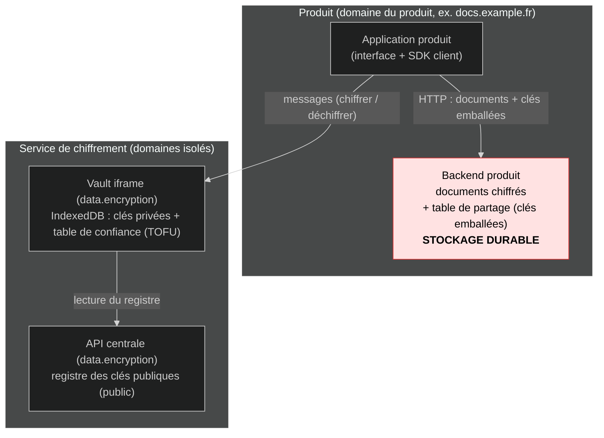
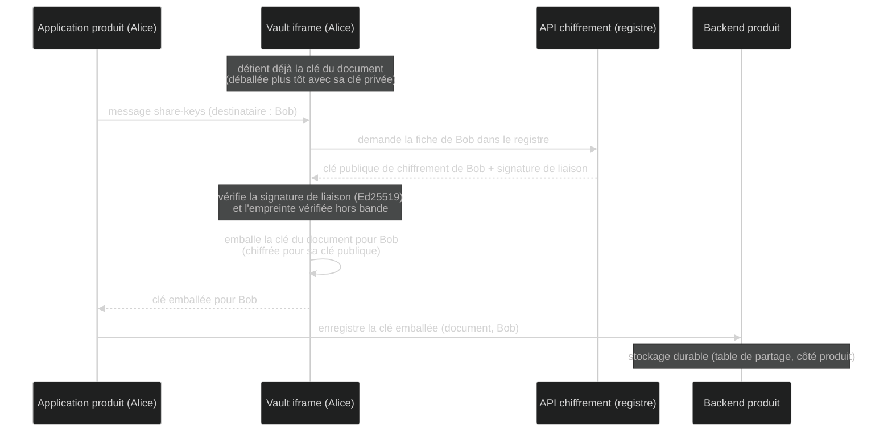
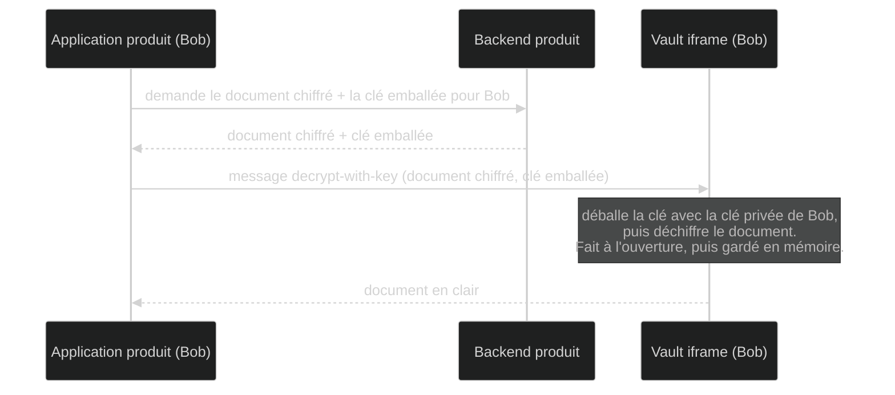
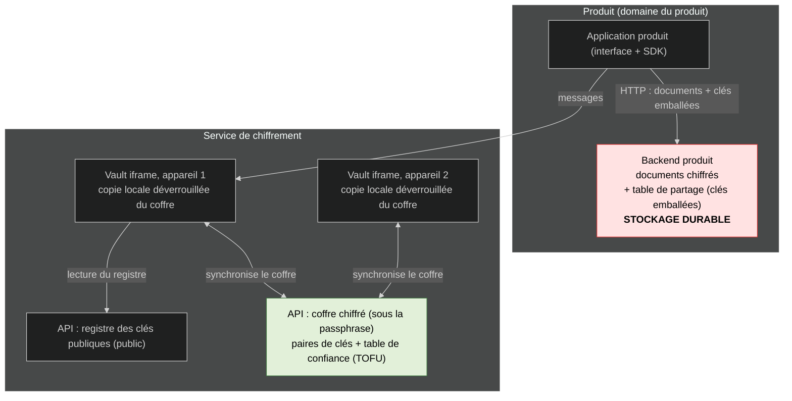
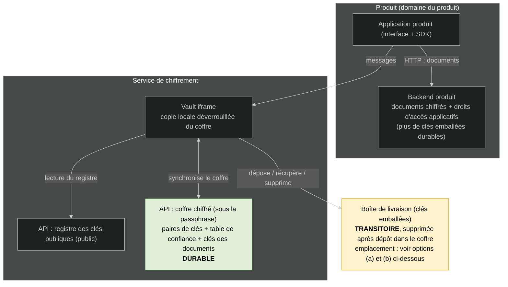
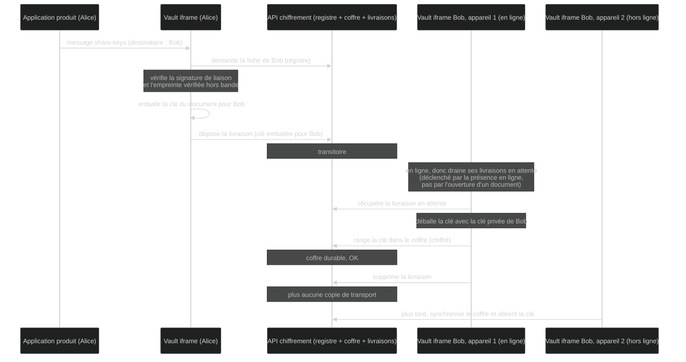
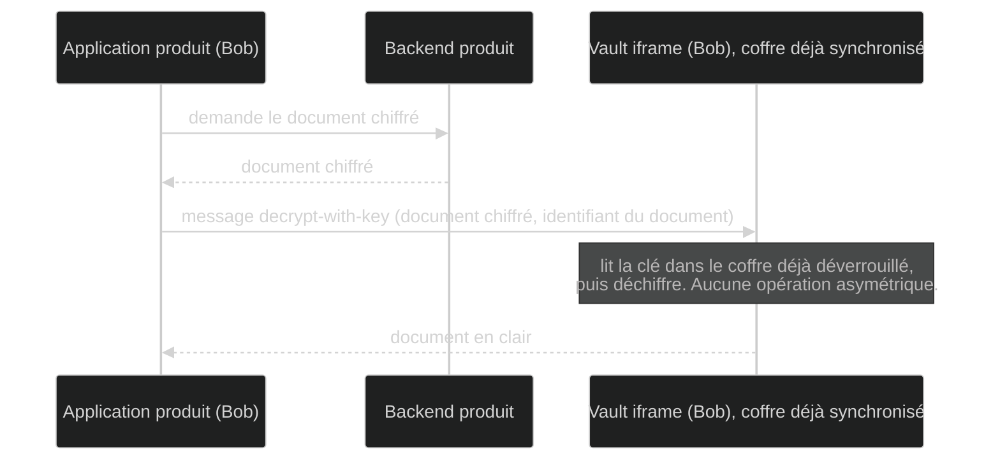
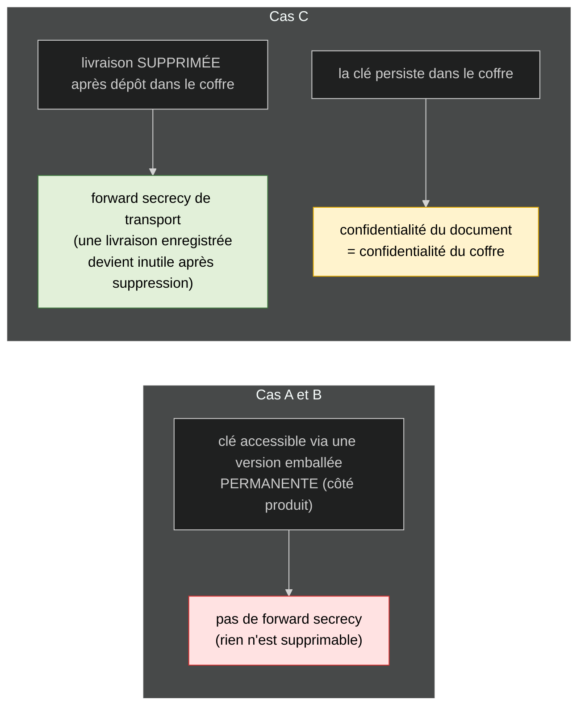

# Partage de documents chiffrés et synchronisation : comparaison de trois cas

Ce document compare trois façons d'organiser **le partage de documents chiffrés** et **la synchronisation entre appareils**. On les appelle cas A, B et C :

- **Cas A (actuel)** : ce qui est implémenté aujourd'hui. Pas de coffre synchronisé. La clé de chaque document est chiffrée (emballée) pour chaque destinataire, et cette version emballée est stockée durablement côté produit.
- **Cas B (A + coffre de synchronisation)** : on ajoute un coffre synchronisé pour suivre l'utilisateur sur tous ses appareils. Il contient ses paires de clés et sa table de confiance. Le partage des documents reste identique au cas A.
- **Cas C (proposition « phase transitoire »)** : la clé d'un document n'est plus stockée emballée de façon durable. Elle est livrée une seule fois au destinataire, qui la range dans son coffre, puis la copie de transport est supprimée. Toutes les clés de documents vivent désormais dans le coffre.

Les termes employés (coffre, registre, table de confiance, etc.) sont définis juste en dessous.

## Glossaire

- **Application produit** : le logiciel que l'utilisateur voit (Docs, Fichier, etc.). Il tourne sur **son propre domaine web** (par exemple `docs.example.fr`), distinct des domaines du service de chiffrement. Il manipule des contenus chiffrés sans jamais voir les clés privées.
- **Backend produit** : le serveur de ce logiciel. Il stocke les documents (chiffrés) et les droits d'accès applicatifs (qui a le droit d'ouvrir quoi).
- **Vault iframe** (`data.encryption`) : un cadre invisible et isolé, chargé par le produit. Il détient les clés privées de l'utilisateur (dans IndexedDB, la base de données du navigateur) et réalise toutes les opérations cryptographiques. Le produit lui parle uniquement par messages (`postMessage`).
- **API de chiffrement** (back `data.encryption`) : le serveur central du service de chiffrement. Il héberge le registre des clés publiques, et selon le cas le coffre.
- **Registre des clés publiques** (`public_keys`) : un annuaire **public**. Pour chaque utilisateur : sa clé publique de chiffrement, sa clé publique de signature, une signature de liaison, un numéro de version. Comme c'est public, il n'a pas besoin d'être confidentiel ; il est protégé en intégrité par la signature de liaison.
- **Table de confiance (TOFU)** : la liste des autres utilisateurs dont on a **vérifié** (ou rejeté) l'empreinte. C'est **sensible** (ce sont vos décisions de confiance, votre graphe de relations), donc stockée **dans le coffre**, jamais en clair côté serveur. TOFU signifie « confiance à la première utilisation ».
- **Coffre** : un conteneur chiffré, propre à l'utilisateur, déchiffrable seulement avec sa passphrase. Synchronisé via l'API centrale pour suivre l'utilisateur sur tous ses appareils. Son contenu dépend du cas (voir le tableau).
- **Clé du document** : la clé symétrique qui chiffre un document (en anglais « DEK », Document Encryption Key). Avec libsodium (XChaCha20-Poly1305), elle fait **32 octets**.
- **Emballer / déballer une clé** : « emballer » veut dire chiffrer la clé d'un document pour la clé publique d'un destinataire, de sorte que lui seul puisse la « déballer » avec sa clé privée.
- **Signature** : preuve cryptographique d'origine, produite avec la clé privée de signature (Ed25519).
- **Empreinte vérifiée hors bande** : un court résumé de la clé d'identité, comparé entre deux personnes par un **autre canal** (QR code, lecture de chiffres de vive voix). « Hors bande » veut dire en dehors du système, donc impossible à falsifier pour un serveur malveillant.
- **Passphrase** : le secret que l'utilisateur connaît et qui déverrouille son coffre. Il ne quitte jamais l'appareil.
- **Alice et Bob** : dans les schémas, Alice partage un document, Bob reçoit l'accès.

---

## Vue d'ensemble : qui stocke quoi

| | **Cas A (actuel)** | **Cas B (A + coffre)** | **Cas C (phase transitoire)** |
|---|---|---|---|
| **Registre des clés publiques** (API centrale, public) | présent | présent | présent |
| **Coffre chiffré** (sous la passphrase, synchronisé) | aucun (transfert ponctuel par QR code ou phrase mnémonique) | paires de clés + table de confiance (TOFU) | paires de clés + table de confiance + **clés des documents** |
| **Stockage local** (IndexedDB, après déverrouillage par la passphrase) | clés privées (propres à l'appareil) + table de confiance locale | copie locale déverrouillée du coffre | copie locale déverrouillée du coffre |
| **Backend produit** | documents chiffrés + table de partage (clés emballées), **durable** | identique au cas A | documents chiffrés + droits d'accès applicatifs (plus de clés emballées durables) |
| **Obtenir la clé d'un document** | déballer la clé qui avait été emballée pour l'utilisateur courant, **à l'ouverture du document**, puis la garder en mémoire | identique au cas A | la **lire** dans le coffre déjà déverrouillé |
| **Couche asymétrique** | chemin d'accès **permanent** | permanent | **transport jetable** (supprimé après récupération) |
| **Forward secrecy possible** | aucune | aucune | sur le **transport** seulement |
| **Multi-appareils** | transfert ponctuel d'une paire de clés | synchro du coffre (clés + table de confiance) | synchro du coffre (clés + table de confiance + clés des documents) |
| **Appartenance visible côté serveur** | oui (les clés emballées sont côté produit) | oui | clés **invisibles** ; restent les droits d'accès applicatifs |

---

## Taille du coffre : est-ce viable avec beaucoup de documents ?

Cas C : le coffre contient une clé de document par document auquel l'utilisateur a accès. Estimation :

| Élément | Taille |
|---|---|
| 1 clé de document (clé symétrique XChaCha20-Poly1305) | 32 octets |
| 1 entrée complète dans le coffre (clé + identifiant du document + identifiant du produit + rôle + surcoût d'encodage JSON/base64) | environ 150 à 250 octets |
| **10 000 documents** | environ **1,5 à 2,5 Mo** |
| 100 000 documents | environ 15 à 25 Mo |

IndexedDB gère sans difficulté plusieurs centaines de Mo à plusieurs Go, et le coffre chiffré synchronisé reste un petit fichier. **Conclusion : largement viable**, même à 10 000 documents le coffre pèse quelques Mo.

---

## Cas A (actuel)

### Architecture

### Partage : Alice donne accès à Bob

### Lecture : Bob ouvre le document

---

## Cas B (A + coffre synchronisé)

Côté serveur, identique au cas A, **plus** un coffre chiffré (déverrouillé par la passphrase) hébergé par l'API de chiffrement. Il porte les **paires de clés** et la **table de confiance (TOFU)**. Ouvrir un nouvel appareil revient à synchroniser le coffre au lieu d'un transfert ponctuel. Le **partage et la lecture sont identiques au cas A** (les clés des documents restent des versions emballées stockées côté produit).

### Architecture

---

## Cas C (phase transitoire : clés des documents dans le coffre)

La couche asymétrique devient un **transport jetable**. Le stockage durable des clés de documents n'est plus le backend produit, c'est le **coffre**. Le backend produit ne garde que les **documents chiffrés** et les **droits d'accès applicatifs**.

### Architecture

### Partage avec suppression (la règle clé)

La suppression de la livraison est **conditionnée au fait qu'elle soit déjà rangée dans le coffre durable**, pas au fait qu'un appareil l'ait récupérée. Sinon un appareil hors ligne perdrait l'accès.

Le déclenchement de la récupération suit le principe « **je suis en ligne, donc je récupère les livraisons en attente** » (un drainage en arrière-plan), indépendamment de l'ouverture d'un document.

### Lecture : Bob ouvre le document

### Comment chiffrer la livraison : X-Wing direct, ou PQXDH

Le schéma ci-dessus décrit la phase transitoire (livrer la clé, la ranger, supprimer la livraison) sans préciser **comment** la clé est chiffrée pour le destinataire. Deux variantes, à ne pas confondre avec le « où la stocker » plus bas.

**Variante 1 : X-Wing direct (simple).**
On emballe la clé du document pour la **clé publique de chiffrement persistante** du destinataire (celle du registre). C'est exactement ce que fait déjà le code. Rien de nouveau à construire.

**Variante 2 : PQXDH (clés à usage unique).**
Au lieu d'emballer pour la clé persistante, on utilise une **clé à usage unique** (« prekey ») publiée à l'avance par le destinataire, consommée puis détruite après usage.

- Comme chaque partage consomme une clé à usage unique, le destinataire doit **en publier un stock à l'avance** (par exemple 1000).
- Quand le stock descend sous un seuil (par exemple 200), son appareil en **régénère** et republie un lot. Les parties privées non encore consommées vivent dans le coffre ; chacune est **supprimée** dès qu'elle a servi.
- Quand le stock est épuisé, on retombe sur une clé « de dernier recours » persistante, ce qui **annule** le bénéfice (un attaquant peut d'ailleurs vider le stock exprès pour forcer ce repli).

**Ce que la variante 2 apporte en plus, concrètement.**
La suppression de la livraison (commune aux deux variantes) fait déjà l'essentiel du travail. La clé à usage unique ne ferme qu'**une** fenêtre supplémentaire : celle où un attaquant aurait à la fois

1. capturé la livraison **avant** sa suppression (en pratique un serveur, ou une sauvegarde, pendant le court instant où elle existe), **et**
2. volé **plus tard** la clé privée de chiffrement persistante du destinataire.

Or si l'attaquant vole cette clé privée, c'est de toute façon **catastrophique** : il a accès au coffre, donc à **toutes** les clés symétriques, donc à tous les documents, que la livraison ait utilisé une clé à usage unique ou non. L'autre voie (casser l'algorithme) est déjà couverte par la partie post-quantique de X-Wing. La variante 2 ne sauve donc que le cas très étroit « livraison archivée dans une sauvegarde + vol futur de la clé persistante, **sans** accès au coffre ».

| | **Variante 1 : X-Wing direct** | **Variante 2 : PQXDH** |
|---|---|---|
| À construire | rien (déjà là) | stock de clés à usage unique, régénération, repli, distribution |
| Forward secrecy de transport | oui, par la **suppression** de la livraison | oui, par la suppression **et** la clé à usage unique |
| Gain de sécurité supplémentaire | référence | ferme seulement « livraison archivée + vol futur de la clé persistante, sans accès au coffre » |
| Vol de la clé privée du destinataire | tout le coffre tombe (tous les documents) | **identique** : tout le coffre tombe quand même |
| Menace quantique | déjà couverte par X-Wing | déjà couverte par X-Wing |

**Conclusion.** Comme c'est seulement du transit et que la livraison est supprimée, le risque est déjà très réduit avec la **variante 1**. La variante 2 ajoute beaucoup de complexité opérationnelle (gérer un stock de clés, la régénération, le repli, le déploiement à grande échelle) pour un gain marginal qui ne couvre pas le scénario vraiment grave : le vol de la clé privée compromet le coffre dans tous les cas. **Recommandation : variante 1 (X-Wing direct) pour la phase transitoire**, en gardant éventuellement la rotation de la clé persistante versionnée si l'on veut une forward secrecy par périodes.

### Où stocker la boîte de livraison ? Deux options

**Option (a) : dans le backend produit.**

- Avantage : atomicité. Créer un partage tient dans **une seule transaction SQL** côté produit (droits d'accès et clé de livraison écrits ensemble). Pas de risque d'orphelins.
- Avantage : un seul backend mobilisé par partage. Plus simple à raisonner.
- Avantage : pas de collision d'identifiants entre produits, chaque produit ne voit que ses propres documents.
- Inconvénient : chaque produit doit implémenter le stockage de livraison et le cycle « supprimer après récupération ».
- Inconvénient : pour drainer les livraisons, le vault doit passer par le backend produit (couplage), ce qui complique le drainage en arrière-plan.

**Option (b) : dans l'API centrale de chiffrement.**

- Avantage : le cycle transitoire (déposer, récupérer, supprimer) est **centralisé**, géré par le vault et l'API. Les produits n'ont rien à savoir des livraisons.
- Avantage : primitive réutilisable de type « boîte aux lettres » pour tous les produits, et le drainage en arrière-plan se fait directement, sans impliquer le produit.
- Avantage : cohérent avec l'existant (les sessions de transfert d'appareil, déjà transitoires avec expiration, sont centralisées).
- Inconvénient : un partage mobilise **2 backends** (produit pour les droits, central pour la livraison), d'où un risque de transaction distribuée et d'orphelins.
- Inconvénient : il faut distinguer les identifiants de documents d'un produit à l'autre (voir ci-dessous).

**Recommandation.** Les deux sont défendables :

- Si la priorité est l'**atomicité et la simplicité par partage** : option (a).
- Si la priorité est de **garder les produits simples** et de centraliser le cycle de vie sensible : option (b). Le risque d'orphelins se neutralise avec une **expiration** sur la livraison (comme les sessions de transfert d'appareil déjà en place) : une livraison non récupérée finit par expirer... mais sous combien de temps ? Et il faut l'expliquer à l'utilisateur que celui qui a partagé doit recommencer le processus ?

Choix pas si simple je trouve...

### Distinguer les documents entre produits (surtout en option b)

Si les livraisons et les clés sont centralisées, il faut éviter qu'un identifiant de document de Docs entre en collision avec celui de Fichier. Le vault **valide déjà l'origine (le domaine)** de chaque message produit : on s'en sert pour étiqueter chaque entrée par le couple **(produit, identifiant du document)**.

On peut figer la liste des produits autorisés dans une **énumération** (Docs, Drive, Fichier, Visio), chacun avec un identifiant stable, plutôt que de dépendre du domaine brut qui peut changer. Bénéfice de sécurité : un produit ne peut demander que les clés de **son propre espace**, Docs ne peut pas accéder aux clés de Fichier.

En option (a), le problème disparaît : chaque backend produit ne stocke que ses propres documents.

---

## Ce que ça change pour la sécurité (synthèse)

**À retenir :**

- La forward secrecy gagnée dans le cas C porte sur le **transport** (la livraison), pas sur les **documents** : la clé persiste dans le coffre, donc la confidentialité d'un document se ramène à celle du coffre, dans les trois cas.
- Le cas C est le seul où PQXDH retrouve son terrain d'usage (un transport jetable). Mais pour la phase transitoire, un simple emballage X-Wing supprimé après dépôt apporte déjà l'essentiel de la forward secrecy ; les clés à usage unique de PQXDH ne ferment en plus que la fenêtre « livraison archivée dans une sauvegarde, puis vol futur de la clé privée de chiffrement ».
- Ce risque résiduel se couvre aussi par **rotation de la clé de chiffrement** (le registre est déjà versionné) avec destruction de l'ancienne clé privée, ce qui donne une forward secrecy par périodes, **sans** la complexité des clés à usage unique.
