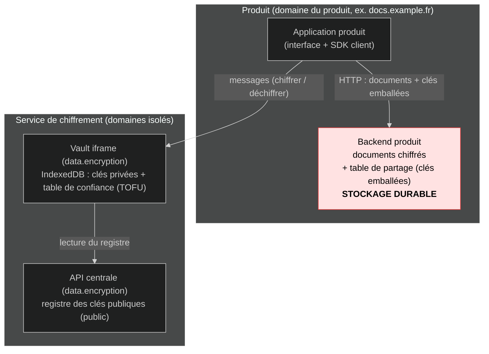
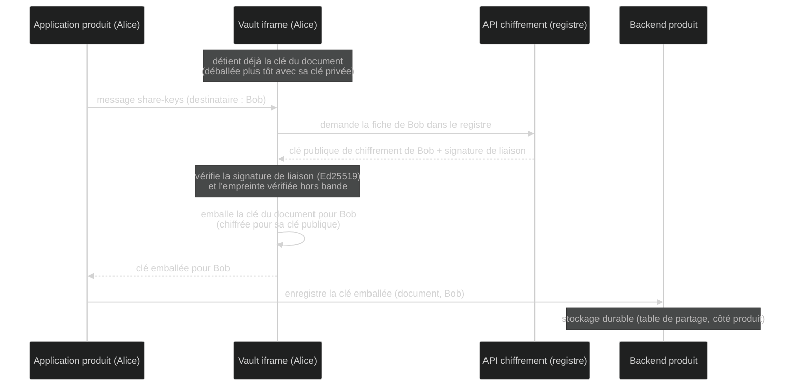
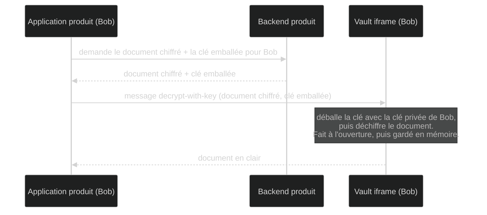
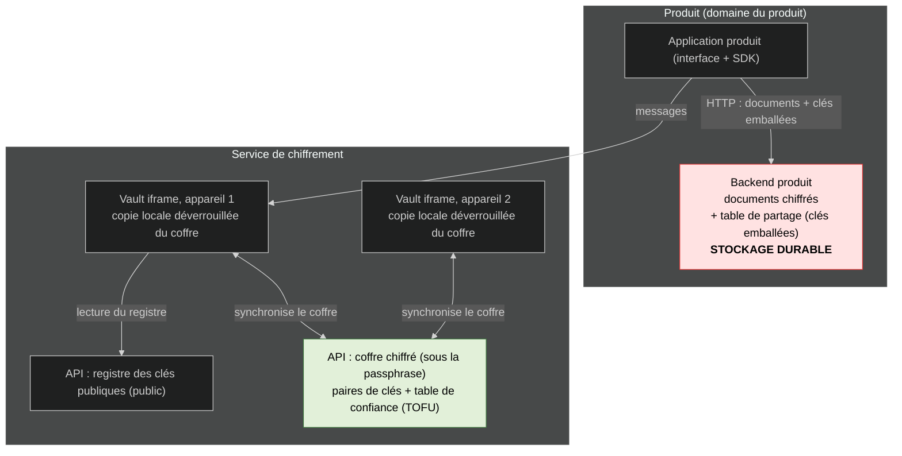
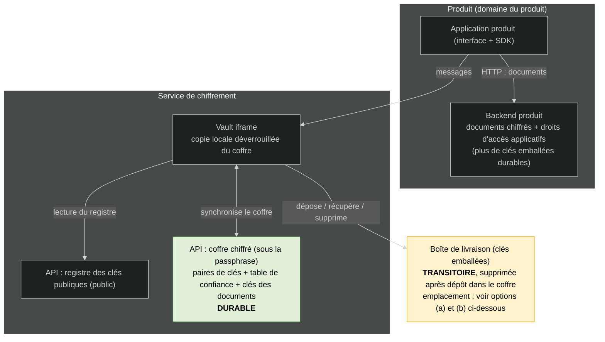
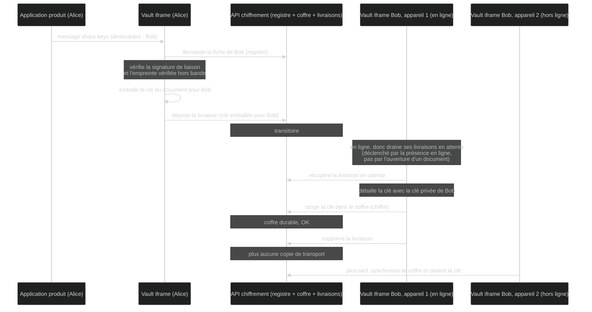
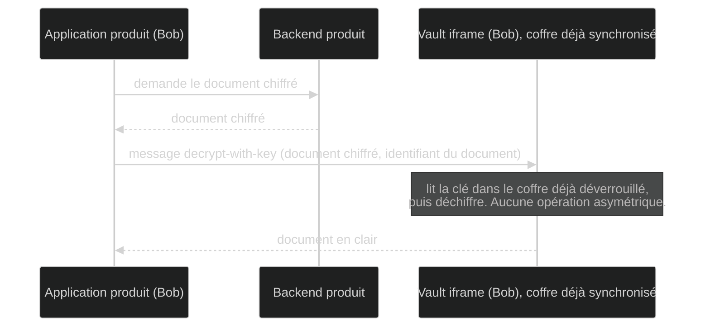
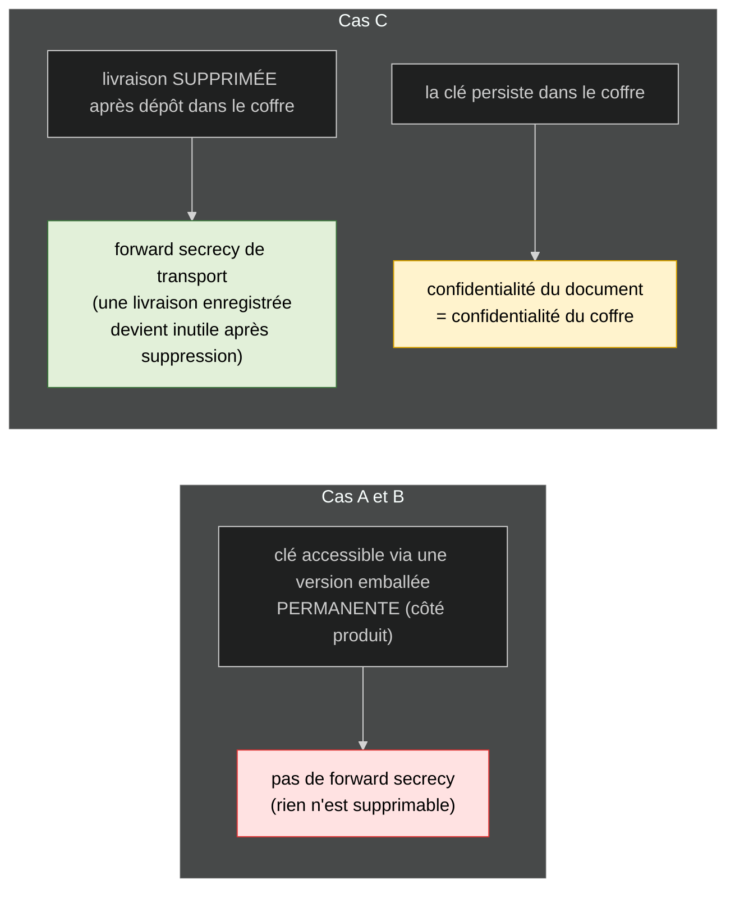

# Partage de documents chiffrés et synchronisation : comparaison de trois cas

Ce document compare trois façons d'organiser **le partage de documents chiffrés** et **la synchronisation entre appareils**. On les appelle cas A, B et C :

- **Cas A (actuel)** : ce qui est implémenté aujourd'hui. Pas de coffre synchronisé. La clé de chaque document est chiffrée (emballée) pour chaque destinataire, et cette version emballée est stockée durablement côté produit.
- **Cas B (A + coffre de synchronisation)** : on ajoute un coffre synchronisé pour suivre l'utilisateur sur tous ses appareils. Il contient ses paires de clés et sa table de confiance. Le partage des documents reste identique au cas A.
- **Cas C (proposition « phase transitoire »)** : la clé d'un document n'est plus stockée emballée de façon durable. Elle est livrée une seule fois au destinataire, qui la range dans son coffre, puis la copie de transport est supprimée. Toutes les clés de documents vivent désormais dans le coffre.

Les termes employés (coffre, registre, table de confiance, etc.) sont définis juste en dessous.

## Glossaire

- **Application produit** : le logiciel que l'utilisateur voit (Docs, Fichier, etc.). Il tourne sur **son propre domaine web** (par exemple `docs.example.fr`), distinct des domaines du service de chiffrement. Il manipule des contenus chiffrés sans jamais voir les clés privées.
- **Backend produit** : le serveur de ce logiciel. Il stocke les documents (chiffrés) et les droits d'accès applicatifs (qui a le droit d'ouvrir quoi).
- **Vault iframe** (`data.encryption`) : un cadre invisible et isolé, chargé par le produit. Il détient les clés privées de l'utilisateur (dans IndexedDB, la base de données du navigateur) et réalise toutes les opérations cryptographiques. Le produit lui parle uniquement par messages (`postMessage`).
- **API de chiffrement** (back `data.encryption`) : le serveur central du service de chiffrement. Il héberge le registre des clés publiques, et selon le cas le coffre.
- **Registre des clés publiques** (`public_keys`) : un annuaire **public**. Pour chaque utilisateur : sa clé publique de chiffrement, sa clé publique de signature, une signature de liaison, un numéro de version. Comme c'est public, il n'a pas besoin d'être confidentiel ; il est protégé en intégrité par la signature de liaison.
- **Table de confiance (TOFU)** : la liste des autres utilisateurs dont on a **vérifié** (ou rejeté) l'empreinte. C'est **sensible** (ce sont vos décisions de confiance, votre graphe de relations), donc stockée **dans le coffre**, jamais en clair côté serveur. TOFU signifie « confiance à la première utilisation ».
- **Coffre** : un conteneur chiffré, propre à l'utilisateur, déchiffrable seulement avec sa passphrase. Synchronisé via l'API centrale pour suivre l'utilisateur sur tous ses appareils. Son contenu dépend du cas (voir le tableau).
- **Clé du document** : la clé symétrique qui chiffre un document (en anglais « DEK », Document Encryption Key). Avec libsodium (XChaCha20-Poly1305), elle fait **32 octets**.
- **Emballer / déballer une clé** : « emballer » veut dire chiffrer la clé d'un document pour la clé publique d'un destinataire, de sorte que lui seul puisse la « déballer » avec sa clé privée.
- **Signature** : preuve cryptographique d'origine, produite avec la clé privée de signature (Ed25519).
- **Empreinte vérifiée hors bande** : un court résumé de la clé d'identité, comparé entre deux personnes par un **autre canal** (QR code, lecture de chiffres de vive voix). « Hors bande » veut dire en dehors du système, donc impossible à falsifier pour un serveur malveillant.
- **Passphrase** : le secret que l'utilisateur connaît et qui déverrouille son coffre. Il ne quitte jamais l'appareil.
- **Alice et Bob** : dans les schémas, Alice partage un document, Bob reçoit l'accès.

---

## Vue d'ensemble : qui stocke quoi

| | **Cas A (actuel)** | **Cas B (A + coffre)** | **Cas C (phase transitoire)** |
|---|---|---|---|
| **Registre des clés publiques** (API centrale, public) | présent | présent | présent |
| **Coffre chiffré** (sous la passphrase, synchronisé) | aucun (transfert ponctuel par QR code ou phrase mnémonique) | paires de clés + table de confiance (TOFU) | paires de clés + table de confiance + **clés des documents** |
| **Stockage local** (IndexedDB, après déverrouillage par la passphrase) | clés privées (propres à l'appareil) + table de confiance locale | copie locale déverrouillée du coffre | copie locale déverrouillée du coffre |
| **Backend produit** | documents chiffrés + table de partage (clés emballées), **durable** | identique au cas A | documents chiffrés + droits d'accès applicatifs (plus de clés emballées durables) |
| **Obtenir la clé d'un document** | déballer la clé qui avait été emballée pour l'utilisateur courant, **à l'ouverture du document**, puis la garder en mémoire | identique au cas A | la **lire** dans le coffre déjà déverrouillé |
| **Couche asymétrique** | chemin d'accès **permanent** | permanent | **transport jetable** (supprimé après récupération) |
| **Forward secrecy possible** | aucune | aucune | sur le **transport** seulement |
| **Multi-appareils** | transfert ponctuel d'une paire de clés | synchro du coffre (clés + table de confiance) | synchro du coffre (clés + table de confiance + clés des documents) |
| **Appartenance visible côté serveur** | oui (les clés emballées sont côté produit) | oui | clés **invisibles** ; restent les droits d'accès applicatifs |

---

## Taille du coffre : est-ce viable avec beaucoup de documents ?

Cas C : le coffre contient une clé de document par document auquel l'utilisateur a accès. Estimation :

| Élément | Taille |
|---|---|
| 1 clé de document (clé symétrique XChaCha20-Poly1305) | 32 octets |
| 1 entrée complète dans le coffre (clé + identifiant du document + identifiant du produit + rôle + surcoût d'encodage JSON/base64) | environ 150 à 250 octets |
| **10 000 documents** | environ **1,5 à 2,5 Mo** |
| 100 000 documents | environ 15 à 25 Mo |

IndexedDB gère sans difficulté plusieurs centaines de Mo à plusieurs Go, et le coffre chiffré synchronisé reste un petit fichier. **Conclusion : largement viable**, même à 10 000 documents le coffre pèse quelques Mo.

---

## Cas A (actuel)

### Architecture

### Partage : Alice donne accès à Bob

### Lecture : Bob ouvre le document

---

## Cas B (A + coffre synchronisé)

Côté serveur, identique au cas A, **plus** un coffre chiffré (déverrouillé par la passphrase) hébergé par l'API de chiffrement. Il porte les **paires de clés** et la **table de confiance (TOFU)**. Ouvrir un nouvel appareil revient à synchroniser le coffre au lieu d'un transfert ponctuel. Le **partage et la lecture sont identiques au cas A** (les clés des documents restent des versions emballées stockées côté produit).

### Architecture

---

## Cas C (phase transitoire : clés des documents dans le coffre)

La couche asymétrique devient un **transport jetable**. Le stockage durable des clés de documents n'est plus le backend produit, c'est le **coffre**. Le backend produit ne garde que les **documents chiffrés** et les **droits d'accès applicatifs**.

### Architecture

### Partage avec suppression (la règle clé)

La suppression de la livraison est **conditionnée au fait qu'elle soit déjà rangée dans le coffre durable**, pas au fait qu'un appareil l'ait récupérée. Sinon un appareil hors ligne perdrait l'accès.

Le déclenchement de la récupération suit le principe « **je suis en ligne, donc je récupère les livraisons en attente** » (un drainage en arrière-plan), indépendamment de l'ouverture d'un document.

### Lecture : Bob ouvre le document

### Comment chiffrer la livraison : X-Wing direct, ou PQXDH

Le schéma ci-dessus décrit la phase transitoire (livrer la clé, la ranger, supprimer la livraison) sans préciser **comment** la clé est chiffrée pour le destinataire. Deux variantes, à ne pas confondre avec le « où la stocker » plus bas.

**Variante 1 : X-Wing direct (simple).**
On emballe la clé du document pour la **clé publique de chiffrement persistante** du destinataire (celle du registre). C'est exactement ce que fait déjà le code. Rien de nouveau à construire.

**Variante 2 : PQXDH (clés à usage unique).**
Au lieu d'emballer pour la clé persistante, on utilise une **clé à usage unique** (« prekey ») publiée à l'avance par le destinataire, consommée puis détruite après usage.

- Comme chaque partage consomme une clé à usage unique, le destinataire doit **en publier un stock à l'avance** (par exemple 1000).
- Quand le stock descend sous un seuil (par exemple 200), son appareil en **régénère** et republie un lot. Les parties privées non encore consommées vivent dans le coffre ; chacune est **supprimée** dès qu'elle a servi.
- Quand le stock est épuisé, on retombe sur une clé « de dernier recours » persistante, ce qui **annule** le bénéfice (un attaquant peut d'ailleurs vider le stock exprès pour forcer ce repli).

**Ce que la variante 2 apporte en plus, concrètement.**
La suppression de la livraison (commune aux deux variantes) fait déjà l'essentiel du travail. La clé à usage unique ne ferme qu'**une** fenêtre supplémentaire : celle où un attaquant aurait à la fois

1. capturé la livraison **avant** sa suppression (en pratique un serveur, ou une sauvegarde, pendant le court instant où elle existe), **et**
2. volé **plus tard** la clé privée de chiffrement persistante du destinataire.

Or si l'attaquant vole cette clé privée, c'est de toute façon **catastrophique** : il a accès au coffre, donc à **toutes** les clés symétriques, donc à tous les documents, que la livraison ait utilisé une clé à usage unique ou non. L'autre voie (casser l'algorithme) est déjà couverte par la partie post-quantique de X-Wing. La variante 2 ne sauve donc que le cas très particulier « livraison archivée dans une sauvegarde + vol futur de la clé persistante, **sans** accès au coffre ».

| | **Variante 1 : X-Wing direct** | **Variante 2 : PQXDH** |
|---|---|---|
| À construire | rien (déjà là) | stock de clés à usage unique, régénération, repli, distribution |
| Forward secrecy de transport | oui, par la **suppression** de la livraison | oui, par la suppression **et** la clé à usage unique |
| Gain de sécurité supplémentaire | référence | ferme seulement « livraison archivée + vol futur de la clé persistante, sans accès au coffre » |
| Vol de la clé privée du destinataire | tout le coffre tombe (tous les documents) | **identique** : tout le coffre tombe quand même |
| Menace quantique | déjà couverte par X-Wing | déjà couverte par X-Wing |

**Conclusion.** Comme c'est seulement du transit et que la livraison est supprimée, le risque est déjà très réduit avec la **variante 1**. La variante 2 ajoute beaucoup de complexité opérationnelle (gérer un stock de clés, la régénération, le repli, le déploiement à grande échelle) pour un gain marginal qui ne couvre pas le scénario vraiment grave : le vol de la clé privée compromet le coffre dans tous les cas. **Recommandation : variante 1 (X-Wing direct) pour la phase transitoire**, en gardant éventuellement la rotation de la clé persistante versionnée si l'on veut une forward secrecy par périodes.

### Où stocker la boîte de livraison ? Deux options

**Option (a) : dans le backend produit.**

- Avantage : atomicité. Créer un partage tient dans **une seule transaction SQL** côté produit (droits d'accès et clé de livraison écrits ensemble). Pas de risque d'orphelins.
- Avantage : un seul backend mobilisé par partage. Plus simple à raisonner.
- Avantage : pas de collision d'identifiants entre produits, chaque produit ne voit que ses propres documents.
- Inconvénient : chaque produit doit implémenter le stockage de livraison et le cycle « supprimer après récupération ».
- Inconvénient : pour drainer les livraisons, le vault doit passer par le backend produit (couplage), ce qui complique le drainage en arrière-plan.

**Option (b) : dans l'API centrale de chiffrement.**

- Avantage : le cycle transitoire (déposer, récupérer, supprimer) est **centralisé**, géré par le vault et l'API. Les produits n'ont rien à savoir des livraisons.
- Avantage : primitive réutilisable de type « boîte aux lettres » pour tous les produits, et le drainage en arrière-plan se fait directement, sans impliquer le produit.
- Avantage : cohérent avec l'existant (les sessions de transfert d'appareil, déjà transitoires avec expiration, sont centralisées).
- Inconvénient : un partage mobilise **2 backends** (produit pour les droits, central pour la livraison), d'où un risque de transaction distribuée et d'orphelins.
- Inconvénient : il faut distinguer les identifiants de documents d'un produit à l'autre (voir ci-dessous).

**Recommandation.** Les deux sont défendables :

- Si la priorité est l'**atomicité et la simplicité par partage** : option (a).
- Si la priorité est de **garder les produits simples** et de centraliser le cycle de vie sensible : option (b). Le risque d'orphelins se neutralise avec une **expiration** sur la livraison (comme les sessions de transfert d'appareil déjà en place) : une livraison non récupérée finit par expirer... mais sous combien de temps ? Et il faut l'expliquer à l'utilisateur que celui qui a partagé doit recommencer le processus ?

Choix pas si simple je trouve...

### Distinguer les documents entre produits (surtout en option b)

Si les livraisons et les clés sont centralisées, il faut éviter qu'un identifiant de document de Docs entre en collision avec celui de Fichier. Le vault **valide déjà l'origine (le domaine)** de chaque message produit : on s'en sert pour étiqueter chaque entrée par le couple **(produit, identifiant du document)**.

On peut figer la liste des produits autorisés dans une **énumération** (Docs, Drive, Fichier, Visio), chacun avec un identifiant stable, plutôt que de dépendre du domaine brut qui peut changer. Bénéfice de sécurité : un produit ne peut demander que les clés de **son propre espace**, Docs ne peut pas accéder aux clés de Fichier.

En option (a), le problème disparaît : chaque backend produit ne stocke que ses propres documents.

---

## Ce que ça change pour la sécurité (synthèse)

**À retenir :**

- La forward secrecy gagnée dans le cas C porte sur le **transport** (la livraison), pas sur les **documents** : la clé persiste dans le coffre, donc la confidentialité d'un document se ramène à celle du coffre, dans les trois cas.
- Le cas C est le seul où PQXDH retrouve son terrain d'usage (un transport jetable). Mais pour la phase transitoire, un simple emballage X-Wing supprimé après dépôt apporte déjà l'essentiel de la forward secrecy ; les clés à usage unique de PQXDH ne ferment en plus que la fenêtre « livraison archivée dans une sauvegarde, puis vol futur de la clé privée de chiffrement ».
- Ce risque résiduel se couvre aussi par **rotation de la clé de chiffrement** (le registre est déjà versionné) avec destruction de l'ancienne clé privée, ce qui donne une forward secrecy par périodes, **sans** la complexité des clés à usage unique.

---

## Du modèle de menace au choix entre les cas

Plutôt que de comparer A, B et C dans l'abstrait, on part des **risques concrets à mitiger**, classés par probabilité réelle.

### Les risques, par probabilité décroissante

| Risque | Probabilité réelle | Réponse de l'architecture |
|---|---|---|
| **Vol d'une base de données** (API centrale ou backend produit) | élevée (fuites, sauvegardes oubliées, accès revendus) | tout est chiffré au repos ; aucune clé privée en clair côté serveur |
| **Compromission d'un poste utilisateur** (logiciel malveillant, disque mal effacé, sauvegarde qui fuit) | quasi certaine à l'échelle : il y a toujours quelqu'un qui finit par cliquer | limiter ce qui persiste en clair sur le poste, et **borner dans le temps** ce qu'un accès passé permet |
| **Initié au service central** (peut conserver au lieu de supprimer, servir un code modifié) | moyenne, mais c'est l'adversaire que l'E2EE vise précisément | bout en bout, registre signé, empreinte vérifiée hors bande, intégrité du code servi |
| **Interception du transport** (la livraison d'une clé en transit) | faible : MITM réseau, ou blob stocké côté serveur avant récupération | la clé livrée est **emballée au niveau applicatif** (X-Wing, hybride PQ) ; TLS n'est qu'une seconde couche (voir note) |
| **Cryptanalyse future d'une brique récente** (la partie post-quantique) | horizon long | hybridation (déjà en place) + rotation des clés |

> **Sur l'interception du transport.** Elle peut être un *man in the middle* (MITM) sur le réseau, pas seulement un accès côté serveur : ce sont deux surfaces distinctes. Mais la clé en transit est **emballée au niveau applicatif** par X-Wing (hybride post-quantique). Intercepter en transit, **même en cassant TLS** (autorité de certification compromise, vol du certificat serveur, ou rupture quantique future de l'échange de clés classique de TLS), ne livre donc que le **même blob emballé** qu'une lecture de base : jamais la clé en clair. C'est cela qui rend le risque acceptable. Corollaire de conception : on ne **dépend pas** de TLS pour le secret de la clé. Le TLS post-quantique (échange hybride X25519 + ML-KEM en TLS 1.3, en cours de déploiement par les navigateurs et les CDN) est une bonne hygiène pour le **reste** du trafic non emballé (jetons, métadonnées), mais ce n'est pas une brique dont dépend l'E2EE.

### Forward secrecy du transport et du document

Pour l'arbitrage entre A/B/C :

- **Forward secrecy du transport**, c'est-à-dire **ne pas faire persister les clés emballées** : avec la méthode C, une clé emballée récupérée puis supprimée ne peut plus être moissonnée. Cela protège contre une capacité **future** d'ouvrir une clé emballée qui aurait été capturée, par deux chemins. Premier chemin, le **vol futur de la clé privée** : peu décisif, car avec B/C la clé privée vit **dans le coffre**, donc qui la vole tient déjà le coffre, et avec lui toutes les clés des documents pour C. Deuxième chemin, la **cryptanalyse future** du KEM, sans aucun vol de clé : l'emballage étant **hybride**, il faudrait casser **à la fois** ML-KEM (cryptanalyse classique) **et** X25519 (quantique) pour ouvrir une clé emballée persistante (c'est le vecteur 11). Bilan : la non-persistance des clés emballées est une **marge de défense en profondeur** contre un évènement à barre haute (les deux briques hybrides tombant ensemble dans le futur).
- **Forward secrecy du document**, obtenue par **rotation** de la clé du document avec retrait de l'ancienne. Il est peut-être plus probable que des postes se fassent compromettre silencieusement avec leurs clés, et une base volée se déchiffre avec de **vieilles clés jamais tournées**. La rotation **éjecte une compromission au bout d'une période** : un accès obtenu à l'instant T0 donne les documents tels qu'à T0, mais ne se maintient pas sur leurs versions ultérieures une fois les clés tournées et l'ancienne détruite, tant que l'attaquant ne garde pas une présence active sur le poste.

### Rotation des clés de document : quand la déclencher, et à quel coût

Re-chiffrer un document à pièces jointes, ou un dossier de plusieurs Go, à chaque rotation peut être prohibitif. Pour décider de la fréquence et du périmètre, il faut garder en tête une distinction qui revient dans tous les scénarios : **voler une clé n'est pas voler le contenu**. Les documents chiffrés restent dans les backends produit ; les clés vivent emballées côté produit (A, B) ou dans le coffre (C). Un attaquant qui récupère des clés ne tient donc pas encore les documents : il lui faut, en plus, mettre la main sur les contenus chiffrés, par une autre fuite ou un accès au service. C'est ce qui rend le « utile / inutile » de la rotation moins évident qu'il n'y paraît.

**Au retrait d'un partage (membre révoqué).** En A et B, pour avoir conservé une clé, l'ancien membre a forcément dû la lire en mémoire pendant une session où il était encore membre (la clé n'existe en clair que le temps d'ouvrir le document). Il était donc déjà en posture malveillante, et comme il avait alors accès aux documents, il a pu **copier directement** ce qu'il consultait : sur ce contenu-là, aucune rotation ne le rattrape. Ce que la rotation au retrait protège, c'est le reste. Les clés qu'il a mises de côté ne lui serviront que si, plus tard, parfois des années après son départ, une fuite du backend produit expose les contenus chiffrés. Sans rotation, ses anciennes clés déchiffrent encore cette fuite, y compris les versions produites après son départ ; avec rotation et destruction des anciennes clés, non. Et cela vaut pour le contenu **inchangé** autant que pour le modifié, à condition d'avoir effectivement re-chiffré l'inchangé, ce qui est la partie coûteuse.

**En rotation périodique, sans changement de partage.** L'argument en sa faveur reprend la même logique que le cas du membre révoqué : un attaquant qui a mis des clés de côté à un instant T0 ne pourra rien faire d'une fuite **ultérieure** des contenus si, entre-temps, on a re-chiffré (l'inchangé compris) et détruit les anciennes clés. Re-chiffrer l'inchangé n'est donc pas inutile, contrairement à l'intuition : c'est même le seul cas où la rotation protège du contenu que l'attaquant n'avait pas encore lu. Reste l'inconnue : comment a-t-il obtenu ces clés ? En A et B, par un accès au poste, pour lire les clés en mémoire. En C, plutôt par un **coffre récupéré à froid** : un disque parti au rebut sans avoir eu son coffre-fort verrouillé localement (cela est possible car la passphrase est gardé en `localStorage` pour éviter de la redemander à chaque session, pour une meilleure expérience utilisateur). Là encore, il obtient des clés, pas les contenus : pour les lire en direct, il lui faudrait en plus un jeton ProConnect valide, à durée de vie courte, donc l'accès direct au service est peu probable depuis un disque froid. Le danger réaliste reste « clés volées plus fuite séparée des contenus », et c'est lui que la rotation périodique vise. Contre lui, le seul frein est le coût de re-chiffrement de l'existant, gros fichiers compris ; la fréquence, et peut-être un seuil de taille au-dessus duquel on s'abstient, sont l'arbitrage à poser.

**Et le coffre concentré du cas C ?** Voler le coffre (vecteur 10 plus bas), c'est récupérer **toutes les clés** des documents, pas les documents eux-mêmes, qui restent dans les backends produit ; pour lire, il faut donc aussi obtenir les contenus chiffrés. La rotation **atténue** bien ce risque, sans toutefois tout couvrir. Elle n'efface pas ce qui a pu être lu pendant la fenêtre où l'attaquant tenait à la fois les clés et un accès aux contenus. Mais une fois le coffre re-sécurisé et les clés tournées (avec re-chiffrement des contenus concernés et destruction des anciennes clés), une fuite ultérieure des backends ne se déchiffre plus avec les clés volées. Ce qu'elle ne peut pas faire, c'est annuler rétroactivement un vol où clés et contenus ont été saisis ensemble. Pour que cette protection soit réelle en C, il faut donc une rotation **régulière** et en accepter le coût ; sinon le coffre concentré reste un point d'exposition fort.

### Calibrer la menace : profils d'attaquants

Inspiré des profils du livre *Building Secure and Reliable Systems* de Google. Ces profils ne sont pas l'axe de décision : ils servent à régler **jusqu'où** monter la barre.

| Profil | Capacités réelles | Pertinence ici |
|---|---|---|
| **Amateur / curieux** | scripts publics, accès opportuniste | faible : tout est chiffré au repos |
| **Cybercriminel** | achat d'accès, rançongiciel, vol de bases, compromission de postes | **élevée** : c'est lui qui réalise le scénario « postes + base » |
| **Hacktiviste** | défiguration, fuite ciblée | faible sur la confidentialité E2EE |
| **Initié (service central ou produit)** | accès légitime aux serveurs, peut conserver au lieu de supprimer, peut servir un code modifié | **élevée** : l'adversaire que l'E2EE est censée neutraliser |
| **État-nation** | tout ce qui précède + moisson aujourd'hui, déchiffrement plus tard + implants longue durée | **dimensionnante** : justifie X-Wing et la rotation |

### Comment lire les verdicts du tableau

- ✅ **couvert** : risque faible par conception.
- ⚠️ **conditionné** : couvert seulement si une hypothèse tient (passphrase forte, suppression effective, empreinte vérifiée, rotation effective, cache local purgé).
- 💀 **sérieux** : compromission large ou fatale au modèle si le vecteur se réalise.

### Les vecteurs, et la place de l'authentification d'API

Avant le tableau, deux précisions importantes sur **l'accès au coffre**, car elles changent la lecture de plusieurs vecteurs :

- Le coffre stocké sur l'API centrale n'est pas servi à n'importe qui : il faut au minimum un appel **authentifié** par le jeton d'accès ProConnect. Mais on ne peut **pas** conditionner la **lecture** du coffre à une signature de la clé d'identité : cette clé est *dans* le coffre (problème de la poule et de l'œuf). Avant le premier déverrouillage, le seul secret dont dispose l'utilisateur est sa **passphrase**.
- La parade correcte contre un **jeton ProConnect volé seul** est donc de dériver **de la passphrase** un authentifiant que le serveur sait vérifier sans pouvoir déchiffrer le coffre. Concrètement : on étire la passphrase (Argon2id) et on en tire **deux** valeurs indépendantes, une **clé de déchiffrement du coffre** qui ne quitte jamais l'appareil, et un **secret d'authentification** présenté au serveur (modèle Bitwarden), ou mieux un **PAKE de type OPAQUE** où rien de rejouable ni de pré-calculable ne transite. Le serveur vérifie alors « connaît la passphrase » sans jamais apprendre la passphrase ni pouvoir ouvrir le coffre.
- Cette parade arrête le **jeton volé seul**, mais **pas le vol direct de la base** : un dump complet autorise toujours une attaque par dictionnaire **hors ligne**, bornée par le coût d'Argon2id et la force de la passphrase (OPAQUE empêche le pré-calcul, pas l'attaque hors ligne si tout le matériel serveur fuit).
- La clé d'identité, elle, garde un rôle : protéger l'**écriture** du coffre, pas sa lecture. Une fois le coffre déverrouillé sur l'appareil, la clé est disponible et peut **signer les mises à jour**, ce qui empêche un jeton volé d'**écraser ou empoisonner** le coffre de quelqu'un.
- **Initialisation et récupération** : au tout premier établissement, ou après perte du coffre, l'utilisateur n'a pas encore (ou plus) de clé d'identité ; le bootstrap repose alors sur la passphrase (PAKE) plus le jeton ProConnect. S'il a aussi perdu la passphrase, on bascule sur les méthodes de récupération (contacts de confiance, séquestre). C'est le maillon sensible, parce que cette étape n'est **pas** protégée par la passphrase : quelqu'un qui détient seulement un jeton volé pourrait s'en servir pour **réinscrire ses propres clés** sous l'identité de la victime et capter ses futurs partages. Deux garde-fous concrets : la réinscription crée une **nouvelle version visible** dans le registre, donc les contacts qui avaient vérifié l'ancienne empreinte doivent **re-vérifier la nouvelle hors bande** (un détournement silencieux se voit) ; et on **limite la fréquence** des réinscriptions pour couper les tentatives automatisées.

> **Rotation de la passphrase.** Elle est possible et peu coûteuse à condition d'ajouter une indirection : la passphrase ne chiffre pas directement le coffre, elle protège une **clé maîtresse** aléatoire qui, elle, chiffre le coffre. Changer de passphrase ne re-chiffre alors que cette petite clé maîtresse, pas tout le coffre. Conséquence sur les sauvegardes : si la sauvegarde de secours contient la **clé maîtresse** ou les clés secrètes elles-mêmes (comme aujourd'hui, environ 400 caractères base64url), elle **reste valable** après une rotation de passphrase, rien à refaire ; seule une sauvegarde qui aurait stocké la **passphrase** elle-même deviendrait obsolète.

Les vecteurs :

1. **Vol direct de la base** (registre ; et coffre chiffré en B/C).
2. **Vol direct du backend produit** (documents chiffrés + clés emballées).
3. **Altération active du registre** (substitution de clé publique).
4. **Accès au coffre via un jeton volé** (ProConnect), sans vol de base.
5. **Conservation malveillante de la livraison** (propre à C : on garde au lieu de supprimer).
6. **Brute-force hors-ligne de la passphrase** (suppose le blob du coffre déjà obtenu via 1 ou 4).
7. **Compromission de poste en direct** (logiciel malveillant résident, contrôle du navigateur).
8. **Compromission de poste à froid** (disque non effacé, sauvegarde qui fuit, restes en cache local).
9. **Vol de la seule clé privée de chiffrement** (sans le coffre déverrouillé).
10. **Compromission du coffre** (passphrase ou clé dérivée obtenue).
11. **Cryptanalyse future de la brique post-quantique** (moisson aujourd'hui de l'asymétrique persistant).
12. **Membre révoqué** (ancien destinataire ayant déjà vu une clé).

### Tableau maître : vecteurs × cas

| Vecteur | Cas A (actuel) | Cas B (A + coffre) | Cas C (transitoire) |
|---|---|---|---|
| 1. Vol direct de la base | ✅ registre public, pas de coffre | ✅ coffre chiffré | ✅ coffre chiffré |
| 2. Vol direct du backend produit | ✅ tient tant que l'asymétrique tient (voir 11) | ✅ idem A | ✅ plus de clé emballée durable à moissonner |
| 3. Altération active du registre | ⚠️ ok **si** empreinte vérifiée hors bande | ⚠️ idem | ⚠️ idem |
| 4. Accès au coffre via jeton volé | sans objet (pas de coffre) | ⚠️ neutralisé par un authentifiant dérivé de la passphrase (PAKE), **pas** par la signature | ⚠️ idem B |
| 5. Conservation malveillante de la livraison | sans objet (permanent par conception) | sans objet | ⚠️ **le bénéfice de C dépend d'une suppression effective** |
| 6. Brute-force hors-ligne passphrase | ✅ pas de coffre sur le serveur | ⚠️ exige Argon2id + passphrase forte | ⚠️ idem B |
| 7. Poste compromis en direct | 💀 aucun système n'y résiste | 💀 idem | 💀 idem |
| 8. Poste compromis à froid | ⚠️ clés privées en cache | ⚠️ coffre en cache (clés + TOFU) | ⚠️→💀 cache local = **toutes les clés des documents** (atténué par la purge du cache, voir plus bas) |
| 9. Vol de la **seule** clé privée | 💀 déballe toutes les clés emballées | 💀 idem A | ⚠️ n'ouvre que les livraisons en transit |
| 10. Compromission du coffre | 💀 (sauvegarde hors serveur) | 💀 clés + TOFU, puis tous les documents | 💀 le coffre contient déjà **toutes les clés des documents** |
| 11. Cryptanalyse future de la brique PQ | ⚠️ il faut casser ML-KEM **et** X25519 | ⚠️ idem A | ✅ rien d'asymétrique ne persiste (si suppression effective, voir 5) |
| 12. Membre révoqué | ⚠️ exige rotation de la clé du document | ⚠️ idem | ⚠️ idem |

Lecture : sur les vecteurs **7 (poste en direct)** et **10 (coffre compromis)**, aucun système ne fait de miracle, et c'est là que se concentre le risque le plus probable. Le cas C **améliore** les vecteurs 9 et 11, mais ces gains sont **limités** et sont en réalité une seule et même propriété (C ne fait pas persister le chiffré asymétrique) : ils ne se réalisent que si la clé privée de chiffrement est volée **plus tard** et **sans** que l'attaquant obtienne le coffre. Or s'il obtient le coffre, il a déjà toutes les clés des documents (vecteur 10), donc le bénéfice tombe. En contrepartie, C **aggrave** le vecteur 8 (son cache local concentre toutes les clés des documents, ce que la purge du cache plus bas vient atténuer). Le levier qui agit sur le risque dominant n'est dans aucune colonne : c'est la **rotation des clés de document**, commune aux trois. Mais elle n'est **pas magique** : elle borne dans le temps une compromission **passée et non persistante** (l'attaquant perd l'accès après la rotation, une fois le poste nettoyé). Contre un attaquant qui tient **en même temps** le matériel de chiffrement (les clés) **et** les ciphertexts, c'est-à-dire un accès direct et vivant (vecteur 7), rien ne protège, et la rotation n'y change rien tant qu'il garde sa présence.

### Compromission du poste : en direct et à froid

C'est le vecteur le plus probable, et il mérite d'être séparé en deux régimes, car ils n'appellent pas la même réponse :

- **En direct** (logiciel malveillant résident, contrôle du navigateur au moment où le coffre est déverrouillé) : l'attaquant voit ce qui est en clair en mémoire. **Aucune** architecture cryptographique n'y résiste, et c'est identique en A, B et C. La réponse n'est pas crypto : c'est la détection (EDR, traces, SOC) et la **rotation**, qui empêche une infection passée et non persistante de continuer à lire après coup.
- **À froid** (disque non effacé revendu, sauvegarde d'appareil qui fuit, restes laissés en cache local) : l'attaquant récupère ce qui **persiste au repos** sur le poste. Ici A/B/C diffèrent : en A et B le cache local contient les clés privées (et la table de confiance) ; en **C il contient en plus toutes les clés des documents**, donc le butin à froid est maximal. Deux parades, cumulables :
  - **Chiffrer le cache local au repos**, la clé ne vivant qu'en mémoire après déverrouillage, pour qu'un disque récupéré ne livre que du chiffré.
  - **Purger la copie locale après inactivité** : si l'utilisateur navigue dans LaSuite (plusieurs domaines produit) mais n'a pas réalisé d'opération de chiffrement depuis N jours ou semaines, on **efface le coffre local** ; la prochaine utilisation re-déverrouille avec la passphrase et re-synchronise depuis le serveur. Cela réduit la fenêtre où une attaque à froid trouve quelque chose. Le seuil d'inactivité est lui-même un arbitrage : trop long, la fenêtre à froid reste large ; trop court, on impose de **re-saisir la passphrase** trop souvent, alors que l'utilisateur jongle déjà avec ProConnect. Cette purge est **la plus utile en C** (le cache y est le plus riche), bonne pratique en B, marginale en A. Elle ne protège **pas** contre l'attaque en direct ; elle ne vise que le repos.

### Méthodes de récupération

La récupération est un axe **séparé** de l'arbitrage A/B/C : elle se combine avec n'importe lequel des trois. Le coffre existe à l'identique en B et en C, donc la perte de passphrase y a le même enjeu de principe ; le choix d'une méthode de récupération ne départage pas B et C.

| Méthode | Récupération garantie ? | Préserve l'E2EE (le central ne peut pas lire) ? | Friction / risque |
|---|---|---|---|
| **Sauvegarde manuelle de la passphrase** | ⚠️ seulement si l'utilisateur ne la perd pas | ✅ | l'utilisateur perd souvent ce qu'il doit garder ; perdu sans autre recours, le contenu devient indéchiffrable pour toujours |
| **Contacts de confiance** (accès d'urgence façon Bitwarden) | ✅ au terme du délai d'attente, sauf veto | ✅ la clé est pré-emballée pour le contact ; le central ne peut pas l'ouvrir | un contact désigné déclenche la demande ; l'utilisateur a un **délai de veto** (par exemple 15 jours) pour refuser ; sans réponse, l'accès est accordé |
| **Compte de séquestre d'organisation** (l'organisation a son propre compte ProConnect et sa propre paire de clés, ajoutée comme destinataire supplémentaire des documents) | ✅ | 💀 l'organisation, et quiconque compromet sa clé, peut tout lire | brise l'E2EE pur ; opt-in par instance (voir sous le tableau) |

Sur les **contacts de confiance**, le modèle de référence est l'**accès d'urgence façon Bitwarden**, et non un partage de secret à la Shamir. L'utilisateur désigne une ou plusieurs personnes de confiance et fixe un **délai d'attente** (par exemple 15 jours). Techniquement, sa clé de récupération est **pré-emballée pour la clé publique** de chaque contact ; le central ne détient qu'un blob qu'il ne peut pas ouvrir. Si un contact demande l'accès (accident, indisponibilité), un compte à rebours démarre : pendant le délai, l'utilisateur peut **refuser** une demande illégitime ; s'il ne répond pas, le central libère le blob au terme du délai et le contact le déchiffre avec sa clé privée. La confidentialité reste donc **cryptographique** : seul le contact désigné, avec sa clé privée, peut ouvrir le blob. En revanche, le **délai et le veto ne sont pas cryptographiques** ; ce n'est qu'une règle appliquée par le central, qui tombe s'il est compromis. Conséquence importante : si la base **fuite**, le contact désigné peut déchiffrer le blob **immédiatement** avec sa clé privée, sans attendre le délai ni laisser de fenêtre de veto. La perte se limite à cela : un attaquant qui n'est **pas** ce contact (donc sans sa clé privée) n'obtient rien, et le contact avait de toute façon vocation à recevoir l'accès à terme. Désigner un contact d'urgence est donc une vraie **décision de confiance**. Pour fermer même ce cas, il faudrait révoquer et re-emballer le blob dès que la confiance change, ou exiger l'accord de **plusieurs** contacts.

Trois précisions sur la transposition de ce modèle chez nous, car notre authentification (ProConnect) diffère de celle de Bitwarden (e-mail plus mot de passe) :

- **Rotation de la clé du contact.** Le blob est emballé pour la clé publique du contact à un instant donné. Si le contact **tourne sa paire de clés** entre-temps et détruit l'ancienne clé privée, le blob devient indéchiffrable et la récupération casse en silence. Il faut donc **re-emballer** le blob quand le contact tourne ses clés. Le registre étant **versionné**, on peut détecter la nouvelle version de la clé du contact et inviter l'utilisateur à rafraîchir le grant. Seul l'utilisateur (qui détient le secret de récupération) peut re-emballer, donc cela demande sa participation.
- **L'« acceptation » du contact.** Chez nous, la clé publique du contact est **déjà dans le registre public** : l'utilisateur peut donc emballer le secret de récupération **tout de suite**, sans étape préalable d'acceptation (contrairement à Bitwarden, où il faut d'abord que le destinataire rejoigne pour exposer sa clé). L'acceptation ou le refus du contact ne sert alors qu'à **garder ou non le grant actif** : on emballe d'emblée, et on conserve le blob seulement si le contact consent.
- **Accès au coffre, pas seulement à la clé (question ouverte).** Récupérer le secret ne suffit pas pour ouvrir le coffre, car notre API est protégée par le ProConnect de l'utilisateur, que le contact n'a pas. Ce point n'est **pas tranché** ; deux directions, selon ce que l'utilisateur a perdu :
  - **Le contact rend le secret à l'utilisateur.** Le contact récupère le secret de récupération (la clé maîtresse) **sans jamais accéder au coffre**, puis le **remet à l'utilisateur d'origine**. Celui-ci, qui garde son propre ProConnect, se reconnecte normalement et restaure son coffre lui-même avec ce secret. Le contact n'est qu'un **dépositaire** du secret, pas un lecteur du coffre. C'est la voie la plus respectueuse de l'E2EE, adaptée au cas où l'utilisateur a perdu sa passphrase mais garde son accès ProConnect.
  - **Reprise du compte ProConnect par l'organisation.** Quand l'utilisateur n'a plus d'accès ProConnect (perte totale, indisponibilité), et comme ProConnect n'a pas de notion de contact de confiance, c'est **l'organisation** (le ministère) qui reprend le compte ProConnect de l'utilisateur ; on peut alors se connecter à sa place et restaurer le coffre avec le secret de récupération. Cela recouvre l'**accès complet** d'un utilisateur, et c'est distinct du séquestre d'organisation (qui, lui, donne une visibilité systématique sur les documents de tous les utilisateurs).

Sur le **séquestre d'organisation**, deux mises en œuvre, à choisir par **politique d'instance** : soit les agents **ajoutent manuellement** une adresse de secours de l'organisation (par exemple `recovery@armees.gouv.fr`) comme destinataire des documents, soit l'instance l'ajoute **automatiquement**, en fonction du suffixe de domaine de l'utilisateur, dès la création d'un document (ou au plus tard à sa première ouverture). Dans les deux cas, l'organisation n'a **pas** la passphrase de l'utilisateur : elle est un **destinataire de plus**, avec sa propre paire de clés, ce qui reste propre du point de vue cryptographique même si cela lève la confidentialité vis-à-vis de l'organisation.

Ces deux dispositifs ne visent pas le même besoin : le **séquestre** est systématique (l'organisation voit, en principe, tous les documents) et convient aux contextes qui l'exigent ; les **contacts de confiance** sont plus légers et n'offrent qu'une **possibilité de récupérer certains documents dans certains cas**, ce qui peut suffire à des organisations moins exposées. Une instance peut proposer l'un, l'autre, ou les deux.

Une remarque transverse : **le re-partage par un co-membre est un chemin de récupération dans les trois cas** pour les documents partagés. Mais il faut un co-membre **owner** (le re-partage est un droit applicatif, pas une simple détention de la clé), encore présent, et qui le fasse : il ré-emballe (A/B) ou re-livre (C) la clé vers la **nouvelle** clé publique de l'utilisateur ré-inscrit. Cela ne marche donc que si un tel co-membre owner existe et agit. Les documents **solo** dépendent, eux, strictement de la sauvegarde ou du séquestre. D'où une recommandation produit : **inciter à ajouter au moins une autre personne** à un document dès sa création. En contexte professionnel, un document strictement solo est rare et a peu de raisons d'exister (une note vraiment personnelle a plutôt sa place en local) ; encourager ce partage minimal réduit d'autant les cas sans recours.

### En résumé

- **Passer de A à B** a du sens d'abord pour la **synchronisation entre appareils**, et pour la table de confiance qui survit à la perte d'un appareil. C'est un gain concret et présent.
- **La rotation des clés de document est le vrai levier** contre le risque dominant (postes compromis, base volée avec de vieilles clés), et elle s'ajoute aussi bien à A qu'à B, indépendamment du choix de modèle. Mais son **coût et sa politique restent à trancher** : re-chiffrer des documents à pièces jointes ou de gros dossiers est lourd, et il faut décider quand rotationner. Même « à chaque retrait d'un membre » mérite nuance : un ex-membre ne peut pas désapprendre ce qu'il a déjà vu, donc la rotation ne protège que les **versions futures**, et re-chiffrer une grosse pièce jointe inchangée après son départ n'apporte rien. Voir la note « Coût de la rotation sur de gros contenus » plus haut.
- **Le cas C reste incertain.** Son apport est de **ne pas faire persister les clés emballées** : une fois la livraison récupérée puis supprimée, un vol futur du backend n'y trouve plus de clés emballées à moissonner. Mais ce gain ne se réalise que sous **condition composée** (une clé emballée capturée **et** un vol futur de la clé privée, **sans** accès au coffre) ; ce n'est donc pas « le risque le moins probable », c'est cette conjonction qui le rend marginal. Et en face, C **augmente l'exposition du poste à froid** (le coffre y concentre toutes les clés des documents). À ne retenir que si cette menace précise le justifie.

Les choix de récupération, de durcissement du poste et d'authentification du coffre sont traités dans leurs sections ci-dessus.
