# Encryption Service: Architecture

This is the reference for how the encryption service works: how products encrypt and share documents, and how each user's keys and trust state are stored and synchronized across their devices. It states what each party stores, how trust is established, and how conflicts and failures are handled.

The system gives each user an encrypted vault so that their keys and trust registry follow them onto every device, while document sharing works through a public directory of users' public keys.

## Contents

1. [Glossary](#1-glossary)
2. [System overview: who stores what](#2-system-overview-who-stores-what)
3. [Document sharing](#3-document-sharing)
4. [The synchronized vault](#4-the-synchronized-vault)
5. [Vault flows](#5-vault-flows)
6. [Conflict prevention and resolution](#6-conflict-prevention-and-resolution)
7. [Integrity model](#7-integrity-model)
8. [Failure handling](#8-failure-handling)
9. [Recovery and lifecycle policy](#9-recovery-and-lifecycle-policy)
10. [Why we model this on password managers](#10-why-we-model-this-on-password-managers)
11. [Threat model summary](#11-threat-model-summary)

---

## 1. Glossary

- **Product app**: the software the user sees (Docs, Drive, Meet). It runs on **its own web domain** (e.g. `docs.example.fr`), distinct from the encryption domains, and handles encrypted content without ever seeing private keys.
- **Product backend**: that software's server. It stores the encrypted documents and the application-level sharing table (who may open what).
- **Vault iframe** (`data.encryption.*`): an invisible, isolated frame loaded by the product. It holds the user's private keys and performs all crypto. The product talks to it only via `postMessage`.
- **Interface iframe** (`encryption.*`): the visible frame for onboarding, settings, and recovery.
- **Encryption server**: the central server. It hosts the public-key registry and the encrypted vault.
- **Public-key registry**: a **public** directory holding, per user, the encryption public key, the identity (signature) public key, a binding signature, and a version. Being public, it needs integrity (the binding signature), not confidentiality.
- **Vault**: a per-user encrypted container, decryptable only with the user's recovery phrase, synchronized through the server so it follows the user across devices. It holds the key pairs and the trust registry.
- **TOFU registry**: the record of each contact's fingerprint and its status: **unknown** (seen on first contact, recorded but not verified), **trusted**, or **refused** (the last two only from an explicit user decision). Sharing to an unknown contact is allowed; a later **change** to a recorded fingerprint is a mismatch that blocks. It is **sensitive** (your trust decisions and relationship graph), so it lives in the vault, never in clear on the server.
- **Vault item**: one logical record in the vault (one encryption key version, the identity key, or one TOFU entry), stored on the server as a single opaque ciphertext, one row per item.
- **VaultState**: the in-memory representation of all items on a device.
- **Recovery phrase (`R`)**: a machine-generated, high-entropy BIP-39 mnemonic; the user's only long-term secret. Shown once at onboarding, printed as the Recovery Kit, never displayed again, never stored by us.
- **KEK / VRK**: the Key-Encryption Key derived from `R` (Argon2id), which wraps the random Vault Root Key that actually encrypts the vault items.
- **Identity key**: the user's Ed25519 signature key pair; the stable identity whose fingerprint contacts verify out-of-band. It signs the vault manifest.
- **Device key**: a per-device key pair created on enrollment; caches the VRK at rest and authenticates that device's ongoing syncs.
- **Document key (DEK)**: the symmetric key (XChaCha20-Poly1305, 32 bytes) that encrypts one document.
- **Wrap / unwrap a key**: encrypt a document key to a recipient's encryption public key so only they can unwrap it.
- **Out-of-band-verified fingerprint**: a short digest of the identity key compared between two people over another channel (QR, spoken digits), impossible for a malicious server to forge.
- **Alice and Bob**: in diagrams, Alice shares a document, Bob receives access.

---

## 2. System overview: who stores what

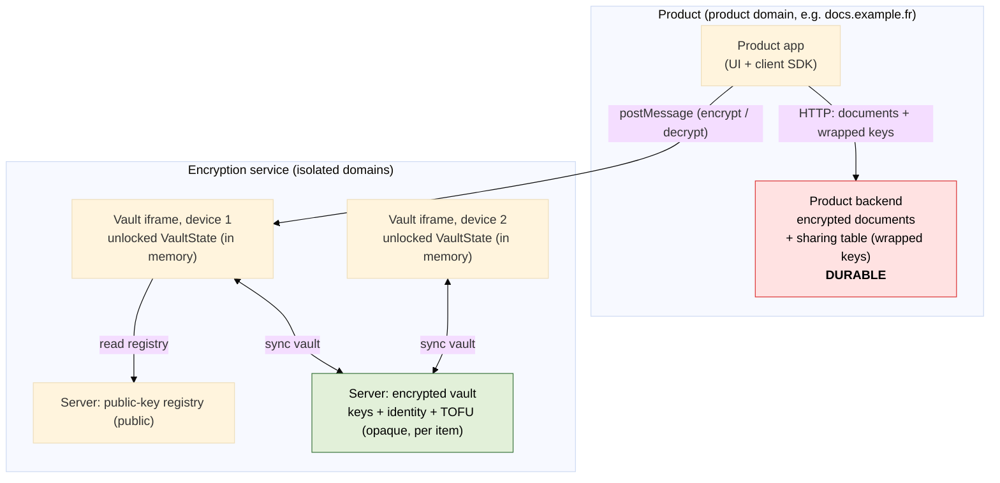
```mermaid
%%{init: {'theme':'base'}}%%
flowchart TB
  subgraph PROD["Product (product domain, e.g. docs.example.fr)"]
    PF["Product app<br/>(UI + client SDK)"]
    PB["Product backend<br/>encrypted documents<br/>+ sharing table (wrapped keys)<br/><b>DURABLE</b>"]
  end
  subgraph ENC["Encryption service (isolated domains)"]
    VF1["Vault iframe, device 1<br/>unlocked VaultState (in memory)"]
    VF2["Vault iframe, device 2<br/>unlocked VaultState (in memory)"]
    REG["Server: public-key registry (public)"]
    COF["Server: encrypted vault<br/>keys + identity + TOFU (opaque, per item)"]
  end
  PF -->|"postMessage (encrypt / decrypt)"| VF1
  PF -->|"HTTP: documents + wrapped keys"| PB
  VF1 -->|"read registry"| REG
  VF1 <-->|"sync vault"| COF
  VF2 <-->|"sync vault"| COF
  classDef durable fill:#e2f0d9,stroke:#3c763d,color:#000;
  classDef perm fill:#ffe2e2,stroke:#d33,color:#000;
  class PB perm;
  class COF durable;
```

|                                                                                     | Stored where                                                 | Confidential?                     |
| ----------------------------------------------------------------------------------- | ------------------------------------------------------------ | --------------------------------- |
| Public-key registry (encryption + identity public keys, binding signature, version) | Encryption server, **public**                                | No, integrity only                |
| Encrypted vault (key pairs + TOFU)                                                  | Encryption server, **opaque per-item ciphertext**            | Yes, server cannot read it        |
| Encrypted documents + sharing table (wrapped document keys)                         | Product backend, **durable**                                 | Documents and keys are ciphertext |
| Unlocked VaultState                                                                 | Vault iframe, **in memory** while unlocked                   | n/a                               |
| Wrapped VRK cache                                                                   | Vault iframe, **at rest** under a non-extractable device key | Yes                               |

The encryption server is a **blind store**: it reads routing metadata (who, which item, how recent) but never any content. This is the same posture as Bitwarden's server, plus one addition: we **sign** what we store so integrity does not depend on trusting the server (Section 7).

---

## 3. Document sharing

Each document has its own symmetric key. Sharing wraps that key to the recipient's encryption public key and stores the wrapped copy in the product's sharing table; reading unwraps it with the recipient's private key.

### 3.1 Share: Alice grants Bob access

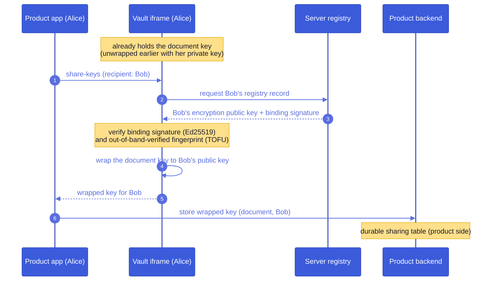
```mermaid
%%{init: {'theme':'base','themeVariables':{'actorBkg':'#3b5bdb','actorTextColor':'#fff','actorBorder':'#2942b8','signalColor':'#5b6ee0','signalTextColor':'#5b6ee0','noteBkgColor':'#ffe08a','noteTextColor':'#1a1a2e','noteBorderColor':'#e0a800','sequenceNumberColor':'#fff'}}}%%
sequenceDiagram
  autonumber
  participant PA as Product app (Alice)
  participant VA as Vault iframe (Alice)
  participant REG as Server registry
  participant PB as Product backend
  Note over VA: already holds the document key<br/>(unwrapped earlier with her private key)
  PA->>VA: share-keys (recipient: Bob)
  VA->>REG: request Bob's registry record
  REG-->>VA: Bob's encryption public key + binding signature
  Note over VA: verify binding signature (Ed25519)<br/>and out-of-band-verified fingerprint (TOFU)
  VA->>VA: wrap the document key to Bob's public key
  VA-->>PA: wrapped key for Bob
  PA->>PB: store wrapped key (document, Bob)
  Note over PB: durable sharing table (product side)
```

### 3.2 Read: Bob opens the document

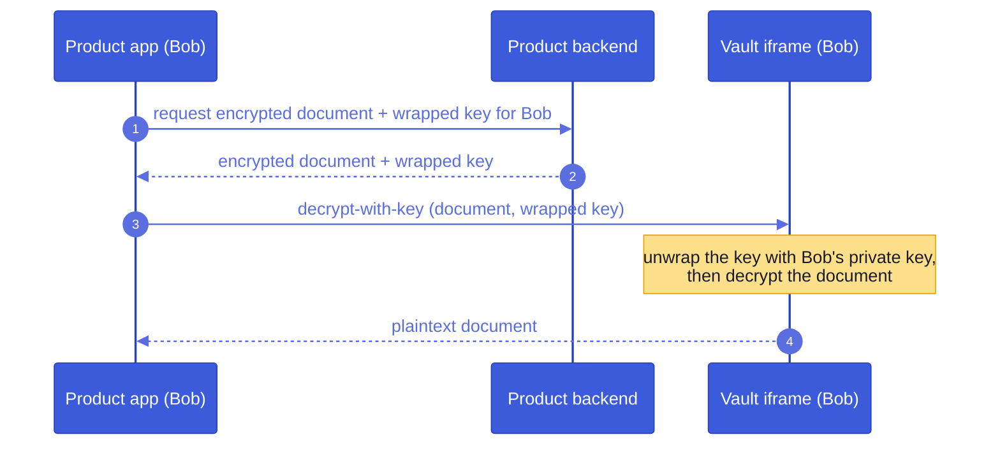
```mermaid
%%{init: {'theme':'base','themeVariables':{'actorBkg':'#3b5bdb','actorTextColor':'#fff','actorBorder':'#2942b8','signalColor':'#5b6ee0','signalTextColor':'#5b6ee0','noteBkgColor':'#ffe08a','noteTextColor':'#1a1a2e','noteBorderColor':'#e0a800','sequenceNumberColor':'#fff'}}}%%
sequenceDiagram
  autonumber
  participant PB2 as Product app (Bob)
  participant BK as Product backend
  participant VB as Vault iframe (Bob)
  PB2->>BK: request encrypted document + wrapped key for Bob
  BK-->>PB2: encrypted document + wrapped key
  PB2->>VB: decrypt-with-key (document, wrapped key)
  Note over VB: unwrap the key with Bob's private key,<br/>then decrypt the document
  VB-->>PB2: plaintext document
```

### 3.3 Backend request authorization and its trust boundary

A product backend can verify that a request acting on an encrypted document really comes from the user the document was shared with. It records, per share, the recipient's encryption-key **version** (an integer). To authorize a later request, it fetches from the registry the identity that this version is bound to and checks the request's signature against it. A legitimately rotated identity is accepted through the **continuity chain** (a successor identity carries a `continuitySignature` by its predecessor); a fresh, unlinked identity is not.

This check is **defense in depth on top of OIDC**. OIDC already authenticates the request as the user. The identity signature adds a cryptographic assurance that survives a **stolen access token**: a stolen token alone cannot produce the identity signature, and cannot register a continuity-linked successor (that needs the previous identity's private key, which never leaves the client), so it cannot silently act on the user's existing documents and can never read them.

**Trust boundary, stated plainly.** The backend **trusts the registry** for this lookup. It does not keep its own first-seen trust store per user, so a registry that is itself compromised could return a substituted identity and the backend would accept it. That is a deliberate limit: defending a product backend against a fully compromised registry _and_ a stolen token at once is out of scope, and cryptography cannot bootstrap trust from nothing. What still holds under a compromised registry is narrow but real: private keys never touch the server, so no registry compromise can **decrypt** content. At worst it enables impersonation or reshuffled shares over data that stays unreadable. The residual trust roots are therefore explicit and small: **OIDC for authentication, and the registry for the identity lookup**, with the continuity chain and the out-of-band fingerprint the tools that reduce, not eliminate, that registry trust.

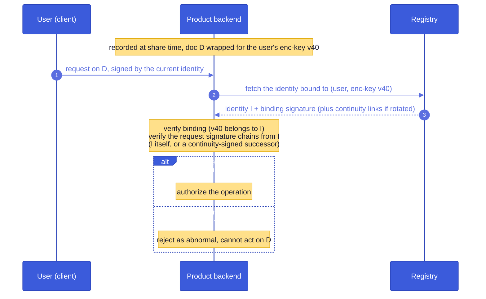
```mermaid
%%{init: {'theme':'base','themeVariables':{'actorBkg':'#3b5bdb','actorTextColor':'#fff','actorBorder':'#2942b8','signalColor':'#5b6ee0','signalTextColor':'#5b6ee0','noteBkgColor':'#ffe08a','noteTextColor':'#1a1a2e','noteBorderColor':'#e0a800','sequenceNumberColor':'#fff'}}}%%
sequenceDiagram
  autonumber
  participant U as User (client)
  participant P as Product backend
  participant REG as Registry
  Note over P: recorded at share time, doc D wrapped for the user's enc-key v40
  U->>P: request on D, signed by the current identity
  P->>REG: fetch the identity bound to (user, enc-key v40)
  REG-->>P: identity I + binding signature (plus continuity links if rotated)
  Note over P: verify binding (v40 belongs to I)<br/>verify the request signature chains from I<br/>(I itself, or a continuity-signed successor)
  alt signature chains from the pinned identity
    Note over P: authorize the operation
  else fresh or unlinked identity, e.g. a stolen-token reset
    Note over P: reject as abnormal, cannot act on D
  end
```

### 3.4 Identity continuity in client trust (TOFU)

A client keeps a trust decision per contact, keyed on that contact's **identity fingerprint**. On first contact the fingerprint is **recorded as `unknown`** (seen, not verified) and **sharing is allowed**: there is deliberately **no trust-on-first-use** (the contact is not marked `trusted`), but neither is the share blocked. Recording the fingerprint is what lets a later change be caught. Marking a contact `trusted` (or `refused`) is only ever an **explicit user decision** (verify the fingerprint out-of-band, then accept). What is fail-safe is any **change**: a new fingerprint for a **recorded** contact is surfaced as a **mismatch**, which blocks the share and prompts the user to re-verify out-of-band. This is what detects an attacker who reset a victim's account into a new identity, and what detects a registry that substituted a key. A first encounter is not treated as an attack; a change to a known contact is.

The continuity chain lets a **legitimate** rotation pass without re-verification: the client walks from the contact's current identity back toward the one it trusts, checking at each hop that the newer identity carries a valid `continuitySignature` from its predecessor, and only then carries the old trust status forward to the new fingerprint. This does **not** weaken the detection above, because forging any link requires that predecessor's **private key**, which never touches the server. A compromised registry can only **withhold or roll back** links, whose fail-safe effect is to fall back to unknown and force re-verification, never a false upgrade to trusted. A refused contact is stuck the same way: hiding the link makes them merely unknown (a fresh decision), not trusted, and they cannot fabricate a link from some other trusted identity. So continuity in TOFU propagates trust only along a chain the legitimate key holder actually signed, and stays safe against a database compromise.

The resolution happens **inside the normal fingerprint check**, not as a separate call. When a provided fingerprint mismatches a pinned one, the vault fetches that contact's continuity chain from the registry itself (`GET /api/public-keys/:userId/continuity`, public directory data needing no auth) and walks it: it verifies each link's signature and contiguity, and stops as soon as a link's predecessor is the identity it pinned, re-pinning the current fingerprint and keeping the old status. The walk is bounded by a shared hop cap (`MAX_CONTINUITY_HOPS`): a contact that rotated more times than that since the last verification, or a registry serving a longer fabricated chain, falls back to a fresh out-of-band check. No continuity data crosses the postMessage boundary, so products never handle it. Multiple rotations therefore resolve across several hops in a single check, and the cross-signing columns are the only registry data the walk relies on.

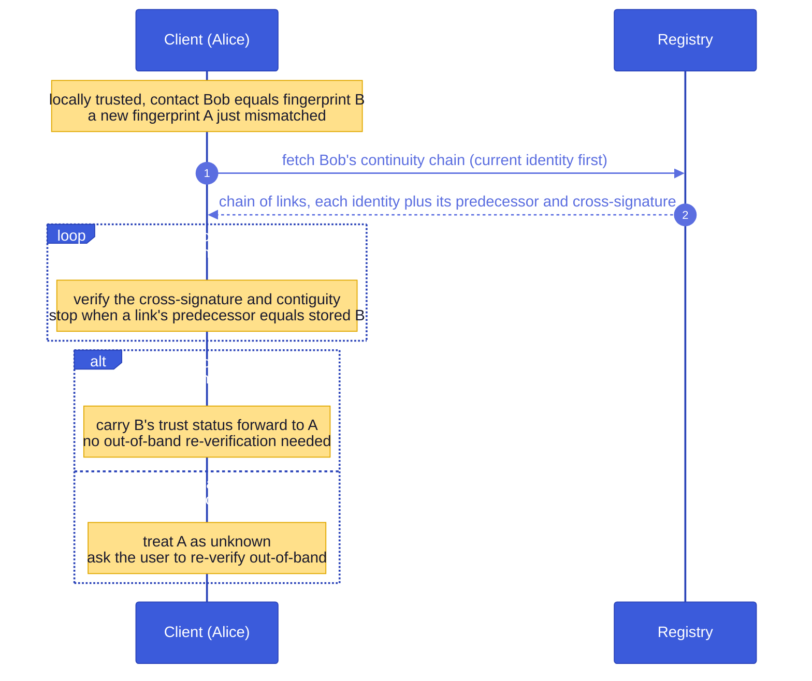
```mermaid
%%{init: {'theme':'base','themeVariables':{'actorBkg':'#3b5bdb','actorTextColor':'#fff','actorBorder':'#2942b8','signalColor':'#5b6ee0','signalTextColor':'#5b6ee0','noteBkgColor':'#ffe08a','noteTextColor':'#1a1a2e','noteBorderColor':'#e0a800','sequenceNumberColor':'#fff'}}}%%
sequenceDiagram
  autonumber
  participant C as Client (Alice)
  participant REG as Registry
  Note over C: locally trusted, contact Bob equals fingerprint B<br/>a new fingerprint A just mismatched
  C->>REG: fetch Bob's continuity chain (current identity first)
  REG-->>C: chain of links, each identity plus its predecessor and cross-signature
  loop each link, back toward B, up to the hop cap
    Note over C: verify the cross-signature and contiguity<br/>stop when a link's predecessor equals stored B
  end
  alt a valid chain reaches B within the cap
    Note over C: carry B's trust status forward to A<br/>no out-of-band re-verification needed
  else chain broken, absent, or over the cap
    Note over C: treat A as unknown<br/>ask the user to re-verify out-of-band
  end
```

### 3.5 Key registration: dual-key proof of possession

Before a key pair enters the directory, the client must prove it holds **both** private keys, and the record's identity binding must be internally coherent. This is the anti-impersonation core: it is what stops anyone (including a malicious server) from publishing a key they do not control, or claiming another user's key. It runs as two phases, `init` then `complete`.

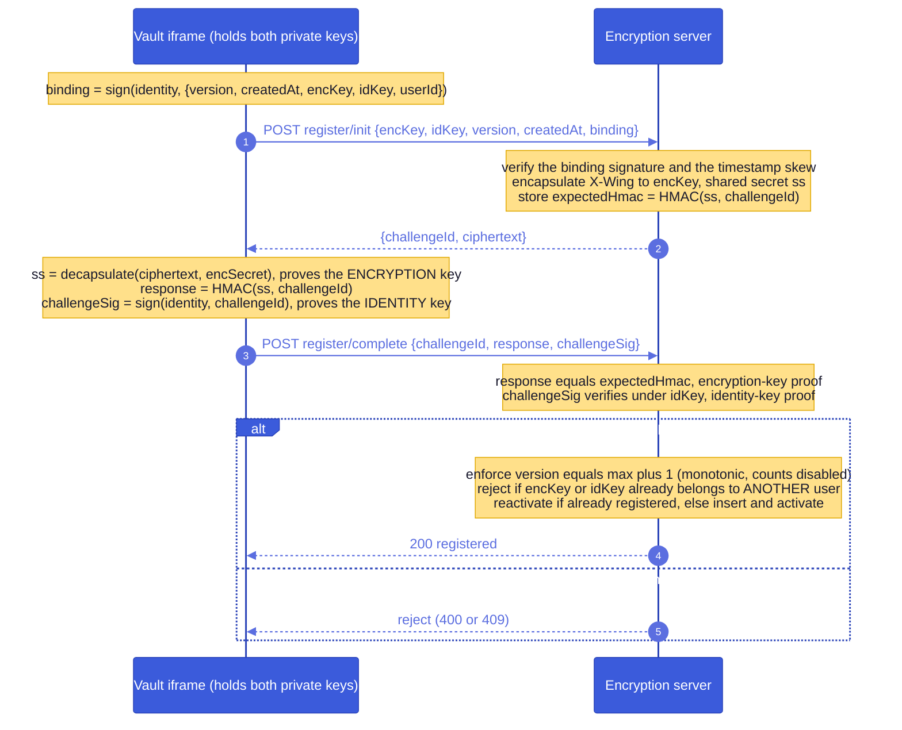
```mermaid
%%{init: {'theme':'base','themeVariables':{'actorBkg':'#3b5bdb','actorTextColor':'#fff','actorBorder':'#2942b8','signalColor':'#5b6ee0','signalTextColor':'#5b6ee0','noteBkgColor':'#ffe08a','noteTextColor':'#1a1a2e','noteBorderColor':'#e0a800','sequenceNumberColor':'#fff'}}}%%
sequenceDiagram
  autonumber
  participant V as Vault iframe (holds both private keys)
  participant API as Encryption server
  Note over V: binding = sign(identity, {version, createdAt, encKey, idKey, userId})
  V->>API: POST register/init {encKey, idKey, version, createdAt, binding}
  Note over API: verify the binding signature and the timestamp skew<br/>encapsulate X-Wing to encKey, shared secret ss<br/>store expectedHmac = HMAC(ss, challengeId)
  API-->>V: {challengeId, ciphertext}
  Note over V: ss = decapsulate(ciphertext, encSecret), proves the ENCRYPTION key<br/>response = HMAC(ss, challengeId)<br/>challengeSig = sign(identity, challengeId), proves the IDENTITY key
  V->>API: POST register/complete {challengeId, response, challengeSig}
  Note over API: response equals expectedHmac, encryption-key proof<br/>challengeSig verifies under idKey, identity-key proof
  alt both proofs pass and the record is coherent
    Note over API: enforce version equals max plus 1 (monotonic, counts disabled)<br/>reject if encKey or idKey already belongs to ANOTHER user<br/>reactivate if already registered, else insert and activate
    API-->>V: 200 registered
  else a proof fails or the key is already taken
    API-->>V: reject (400 or 409)
  end
```

The two proofs are independent and both required: decapsulating the X-Wing ciphertext proves the **encryption** private key, and signing the server-issued challenge id proves the **identity** private key. The binding signature (verified at `init`) proves the encryption key was chosen by the holder of the identity key, and because `version` and `createdAt` are inside it, the server cannot silently renumber or backdate a record. The `complete` writes run in one Serializable transaction so two devices racing for the same next `version` cannot both succeed. A registration record is immutable: restoring an already-registered key **reactivates** its existing row rather than minting a new version. This is the same flow the atomic onboarding (5.1) folds into its bootstrap transaction, and it is what a re-onboard after a reset re-runs at `max + 1`.

---

## 4. The synchronized vault

### 4.1 What syncs

```
VaultState {
  schema: 1
  identities:     [ { generation, algo, sigPublicKey, sigSecretKey, createdAt } ]   // grow-only, immutable
  encryptionKeys: [ { version, algo, publicKey, secretKey, createdAt } ]            // grow-only, immutable
  active:         { identityGen, encKeyVersion }                                     // pointer to the current key
  tofu:           { [remoteUserId]: { fingerprint, status, revisionDate, deleted? } }// the only mutable data
}
```

- **Keep every key generation**, not just the current one: a device must _decrypt_ content wrapped under an old key while _encrypting_ under the active one. Old versions are immutable, so keeping them costs a few KB.
- **No cached "known public keys."** A TOFU entry is just `{ fingerprint, status }` keyed by `remoteUserId`; the actual public keys are fetched fresh from the registry and re-verified on use. The fingerprint plus the userId is all we need to remember a trust decision.
- **TOFU is the only mutable, conflict-prone state**: everything else is append-only. This is what makes conflict handling tractable (Section 6).

Each item's decrypted payload and each server row are validated against a **Zod schema** after decryption, matching the project convention in `src/shared/schemas`. AEAD already prevents tampering; Zod guards against bugs and schema drift.

### 4.2 Key hierarchy and the unlock secret

Bitwarden's master password does two jobs, authenticate and unlock, which forces it to be memorable, hence weak. We split those jobs: **OIDC authenticates**, and the vault's unlock secret only _unlocks_. That frees the unlock secret to be **machine-generated and high-entropy**, which is what defeats an offline attack on a stolen or leaked blob without needing 1Password's separate "Secret Key."

```
recovery phrase R          (generated, BIP-39, high entropy, the only long-term secret)
      │  Argon2id(R, salt = userId)        # salt is not secret; the server never runs this
      ▼
   KEK
      ├── seal → wrappedVRK                 # VRK is random; the KEK only wraps it
      └── HKDF(KEK, "vault-auth") → authKey (Ed25519)   # proof-of-passphrase, cold fetch only

   VRK  ──seal each item──▶  vault items (one opaque ciphertext each, on the server)
```

- **The recovery phrase is generated, never user-chosen.** No low-entropy fallback and therefore no "Secret Key" bolt-on: a high-entropy `R` already makes a downloaded blob unbruteforceable. Imposing generation guarantees that property for every user.
- **Argon2id** via libsodium `crypto_pwhash`. Because `R` is high-entropy, the KDF is defense-in-depth (it rate-limits online guessing and standardizes derivation), not the load-bearing barrier.
- **The salt is `userId`** (the stable OIDC `sub`). A salt is not a secret: public source code is irrelevant, and only the client ever runs the KDF, so there is no server-side check that needs it. Its jobs are per-user uniqueness and anti-precomputation, both satisfied by `userId`. A malicious server that tampered with a salt would only cause the client's KEK to be wrong and the AEAD unwrap to fail, a detectable denial of service, not a confidentiality break. (A random stored salt is an equally valid alternative with no security difference.)
- **The VRK indirection** (a random key wrapped by the KEK, mirroring Bitwarden's user key) makes two operations cheap: changing the passphrase re-wraps only the VRK, and enrolling a second device forwards the VRK wrapped to that device's key.

**What "rotation" means here.** A passphrase change re-wraps the VRK only. An encryption-key rotation _appends_ a new key version and re-encrypts nothing (old versions are kept for decryption). The VRK itself is only ever rotated if it is believed leaked, and only that rare case re-encrypts the items. Ordinary use never re-encrypts the vault.

### 4.3 Local storage and caching

Locally, the vault iframe keeps two things: a plain in-memory `VaultState`, and a durable cache holding the encrypted items, their revision, the manifest signature, and **the VRK wrapped by a non-extractable WebCrypto device key**.

Why cache the VRK rather than the passphrase: the passphrase (`R`) is the ultimate secret and also the printed recovery secret, so it is never persisted anywhere. The VRK is a derived key; caching it wrapped under a non-extractable device key means (a) we skip the deliberately-slow Argon2id every session, (b) we never re-prompt the mnemonic for routine use, including after the last tab is closed, and (c) script cannot exfiltrate the wrapping key. This is strictly safer than storing the phrase.

Two independent timers govern the cache:

- **Lock** (short, e.g. inactivity): clear the plaintext `VaultState` from memory. Unlock is instant: unwrap the cached VRK with the device key; no mnemonic needed.
- **De-enroll** (long, e.g. ~6 months): wipe the device-wrapped VRK, so the device must re-enroll via device-approval or the mnemonic. This bounds how long a stolen but still-logged-in device stays usable. The vault iframe enforces the check on load, so it triggers the next time any product embeds it.

---

## 5. Vault flows

Participants: **U** user, **P** product app, **UI** interface iframe, **V** vault iframe, **API** encryption server, **E** an enrolled device, **N** a new device.

### 5.1 Onboarding: vault creation

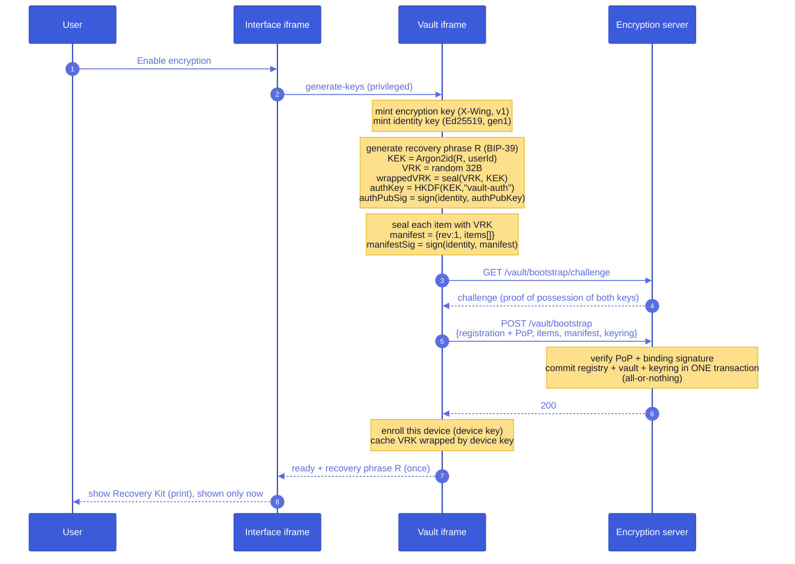
```mermaid
%%{init: {'theme':'base','themeVariables':{'actorBkg':'#3b5bdb','actorTextColor':'#fff','actorBorder':'#2942b8','signalColor':'#5b6ee0','signalTextColor':'#5b6ee0','noteBkgColor':'#ffe08a','noteTextColor':'#1a1a2e','noteBorderColor':'#e0a800','sequenceNumberColor':'#fff'}}}%%
sequenceDiagram
  autonumber
  participant U as User
  participant UI as Interface iframe
  participant V as Vault iframe
  participant API as Encryption server
  U->>UI: Enable encryption
  UI->>V: generate-keys (privileged)
  Note over V: mint encryption key (X-Wing, v1)<br/>mint identity key (Ed25519, gen1)
  Note over V: generate recovery phrase R (BIP-39)<br/>KEK = Argon2id(R, userId)<br/>VRK = random 32B<br/>wrappedVRK = seal(VRK, KEK)<br/>authKey = HKDF(KEK,"vault-auth")<br/>authPubSig = sign(identity, authPubKey)
  Note over V: seal each item with VRK<br/>manifest = {rev:1, items[]}<br/>manifestSig = sign(identity, manifest)
  V->>API: GET /vault/bootstrap/challenge
  API-->>V: challenge (proof of possession of both keys)
  V->>API: POST /vault/bootstrap<br/>{registration + PoP, items, manifest, keyring}
  Note over API: verify PoP + binding signature<br/>commit registry + vault + keyring in ONE transaction<br/>(all-or-nothing)
  API-->>V: 200
  Note over V: enroll this device (device key)<br/>cache VRK wrapped by device key
  V-->>UI: ready + recovery phrase R (once)
  UI-->>U: show Recovery Kit (print), shown only now
```

Onboarding writes three things that must stay consistent: the public-key registration, the encrypted vault, and the keyring (the wrapped VRK plus the cold-fetch auth key). They are committed **atomically in a single server transaction** rather than as separate requests. A partial write would otherwise leave a harmful state, for example public keys registered so contacts wrap document keys to the user, but no keyring or vault backed up, so the data is unrecoverable if the device is lost, or a stored vault whose keyring never landed, which can never be unlocked. The preceding challenge fetch is read-only and safe to retry, and the commit is **idempotent** (registration reactivates rather than duplicates, and the vault write is keyed by content and revision), so a client that retries after a lost response completes cleanly.

### 5.2 Encrypt a document (product operation, no sync round-trip)

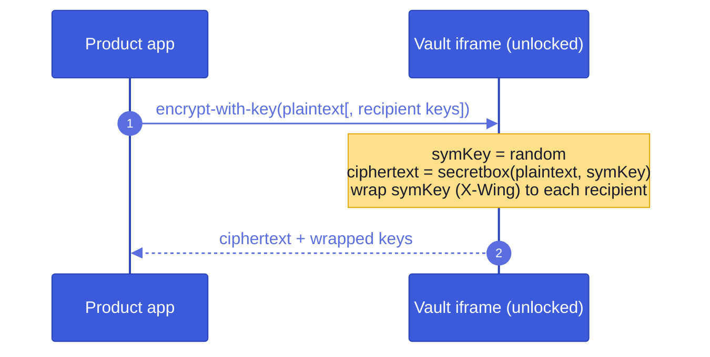
```mermaid
%%{init: {'theme':'base','themeVariables':{'actorBkg':'#3b5bdb','actorTextColor':'#fff','actorBorder':'#2942b8','signalColor':'#5b6ee0','signalTextColor':'#5b6ee0','noteBkgColor':'#ffe08a','noteTextColor':'#1a1a2e','noteBorderColor':'#e0a800','sequenceNumberColor':'#fff'}}}%%
sequenceDiagram
  autonumber
  participant P as Product app
  participant V as Vault iframe (unlocked)
  P->>V: encrypt-with-key(plaintext[, recipient keys])
  Note over V: symKey = random<br/>ciphertext = secretbox(plaintext, symKey)<br/>wrap symKey (X-Wing) to each recipient
  V-->>P: ciphertext + wrapped keys
```

### 5.3 Cold unlock on a new device (mnemonic + proof-of-passphrase)

The only flow that uses the passphrase, when a device has nothing cached and no other device is available to approve it (otherwise use 5.6).

The proof-of-passphrase gates the **`wrappedVRK`**, not just the items. That placement is deliberate: the items are encrypted under the random VRK and are not brute-forceable, whereas `wrappedVRK = seal(VRK, Argon2id(R, ...))` is the only thing an attacker could grind against the passphrase, so it is what must not be handed to a bare token. The salt is `userId`, so no secret is fetched to derive the key; the only thing served before the proof is the account's **KDF cost variants** (non-sensitive numbers). They are needed because Argon2 params are stored **per vault**, so a vault created before the standard was raised keeps its own params: the client derives `authKey` for each distinct variant (cheapest first, almost always a single one) and retries the proof until a keyring verifies. No language is served or needed: `authKey` is derived from Argon2 over the phrase **string**, so the input validates typed words against every wordlist and the server only ever checks a signature. The `authPubKey` is a passphrase-derived verifier and is therefore **never** returned to a client; it is written at bootstrap and used only server-side to check the proof. As elsewhere, this gate is defense-in-depth: the high entropy of `R` is what actually protects a leaked `wrappedVRK`; the gate simply keeps that material away from a stolen token in the first place.

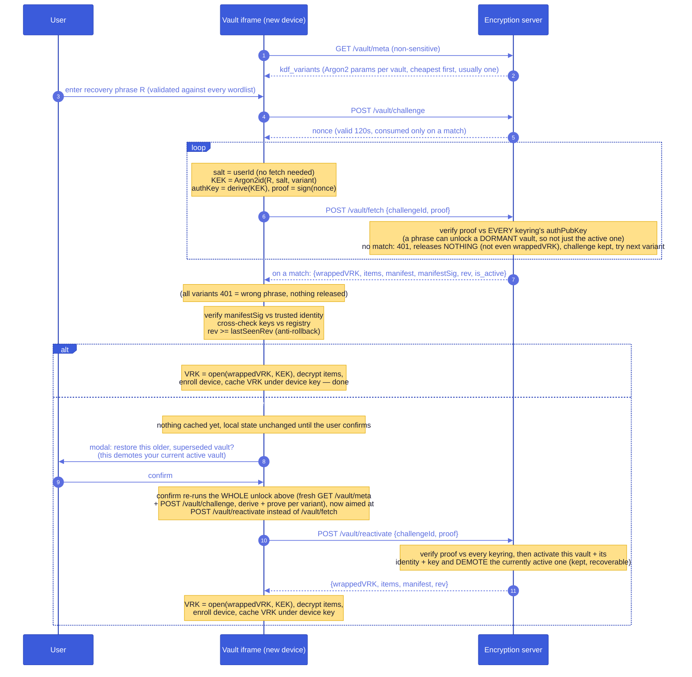
```mermaid
%%{init: {'theme':'base','themeVariables':{'actorBkg':'#3b5bdb','actorTextColor':'#fff','actorBorder':'#2942b8','signalColor':'#5b6ee0','signalTextColor':'#5b6ee0','noteBkgColor':'#ffe08a','noteTextColor':'#1a1a2e','noteBorderColor':'#e0a800','sequenceNumberColor':'#fff'}}}%%
sequenceDiagram
  autonumber
  participant U as User
  participant V as Vault iframe (new device)
  participant API as Encryption server
  V->>API: GET /vault/meta (non-sensitive)
  API-->>V: kdf_variants (Argon2 params per vault, cheapest first, usually one)
  U->>V: enter recovery phrase R (validated against every wordlist)
  V->>API: POST /vault/challenge
  API-->>V: nonce (valid 120s, consumed only on a match)
  loop each KDF variant until the proof verifies (usually the first)
    Note over V: salt = userId (no fetch needed)<br/>KEK = Argon2id(R, salt, variant)<br/>authKey = derive(KEK), proof = sign(nonce)
    V->>API: POST /vault/fetch {challengeId, proof}
    Note over API: verify proof vs EVERY keyring's authPubKey<br/>(a phrase can unlock a DORMANT vault, so not just the active one)<br/>no match: 401, releases NOTHING (not even wrappedVRK), challenge kept, try next variant
  end
  API-->>V: on a match: {wrappedVRK, items, manifest, manifestSig, rev, is_active}
  Note over V: (all variants 401 = wrong phrase, nothing released)
  Note over V: verify manifestSig vs trusted identity<br/>cross-check keys vs registry<br/>rev >= lastSeenRev (anti-rollback)
  alt is_active: the phrase unlocked the CURRENT vault
    Note over V: VRK = open(wrappedVRK, KEK), decrypt items,<br/>enroll device, cache VRK under device key — done
  else the phrase unlocked a DORMANT (superseded) vault
    Note over V: nothing cached yet, local state unchanged until the user confirms
    V->>U: modal: restore this older, superseded vault?<br/>(this demotes your current active vault)
    U->>V: confirm
    Note over V: confirm re-runs the WHOLE unlock above (fresh GET /vault/meta<br/>+ POST /vault/challenge, derive + prove per variant), now aimed at<br/>POST /vault/reactivate instead of /vault/fetch
    V->>API: POST /vault/reactivate {challengeId, proof}
    Note over API: verify proof vs every keyring, then activate this vault + its<br/>identity + key and DEMOTE the currently active one (kept, recoverable)
    API-->>V: {wrappedVRK, items, manifest, rev}
    Note over V: VRK = open(wrappedVRK, KEK), decrypt items,<br/>enroll device, cache VRK under device key
  end
```

The `is_active` flag drives the last fork. If the phrase unlocked the **current** vault, the client caches it and enrolls straight away. If it unlocked a **dormant** (superseded) vault, nothing is cached: the client shows a modal, and only if the user confirms does it call `/vault/reactivate`, which activates that vault and **demotes the currently active one** (the same phrase-authenticated switch §5.9 uses, and the mechanism behind recovering an older vault or reclaiming a vault after another device replaced the identity).

### 5.4 Warm sync on an enrolled device

No passphrase, the device authenticates ongoing syncs with its **device key**. The everyday path.

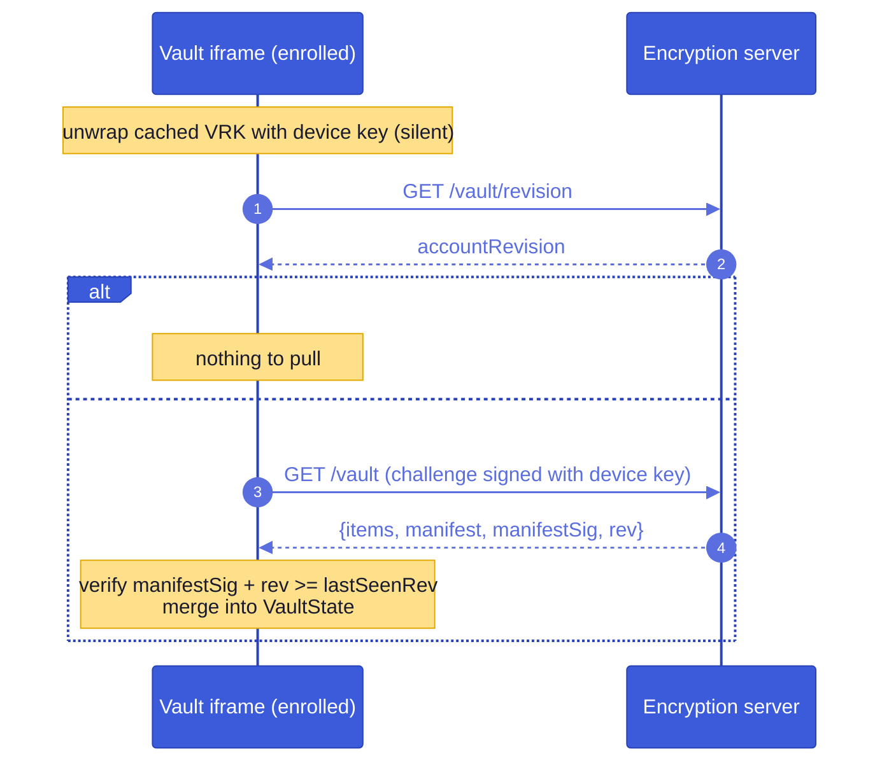
```mermaid
%%{init: {'theme':'base','themeVariables':{'actorBkg':'#3b5bdb','actorTextColor':'#fff','actorBorder':'#2942b8','signalColor':'#5b6ee0','signalTextColor':'#5b6ee0','noteBkgColor':'#ffe08a','noteTextColor':'#1a1a2e','noteBorderColor':'#e0a800','sequenceNumberColor':'#fff'}}}%%
sequenceDiagram
  autonumber
  participant V as Vault iframe (enrolled)
  participant API as Encryption server
  Note over V: unwrap cached VRK with device key (silent)
  V->>API: GET /vault/revision
  API-->>V: accountRevision
  alt unchanged
    Note over V: nothing to pull
  else newer on server
    V->>API: GET /vault (challenge signed with device key)
    API-->>V: {items, manifest, manifestSig, rev}
    Note over V: verify manifestSig + rev >= lastSeenRev<br/>merge into VaultState
  end
```

### 5.5 Mutate the vault (with conflict handling)

Every local change goes through a single choke point (`applyAndSync`) so nothing bypasses sync: compute the change, re-sign the manifest, push **write-through** (commit to `VaultState` only once the server confirms). Mirrors Bitwarden's per-item optimistic concurrency.

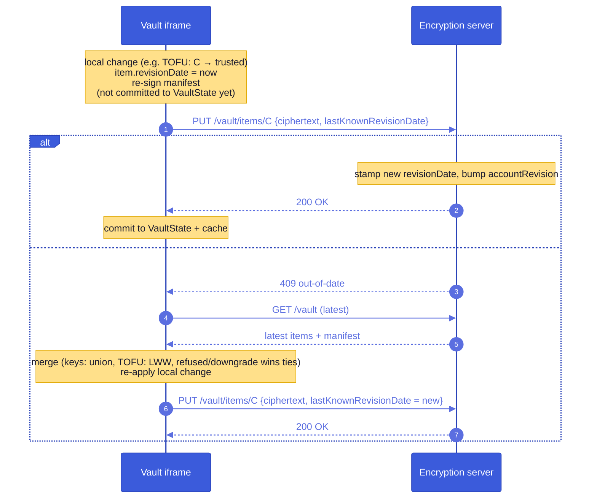
```mermaid
%%{init: {'theme':'base','themeVariables':{'actorBkg':'#3b5bdb','actorTextColor':'#fff','actorBorder':'#2942b8','signalColor':'#5b6ee0','signalTextColor':'#5b6ee0','noteBkgColor':'#ffe08a','noteTextColor':'#1a1a2e','noteBorderColor':'#e0a800','sequenceNumberColor':'#fff'}}}%%
sequenceDiagram
  autonumber
  participant V as Vault iframe
  participant API as Encryption server
  Note over V: local change (e.g. TOFU: C → trusted)<br/>item.revisionDate = now<br/>re-sign manifest<br/>(not committed to VaultState yet)
  V->>API: PUT /vault/items/C {ciphertext, lastKnownRevisionDate}
  alt server copy not newer
    Note over API: stamp new revisionDate, bump accountRevision
    API-->>V: 200 OK
    Note over V: commit to VaultState + cache
  else server copy newer (> 1s)
    API-->>V: 409 out-of-date
    V->>API: GET /vault (latest)
    API-->>V: latest items + manifest
    Note over V: merge (keys: union, TOFU: LWW, refused/downgrade wins ties)<br/>re-apply local change
    V->>API: PUT /vault/items/C {ciphertext, lastKnownRevisionDate = new}
    API-->>V: 200 OK
  end
```

### 5.6 Add a device via approval (QR): the primary path

There are two ways to bring encryption onto a new device. When another device is at hand, this approval flow forwards the keys directly. When it is not, the user unlocks with the recovery phrase instead (5.3). This section is the with-another-device path. An already-enrolled, unlocked device forwards the **VRK** to a new device. The mnemonic is never involved here (it is not on the device to forward; the VRK is). The new device shows a **128-bit decimal fingerprint** of its ephemeral public key: as a QR to scan with a camera, and as digits to type when a camera is not available. The fingerprint is public, so capturing it is useless. It exists only so the enrolled device can confirm the server handed over the right key. 128 bits is deliberate: the ephemeral key and the whole exchange live for minutes and are used once, so there is no need for the recovery phrase's long-term, post-quantum 256-bit margin, and a shorter fingerprint keeps the typed fallback manageable.

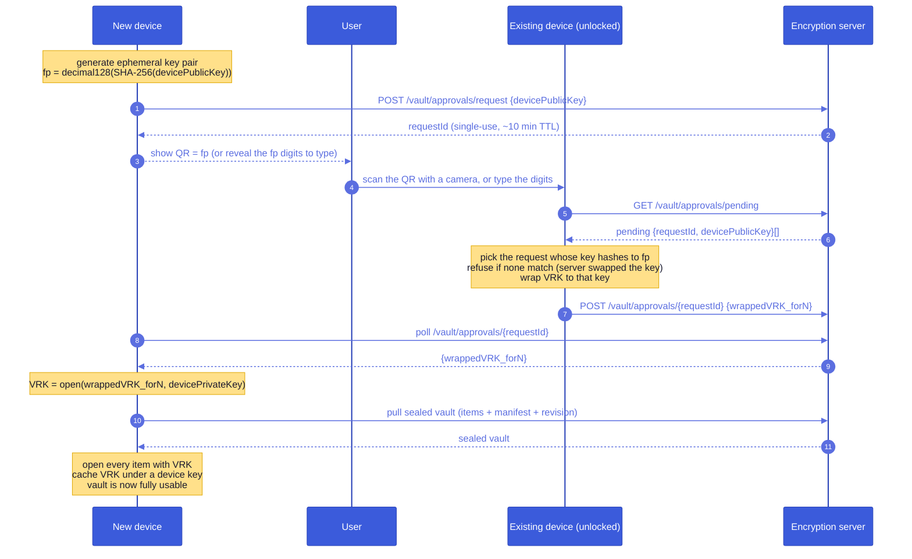
```mermaid
%%{init: {'theme':'base','themeVariables':{'actorBkg':'#3b5bdb','actorTextColor':'#fff','actorBorder':'#2942b8','signalColor':'#5b6ee0','signalTextColor':'#5b6ee0','noteBkgColor':'#ffe08a','noteTextColor':'#1a1a2e','noteBorderColor':'#e0a800','sequenceNumberColor':'#fff'}}}%%
sequenceDiagram
  autonumber
  participant N as New device
  participant U as User
  participant E as Existing device (unlocked)
  participant API as Encryption server
  Note over N: generate ephemeral key pair<br/>fp = decimal128(SHA-256(devicePublicKey))
  N->>API: POST /vault/approvals/request {devicePublicKey}
  API-->>N: requestId (single-use, ~10 min TTL)
  N-->>U: show QR = fp (or reveal the fp digits to type)
  U->>E: scan the QR with a camera, or type the digits
  E->>API: GET /vault/approvals/pending
  API-->>E: pending {requestId, devicePublicKey}[]
  Note over E: pick the request whose key hashes to fp<br/>refuse if none match (server swapped the key)<br/>wrap VRK to that key
  E->>API: POST /vault/approvals/{requestId} {wrappedVRK_forN}
  N->>API: poll /vault/approvals/{requestId}
  API-->>N: {wrappedVRK_forN}
  Note over N: VRK = open(wrappedVRK_forN, devicePrivateKey)
  N->>API: pull sealed vault (items + manifest + revision)
  API-->>N: sealed vault
  Note over N: open every item with VRK<br/>cache VRK under a device key<br/>vault is now fully usable
```

The enrolled device fetches the full key from the server and wraps the VRK only after the out-of-band fingerprint matches, so a malicious server cannot substitute a key of its own: it would have to find a different key pair whose 128-bit fingerprint collides, which is infeasible (2^128). The forwarded capsule is the VRK alone. The new device then pulls the sealed vault and opens every item with that VRK, so it lands on a complete, usable vault rather than an orphaned key.

**What the return path does and does not guarantee.** The forwarded capsule (the VRK wrapped to the new device's ephemeral key) is unauthenticated public-key encryption: anyone holding that public key, the server included, can produce a valid wrapping. So the 128-bit fingerprint authenticates only the **new-to-enrolled** direction (the enrolled device wraps to the right key). It does not let the new device prove the returned VRK and vault are the real ones. A fully malicious server could therefore wrap its own VRK' and serve a self-consistent vault under an **attacker identity**, which a brand-new device, having no prior anchor, would adopt. This is not a pairing-specific weakness: it is the general case of an untrusted server substituting a user's identity (3.3, 3.4), and it is bounded from several directions, which is why we do not add a second out-of-band confirmation step:

- **An already-provisioned device cannot be silently flipped.** If the server tries to converge an enrolled device onto the fake vault, that device verifies the pulled manifest against the identity it **already trusts locally**; the attacker's signature does not match, so it fails closed (5.8, integrity error) instead of adopting. Fooling it would need the real identity's private key, which never left it.
- **The fake identity is inert to others unless the registry is also substituted.** Third parties can only encrypt to the new device if the attacker also publishes the fake identity in the public-key registry, and that publication is exactly what a contact's out-of-band fingerprint check (TOFU, 3.4) detects, and what an append-only registry trace would make **auditable** after the fact (see below).
- **The blast radius is new content only.** Existing documents stay under the real keys and remain unreadable to the fake identity. Only content the user creates on the freshly poisoned device is exposed, and it surfaces on first share via TOFU.

Turning an enrolled device's refusal into a guided "what happened / how to recover" flow, and telling this apart from a **legitimate** vault switch made on another device, is the reconciliation path (5.10). The net posture is worth stating plainly: being able to tamper with the server does **not** let it read content or silently take over a provisioned device. At most, and detectably, it can mislead a brand-new device or reshuffle data that stays unreadable.

> TODO: keep an **append-only trace** of registry writes (identity and key publications) so an identity substitution is auditable after the fact, not only detectable live by a contact's fingerprint check. The directory ledger is already permanent (5.9); this is about recording the write history in a form a user or auditor can review.

### 5.7 Change the recovery phrase

Cheap: re-wrap the VRK; the vault items are not touched. The previously printed Recovery Kit becomes invalid, so the user must re-print.

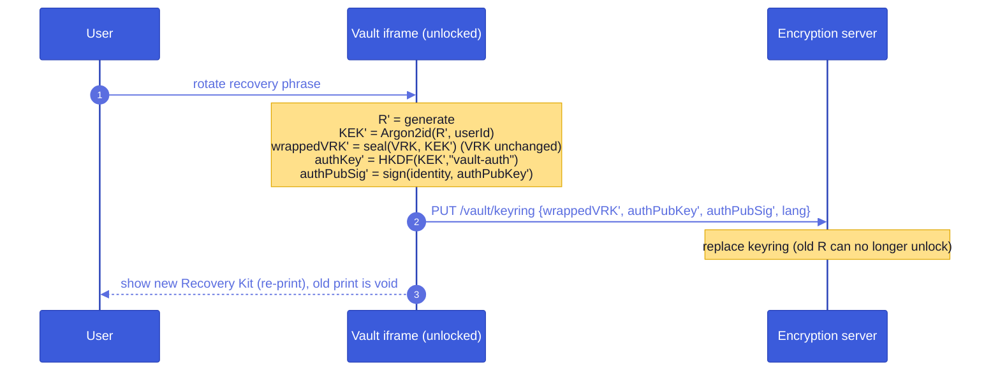
```mermaid
%%{init: {'theme':'base','themeVariables':{'actorBkg':'#3b5bdb','actorTextColor':'#fff','actorBorder':'#2942b8','signalColor':'#5b6ee0','signalTextColor':'#5b6ee0','noteBkgColor':'#ffe08a','noteTextColor':'#1a1a2e','noteBorderColor':'#e0a800','sequenceNumberColor':'#fff'}}}%%
sequenceDiagram
  autonumber
  participant U as User
  participant V as Vault iframe (unlocked)
  participant API as Encryption server
  U->>V: rotate recovery phrase
  Note over V: R' = generate<br/>KEK' = Argon2id(R', userId)<br/>wrappedVRK' = seal(VRK, KEK')  (VRK unchanged)<br/>authKey' = HKDF(KEK',"vault-auth")<br/>authPubSig' = sign(identity, authPubKey')
  V->>API: PUT /vault/keyring {wrappedVRK', authPubKey', authPubSig', lang}
  Note over API: replace keyring (old R can no longer unlock)
  V-->>U: show new Recovery Kit (re-print), old print is void
```

### 5.8 Integrity failure handling

If the manifest signature does not verify, or the revision went backwards, the device refuses to apply the data and keeps its last-good state.

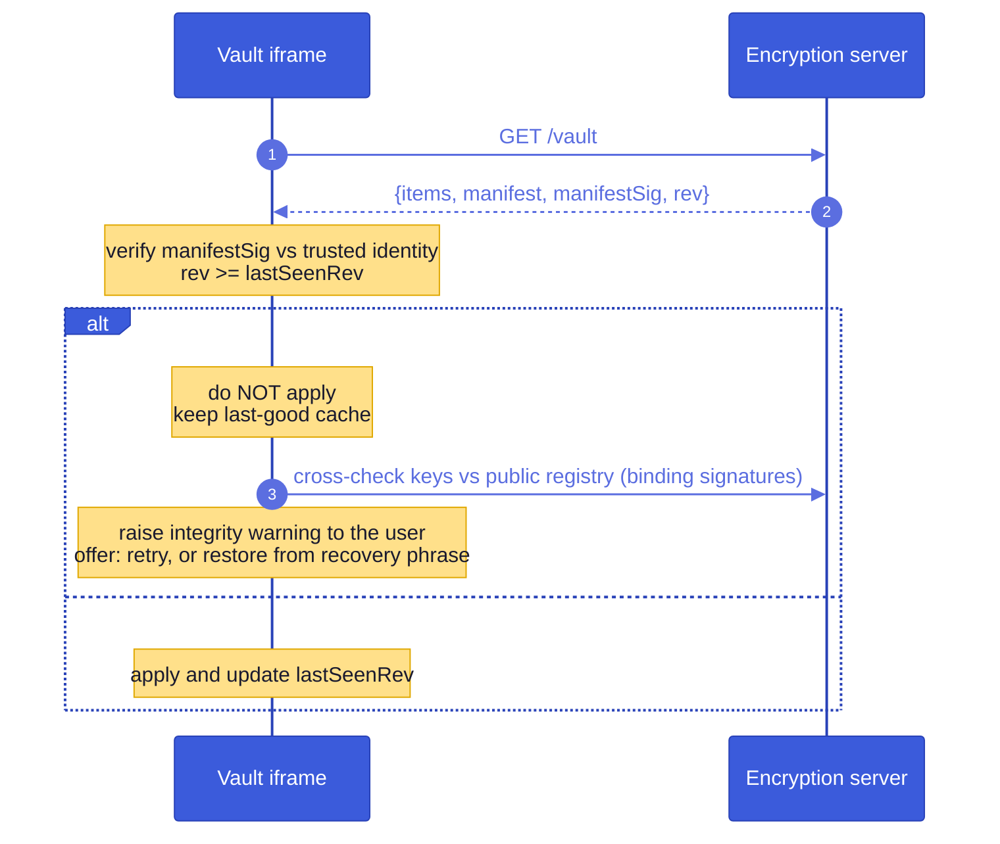
```mermaid
%%{init: {'theme':'base','themeVariables':{'actorBkg':'#3b5bdb','actorTextColor':'#fff','actorBorder':'#2942b8','signalColor':'#5b6ee0','signalTextColor':'#5b6ee0','noteBkgColor':'#ffe08a','noteTextColor':'#1a1a2e','noteBorderColor':'#e0a800','sequenceNumberColor':'#fff'}}}%%
sequenceDiagram
  autonumber
  participant V as Vault iframe
  participant API as Encryption server
  V->>API: GET /vault
  API-->>V: {items, manifest, manifestSig, rev}
  Note over V: verify manifestSig vs trusted identity<br/>rev >= lastSeenRev
  alt invalid signature or rolled-back revision
    Note over V: do NOT apply<br/>keep last-good cache
    V->>API: cross-check keys vs public registry (binding signatures)
    Note over V: raise integrity warning to the user<br/>offer: retry, or restore from recovery phrase
  else valid
    Note over V: apply and update lastSeenRev
  end
```

### 5.9 Lost access: disable, reactivate, or reset

A user who loses their recovery phrase and has no enrolled device de-onboards. This soft-disables the **identity and the vault keyring** (their rows stay, with `disabledAt` set); the **encryption key row is left valid**, so a later reactivation restores the _same_ key rather than rotating. Disabling targets the identity because the identity is what makes a user discoverable: the directory joins only _active_ identities, so a disabled identity disappears from the registry and others can no longer fetch its key to share with it, while the key itself remains intact for recovery. It is never a hard delete, so a stolen access token cannot destroy data, only hide it.

**The directory ledger is permanent.** Identities (their generation) and encryption-key versions, with their dates and `disabledAt`, are never purged. They are the audit trail ("on this date, this identity existed") and the source of the monotonic counters, so versions and generations never reset: a returning user's next key is `ledger max + 1`.

**The vault content is purgeable.** The wrapped VRK and sealed items are the only sensitive material (they hold private keys). A scheduled job deletes them once `disabledAt` exceeds the retention window of one year, which also bounds how long private keys sit at rest.

**Reactivation and reset.** Within the retention window, the correct recovery phrase reactivates the dormant vault: the phrase-derived auth key matches that vault's stored `authPublicKey`, which identifies the vault and proves ownership in one step. After the window, or when no disabled vault matches, the user onboards a fresh vault under a new identity and the old encrypted content is lost.

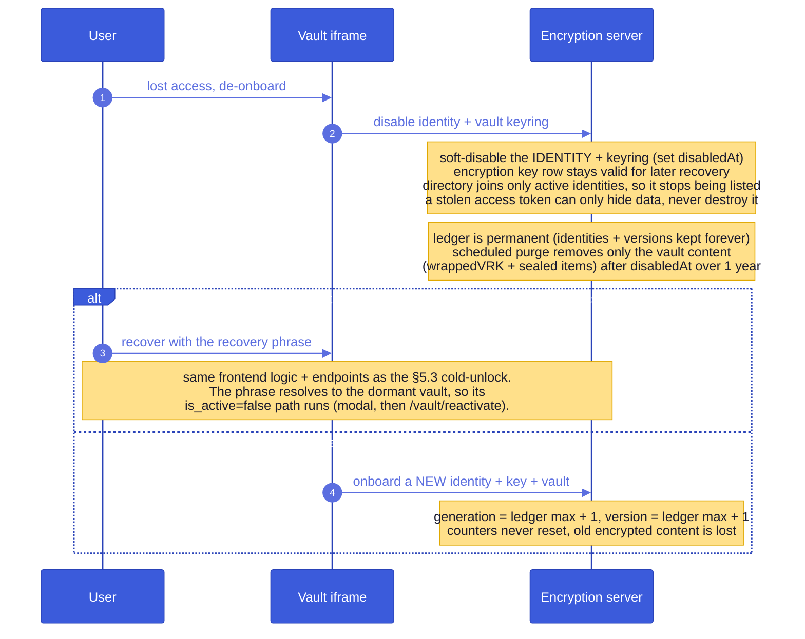
```mermaid
%%{init: {'theme':'base','themeVariables':{'actorBkg':'#3b5bdb','actorTextColor':'#fff','actorBorder':'#2942b8','signalColor':'#5b6ee0','signalTextColor':'#5b6ee0','noteBkgColor':'#ffe08a','noteTextColor':'#1a1a2e','noteBorderColor':'#e0a800','sequenceNumberColor':'#fff'}}}%%
sequenceDiagram
  autonumber
  participant U as User
  participant V as Vault iframe
  participant API as Encryption server
  U->>V: lost access, de-onboard
  V->>API: disable identity + vault keyring
  Note over API: soft-disable the IDENTITY + keyring (set disabledAt)<br/>encryption key row stays valid for later recovery<br/>directory joins only active identities, so it stops being listed<br/>a stolen access token can only hide data, never destroy it
  Note over API: ledger is permanent (identities + versions kept forever)<br/>scheduled purge removes only the vault content<br/>(wrappedVRK + sealed items) after disabledAt over 1 year
  alt within retention window, user re-enters the recovery phrase
    U->>V: recover with the recovery phrase
    Note over U,API: same frontend logic + endpoints as the §5.3 cold-unlock.<br/>The phrase resolves to the dormant vault, so its<br/>is_active=false path runs (modal, then /vault/reactivate).
  else phrase matches nothing or vault already purged
    V->>API: onboard a NEW identity + key + vault
    Note over API: generation = ledger max + 1, version = ledger max + 1<br/>counters never reset, old encrypted content is lost
  end
```

Two details the diagram compresses. **Nothing secret crosses the wire.** The device only ever sends a `challengeId` and an Ed25519 signature; the phrase, the KEK, and the VRK never leave it. The server stores each keyring's `authPublicKey` (a public key derived from the phrase) and the phrase-encrypted `wrappedVRK`, never the phrase or a hash of it, so a database thief learns nothing and the 256-bit phrase is unbruteforceable. **KDF params are per vault.** An older vault keeps the (weaker) Argon2 cost it was created with rather than today's, so the device cannot know which to use until it derives: it asks the server for the account's distinct variants (cheapest first) and retries the proof once per variant until one keyring verifies, almost always the first, since an account normally has a single variant. All attempts reuse one short-lived challenge, consumed only on a match and **not** invalidated on a wrong variant; that chaining is safe because every attempt still costs a full Argon2 derivation on the device and the phrase carries 256 bits of entropy. This walk-and-verify only happens on **cold restore**; an already-enrolled device that still holds its VRK syncs against the single active keyring directly (`/vault/items`, JWT-gated, no proof, no walk).

### 5.10 Reconciliation: when this device and the server disagree

§5.9 is the _cold_ case: a device with **no VRK**, holding only a recovery phrase. This section is the opposite: a device that **still holds its VRK** (cached under a non-extractable device key) but finds that the server no longer advertises its identity (disabled from another device) or advertises a **different** one (another device re-onboarded). The settings screen detects this by comparing its local identity fingerprint against the directory's active identity, and, since the two must agree before anything else works, gates on a reconciliation choice.

Two states, and the choices they offer:

- **Disabled elsewhere** (no active identity on the server): _reactivate this device_ (warm, below) or _de-onboard_ this device.
- **Diverged** (a different identity is active): _keep this device's identity_ (warm reactivate, which supersedes the other, and the other device must then reconcile in turn), _adopt the server's identity_ (discard the local keys and re-acquire the active one via a device or its recovery phrase), or _de-onboard_.

**Warm reactivation** is the key contrast with §5.9's cold path, and the reason it needs **no recovery phrase** is the **VRK**, not the keys. The VRK is what the passphrase originally produced (the phrase derives a KEK that unwraps the VRK), and this device already has it cached. Because the VRK is present, the device does not need the phrase to re-derive it: it opens its own vault with the cached VRK, and re-proves possession of the keys that vault contains (the same dual proof of possession used at registration). Holding the keys is itself a consequence of holding the VRK. The server's reactivate path then re-enables the identity and its encryption key, and flips this identity's vault keyring active (demoting any other), so identity and vault come back together. No `wrappedVRK` is released, because the device already has it.

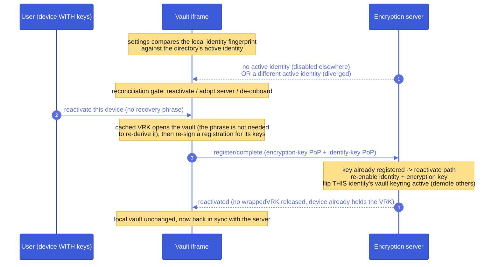
```mermaid
%%{init: {'theme':'base','themeVariables':{'actorBkg':'#3b5bdb','actorTextColor':'#fff','actorBorder':'#2942b8','signalColor':'#5b6ee0','signalTextColor':'#5b6ee0','noteBkgColor':'#ffe08a','noteTextColor':'#1a1a2e','noteBorderColor':'#e0a800','sequenceNumberColor':'#fff'}}}%%
sequenceDiagram
  autonumber
  participant U as User (device WITH keys)
  participant V as Vault iframe
  participant API as Encryption server
  Note over V: settings compares the local identity fingerprint<br/>against the directory's active identity
  API-->>V: no active identity (disabled elsewhere)<br/>OR a different active identity (diverged)
  Note over V: reconciliation gate: reactivate / adopt server / de-onboard
  U->>V: reactivate this device (no recovery phrase)
  Note over V: cached VRK opens the vault (the phrase is not needed<br/>to re-derive it), then re-sign a registration for its keys
  V->>API: register/complete (encryption-key PoP + identity-key PoP)
  Note over API: key already registered -> reactivate path<br/>re-enable identity + encryption key<br/>flip THIS identity's vault keyring active (demote others)
  API-->>V: reactivated (no wrappedVRK released, device already holds the VRK)
  Note over V: local vault unchanged, now back in sync with the server
```

---

## 6. Conflict prevention and resolution

The strategy is **prevention by data shape**: most of the vault cannot represent a conflict, so what is left to resolve is small and deterministic.

- **Encryption keys and identities are immutable and monotonic.** Two devices can only ever _add_ a new version or generation; merging is a **set union keyed by version/generation**: no conflict is representable. If two devices mint the same next `version`, the server's uniqueness constraint rejects the second, which re-pulls and picks `max+1`, the same optimistic-concurrency retry as any write.
- **TOFU entries are the only mutable items**, so the only place a genuine conflict can occur (device A trusts a contact, device B refuses the same contact). Resolution rules: a **fail-safe** refinement of Bitwarden's pure last-write-wins:
  1. Default: **last-write-wins by `revisionDate`**.
  2. **`refused` wins ties** and never loses to a same-or-older `trusted`.
  3. A **downgrade to `unknown`** (a fingerprint mismatch was detected) always wins, never silently re-trust a key another device flagged.
- **Deletion** of a TOFU entry uses a **tombstone** (a `deleted` marker carrying a `revisionDate`), not a user-facing trash. The tombstone participates in the same LWW so a stale device cannot resurrect a forgotten contact. We do **not** implement Bitwarden's soft-delete / Trash: that is a product feature we do not need; a tombstone is the minimum required for merge correctness.

Because the merge is **deterministic, commutative, and idempotent**, every device converges to the same state regardless of ordering, and the "re-pull, merge, retry" loop after a 409 is always safe to repeat.

Where we diverge from Bitwarden, stated plainly: Bitwarden's server can read each item's `revisionDate` and adjudicate last-write-wins itself, and its clients never merge. Our server is fully blind, so per-item concurrency is still enforced server-side on the opaque `revisionDate` column, but the **merge on a 409 happens on the client**. We accept this because the only mergeable data is the tiny, deterministic TOFU map; keys never merge.

---

## 7. Integrity model

Bitwarden does not sign vault items, it relies on transport auth and trusts the server for integrity. We do not, because our threat model includes a compromised server.

Alongside the items we store a **manifest**:

```
manifest = {
  revision,                 // monotonic
  identityGen,              // which identity generation signed, advisory hint only
  items: [ { id, type, contentHash, revisionDate } ],
}
manifestSig = Ed25519_sign(identitySecretKey, canonical(manifest))
```

A consuming device verifies, in order:

1. `manifestSig` against the **locally-trusted identity public key**, not whatever the server labels. `identityGen` is only a hint for _which_ key to expect; the trust anchor is the identity the device already holds (verified out-of-band and/or cross-checked against the public registry). A server that rewrites `identityGen` gains nothing, because it cannot produce a signature under a key it does not hold.
2. Every item's `contentHash` is present in the manifest, detects a spliced, dropped, or swapped item.
3. `revision >= lastSeenRevision` stored locally, detects rollback to an older vault.

**Which identity signs.** The manifest must be signed by the **current active identity**. On an identity rotation (the continuity columns exist but the flow is not wired yet), the manifest is re-signed under the new identity, the same "re-sign on rotation" pattern Bitwarden uses for key rotation. A manifest signed by a non-active identity is rejected, with a future grace path via the continuity cross-signature.

**Can a legitimate user hit a bad signature?** With a correct client, essentially no, a legitimate device always signs with the active identity it holds, so a verification failure means tampering, corruption, or rollback, not normal use. That is why the response is to **refuse and warn**, not to auto-repair. Resolution paths, in order of preference: keep the last-good cached vault and retry (transient/corruption); **cross-check against the public registry** (the keys are independently registered there with their own binding signatures, so a device can confirm which key set is authentic and see exactly what was altered); **restore from the recovery phrase**, which re-derives the VRK and lets the device rebuild and re-sign a fresh manifest from items that verify against the registry.

This mirrors how other systems treat an integrity break as a hard stop with a human decision rather than a silent fix: **Signal** shows a "safety number changed" warning and blocks until acknowledged; **git** flags a bad commit signature and leaves the policy to the caller; **TLS certificate pinning** fails the connection outright; **Apple iCloud Keychain** anchors recovery in HSM attestation so a mismatch cannot be papered over.

### 7.1 How each server mutation is authorized

Two things authorize a request, and they answer different questions: **transport** ("is this really one of the account's devices?") and **payload** ("what does this write mean?").

**Transport auth comes in four tiers**, chosen by whether the caller can hold the identity key at that moment and how sensitive the operation is. The load-bearing idea: the **vault** iframe (which holds the identity key) is loaded whenever a product uses encryption, but the **interface** iframe (which holds the OIDC JWT) is not — so anything that must run silently is authenticated by the **identity signature alone**, not the JWT. "Silently" still means _while the user has a product window open_ (the vault iframe is live in that page); this is not headless, server-side background work. The point is precisely that we can keep the vault synced in that window **without interrupting the user**: we never want to pop a "your session has expired, please sign in again" modal just to push a TOFU decision or pull a remote change. Signing each request with a private key and verifying it against a registered public key, with no bearer token, is the same pattern as SSH, WireGuard, mTLS and WebAuthn.

| Tier                        | Auth required                        | Driven by              | Why                                                                                                                                                                                                             | Endpoints                                                                                                    |
| --------------------------- | ------------------------------------ | ---------------------- | --------------------------------------------------------------------------------------------------------------------------------------------------------------------------------------------------------------- | ------------------------------------------------------------------------------------------------------------ |
| **Silent / background**     | **Identity signature only** (no JWT) | the vault (autonomous) | must run with no interface and no live JWT; the identity signature proves "an enrolled device of this user", and `userId` travels inside the signed claims so the server targets one identity to verify against | `GET`/`PUT /api/vault/items`, `GET /api/vault/revision`, SSE `/api/vault/events`                             |
| **Interactive + sensitive** | **JWT + identity signature**         | the interface          | the interface is open (JWT is free) and the op is security-relevant, so keep the OIDC-session assurance on top of the key proof                                                                                 | `PUT /api/vault/keyring` (change phrase), device-approval approve / list                                     |
| **Cold / no keys yet**      | **JWT (+ passphrase PoP)**           | the interface          | the caller has no identity key yet (restoring / onboarding); the passphrase proof is what gates the `wrappedVRK`                                                                                                | `GET /api/vault/meta`, `POST /api/vault/challenge` `/fetch` `/reactivate` `/vault` (bootstrap), `register/*` |
| **Lost-password**           | **JWT only**                         | the interface          | must work exactly when the user can sign nothing                                                                                                                                                                | `DELETE /api/public-keys`                                                                                    |

**Why keep the JWT _on top of_ the signature for tier 2.** The signature alone is already strong authentication — it is the SSH / WebAuthn key-possession pattern — so tier 2 does not strictly _need_ the JWT for correctness. We keep it because those operations are **rare and sensitive** (changing the recovery phrase, approving a new device), the interface is already open at that moment so the JWT costs nothing, and it is cheap belt-and-suspenders: were there ever a subtle edge in signature verification, the JWT is a second, independent gate that blinds it. It is the same shape as cold-start pairing the JWT with the passphrase proof (there the passphrase does the cryptographic part). For the frequent, silent data-plane we deliberately do not pay that cost, because requiring the JWT is exactly what would force the re-authentication modal we are trying to avoid.

**The `X-Signature` mechanism.** The per-request identity signature (tiers 1 and 2) is a DPoP-style compact JWS (modelled on RFC 9449 / RFC 7515) over `{method, path, body-digest, userId, iat, exp}`, signed by the caller's identity key and sent in an `X-Signature` header (`src/crypto/request-proof.ts`). On the **silent data-plane (tier 1)** it stands alone — no JWT — and the server takes `userId` from the signed `sub`, does one indexed lookup of that user's identity key, and verifies against it (a forged `sub` simply won't verify). On **tier 2** it accompanies the JWT, its `sub` bound to the JWT's user. The **body-digest** (`bh` = base64url SHA-256 of the exact request body, the same idea as AWS SigV4's payload hash and RFC 9421's `Content-Digest`) binds the signature to the payload, so a captured signature cannot be replayed against the same method+path with a **swapped body** — the server hashes the raw bytes it received and rejects any mismatch. A server middleware enforces the whole proof **secure-by-default**: a new vault route is covered automatically and must be _explicitly_ exempted, so the failure mode of forgetting is a rejected legitimate call (loud), never a silently open one. The server verifies the proof against the caller's **active identity** from the registry — so a bare stolen token, lacking the identity key, cannot produce it. Replay is bounded by the covered method+path+body and a short validity window, with **no server-side nonce cache**: the covered reads are idempotent and the covered writes carry their own monotonic-revision replay protection. One deliberate deviation from DPoP: we do not trust a public key embedded in the proof; the server always resolves the key from the registry.

Exempt from the `X-Signature`, and _only_ these, because the caller structurally cannot hold the identity key at that point:

- **cold prerequisites / PoP flows**: `GET /api/vault/meta` (KDF params fetched before any key is derived), `POST /api/vault/challenge` `/fetch` `/reactivate` `/vault` (bootstrap), `register/*`;
- **lost-password disable**: `DELETE /api/public-keys` — it must work precisely when the user can sign nothing, and only ever _disables_ the identity and keyring (never hard-deletes), so a backup reactivates them;
- the public directory reads.

The one subtlety is device adoption: a new device must pull `/items` (a covered route) to obtain the very identity key it would sign with. So the enrolled device forwards the **identity secret key alongside the VRK**, both wrapped to the new device's ephemeral key, and the new device signs its own first pull (5.6). No keyless carve-out on `/items`.

**Identity migration and self-auth.** Verifying the `X-Signature` against only the _active_ identity would deadlock a device that is one migration behind (it signs with the old generation the server no longer treats as active, yet it must sync to obtain the new one). The resolution is a walk bounded **two** ways: accept the active identity always; accept a **continuity-linked** predecessor (verifying each cross-signature) only if it is both within a small **hop** bound (N-1…N-3) _and_ within a **time** grace window; otherwise return a distinct "identity too stale / off-chain" error that tells the client to restore from backup. The two bounds do different jobs: the hop bound caps the walk's cost, the **time bound caps cryptographic exposure** — you migrate an identity for a reason (notably retiring a signature key with emerging long-term weakness, the Ed25519 → PQ case this mechanism is reserved for), so an old key must stop authenticating _anything_ once the window closes, not linger usable forever. The time check is **absolute and per-identity, measured against `now`**: a predecessor's "superseded at" is exactly its **successor's `createdAt`** (the successor is minted at the moment the old identity is demoted, so no separate column is needed — the walk already holds the successor), and a predecessor is accepted only while `now − successor.createdAt < WINDOW`. It is emphatically **not** a chained "each migration was within WINDOW of the previous" test — that would let frequent migrations (say every 11 months) walk the chain back many years. With the absolute rule, the oldest key that can authenticate is one retired within the last WINDOW, no matter how often migrations happen. The active identity itself is **never** time-checked (it is accepted unconditionally on the fast path); only superseded predecessors are. The window is set to the **same ~1 year** as the superseded-vault content retention (§9), and the two reinforce each other: past a year the old vault's wrapped VRK + items are purged, so a device still on the old identity would have nothing left to sync anyway. It is deliberately _not_ "any of the user's identities": an **unlinked** older generation (from a start-over or a post-compromise reset) is a trust break and must not authenticate (the walk needs a valid cross-signature to step), and even a linked one expires. This acceptance is **implemented** (`vault.ts`: active key checked first, then `continuityPredecessorWireKeys` walks the chain with the hop + window + cross-signature checks; verified by unit tests including out-of-window, revoked, and forged-link rejection). It is currently **dormant**, not absent: nothing writes continuity links yet (the migration _write_ path is future work, 3.5), so `previousIdentityId` is always null, the walk finds no predecessor, and only the active identity authenticates — but the day migration writes a chain (link + successor `createdAt`, no extra state), the check is already correct and live.

**Payload: content signatures (what a write means).** Independently of transport, any write that changes durable, trust-bearing state carries an Ed25519 signature over a specific canonical object, in the JSON body, verified against a key the server cannot forge:

- vault item writes carry the **manifest signature** (identity over item hashes + monotonic `revision`, Section 7);
- registration and onboarding carry the **binding signature** (identity over `{version, createdAt, keys, userId}`) plus dual proof-of-possession (3.5);
- a rotated identity carries the **continuity signature** by its predecessor (3.4);
- changing the recovery phrase (`PUT /api/vault/keyring`) carries an **auth-binding** signature over the new `authPublicKey`.

Anti-replay/anti-reorder here is the **embedded monotonic counter** the signature covers, not a nonce. This layer is what makes integrity independent of the server; the transport `X-Signature` is defence-in-depth on top of it, and the only thing protecting the covered _reads_ (which have no body to sign).

**Releasing the wrappedVRK (passphrase PoP).** Cold fetch (`/fetch`) and reactivation (`/reactivate`) are gated by a passphrase-derived signature over a **single-use server nonce** (5.3): a read and a state-flip with no meaningful payload to sign, where a server nonce is the simplest anti-replay and matters most for the state change.

**Residual.** With the `X-Signature` in place, a bare stolen JWT (or a rogue server acting within its own API) can no longer even pull the sealed vault — it lacks the identity key. The one mutating endpoint it can still reach is the lost-password **disable**, whose worst case is a **recoverable availability hit** (the owner reactivates from backup). It can never read content, forge a signed item, mint or rotate an identity, or cause irreversible loss — exactly the Section 11 posture (the server is honest-but-curious and possibly compromised for availability; confidentiality and integrity never depend on trusting it).

---

## 8. Failure handling

**Push failure.** Mutations are **write-through and synchronous**: a change is not considered committed until the server confirms it. The choke point computes the new state, pushes it (with the 409 pull-merge-retry loop, all within the one operation), and only then commits to `VaultState` and the local cache; if the push ultimately fails, it raises a **direct, blocking error** and leaves the prior state intact, nothing is silently applied locally and lost. There is deliberately **no cross-session offline write-queue** (a change that could not be saved is simply reported as failed, and the user retries), which keeps the model simple and matches Bitwarden's baseline. The 409 merge-retry loop is not buffering, it resolves a concurrent server-side change inline before the same operation completes.

**Sync triggers (and why SSE is only an optimization).** Background sync runs IN THE VAULT (`src/vault/vault-sync-driver.ts`), authenticated by the identity signature — no interface, no JWT (§7.1, tier 1). It pulls on four occasions: on **start** (a product page opening / the vault loading), on **`visibilitychange`** when the page becomes visible again, on every **(re)connection** of the server-push channel, and on each **server-push wake**. The server-push is an **SSE** stream (`GET /api/vault/events`): a content-free "your vault changed" signal, never any vault data, after which the woken device performs the normal authenticated pull. It carries no security risk (it reveals nothing the server does not already hold — it _is_ the server).

Crucially, **SSE is a latency optimization, not the correctness mechanism**, and the design does not pretend otherwise. A wake can be **missed**: the notifier is an in-memory, per-process registry, so in a **multi-instance** deployment a write handled on one instance does not wake a device connected to another (fix with a shared bus — Postgres `LISTEN/NOTIFY` or Redis pub/sub — or sticky-by-user routing at the gateway); an instance **restart** or a dropped connection also loses in-flight wakes. Convergence therefore does **not** depend on the wake arriving — it depends on the **pull on visibility / open / reconnect**, which fires exactly when it matters: a user is essentially never watching two devices at once expecting instant propagation; the real case is _switching_ to the other device, and that switch makes its page visible, which pulls. This is the same shape Bitwarden uses (SignalR/WebPush for latency, a full authenticated pull as the ground truth).

**Multi-write operations.** Any operation that touches more than one server-side record at once, onboarding (registry + vault + keyring, diagram 5.1) and encryption-key rotation (registry + a new vault item + the manifest), is committed in a **single database transaction** so it is all-or-nothing. This is possible because the registry and the vault share one server and one database. Combined with idempotent writes, a failure or a retry can never leave the server in a half-registered state (for example public keys published without a recoverable backup). This is the same atomic-commit pattern Bitwarden uses for key rotation.

**Integrity failure.** See Section 7 and diagram 5.8, refuse, warn, offer a trusted rebuild path.

**Directory cache staleness.** A product backend that verifies a user's signatures caches their public key using the directory's `ETag` and a short `max-age` (about a minute). For a short window after a key rotation or a reset, that cache can be stale, so a signature made with the new key may be briefly rejected, or a document briefly wrapped for the superseded key. The window is bounded by `max-age` and self-heals on the next revalidation, since the `ETag` changes on rotation and forces a re-fetch. It rarely bites in practice: a user who has just rotated does not immediately return to the product, and by the time they act the caches have revalidated. A backend needing tighter freshness lowers `max-age` or subscribes to the same revision-changed push used for vault sync.

---

## 9. Recovery and lifecycle policy

**Enrollment and recovery, combined.** Device-approval (5.6) is the everyday way to add a device; the mnemonic (5.3) is the recovery fallback for when no other device is available. The mnemonic is shown once at onboarding and printed as the Recovery Kit; after that it is secret and never re-displayed. The QR path forwards the _wrapped VRK_, never the mnemonic, so routine multi-device setup never exposes the long-term secret.

**Recovery Kit wording.** The kit hints that it is needed to restore encrypted data on a new device, without over-explaining exactly what it unlocks. Both **print** (recommended) and **download** are offered. We do not try to "save into a password manager", the item-vs-note ambiguity is not worth it.

**Mnemonic language.** BIP-39 wordlists are language-specific, so the language is a cryptographic parameter, not only UI text: a phrase generated in one wordlist must be entered against that wordlist (the BIP-39 checksum makes a wrong-language entry fail fast). The user is **never asked to pick a language**, it would be an odd, out-of-context question. At generation we **detect it automatically** from the UI/User-Agent locale, falling back to **English** if unsupported, then **store the wordlist language as non-secret metadata (`lang`) in the keyring**. On a new device we **auto-load that stored `lang`** so restore always uses the exact wordlist regardless of that device's locale; the printed Kit states it too. (Auto-detection is fine as the generation-time default precisely because we then persist the real choice, the User-Agent is only a first guess, not what restore relies on.)

**Changing the recovery phrase.** Allowed and cheap (5.7: re-wrap the VRK, no vault re-encryption). The cost is that the **previously printed kit is invalidated**, so we force a re-print with a clear warning. This is the trade-off 1Password avoids by keeping its Secret Key stable forever and letting only the memorized password change, they have two secrets, so the printed one never rotates; we have one by design, so rotating it means re-printing. Bitwarden, which has no printed artifact, simply lets the master password change. Our choice: permit rotation, force re-print, never re-encrypt the vault.

**Recovery model and durability.** Recovery has exactly three routes and no standalone key export: an already-enrolled **device** (its cached VRK), **device-approval** from such a device, and the **recovery phrase** unlocking the server-held vault. There is deliberately **no offline full-private-key export**: it would be a second, more dangerous secret (the blob _is_ the keys, whereas the phrase is useless without the server and a proof-of-possession), and it is redundant with the three routes above. Durability of the server copy is the **operator's** responsibility (database backups/replication), not something offloaded onto every user as a raw-key file, which is where Bitwarden's user-held encrypted export sits and which we intentionally do not adopt.

**Retention and reset.** Losing the phrase with no enrolled device is a **soft de-onboard**, never a destructive delete, so a stolen access token cannot cause permanent loss (see 5.9). The **directory ledger** (identities and encryption-key versions) is **permanent**: it is the audit trail and the source of the monotonic counters, so a reset never resets a version to 1, and a new key is always `ledger max + 1`. Only the **sensitive vault content** (wrapped VRK + sealed items) is purged, after a retention window of one year of `disabledAt`, which also bounds how long private keys sit at rest against a future cryptanalytic break. Within that window the correct phrase **reactivates** the dormant vault; after it, the user does a fresh reset under a new identity and the old encrypted content is lost.

**Starting over never destroys the previous vault.** A user can hold several vaults (keyrings) over time: exactly one is **active** (the current sync target) and any others are **dormant** remnants of superseded vaults. A fresh onboarding mints a new identity and a new vault; if an active vault already exists, its keyring is marked dormant and the new one is created alongside it in the same bootstrap transaction. The dormant vault's wrapped VRK and sealed items are kept intact, so its **own** recovery phrase can still recover it within the retention window. This is what keeps the two flows independent: start over is a brand-new vault, and recovery is a separate phrase-driven path.

Recovery is by phrase, and the phrase **self-selects** its vault. The proof of possession verifies against exactly the keyring whose `authPublicKey` the phrase derived, so a fetch returns the one vault that phrase unlocks, active or dormant, without the client ever naming a vault id. The sync and write paths always operate on the active vault, so a single active keyring per user keeps them unambiguous.

When the phrase resolves to a **dormant** vault, the client can bring it back as the current one. Reactivation is a distinct, explicitly confirmed step (it demotes the vault that was active, which stays recoverable by its own phrase), authenticated by the same phrase proof of possession. It is entirely **flag flips**: the recovered keyring is marked active and the previously active one dormant, and the directory is re-pointed at the recovered vault's identity and its latest encryption key, disabling whatever pair was active. Because each keyring records the identity it belongs to, no re-registration is needed. The confirmation matters because there is no separate "disable" gesture: the user is told which vault is being put to sleep, so switching vaults is never silent.

**UI placement.** Onboarding and a "Sync now" + status control are front-and-centre; change-passphrase and the device list live behind an **Advanced** section so the routine experience stays simple and non-alarming.

**Timers.** A short **lock** clears plaintext from memory on inactivity (re-derive instantly from the cached VRK); a long **de-enroll** (~6 months) wipes the device-wrapped VRK so the device must re-enroll, bounding the value of a stolen, still-logged-in device.

---

## 10. Why we model this on password managers

Under the hood, this service and a password manager solve the **same problem**: an **encrypted vault only the user can read, synced across their devices, unlocked by a user secret, with the server never trusted with the contents**. Ours happens to store **encryption keys** — the current one _and_ the rotated history — plus a **trust (TOFU) registry**, rather than logins and notes; but the mechanics are identical (encrypt on the device, store only ciphertext, sync it per-item, recover it from a secret). So instead of inventing a sync-and-recovery scheme from scratch, we borrowed the parts of mature, audited managers that fit our case and deliberately dropped the parts that don't.

**What we borrowed, and from whom:**

- **From Bitwarden — the synchronization model.** A cheap "has anything changed?" check (a revision number), a full pull when it has, and per-item last-write-wins for conflicts. It is simple, well-documented, and independently audited, so a reviewer can map our sync onto a known baseline and only scrutinise where we differ.
- **From 1Password — the high-entropy unlock secret.** 1Password pairs the memorised password with a generated 128-bit "Secret Key" precisely so that a stolen vault can't be guessed offline. We take that idea and go one step further: because the user is **already logged in via the LaSuite's normal sign-in (OIDC)**, our unlock secret is **entirely generated** (the recovery phrase) with no memorised password at all — one strong secret instead of two.

**What we deliberately did _not_ copy:**

- **We don't send a password to log in.** Bitwarden sends a hash of the master password; 1Password uses a zero-knowledge password login (a scheme called SRP). We need neither: LaSuite already authenticates the user, and our secret is randomly generated, so there is nothing password-shaped to protect. We do add a small proof that the caller actually holds the phrase before the server hands back the encrypted vault, but that's a belt-and-suspenders check, not the thing that keeps the data secret — the secret's sheer randomness is what does that.
- **We don't trust the server for integrity.** A plain synced vault trusts the server not to tamper with the stored ciphertext. We instead **sign** the vault with the user's identity key and verify that signature against a key we trust locally plus the independent public registry — so tampering is caught even if the server itself is compromised.

The table is for orientation, not a scorecard — it just shows where our choices land next to two well-known systems:

| Dimension                  | Bitwarden                                 | 1Password                                   | **Our solution**                                                                              |
| -------------------------- | ----------------------------------------- | ------------------------------------------- | --------------------------------------------------------------------------------------------- |
| Unlock secret              | Memorised master password                 | Password **+** generated 128-bit Secret Key | **Generated recovery phrase only** (nothing to memorise)                                      |
| Logging in                 | Password hash sent to server              | Zero-knowledge password login (SRP)         | **LaSuite sign-in (OIDC)** + a small "you hold the phrase" proof before the vault is released |
| Server's view of the vault | Ciphertext (trusted not to tamper)        | Ciphertext (trusted not to tamper)          | **Signed** ciphertext, re-verified against a local key + public registry                      |
| Sync & conflicts           | Per-item, poll-then-pull, last-write-wins | Per-item                                    | **Same as Bitwarden**                                                                         |
| What the vault stores      | Logins, notes                             | Logins, notes                               | **Encryption keys (current + rotated history) + a trust (TOFU) registry**                     |

---

## 11. Threat model summary

The server is assumed **honest-but-curious and potentially compromised** for availability and delivery ordering; confidentiality and integrity must not depend on trusting it.

| Threat                                                                                          | Defense                                                                                                                                                                                                                                                                                                                                                          |
| ----------------------------------------------------------------------------------------------- | ---------------------------------------------------------------------------------------------------------------------------------------------------------------------------------------------------------------------------------------------------------------------------------------------------------------------------------------------------------------- |
| **Stolen OIDC token** downloads the vault                                                       | The items are under a random VRK, so they are inert without it. The one passphrase-brute-forceable artifact, the `wrappedVRK`, is released only after a proof-of-passphrase, so a bare token cannot even retrieve it.                                                                                                                                            |
| **Server / database leak**, offline brute force                                                 | The high-entropy recovery phrase is never held by the server (nor the KEK or VRK), so there is nothing to grind.                                                                                                                                                                                                                                                 |
| **Server tampering** (splice, reorder, backdate, rollback)                                      | The signed manifest, verified against a locally-trusted identity and the public registry with a monotonic revision, detects it. Integrity does not rely on the server.                                                                                                                                                                                           |
| **Server substitutes a user's identity** (e.g. serving a fake vault to a newly enrolled device) | A provisioned device fails closed (the manifest does not verify against the identity it trusts locally, 5.8); the fake identity is inert to others unless the registry is also substituted, which contacts detect out-of-band (TOFU, 3.4) and an append-only registry trace would make auditable (5.6). Blast radius is new content on the poisoned device only. |
| **Compromised device while unlocked**                                                           | Out of scope, as for every vault product; the de-enroll timer and at-rest device-key wrapping limit the cold-disk case.                                                                                                                                                                                                                                          |
| **Wrong document key / poisoned share**                                                         | Sharing verifies the recipient's binding signature and the out-of-band-verified fingerprint (TOFU) before wrapping (3.1).                                                                                                                                                                                                                                        |
