# Encryption Service: Architecture

This document describes how the encryption service protects the documents of LaSuite products (Docs, Drive, Meet): what it protects and from whom, which keys exist, and how each flow works.

How to read it:

- **[Section 1](#s1)** is a self-contained summary: purpose, assets, attackers, trust roots, assumptions, security level.
- **Sections 2 to 4** give the components, the threat model, and every key with its algorithm.
- **Sections 5 to 10** detail each mechanism (document sharing, the synchronized vault and its flows, recovery, emergency access).
- **Sections 11 and 12 and the appendices** cover operational behaviour (sync conflicts, failures, identity-provider migration, emails) that does not change the security model.

Terms are defined at first use and in the glossary just below. A passage marked **Status** says what is not in use yet: **planned** for agreed design not implemented, **supported by the core, not used yet** for mechanisms the code handles but no flow triggers; everything else describes the code as it is.

## Contents

- [Glossary](#glossary)
- [1. Summary](#s1)
  - [1.1 What the service does](#s1-1)
  - [1.2 What it protects, and against whom](#s1-2)
  - [1.3 What the security relies on](#s1-3)
  - [1.4 Assumptions](#s1-4)
  - [1.5 Security level](#s1-5)
- [2. Components and trust boundaries](#s2)
  - [2.1 How users are authenticated](#s2-1)
  - [2.2 Who may decrypt a document](#s2-2)
  - [2.3 Internal user id: identity outlives the OIDC provider](#s2-3)
- [3. Threat model](#s3)
  - [3.1 A compromised encryption server cannot decrypt, because retrieval is gated by the product, not by us](#s3-1)
  - [3.2 Keying trust on the internal id instead of the sub barely changes this](#s3-2)
  - [3.3 A compromised product is out of scope, by construction](#s3-3)
  - [3.4 The vault frontend is the trusted computing base](#s3-4)
- [4. Keys](#s4)
  - [4.1 Key map](#s4-1)
  - [4.2 Key inventory](#s4-2)
  - [4.3 Derivations](#s4-3)
  - [4.4 Rotation, and several ways into one vault](#s4-4)
  - [4.5 Comparison with ANSSI's cryptographic rules](#s4-5)
- [5. Document sharing](#s5)
  - [5.1 Encrypt a document](#s5-1)
  - [5.2 Share: Alice grants Bob access](#s5-2)
  - [5.3 Read: Bob opens the document](#s5-3)
  - [5.4 Contact trust and identity continuity](#s5-4)
  - [5.5 Key registration: dual-key proof of possession](#s5-5)
- [6. The synchronized vault](#s6)
  - [6.1 What syncs](#s6-1)
  - [6.2 Local storage and caching](#s6-2)
  - [6.3 Integrity model](#s6-3)
  - [6.4 How each server request is authorized](#s6-4)
- [7. Vault flows](#s7)
  - [7.1 Onboarding: vault creation](#s7-1)
  - [7.2 Cold unlock on a new device (recovery phrase)](#s7-2)
  - [7.3 Warm sync on an enrolled device](#s7-3)
  - [7.4 Mutate the vault (with conflict handling)](#s7-4)
  - [7.5 Add a device via approval (QR): the primary path](#s7-5)
  - [7.6 Change the recovery phrase](#s7-6)
  - [7.7 Integrity failure handling](#s7-7)
  - [7.8 Lost access: disable, reactivate, or reset](#s7-8)
  - [7.9 Reconciliation: when this device and the server disagree](#s7-9)
- [8. Recovery and lifecycle policy](#s8)
- [9. Emergency access (trusted contacts)](#s9)
  - [9.1 The escrow: a dormant emergency passphrase, a second credential of the same vault](#s9-1)
  - [9.2 State machine](#s9-2)
  - [9.3 The wait period: lazy arithmetic is the authority, the hourly job is for humans](#s9-3)
  - [9.4 Flows](#s9-4)
  - [9.5 Recovery, then burn + re-arm](#s9-5)
  - [9.6 Lifecycle](#s9-6)
  - [9.7 How the emergency routes authenticate](#s9-7)
- [10. Why the vault is modelled on password managers](#s10)
- [Operational details](#operational-details)
- [11. Conflict prevention and resolution](#s11)
- [12. Failure handling](#s12)
- [Appendix A: Migrating the OIDC provider (subs change)](#appendix-a)
- [Appendix B: Email notifications](#appendix-b)
- [Appendix C: Product backend request authorization (explored, not adopted)](#appendix-c)
- [Appendix D: Auditing and monitoring](#appendix-d)

---

## Glossary

- **Alice and Bob**: in diagrams, Alice shares a document, Bob receives access.
- **Binding signature**: the identity key's signature over a user's encryption public key and its metadata (version, creation date, user id), published in the directory. It proves the encryption key was chosen by the holder of the identity key ([5.5](#s5-5)).
- **Credential**: one way into a vault (the owner's recovery phrase, or an emergency phrase), stored as a wrapped VRK plus an auth public key ([4.4](#s4-4)).
- **Device key**: a per-device, non-extractable AES-256-GCM WebCrypto key created on enrollment. It only wraps the cached VRK at rest; it authenticates nothing (requests are authenticated by the identity key, [6.4](#s6-4)).
- **Document key (DEK)**: the random 256-bit key that encrypts one document (XSalsa20-Poly1305).
- **Encryption key pair**: the user's X-Wing key pair, to which document keys are wrapped. Versioned; every version is kept for decryption.
- **Encryption server**: the central server. It hosts the public-key directory and the encrypted vaults, and serves both iframes.
- **Fingerprint**: the first 128 bits of the SHA-256 of a public key, shown as 40 digits in groups of five. Two people compare the fingerprint of an identity key over another channel (QR code, digits read aloud) to make sure no server substituted it.
- **Identity key pair**: the user's Ed25519 signature key pair; the stable identity whose fingerprint contacts verify. It signs the binding, the vault manifest and request proofs.
- **Interface iframe** (`encryption.*`): the visible frame for onboarding, settings, recovery and contact verification, shown over the product page on demand.
- **KEK / VRK**: the key-encryption key derived from the recovery phrase (Argon2id), which wraps the random vault root key that actually encrypts the vault items ([4.3](#s4-3)).
- **Manifest**: the signed list of a vault's items with their hashes and a monotonic revision, which lets a device detect any item added, removed, swapped or rolled back by the server ([6.3](#s6-3)).
- **OIDC, JWT, `sub`**: the standard login protocol the products and this service share (OpenID Connect), the signed access token it issues (JWT), and the user identifier inside that token (`sub`), which the service maps to its own internal id ([2.3](#s2-3)).
- **Opaque**: stored as ciphertext the server cannot read. An "opaque item" is one encrypted vault record.
- **Product app / product backend**: the software the user sees (Docs, Drive, Meet), on its own domain, and its server, which stores the encrypted documents and the access list with the wrapped document keys.
- **Proof of possession**: a challenge only the holder of a private key (or of the recovery phrase) can answer, required before the server registers a key or releases a vault ([5.5](#s5-5), [7.2](#s7-2)).
- **Public-key directory** (also "registry"): the **public** list holding, per user, the encryption public key, the identity public key, the binding signature and a version. Being public, it needs integrity (the binding signature), not confidentiality.
- **Recovery phrase (`R`)**: a machine-generated 24-word BIP-39 mnemonic (256 bits); the user's only long-term secret. Shown once at onboarding as the Recovery Kit, never stored by the service.
- **TOFU registry** (trust on first use): each user's record of their contacts' identity fingerprints, with a status for each: **unknown** (seen, not verified), **trusted** or **refused** (the last two only by an explicit user decision). As with SSH's known hosts, the first key seen is accepted for sharing and recorded; any later **change** of a recorded fingerprint is a mismatch that blocks sharing. Statuses and fingerprints are encrypted in the vault; which contacts have an entry is visible to the server ([1.2](#s1-2), [5.4](#s5-4)).
- **Trusted computing base (TCB)**: the code that must be correct for every other guarantee to hold. Nothing protects against a bug or a backdoor inside it, so it is kept as small and as tamper-evident as possible. Here it is the vault's served code ([3.4](#s3-4)).
- **Vault**: either the **vault iframe** (`data.encryption.*`, the invisible frame that holds the private keys and performs all cryptography, reached only through `postMessage`) or the **synchronized vault** (the per-user encrypted container on the server that the vault iframes download and update). See [Section 2](#s2).
- **Vault item**: one record in the synchronized vault (one encryption key version, the identity key, or one trust entry), stored as one ciphertext.
- **VaultState**: the in-memory, decrypted form of all items on a device.
- **Wrap / unwrap a key**: encrypt a key to a recipient's public key (X-Wing), so only the matching private key can recover it.
- **X-Wing**: a hybrid key-encapsulation mechanism combining X25519 (classical) and ML-KEM-768 (post-quantum); breaking it requires breaking both.

---

<a id="s1"></a>

## 1. Summary

<a id="s1-1"></a>

### 1.1 What the service does

LaSuite products let users create and share documents. For the documents a user chooses to encrypt, the service makes the content readable only by the people it is shared with, and not by the servers that store it: neither the product's servers nor the encryption service itself.

It does this with end-to-end encryption performed in the user's browser:

- **Each document is encrypted with its own random key** (the document key). That key is then encrypted ("wrapped") separately for each person who has access, with that person's public key. The product stores the encrypted document and the wrapped keys, exactly where it stores a normal document and its access list.
- **Each user has two key pairs**: an encryption key pair, which receives wrapped document keys, and an identity key pair, which signs and is what contacts verify. The public halves are published in a directory; the private halves never leave the user's browsers unencrypted.
- **Private keys live in an isolated, invisible browser frame (the vault iframe)** served from a dedicated domain. Products never see them: they ask the vault to encrypt or decrypt through `postMessage`, the browser's message channel between frames.
- **Keys follow the user across devices** through an encrypted vault kept on the encryption server. It can be opened only with a 24-word recovery phrase the user prints when activating encryption, or through an approval from a device that already holds the keys.

<a id="s1-2"></a>

### 1.2 What it protects, and against whom

**Assets**, and what each needs. Each cell says whether a breach of that property would harm users; "no" means there is nothing to protect, usually because the data is public. Availability matters for keys: losing them means losing the documents they protect, which is why recovery takes so much of this document.

| Asset                                         | Confidentiality                                                                                        | Integrity | Authenticity                         | Availability                                 |
| --------------------------------------------- | ------------------------------------------------------------------------------------------------------ | --------- | ------------------------------------ | -------------------------------------------- |
| Document content                              | Yes                                                                                                    | Yes       | Not provided (the product's concern) | The product's concern                        |
| Document keys                                 | Yes                                                                                                    | Yes       | n/a                                  | Yes: lost keys mean lost documents           |
| Users' private keys (encryption and identity) | Yes                                                                                                    | Yes       | Yes                                  | Yes: same                                    |
| Recovery phrase, emergency phrases            | Yes                                                                                                    | Yes       | n/a                                  | Yes: the only way back without a device      |
| Public-key directory                          | No, public by design                                                                                   | Yes       | Yes                                  | Yes                                          |
| Trust decisions about contacts                | Yes for statuses and fingerprints; the list of contacts is visible to the server (accepted, see below) | Yes       | Yes                                  | Yes: losing them silently re-accepts any key |
| Vault and interface code                      | No, open source                                                                                        | Yes       | Yes                                  | Yes                                          |

Document authenticity (who wrote a given version) is not provided by the encryption layer: documents are encrypted, not signed, and authorship stays with the product.

**Attackers in scope**, in two families:

- **Remote**: a compromised or malicious encryption server or database (reads everything stored, modifies, replays old data, substitutes keys); a compromised product backend or database; a stolen login session; a trusted contact who abuses emergency access; a network attacker (TLS is assumed).
- **Local**, with physical access to a user's device, temporary or permanent, possibly the legitimate user of that device: limited to what the assumptions below leave open, i.e. a device that is switched off or locked, with disk encryption.

**Out of scope**: a device used while its session is unlocked; a compromised product frontend, which legitimately sees what its user decrypts; malicious code served as the vault itself, which is the trusted computing base. [Section 3](#s3) lists every threat with its defence.

**What this gives**:

- Neither server, acting alone, can read document content or private keys: the encryption server stores only ciphertext and public data, and the product stores only ciphertext and wrapped keys.
- Tampering with stored vault data or with the directory is detected through signatures, never silently accepted.
- A server that substitutes someone's public key is detected by contacts who already know that person's identity: any change of a recorded fingerprint blocks sharing. A contact who meets someone for the first time accepts the key they see, as in any end-to-end system, unless they verify it out-of-band.
- A stolen login session alone reaches neither keys nor content. Its worst outcome is a recoverable one: disabling encryption for that user, or refusing a recovery.

**Metadata the encryption server can see (accepted).** Encryption hides content and keys, not who interacts with whom. A hostile encryption server can learn:

- **each user's contacts**: trust entries are encrypted one by one, but stored under an id that names the contact (`tofu:<contact id>`), so the server sees who a user has shared with, though not the status or the fingerprint;
- **who looks up whom**: directory reads are not authenticated, but they come from the same browser that syncs the vault, at the moment of a share;
- **activity**: when a vault changes and how many items it holds (roughly the number of contacts and key versions);
- **which accounts exist**: the directory is public, and the trusted-contact search answers whether an email has an account.

This is accepted on purpose: the products already hold the same relationship graph in their access lists, so hiding it from the encryption server alone would not reduce what a compromise reveals.

<a id="s1-3"></a>

### 1.3 What the security relies on

- **The vault's served code**, the trusted computing base: kept on its own origin, pinned by Subresource Integrity hashes and a Service Worker, and confined by a strict Content Security Policy ([Section 3.4](#s3-4)).
- **The browser**: origin isolation between the product page and the vault iframe, its cryptographically secure random generator (`crypto.getRandomValues`), and WebCrypto's non-extractable keys. There is no TPM, HSM or secure element: keys are software keys in the browser.
- **libsodium** (compiled to WebAssembly) for all cryptography in the vault.
- **The OIDC identity provider** of the deployment, for authentication (who is logged in). Logging in never unlocks keys by itself.
- **Users' out-of-band fingerprint checks**, against key substitution.
- **The product's own access control**, as an independent second gate: even with a wrong wrapped key, an attacker must also be allowed by the product to download it ([Section 3.1](#s3-1)).

<a id="s1-4"></a>

### 1.4 Assumptions

What the service expects from its environment and does not defend against itself:

- **Users lock their computer session** when they leave it. Anyone using an unlocked session can use the products, and therefore decrypt, as that user.
- **Devices have disk encryption.** The cached vault key is wrapped by a non-extractable device key, but the browser stores that key in the same profile: a copy of the IndexedDB file alone is useless, a copy of the whole browser profile from an unencrypted disk is not.
- **Browsers and operating systems are kept up to date**, and the browser's TLS implementation is correct.
- **Users keep their Recovery Kit safe**, like any other credential, and verify out-of-band the identity of the contacts whose access matters to them.
- **The operator is trusted for availability and durability** (database backups, uptime), never for confidentiality or integrity: the design assumes the operator's server and database may be hostile.
- **The OIDC identity provider authenticates users correctly.** It cannot unlock anything by itself, but a provider that logs an attacker in as a victim enables the stolen-session attacks of [Section 3](#s3).

<a id="s1-5"></a>

### 1.5 Security level

| Use                                     | Primitive                                                                             | Classical security            | Post-quantum                                                                                                                                                                                                           |
| --------------------------------------- | ------------------------------------------------------------------------------------- | ----------------------------- | ---------------------------------------------------------------------------------------------------------------------------------------------------------------------------------------------------------------------- |
| Document and vault content              | XSalsa20-Poly1305 (libsodium `crypto_secretbox`), 256-bit keys, 192-bit random nonces | 256-bit keys                  | Yes (symmetric, 256-bit keys)                                                                                                                                                                                          |
| Wrapping a key to a user (key exchange) | X-Wing hybrid KEM: X25519 + ML-KEM-768                                                | about 128 bits                | Yes, through ML-KEM-768 (NIST category 3)                                                                                                                                                                              |
| Identity and all signatures             | Ed25519                                                                               | about 128 bits                | **No.** A signature only has to resist forgery while it is being checked, unlike ciphertext that can be recorded now and broken later. A migration path to a post-quantum signature is reserved ([Section 5.4](#s5-4)) |
| Recovery phrase                         | 24 BIP-39 words (256 bits of entropy), stretched with Argon2id (3 passes, 64 MiB)     | 256 bits                      | Yes                                                                                                                                                                                                                    |
| Cached key on each device               | AES-256-GCM, WebCrypto non-extractable key                                            | 256 bits                      | Yes                                                                                                                                                                                                                    |
| Fingerprints compared between people    | SHA-256 truncated to 128 bits, shown as 40 decimal digits                             | 128 bits against substitution | n/a                                                                                                                                                                                                                    |

In short, **confidentiality is designed to resist quantum computers, authenticity is not yet**: every path to a document key goes either through ML-KEM-768 or through 256-bit symmetric keys, so content recorded today stays protected against a future quantum computer as long as ML-KEM-768 holds. It is a recent standard that could still fall to new cryptanalysis; the hybrid construction is the safety net, since the content would then remain as protected as with X25519 alone, which is secure against classical attackers only. Signatures (identity, directory, vault integrity) are classical Ed25519.

---

<a id="s2"></a>

## 2. Components and trust boundaries

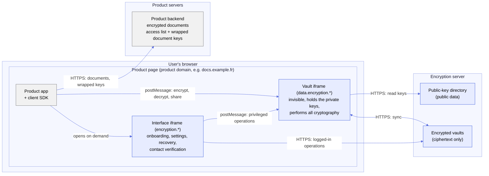
```mermaid
%%{init: {'theme':'base','themeVariables':{'lineColor':'#5b6ee0','edgeLabelBackground':'#ffffff','clusterBkg':'#f5f7ff','clusterBorder':'#9aa7e8','titleColor':'#1a1a2e'},'themeCSS':'.edgeLabel p{background-color:#ffffff;color:#444;font-style:italic;border:1px solid #b5b5b5;padding:2px 8px;border-radius:10px;margin:0;} .edgeLabel .labelBkg{background:transparent;}'}}%%
flowchart LR
  subgraph BROWSER["User's browser"]
    subgraph PAGE["Product page (product domain, e.g. docs.example.fr)"]
      PF["Product app<br/>+ client SDK"]
      VI["Vault iframe (data.encryption.*)<br/>invisible, holds the private keys,<br/>performs all cryptography"]
      UI["Interface iframe (encryption.*)<br/>onboarding, settings, recovery,<br/>contact verification"]
    end
  end
  subgraph PSRV["Product servers"]
    PB["Product backend<br/>encrypted documents<br/>access list + wrapped document keys"]
  end
  subgraph ESRV["Encryption server"]
    REG["Public-key directory<br/>(public data)"]
    EV["Encrypted vaults<br/>(ciphertext only)"]
  end
  PF -->|"postMessage: encrypt, decrypt, share"| VI
  PF -->|"opens on demand"| UI
  UI -->|"postMessage: privileged operations"| VI
  PF -->|"HTTPS: documents, wrapped keys"| PB
  VI -->|"HTTPS: read keys"| REG
  VI <-->|"HTTPS: sync"| EV
  UI -->|"HTTPS: logged-in operations"| EV
  classDef enc fill:#e7ecff,stroke:#3b5bdb,color:#000;
  classDef prod fill:#f1f1f1,stroke:#777,color:#000;
  class VI,UI,REG,EV enc;
  class PF,PB prod;
```

The two iframes are drawn inside the product page because that is where they **run**: in the user's browser, embedded by the product. They belong to the encryption service because their code is **served from its domains**, so the browser's same-origin policy separates them from the product: the product's scripts cannot read the vault's memory or storage, and can only exchange messages with it. That is what lets private keys sit inside a page the product controls without the product being able to read them. Products load a small client SDK (`client.js`) from the vault domain, which creates and talks to both iframes.

| Data                                                                                 | Stored where                                                         | Confidential?                     |
| ------------------------------------------------------------------------------------ | -------------------------------------------------------------------- | --------------------------------- |
| Public-key directory (encryption + identity public keys, binding signature, version) | Encryption server, **public**                                        | No, integrity only                |
| Encrypted vault (key pairs + TOFU registry)                                          | Encryption server, **one ciphertext per item**                       | Yes, server cannot read it        |
| Encrypted documents + access list with wrapped document keys                         | Product backend                                                      | Documents and keys are ciphertext |
| Unlocked vault state                                                                 | Vault iframe, **in memory** while the page is open                   | n/a                               |
| Cached vault root key                                                                | Vault iframe, **IndexedDB**, wrapped by a non-extractable device key | Yes                               |

The encryption server is a **blind store**: it reads routing metadata (which user, which item, how recent) but never any content. This is the same posture as Bitwarden's server, plus one addition: what it stores is **signed**, so integrity does not depend on trusting it ([Section 6.3](#s6-3)).

**"Vault" means two things in this document.** The **vault iframe** is the code above, running on each device, with its local storage. The **(synchronized) vault** is the per-user encrypted container kept on the server, which the vault iframes download and update. Neither is an off-the-shelf product: both are this service's own code, built on libsodium and the browser's IndexedDB and WebCrypto. The design of the synchronized vault borrows from password managers ([Section 10](#s10)).

**Perimeter.** This document covers the code of this repository: the vault iframe, the interface iframe, the client SDK products load, and the encryption server with its database schema. Everything else is environment, relied on as stated in [1.3](#s1-3) and [1.4](#s1-4): the browser and operating system, the OIDC identity provider, the products (their frontends, backends and access control), PostgreSQL, the mail server, and the hosting of the deployment.

**Roles.**

- **User**: activates encryption, holds their keys, shares documents, verifies contacts, manages their devices and recovery.
- **Contact**: another user someone shares with; their trust status is recorded per user ([5.4](#s5-4)).
- **Grantor and trusted contact**: a user who designates someone to help recover their vault, and that person ([Section 9](#s9)).
- **Operator**: runs a deployment (configuration, database, backups, mail). The operator can read and change everything the server stores, deny service, or relink a login to an account ([Appendix A](#appendix-a)); the design is built so that this still gives no access to keys or content. There is no administrator role inside the service itself: no user can act on another user's keys.

<a id="s2-1"></a>

### 2.1 How users are authenticated

- **Login** uses the deployment's OIDC identity provider, the same one the products use. The interface iframe runs the standard authorization-code flow and keeps the tokens in its own `sessionStorage`; the server verifies each token's signature against the provider's published keys. Logging in identifies the user; it never unlocks anything.
- **Requests to the encryption server** are authenticated differently depending on what the device holds ([Section 6.4](#s6-4) has the full list):

  | The device...                              | The request is authenticated by                                                                                                     | Used for                                                                                              |
  | ------------------------------------------ | ----------------------------------------------------------------------------------------------------------------------------------- | ----------------------------------------------------------------------------------------------------- |
  | holds the vault (normal use)               | a per-request signature by the **identity key**, which only an open vault can produce, plus the OIDC token for sensitive operations | sync, changing the phrase, approving a device, designating or calling on a trusted contact            |
  | holds nothing, and the user has the phrase | the OIDC token plus a signature by the **auth key**, derived from the recovery phrase, over a fresh server nonce                    | releasing the vault to that device (cold unlock, reactivation), and nothing else                      |
  | holds nothing, and the user has no phrase  | the OIDC token alone                                                                                                                | only actions that can deny but never disclose: disabling encryption, refusing a recovery, and similar |

- **Between users**, each person's identity is the fingerprint of their identity key, which two people compare out-of-band (QR code or 40 digits read aloud) to rule out a substituted key ([Section 5.4](#s5-4)).
- **Product backends** keep authenticating their users as they already do.

<a id="s2-2"></a>

### 2.2 Who may decrypt a document

**The product decides; the encryption layer enforces.** Access is granted and reviewed in the product's usual sharing interface, and the product's access list remains the authority. The encryption layer adds a cryptographic condition on top: a user can decrypt only if the product lets them download the document **and** a copy of its key was wrapped for them.

- **Granting.** When a user shares, the product asks their vault to wrap the document key for the chosen people. Before wrapping, the vault checks each recipient's directory record (binding signature) and its own trust decision about them, and refuses a recipient whose key changed or whom the user refused ([Section 5.4](#s5-4)). The product stores the wrapped keys on its access rows.
- **Reading.** The product returns a wrapped key only to the user it belongs to, and only that user's private key can unwrap it.
- **Neither server can add a reader.** Wrapping needs the document key in clear, which exists only inside the vault of someone who already has access. A product backend can grant access in its database, but the new member gets nothing they can decrypt; the encryption server holds no document keys at all.
- **Revoking.** Removing someone from the product's access list removes their wrapped key and their ability to download the document. It cannot make them forget a key or content they already obtained. To protect what is written afterwards, a product can re-encrypt the document under a new key (`encrypt-without-key`) and re-share it to the remaining members; whether it does so on every removal is the product's decision.

<a id="s2-3"></a>

### 2.3 Internal user id: identity outlives the OIDC provider

Products and the login flow speak the OIDC `sub`. That value is not stable over the life of a deployment since an organization can replace its identity provider, and the new provider mints new subs for the same humans. Meanwhile this service embeds a user identifier in places no data migration can ever rewrite: inside Ed25519-signed payloads (key binding, identity continuity, request proofs), inside sealed `tofu:<userId>` vault items pinned by the signed manifest, and as cache keys on every enrolled device.

The canonical identifier is therefore a service-minted, immutable UUID (`users.id`), created at first contact and used everywhere past the auth boundary: signatures, TOFU registry, foreign keys, caches, the directory. OIDC credentials map to it through the `oidc_accounts` table, one row per unique `(issuer, sub)` pair. A provider migration becomes a plain data operation on that mapping table (a new row pointing at the same user, attached automatically by the verified-email fallback or manually by the operator) while every signature and sealed item stays valid. Directory resolution of a sub is scoped to the currently configured issuer, always: matching retired-issuer rows would be fail-open (on a cross-issuer sub collision the directory could return another human's public key, the one wrong answer a key directory must never give), so after a cutover a not-yet-relinked user simply shows as having no keys until their first post-cutover login. Retired rows are still never deleted; they remain as an audit trail and as raw material for operator merge tooling, and `disabledAt` blocks authentication with a retired provider.

Products never see internal ids. The SDK speaks subs end to end, and the vault translates at its boundary: the directory accepts `subs=` lookups, while the TOFU registry and all persistence key on the internal id. The principle: **subs exist only at the two authentication boundaries** (JWT verification on the server, `setAuthContext` in the SDK); everything past those points speaks internal ids.

| Layer                                                              | Identifier           | Notes                                                                                   |
| ------------------------------------------------------------------ | -------------------- | --------------------------------------------------------------------------------------- |
| Signed payloads (binding, continuity, request proof)               | internal id          | the whole point: signatures survive provider changes                                    |
| All DB `user_id` columns                                           | internal id (FK)     | referential integrity for free                                                          |
| Sealed vault items (`tofu:<id>`), trust map keys                   | internal id          | trust decisions survive provider changes                                                |
| IndexedDB vault-cache row key, Web Locks names                     | internal id          | plus a small local sub-to-id alias store                                                |
| Directory records returned to clients                              | internal id          | responses echo the queried sub for correlation                                          |
| JWT `sub`                                                          | resolved at boundary | `(iss, sub)` looked up in `oidc_accounts`; request proofs sign the internal id directly |
| SDK own-user init (`setAuthContext`)                               | sub                  | resolved once via the fallback chain below                                              |
| SDK product-facing operations (recipients, fingerprints, profiles) | sub                  | the ONLY id products ever handle; the vault translates at its boundary                  |

**How the vault resolves the caller's own sub**: in-memory map, then the IndexedDB alias store (written alongside the vault cache, so a cached vault always resolves offline), then an unauthenticated registry lookup by sub. The interface uses the same chain through a privileged `resolve-user` operation, so an onboarded user's settings page works even with an expired OIDC session; only a never-onboarded user falls back to the authenticated `GET /api/me` (which mints the user row), after which the interface declares the id in its postMessage envelope and the vault, which adopts a declared internal id from privileged interface-origin callers only, persists the sub-to-id alias for the next visit. Recipient subs are resolved through the same batched directory fetch the operation already makes for keys and trust, so translation adds no round-trip. The alias store is metadata, never a trust input: a wrong alias can only cause a cache miss or a failed sync, never a wrong trust or decryption outcome (trust reads the sealed TOFU registry, and every server call is independently authenticated).

---

<a id="s3"></a>

## 3. Threat model

The assets and attackers are summarized in [1.2](#s1-2). The server is assumed **honest-but-curious and potentially compromised** for availability and delivery ordering; confidentiality and integrity must not depend on trusting it.

The table below is a **summary**: one line per threat, one line per defense. The rows carrying a section reference are the ones most easily misread as "gaps", so each is worked through in full underneath, in the same order.

| Threat                                                                                                               | Defense                                                                                                                                                                                                                                                                                                                                                                                                                                                                                                                                                                                                                                     | Detail                       |
| -------------------------------------------------------------------------------------------------------------------- | ------------------------------------------------------------------------------------------------------------------------------------------------------------------------------------------------------------------------------------------------------------------------------------------------------------------------------------------------------------------------------------------------------------------------------------------------------------------------------------------------------------------------------------------------------------------------------------------------------------------------------------------- | ---------------------------- |
| **Stolen OIDC token** downloads the vault                                                                            | The items are under a random VRK, so they are inert without it. The one passphrase-brute-forceable artifact, the `wrappedVRK`, is released only after a proof-of-passphrase, so a bare token cannot even retrieve it.                                                                                                                                                                                                                                                                                                                                                                                                                       |                              |
| **Server / database leak**, offline brute force                                                                      | The high-entropy recovery phrase is never held by the server (nor the KEK or VRK), so there is nothing to grind.                                                                                                                                                                                                                                                                                                                                                                                                                                                                                                                            |                              |
| **Server tampering** (splice, reorder, backdate, rollback)                                                           | The signed manifest, verified against a locally-trusted identity and the public registry with a monotonic revision, detects it. Integrity does not rely on the server.                                                                                                                                                                                                                                                                                                                                                                                                                                                                      |                              |
| **Server substitutes a user's identity** (fake vault to a newly enrolled device, attacker keys returned for a share) | A provisioned device fails closed ([7.7](#s7-7)), and contacts detect a substituted registry out-of-band (TOFU registry, [5.4](#s5-4)). A substituted share becomes a denial of service against the recipient rather than a read for the attacker, because retrieval is gated by the product's own access model.                                                                                                                                                                                                                                                                                                                            | [§3.1](#s3-1)                |
| **Server returns the wrong internal user id** (the TOFU registry is keyed on a server-minted identifier)             | Barely changes confidentiality: the identifier that keys trust does not decide who the product releases ciphertext to. The internal id is a migration-stability and blast-radius choice, not a confidentiality upgrade over using the sub.                                                                                                                                                                                                                                                                                                                                                                                                  | [§3.2](#s3-2)                |
| **Hostile `oidc_accounts` edit or email-fallback mislink** (attacker's login mapped to a victim's account)           | Trust-critical for authentication, not for E2EE: no VRK, recovery phrase, or identity secret travels with a mislinked login, the vault stays ciphertext behind the proof-of-passphrase, and any identity the attacker registers shows to every contact as a fingerprint change. Damage profile is a visible identity reset, never silent decryption. Linking needs operator intent or the flagged verified-email fallback (exactly one match, one-year dormancy guard).                                                                                                                                                                     |                              |
| **Local: someone uses an unlocked session**                                                                          | Out of scope, as for every vault product: the session is the user's (assumption, [1.4](#s1-4)).                                                                                                                                                                                                                                                                                                                                                                                                                                                                                                                                             |                              |
| **Local: copy of a switched-off or locked device's disk**                                                            | A copy of the vault's IndexedDB alone is inert: the cached VRK is wrapped by a device key whose bytes cannot be read out. A copy of the **whole browser profile** from an unencrypted disk opens the vault, since the browser stores that key in the profile: disk encryption is an assumption ([1.4](#s1-4)). A de-enroll after inactivity is planned ([6.2](#s6-2)).                                                                                                                                                                                                                                                                      |                              |
| **Server or database restored to an older, validly signed state** (replay rather than forgery)                       | Partly covered. Vault: each device refuses a revision older than the last one it saw ([6.3](#s6-3)), but a brand-new device has no such anchor. Directory: an older identity made active again shows as a fingerprint change to contacts who recorded the newer one, not to contacts who only ever knew the older one. Emergency escrow restored after deletion: its signature is still valid, so the contact could request recovery again, but the wait period and the grantor's notifications still apply. A recovery phrase changed after a leak does not protect against someone who also holds a database copy from before the change. | [§6.3](#s6-3), [§9.3](#s9-3) |
| **Wrong document key / poisoned share**                                                                              | Sharing verifies the recipient's binding signature and the user's trust decision about that identity before wrapping: a changed or refused identity blocks the share ([5.2](#s5-2), [5.4](#s5-4)).                                                                                                                                                                                                                                                                                                                                                                                                                                          |                              |
| **Compromised product swaps recipients** (its share UI displays "Bob <bob@…>" but hands the SDK a different user)    | ACCEPTED residual risk, deliberately not defended: the product already sits inside the plaintext boundary, so lying about recipients adds nothing beyond what the compromise already yields. Still enforced: wrapping is limited to registered directory identities, trust marking is interface-only, and fingerprints are rendered by the interface from vault data.                                                                                                                                                                                                                                                                       | [§3.3](#s3-3)                |
| **Compromised _product_ frontend** (XSS / poisoned dependency in Docs, Drive, …)                                     | The high-water mark of content exposure: it reads what its user decrypts and can enumerate the whole corpus, dormant files included. Iframe isolation still denies it the vault's private keys, trust marking, and raw-key injection. Not defendable by crypto; mitigated operationally (per-product hardening, CSP, dependency pinning).                                                                                                                                                                                                                                                                                                   | [§3.3](#s3-3)                |
| **Compromised vault** (malicious code inside the vault iframe, via a serving-chain or SRI-valid supply-chain breach) | The irreducible trust root, defended in two layers: bundle integrity (isolated origin, build-time SRI, Service Worker pinning) and a `default-src 'none'; connect-src 'self'` CSP that leaves a hash-valid bundle no exfiltration channel on an honest server. Getting data out needs a further serving-chain or backend compromise, and even then stays bounded to in-flight ciphertext plus the keys.                                                                                                                                                                                                                                     | [§3.4](#s3-4)                |
| **Malicious or compromised trusted contact** requests recovery covertly                                              | The waiting period plus escalating out-of-band email notifications: the grantor can refuse from any logged-in session, vault or no vault. Residual risk: a grantor unreachable for the whole wait, bounded by their own choice of wait time and of contact (the feature's premise is a person the user trusts more than they fear losing their data).                                                                                                                                                                                                                                                                                       | [§9.2](#s9-2)                |
| **Trusted contact alone, even holding a revealed emergency phrase**                                                  | Reads nothing: the server serves vault ciphertext only to the grantor's own authenticated OIDC session, and documents live in product backends behind the grantor's OIDC and the products' sharing tables. Recovery discloses a credential, never content.                                                                                                                                                                                                                                                                                                                                                                                  | [§9.1](#s9-1)                |
| **Stolen GRANTOR OIDC session** acts on emergency access                                                             | Can reject, revoke, or start over: all denial, never disclosure. Nothing JWT-reachable can shorten the wait (no early-approve endpoint exists), and a vault reset does not erase escrows. It still cannot read the vault: login does not unlock.                                                                                                                                                                                                                                                                                                                                                                                            | [§9.2](#s9-2), [§9.6](#s9-6) |
| **Stolen CONTACT OIDC session** starts or exercises a recovery                                                       | Cannot even initiate: `initiate` and `recover` require the per-request identity signature ([§6.4](#s6-4)), produced only by the contact's open vault. With the contact's vault also compromised, the attacker IS the contact for practical purposes, and the grantor-side wait plus notifications still apply.                                                                                                                                                                                                                                                                                                                              | [§9.7](#s9-7)                |
| **Server releases the capsule or emergency credential early / colludes with the contact**                            | Not cryptographically prevented, exactly as in Bitwarden: the wait period is server policy, enforced twice (hourly job and lazy arithmetic). Stated honestly: once a contact is designated, confidentiality against contact-plus-server collusion is gone by design. The server alone still reads nothing, and a non-colluding contact gains nothing early.                                                                                                                                                                                                                                                                                 | [§9.3](#s9-3)                |
| **Server substitutes the contact's public key at designation time**                                                  | Defeated: designation requires the contact's identity fingerprint to be `trusted` (verified out-of-band) in the grantor's TOFU registry, and the wrap targets the binding-verified key of that pinned identity. The equivalent Bitwarden dialog is skippable; ours is not.                                                                                                                                                                                                                                                                                                                                                                  | [§9.1](#s9-1)                |
| **Server fabricates or alters escrow rows** (fake contact, shortened wait)                                           | The escrow binding signature (grantor identity key) covers the contact, the wait time, the credential's auth-verifier hash and the capsule hash; the grantor's devices audit the list and fail loudly ([§7.7](#s7-7) posture), and the server re-verifies it at write. Hiding rows or refusing release remains an availability attack, never a confidentiality one.                                                                                                                                                                                                                                                                         | [§9.1](#s9-1)                |
| **Contact served a forged escrow record at reveal time**                                                             | The binding signature is verified against the grantor identity **pinned in the contact's own TOFU registry** at verification time, fail-closed.                                                                                                                                                                                                                                                                                                                                                                                                                                                                                             | [§9.5](#s9-5)                |
| **Contact retains the phrase after handover**                                                                        | Burned by construction: the first emergency unlock forces a phrase change whose commit atomically deletes the used credential and re-arms a fresh one (the server rejects the write without the burn). Until then the phrase is a credential the grantor knowingly shares for the handover, and it still reads nothing without the grantor's OIDC session.                                                                                                                                                                                                                                                                                  | [§9.5](#s9-5)                |

<a id="s3-1"></a>

### 3.1 A compromised encryption server cannot decrypt, because retrieval is gated by the product, not by us

The encryption server is a blind store: ciphertext, the registry, and routing metadata, never plaintext and never the products' access-control lists. The load-bearing fact is where the per-recipient wrapped keys live: **in the product's own access model, not on the encryption server.** Docs stores them on its `DocumentAccess` rows, keyed by Docs' _local user id_ (not the sub, and not our internal id); the sub is merely the transport identifier the product passes to the SDK, and the vault never holds another recipient's wrapped key. Retrieval is therefore gated by the product's own ACL for its own user, a gate the encryption server has no influence over.

Trace a full server-substitution attack against a share of document `D` whose intended recipient is Bob. The server can lie in either of two ways, and both collapse to the same outcome:

- **(a) right id, wrong key**: it returns Bob's real internal id but the attacker's keys `K-evil`.
- **(b) wrong id, wrong key**: it returns a fresh internal id _and_ `K-evil`.

In both, the vault wraps `D`'s symmetric key for `K-evil`, and the **product** stores that blob on Bob's `DocumentAccess` row (the product chose recipient = Bob; what the encryption service used internally never reached it). Now:

1. **Bob** fetches his row and tries to unwrap with his real key `K-bob`: it **fails**, the blob was wrapped for `K-evil`. Bob loses access.
2. **The attacker** holds `K-evil`'s private key and _could_ decrypt the blob, but cannot **retrieve** it: the product releases Bob's row only to Bob's authenticated session.

So a server acting **alone** turns a substituted share into a **denial of service against Bob, not a read for the attacker**. Delivering the blob to the attacker on top of this requires product-side power (authenticating as Bob, or a product/ACL/DB compromise), at which point we are back in [3.3](#s3-3). The encryption identity and the product's ACL are two independent gates; the server controls only one, which is why the "server substitutes an identity" row is bounded.

<a id="s3-2"></a>

### 3.2 Keying trust on the internal id instead of the sub barely changes this

Two consequences follow from [3.1](#s3-1).

First, a natural worry: now that the TOFU registry and the directory key on a server-minted internal id, a lying server can return the _wrong_ internal id and we "trust the wrong person". True, but it barely changes the confidentiality outcome, for the same reason: whichever identifier keys the TOFU registry, the wrapped key still lands on the product's `DocumentAccess` row for the recipient the product _intended_, and retrieval stays gated there. The identifier used to key the TOFU registry does not decide who the product releases ciphertext to. A substituted share is still a DoS, not a leak. (This is also why recording the sub on trust entries to catch a "known sub, different internal id" swap turns out to add little: it would upgrade a silent DoS into a _detected_ DoS, useful as a signal, but it protects no confidentiality the product ACL was not already protecting. Reasonable to skip unless a product ships a sharing model that does _not_ gate retrieval by the intended recipient, e.g. share-by-link, in which case the wrap-time gate becomes load-bearing again.)

Second, the internal id itself is not exotic: it is exactly the **indirection every product already performs**. Docs maps an OIDC sub to its own local `User` id; Drive to its own; we map it to `users.id`. Each service anchors its data on an identifier it fully owns and converts the sub at its boundary. Ours would be redundant if a single stable identifier existed across the whole suite, but none does, precisely because OIDC subs can change under a provider migration ([Section 2.3](#s2-3)). The internal id is our stable anchor, playing the same role the product's local user id plays for the product, no more mysterious than that.

So the honest summary: the internal id is not a confidentiality upgrade over using the sub directly (the product ACL carries confidentiality either way). It is a **migration-stability** decision (a stable anchor where the sub cannot be one) and a **blast-radius-placement** one: some component must map a login to a keypair, and the encryption server is the only candidate holding neither plaintext nor an ACL, so anchoring identity there keeps its blast radius bounded by the product's independent gate. The one party you must never make the identity authority is the one holding the plaintext, and no design here does.

<a id="s3-3"></a>

### 3.3 A compromised product is out of scope, by construction

The product (Docs, Drive, Meet) hands the cleartext to the SDK at encrypt time and can call `decrypt-with-key` for anything its current user is allowed to read. A malicious or XSS-injected product frontend therefore already reads the plaintext directly and can stream every opened document to an invisible endpoint. No cryptographic measure helps, because the application _is_ the plaintext boundary. This is the universal E2EE property (a backdoored Signal client reads your messages too), not a weakness specific to this design.

This is also **the most damaging** frontend compromise, worse than a compromised vault frontend ([3.4](#s3-4)), for a reason worth stating: the product can **enumerate**. It sees the user's whole document list and can walk it, decrypting files that have not been opened in months, with their titles and context. A vault compromise only sees ciphertext that someone actively pipes through it. So "product frontend compromised" is the high-water mark of content exposure.

The classic escalation, "the product auto-adds an attacker-controlled recipient to every share so access _persists_ after the compromise is cleaned up", is real but strictly _marginal_: it buys persistence and offline reach, never the initial read, which the product already had. The same reasoning covers the **recipient swap**: a product whose share UI displays "Bob" while handing the SDK a different user is lying about a decision it could already subvert, and its own ACL grant follows the same swapped selection, so the JWT layer is not an independent check here. If that residual is ever judged unacceptable, the lever is to have the **interface** render the recipient confirmation from registry-stored emails (`users.email`, captured from verified IdP claims at login) rather than from product-supplied labels.

What the iframe isolation _does_ buy, and it is not nothing, is that a compromised product frontend cannot read the vault's **private keys** (different origin, unreachable), cannot **mark trust** (accept/refuse are interface-origin-only), and cannot **inject raw keys** (it passes ids; the vault only ever wraps for registered directory identities). So a product-frontend compromise is downgraded from "total key compromise" (the CryptPad/Bitwarden model, where the served app _is_ the vault) to "can exfiltrate what its own user can decrypt, plus add persistence". That downgrade is the point of putting the crypto in an unspoofable iframe.

<a id="s3-4"></a>

### 3.4 The vault frontend is the trusted computing base

Everything above assumes the vault's own served code is honest. That code is the **trusted computing base**: the one component that must be correct for every other guarantee in this document to hold. The vault iframe holds the private keys and performs every decryption, so if an attacker runs code of their choosing inside it, the scheme is over, exactly as a backdoored Bitwarden client is over. This is not defended by cryptography; it is defended in two layers, and the distinction between them matters because it decides how much a given compromise can actually do.

**Layer 1, getting malicious code to run at all.** The vault ships from its own isolated origin, every script tag carries a build-time SRI hash, and the Service Worker pins the served bundle. Two attack routes have to be told apart:

- **Serving-chain compromise** (the attacker controls what the server returns): they can rewrite the HTML, its SRI hashes, _and_ the response headers together. This is full control, including Layer 2 below, and is the true "game over". The bar is high (compromise the encryption service's build/serving chain, not one product's frontend).
- **SRI-valid supply-chain compromise** (a poisoned dependency baked into the bundle at build time): the malicious code hash-matches, so it runs, but the HTML and the **HTTP-header-delivered CSP are untouched**, served by an honest server. Layer 2 then still applies to it.

SRI hashes are computed by the same build and served by the same server as the bundle, so they do not help against a serving-chain compromise: whoever serves a modified bundle serves matching hashes. Closing that gap needs a check outside the production server: hashes published through an independent channel (the repository's releases, a transparency log as in [Appendix D](#appendix-d)) and builds reproducible from the source, so that anyone can compare what is served with what was published. The container image already carries build provenance and an SBOM; nothing yet lets a browser or a user check the served bundle independently.

**Layer 2, stopping code that _is_ running from phoning home.** The vault's production CSP is `default-src 'none'; script-src 'self' 'wasm-unsafe-eval'; connect-src 'self'; base-uri 'none'; form-action 'none'; frame-ancestors <allowed products> <interface>; require-trusted-types-for 'script'; trusted-types vault-service-worker` (plus the reporting directives). Libsodium is compiled to WebAssembly and its asm.js backup module does not rescue a CSP refusal, so without `wasm-unsafe-eval` the vault performs no cryptography at all. That token is not a hole in this layer: WebAssembly carries no ambient authority (no DOM, no network, no syscalls, every effect travelling through imports the calling JavaScript supplies at instantiation), and whoever can reach `WebAssembly.instantiate()` is already executing JavaScript on this origin, so they already hold a superset of anything the module could be handed. What it relaxes is code _provenance_, not capability, and even that is bounded here: libsodium ships no standalone `.wasm` file, its bytes are embedded in the bundle that already carries an SRI hash. `'unsafe-eval'` would have been different in kind, making any attacker-controlled string that reaches `eval` or `new Function` executable. So malicious-but-hash-valid code can decrypt in memory but has **no exfiltration channel to an attacker's own origin**: `connect-src 'self'` blocks `fetch`/XHR/WebSocket to any external host, and `default-src 'none'` blocks the image-beacon and form-post tricks. There are therefore only two ways such code can get data out, and both require a compromise _beyond_ the hash-valid bundle:

- **Loosen the CSP** to permit an external attacker origin. The CSP is an HTTP response header, so this is a serving-chain compromise (the attacker controls what the server returns), not a supply-chain one.
- **Use a same-origin sink.** `connect-src 'self'` still permits requests to the vault's _own_ origin, i.e. the encryption API. So a dedicated attacker-controlled endpoint on that API (or an existing one abused to persist and later reveal the posted bytes) is an exfil sink that needs no CSP change, but it is a **backend** compromise, again beyond the bundle.

So the honest statement is: a hash-valid bundle swap on top of an **honest server (intact CSP header _and_ no cooperating API sink)** has no way to exfiltrate. Impact appears only once the attacker also controls the CSP or an API endpoint. And even then, two things bound and one thing widens the damage:

- **Scope is in-flight only.** The vault sees only ciphertext actively piped through it during the compromise; it cannot enumerate the user's other or dormant documents (no list, no titles), which remains a product-compromise-only capability ([3.3](#s3-3)). What it _can_ additionally steal is the **private keys**, which lets the attacker decrypt, later and offline, any ciphertext they can separately obtain, still never the immediate corpus.
- **Navigation** is a lesser residual: code could encode data into a URL and navigate the hidden iframe to an attacker host. The neighbouring tricks are already closed: both iframes are embedded with `sandbox="allow-scripts allow-same-origin"` (the minimum the vault needs for IndexedDB and WASM crypto), so no `allow-popups` means `window.open` beaconing fails and no `allow-top-navigation` means it cannot drag the product page away. But **no sandbox token stops a frame from navigating itself**, and CSP has no lever either: the directive designed for it (`navigate-to`) was dropped from the spec and is unsupported by browsers. Containment is therefore Layer 1 plus detection: the exfil is noisy (the parent observes the iframe leaving its origin, breaking the postMessage channel).
- **Crypto sabotage widens it, with no exfil at all.** The deadlier path needs no channel: compromised vault code can weaken randomness or silently add an attacker key as an extra recipient on every wrap, so ciphertext leaks through the **untrusted server/product** it was meant to be protected from. CSP cannot stop this, the tainted output leaves through a legitimate channel. This is why Layer 1 (bundle integrity: SRI + Service Worker pinning) is the load-bearing defense, not Layer 2.

One calibration worth keeping in mind:

- A vault-frontend compromise is, per [3.3](#s3-3), **less** exposing of _content_ than a product-frontend compromise: bounded to in-flight ciphertext, never the enumerable corpus. What it threatens instead is the **keys** and the **integrity of future ciphertext**, which is why its integrity gets the strongest served-code protections in the system.
- The interface frontend (onboarding, settings, verify modal) carries a smaller share of that trust: it drives privileged operations but never holds the long-term keys in a form it can exfiltrate silently, and its sensitive actions require a human present. It is protected by the same SRI/CSP posture, but with a deliberately **wider sandbox** than the vault (`allow-forms allow-downloads allow-popups allow-modals`, needed by the recovery-kit download and the pairing dialogs). So the popup/navigation channels closed above for the vault stay open on the interface host, which is one more reason to keep the long-term secrets on the vault side of the boundary.

---

<a id="s4"></a>

## 4. Keys

This section is the single reference for keys: a map of how they relate ([4.1](#s4-1)), an inventory ([4.2](#s4-2)), and the exact derivations ([4.3](#s4-3)). The flow diagrams elsewhere name keys and actions only and point back here for the formulas.

<a id="s4-1"></a>

### 4.1 Key map

An arrow reads "protects": the source key derives, wraps (encrypts a key), encrypts (content) or signs its target. Colours show where each key lives.

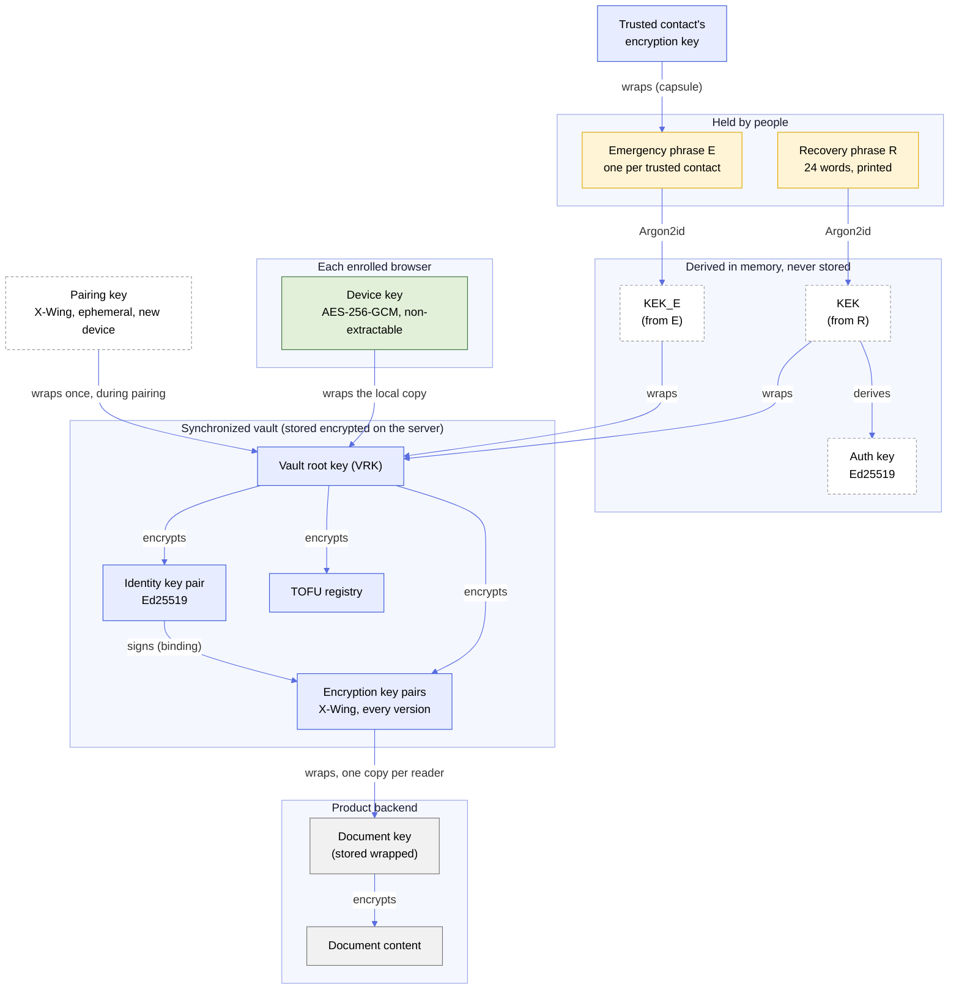
```mermaid
%%{init: {'theme':'base','themeVariables':{'lineColor':'#5b6ee0','edgeLabelBackground':'#ffffff','clusterBkg':'#f5f7ff','clusterBorder':'#9aa7e8','titleColor':'#1a1a2e'},'themeCSS':'.edgeLabel p{background-color:#ffffff;color:#444;font-style:italic;border:1px solid #b5b5b5;padding:2px 8px;border-radius:10px;margin:0;} .edgeLabel .labelBkg{background:transparent;}'}}%%
flowchart TB
  subgraph HELD["Held by people"]
    R["Recovery phrase R<br/>24 words, printed"]
    E["Emergency phrase E<br/>one per trusted contact"]
  end
  subgraph MEM["Derived in memory, never stored"]
    KEK["KEK<br/>(from R)"]
    KEKE["KEK_E<br/>(from E)"]
    AUTH["Auth key<br/>Ed25519"]
  end
  subgraph DEV["Each enrolled browser"]
    DK["Device key<br/>AES-256-GCM, non-extractable"]
  end
  subgraph VAULT["Synchronized vault (stored encrypted on the server)"]
    VRK["Vault root key (VRK)"]
    ID["Identity key pair<br/>Ed25519"]
    ENC["Encryption key pairs<br/>X-Wing, every version"]
    TR["TOFU registry"]
  end
  subgraph PROD["Product backend"]
    DEK["Document key<br/>(stored wrapped)"]
    DOC["Document content"]
  end
  EPH["Pairing key<br/>X-Wing, ephemeral, new device"]
  CENC["Trusted contact's<br/>encryption key"]
  R -->|"Argon2id"| KEK
  E -->|"Argon2id"| KEKE
  KEK -->|"derives"| AUTH
  KEK -->|"wraps"| VRK
  KEKE -->|"wraps"| VRK
  DK -->|"wraps the local copy"| VRK
  VRK -->|"encrypts"| ID
  VRK -->|"encrypts"| ENC
  VRK -->|"encrypts"| TR
  ENC -->|"wraps, one copy per reader"| DEK
  DEK -->|"encrypts"| DOC
  ID -->|"signs (binding)"| ENC
  EPH -->|"wraps once, during pairing"| VRK
  CENC -->|"wraps (capsule)"| E
  classDef held fill:#fff4d6,stroke:#e0a800,color:#000;
  classDef mem fill:#ffffff,stroke:#999,stroke-dasharray:4 3,color:#000;
  classDef dev fill:#e2f0d9,stroke:#3c763d,color:#000;
  classDef vault fill:#e7ecff,stroke:#3b5bdb,color:#000;
  classDef prod fill:#f1f1f1,stroke:#777,color:#000;
  class R,E held;
  class KEK,KEKE,AUTH,EPH mem;
  class DK dev;
  class VRK,ID,ENC,TR,CENC vault;
  class DEK,DOC prod;
```

Besides the binding shown above, the identity key signs the vault manifest ([6.3](#s6-3)), every per-request proof ([6.4](#s6-4)), the auth key's public half ([4.3](#s4-3)), and the emergency escrows ([9.1](#s9-1)). The pairing key also carries the identity secret key along with the VRK ([7.5](#s7-5)).

<a id="s4-2"></a>

### 4.2 Key inventory

Every key, password and secret of the service. "libsodium RNG" is libsodium's `randombytes`, which in the browser draws from `crypto.getRandomValues` (the browser's cryptographically secure generator, seeded by the operating system) and on the server from the operating system's generator.

| Key                          | Purpose                                                                                       | Algorithm                                                           | Size, entropy                          | Generated by                                 | Lifetime                                                                                                                                | Stored                                                                                                                                |
| ---------------------------- | --------------------------------------------------------------------------------------------- | ------------------------------------------------------------------- | -------------------------------------- | -------------------------------------------- | --------------------------------------------------------------------------------------------------------------------------------------- | ------------------------------------------------------------------------------------------------------------------------------------- |
| **Recovery phrase `R`**      | The user's only long-term secret: unlocks the vault on a device that holds nothing            | BIP-39 mnemonic of a random value                                   | 24 words, 256 bits of entropy          | libsodium RNG, in the vault iframe           | Until the user changes it ([7.6](#s7-6))                                                                                                | By the user only (printed or downloaded Recovery Kit). Never stored by the service, never shown again                                 |
| **KEK** (key-encryption key) | Wraps the VRK                                                                                 | Argon2id (3 passes, 64 MiB), parameters stored per credential       | 256 bits, as strong as `R`             | Derived from `R`                             | Only while unlocking or changing the phrase                                                                                             | Never stored                                                                                                                          |
| **Auth key pair**            | Proves knowledge of `R` before the server releases the wrapped VRK ([7.2](#s7-2))             | Ed25519, seed derived from the KEK                                  | 256-bit seed                           | Derived from the KEK                         | Same as `R`                                                                                                                             | Public half on the server (per credential), signed by the identity key; private half never stored                                     |
| **Vault root key (VRK)**     | Encrypts every vault item                                                                     | XSalsa20-Poly1305                                                   | 256 bits                               | libsodium RNG                                | Life of the vault                                                                                                                       | Server: wrapped by each credential's KEK. Each device: wrapped by its device key, in IndexedDB. In memory while the vault iframe runs |
| **Device key**               | Wraps the device's cached VRK at rest                                                         | AES-256-GCM, WebCrypto, non-extractable                             | 256 bits                               | WebCrypto `generateKey` (browser generator)  | Until the device leaves encryption or its site data is cleared (an expiry after inactivity is planned, [6.2](#s6-2))                    | IndexedDB of the vault origin, as a key handle whose raw bytes script cannot read                                                     |
| **Identity key pair**        | The user's identity: what contacts verify, and what signs bindings, manifests, request proofs | Ed25519                                                             | 256-bit secret, about 128-bit security | libsodium RNG                                | Long-lived; a new one only when the user starts over (migration to a new identity is supported by the core, not used yet, [5.4](#s5-4)) | Private: vault item (encrypted by the VRK). Public: directory                                                                         |
| **Encryption key pairs**     | Receive wrapped document keys                                                                 | X-Wing (X25519 + ML-KEM-768)                                        | Public 1,216 bytes, secret 2,464 bytes | libsodium RNG                                | Every version is kept for decryption (rotation is supported by the core, not used yet, [4.4](#s4-4))                                    | Private: vault items. Public: directory, with a binding signature by the identity key                                                 |
| **Document key (DEK)**       | Encrypts one document's content                                                               | XSalsa20-Poly1305, fresh 192-bit random nonce per encryption        | 256 bits                               | libsodium RNG                                | Life of the document, unless the product re-encrypts it ([2.2](#s2-2))                                                                  | Product backend, wrapped once per reader. In the vault's memory for the session (at most 50, least recently used dropped first)       |
| **Wrapping secret**          | Encrypts one wrapped copy of a key                                                            | Output of an X-Wing encapsulation, used as an XSalsa20-Poly1305 key | 256 bits                               | Fresh for each wrap                          | Single use                                                                                                                              | Never stored (only the KEM ciphertext is, next to the wrapped key)                                                                    |
| **Emergency phrase `E`**     | A dormant second way into the vault, escrowed for one trusted contact ([9.1](#s9-1))          | As `R`, with its own KEK, auth key and wrapped VRK                  | 24 words, 256 bits of entropy          | libsodium RNG, in the grantor's vault iframe | Until used (then replaced), refreshed or deleted ([9.5](#s9-5), [9.6](#s9-6))                                                           | Never in clear on the grantor's side. Server: its credential, and its entropy wrapped to the contact's encryption key (the capsule)   |
| **Pairing key pair**         | Receives the VRK and identity key when a new device is approved ([7.5](#s7-5))                | X-Wing                                                              | As above                               | libsodium RNG, on the new device             | One pairing, at most 10 minutes                                                                                                         | Private: new device's memory only. Public: server, until the request expires                                                          |

Secrets that are not keys:

| Secret                 | Purpose                                                        | Form and lifetime                                                                                                    | Stored                                                          |
| ---------------------- | -------------------------------------------------------------- | -------------------------------------------------------------------------------------------------------------------- | --------------------------------------------------------------- |
| OIDC tokens            | Log the user in to the encryption server                       | Issued by the deployment's identity provider, lifetimes set there                                                    | Interface iframe's `sessionStorage`                             |
| Per-request proof      | Authenticates a request by the identity key ([6.4](#s6-4))     | Signed token covering method, path and a SHA-256 of the body, valid at most 120 seconds                              | Not stored                                                      |
| Unlock challenge       | Fresh value the auth key signs ([7.2](#s7-2))                  | 32 random bytes from the server's generator, valid 120 seconds, consumed on success                                  | Server database until used or expired                           |
| Registration challenge | Proves possession of both private keys ([5.5](#s5-5))          | X-Wing encapsulation to the key being registered, valid 120 seconds; the server keeps only a MAC of the challenge id | Server database until used or expired                           |
| Fingerprints           | Compared between people to verify an identity or a pairing key | First 128 bits of SHA-256 of the public key, shown as 40 decimal digits                                              | Trust decisions keep the fingerprint inside the encrypted vault |

<a id="s4-3"></a>

### 4.3 Derivations

```
R                = BIP-39 mnemonic of 32 random bytes (24 words)     wordlist from the user's locale, stored as `lang`
salt             = BLAKE2b-128(userId)                               internal user id (2.3); not secret
KEK              = Argon2id(normalize(R), salt, ops = 3, mem = 64 MiB) → 32 bytes
authKey          = Ed25519 key pair from seed BLAKE2b-256(key = KEK, "vault-auth-v1")
authPubSig       = Ed25519_sign(identity, "vault-auth-binding-v1" ‖ authKey.public)
VRK              = 32 random bytes
wrappedVRK       = XSalsa20-Poly1305(VRK, key = KEK)
item ciphertext  = XSalsa20-Poly1305(item, key = VRK)                one per vault item, random nonce each
device cache     = AES-256-GCM(VRK, key = device key)

identity         = Ed25519 key pair (random)
encryption key   = X-Wing key pair (random), numbered by a per-user version
binding          = Ed25519_sign(identity, {version, createdAt, encryption public key, identity public key, userId})

DEK              = 32 random bytes
document         = XSalsa20-Poly1305(content, key = DEK)
wrap(K, pk)      = (ct, ss) = X-Wing_encapsulate(pk);  stored: ct ‖ XSalsa20-Poly1305(K, key = ss)

fingerprint(pk)  = first 128 bits of SHA-256(pk), as 40 decimal digits
pairing bundle   = wrap({VRK, identity secret key}, new device's pairing public key)

E                = same as R, independent; its KEK_E, auth key and wrapped VRK are derived exactly like R's
capsule          = wrap(entropy of E, contact's active encryption public key)
```

**Exact bytes of every signed message.** "Framed" below means each field is preceded by its length as a 16-bit little-endian integer (a longer field is refused); integers are little-endian.

| Message                               | Signed by              | Bytes                                                                                                                                                                                                                                                          |
| ------------------------------------- | ---------------------- | -------------------------------------------------------------------------------------------------------------------------------------------------------------------------------------------------------------------------------------------------------------- |
| Key binding ([5.5](#s5-5))            | Identity key           | framed `lasuite-encryption/key-registration/v1`, version (32-bit), createdAt in ms (64-bit), framed userId, framed encryption public key, framed identity public key                                                                                           |
| Identity continuity ([5.4](#s5-4))    | Previous identity key  | framed `lasuite-encryption/identity-continuity/v1`, framed userId, generation (32-bit), framed algorithm name, framed new identity public key                                                                                                                  |
| Emergency escrow ([9.1](#s9-1))       | Grantor's identity key | framed `lasuite-encryption/emergency-escrow/v1`, framed grantor id, framed contact id, framed contact identity public key, wait days (32-bit), creation time in ms (64-bit), framed SHA-256 of the credential's auth public key, framed SHA-256 of the capsule |
| Auth-key binding ([4.4](#s4-4))       | Identity key           | `vault-auth-binding-v1` and the auth public key, each preceded by its 32-bit length                                                                                                                                                                            |
| Registration challenge ([5.5](#s5-5)) | Identity key           | the text `lasuite-encryption/key-pop/v1:<challenge id>`                                                                                                                                                                                                        |
| Per-request proof ([6.4](#s6-4))      | Identity key           | compact JWS: `base64url(header).base64url(claims)`, header `{"alg":"EdDSA","typ":"vault-req+jws"}`                                                                                                                                                             |
| Vault manifest ([6.3](#s6-3))         | Identity key           | the text `v<schema>\|<revision>\|<identity generation>\|[<items>]`, each item as `"<id>":"<type>":"<content hash>":<revision date>` (strings JSON-escaped), sorted by id                                                                                       |
| Unlock challenge ([7.2](#s7-2))       | Auth key               | the text `vault-auth-challenge-v1:<userId>:` followed by the 32-byte server nonce                                                                                                                                                                              |

Every message signed by the identity key starts differently (a binary length, `lasuite-…`, `eyJ` for the JWS, `v` for the manifest), so a signature made for one purpose cannot be taken for another. The manifest is the only one without an explicit context label; adding one is planned with its next format version.

Why it is built this way:

- **Authentication and unlocking are separate jobs.** Bitwarden's master password does both, which forces it to be memorable, hence weak. Here **OIDC authenticates**, and the vault secret only _unlocks_. That frees it to be **machine-generated and high-entropy**, which is what defeats an offline attack on a stolen or leaked vault without needing 1Password's separate "Secret Key".
- **The recovery phrase is generated, never user-chosen.** There is no low-entropy fallback, so every user gets a vault that cannot be brute-forced.
- **Argon2id** (libsodium `crypto_pwhash`) is defence in depth: because `R` is high-entropy, the KDF is not the load-bearing barrier. It slows guessing and standardizes the derivation.
- **The salt is derived from the internal user id**, not the OIDC `sub`, which can change ([2.3](#s2-3)). A salt is not a secret: its jobs are per-user uniqueness and resistance to precomputation, both met. Only the client runs the KDF, so a server that tampered with a salt would only produce a wrong KEK and a failed, detectable unwrap, a denial of service and not a disclosure. (A random stored salt would be an equally valid alternative.)
- **The VRK indirection** (a random key wrapped by the KEK, like Bitwarden's user key) makes two operations cheap: changing the phrase re-wraps only the VRK, and enrolling a second device forwards the VRK.

<a id="s4-4"></a>

### 4.4 Rotation, and several ways into one vault

**What "rotation" means here.** A phrase change re-wraps the VRK only. An encryption-key rotation _appends_ a new key version and re-encrypts nothing (old versions are kept for decryption). **Status: supported by the core, not used yet.** The data model, the directory and the decrypt path (which selects the exact stored key version) handle several versions, so rotation can be added without migrating anything; no flow triggers it today. Ordinary use never re-encrypts the vault.

**One vault, several credentials (like LUKS keyslots).** The unlock material (the wrapped VRK, the auth public key with its identity signature, the Argon2 parameters, the wordlist `lang`) lives in its own `VaultCredential` table rather than on the vault itself: exactly one `primary` credential per vault (the owner's phrase), plus any number of `emergency` credentials, each owned by a trusted-contact relationship ([Section 9](#s9)) and each wrapping the SAME VRK under a different phrase. Emergency credentials are **dormant**: the unlock proof is never checked against them until that relationship's recovery is granted. `VaultKeyring` stays the vault container (identity, items, manifest, `disabledAt`); a credential is one way in.

<a id="s4-5"></a>

### 4.5 Comparison with ANSSI's cryptographic rules

Reference: ANSSI, _Règles et recommandations concernant le choix et le dimensionnement des mécanismes cryptographiques_ (ANSSI-PG-083, version 3.00, March 2026). The guide states rules and gives examples of conforming mechanisms. A mechanism missing from its examples is not non-conforming by definition, but its conformity has to be argued against the rules rather than cited.

| Mechanism                                  | Used for                                                           | Status in the guide                                                                                                                                                                                                                                             |
| ------------------------------------------ | ------------------------------------------------------------------ | --------------------------------------------------------------------------------------------------------------------------------------------------------------------------------------------------------------------------------------------------------------- |
| SHA-256                                    | Fingerprints, request body digests, escrow hashes                  | Listed as conforming (but not to the post-quantum recommendation of 384-bit digests). Fingerprints truncate it to 128 bits: they are compared values, where only resistance to finding a second key with the same fingerprint matters, not collision resistance |
| HMAC-SHA-256                               | Registration challenge ([5.5](#s5-5))                              | Listed as conforming                                                                                                                                                                                                                                            |
| AES-256-GCM                                | Device key ([6.2](#s6-2))                                          | Listed as conforming; each wrap uses a fresh random 96-bit IV                                                                                                                                                                                                   |
| ML-KEM-768 hybridised with X25519 (X-Wing) | Wrapping document keys, the VRK during pairing, emergency capsules | ML-KEM-768 is conforming only when hybridised with a classical mechanism, which X-Wing does. Its mode (a classical and a post-quantum KEM, combined by SHA3-256 with the classical ciphertext and public key) is the one the guide calls the most desirable     |
| X25519 (classical half of X-Wing)          | Same                                                               | Curve25519 is not among the listed curves (FRP256v1, P-256, P-384, P-521, Brainpool). Its prime-order subgroup (about 252 bits) meets the 250-bit rule, but the group has cofactor 8, against the recommendation of a prime-order group                         |
| Ed25519                                    | Identity, binding, manifest, request proofs, escrows               | Not listed: the listed classical signatures are ECDSA or ECKCDSA on the curves above, and RSA-PSS. For post-quantum signatures the guide expects ML-DSA hybridised with a classical signature, or SLH-DSA                                                       |
| XSalsa20-Poly1305                          | Documents, vault items, wrapped VRK, wrapped keys                  | Not listed. The guide lists ChaCha20 (a variant of Salsa20 by the same author) as a conforming stream cipher, but not Poly1305, and AES-GCM as the conforming authenticated encryption                                                                          |
| Argon2id, BLAKE2b                          | KEK from the recovery phrase; salt and auth-key seed               | Outside the guide, which has no entry for password-based derivation or BLAKE2                                                                                                                                                                                   |
| Random generation                          | Every key ([4.2](#s4-2))                                           | The guide's rules on random generators apply to the browser's and operating system's generator, which this service relies on ([1.3](#s1-3))                                                                                                                     |

In short, the post-quantum part (hybridisation, ML-KEM-768, the combiner) follows ANSSI's position, while the classical primitives come from the libsodium family rather than from the curves and constructions the guide lists.

**Decision: stay on libsodium, and argue conformity against the rules rather than cite the list.** All cryptography in the vault goes through one widely audited library, with no algorithm or parameter choices left to this code, and that matters more here than matching the guide's examples. The primitives meet the strength the rules ask for: 256-bit symmetric keys, about 128-bit classical security for X25519 and Ed25519, whose prime-order subgroup exceeds the 250-bit minimum, and post-quantum confidentiality through the hybrid KEM. The one exception to "only libsodium" is the device key, kept in WebCrypto because only WebCrypto offers non-extractable keys, and it uses AES-256-GCM, which the guide lists. If an ANSSI qualification is ever sought and this argument is not accepted, the closest listed replacements are AES-256-GCM for symmetric encryption, ECDSA on P-256 (hybridised with ML-DSA for post-quantum signatures) and a P-256 based classical half for the hybrid KEM; the versioned wire formats (every ciphertext, wrapped key and wire public key starts with a crypto-version byte) let such a migration keep old data readable.

---

<a id="s5"></a>

## 5. Document sharing

Each document has its own symmetric key. Sharing wraps that key to the recipient's encryption public key and stores the wrapped copy in the product's sharing table; reading unwraps it with the recipient's private key.

<a id="s5-1"></a>

### 5.1 Encrypt a document

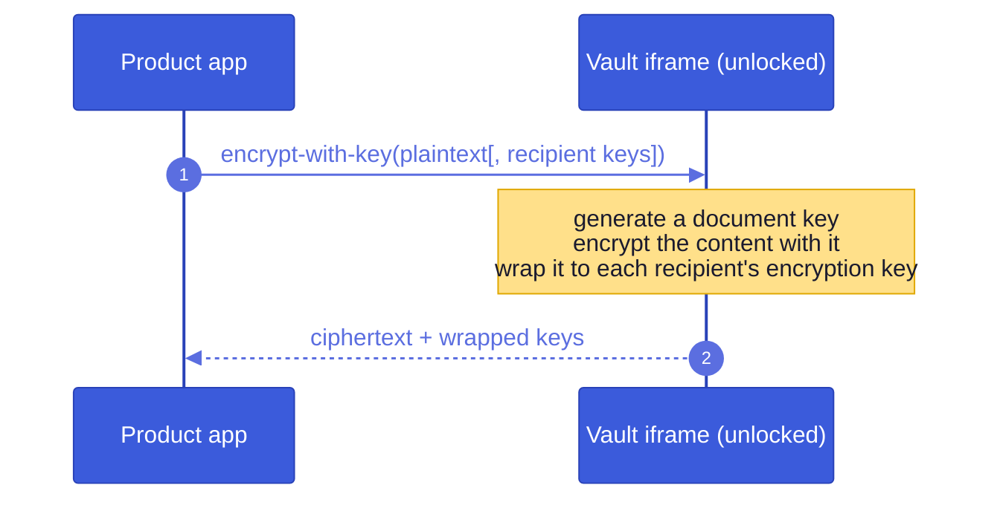
```mermaid
%%{init: {'theme':'base','themeVariables':{'actorBkg':'#3b5bdb','actorTextColor':'#fff','actorBorder':'#2942b8','signalColor':'#5b6ee0','signalTextColor':'#5b6ee0','noteBkgColor':'#ffe08a','noteTextColor':'#1a1a2e','noteBorderColor':'#e0a800','sequenceNumberColor':'#fff'}}}%%
sequenceDiagram
  autonumber
  participant P as Product app
  participant V as Vault iframe (unlocked)
  P->>V: encrypt-with-key(plaintext[, recipient keys])
  Note over V: generate a document key<br/>encrypt the content with it<br/>wrap it to each recipient's encryption key
  V-->>P: ciphertext + wrapped keys
```

<a id="s5-2"></a>

### 5.2 Share: Alice grants Bob access

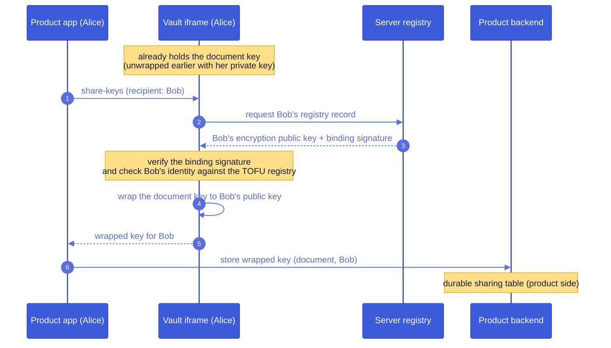
```mermaid
%%{init: {'theme':'base','themeVariables':{'actorBkg':'#3b5bdb','actorTextColor':'#fff','actorBorder':'#2942b8','signalColor':'#5b6ee0','signalTextColor':'#5b6ee0','noteBkgColor':'#ffe08a','noteTextColor':'#1a1a2e','noteBorderColor':'#e0a800','sequenceNumberColor':'#fff'}}}%%
sequenceDiagram
  autonumber
  participant PA as Product app (Alice)
  participant VA as Vault iframe (Alice)
  participant REG as Server registry
  participant PB as Product backend
  Note over VA: already holds the document key<br/>(unwrapped earlier with her private key)
  PA->>VA: share-keys (recipient: Bob)
  VA->>REG: request Bob's registry record
  REG-->>VA: Bob's encryption public key + binding signature
  Note over VA: verify the binding signature<br/>and check Bob's identity against the TOFU registry
  VA->>VA: wrap the document key to Bob's public key
  VA-->>PA: wrapped key for Bob
  PA->>PB: store wrapped key (document, Bob)
  Note over PB: durable sharing table (product side)
```

<a id="s5-3"></a>

### 5.3 Read: Bob opens the document

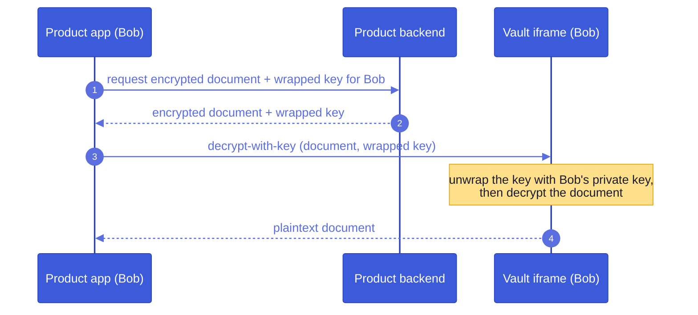
```mermaid
%%{init: {'theme':'base','themeVariables':{'actorBkg':'#3b5bdb','actorTextColor':'#fff','actorBorder':'#2942b8','signalColor':'#5b6ee0','signalTextColor':'#5b6ee0','noteBkgColor':'#ffe08a','noteTextColor':'#1a1a2e','noteBorderColor':'#e0a800','sequenceNumberColor':'#fff'}}}%%
sequenceDiagram
  autonumber
  participant PB2 as Product app (Bob)
  participant BK as Product backend
  participant VB as Vault iframe (Bob)
  PB2->>BK: request encrypted document + wrapped key for Bob
  BK-->>PB2: encrypted document + wrapped key
  PB2->>VB: decrypt-with-key (document, wrapped key)
  Note over VB: unwrap the key with Bob's private key,<br/>then decrypt the document
  VB-->>PB2: plaintext document
```

<a id="s5-4"></a>

### 5.4 Contact trust and identity continuity

Each user's vault keeps a **TOFU registry** (trust on first use): one entry per contact, keyed on that contact's **identity fingerprint**. It works like SSH's known hosts. The first time the user shares with a contact, the fingerprint is **recorded** and **sharing is allowed**, so the first key seen is effectively accepted; recording it is what lets a later change be caught. The one refinement is the label: that first key is recorded as **`unknown`** (seen, not verified), never as `trusted`, so the interface can tell apart a contact whose identity was checked from one that was merely seen. Marking a contact `trusted` (or `refused`) is only ever an **explicit user decision** (verify the fingerprint out-of-band, then accept). What is fail-safe is any **change**: a new fingerprint for a **recorded** contact is surfaced as a **mismatch**, which blocks the share and prompts the user to re-verify out-of-band. This is what detects an attacker who reset a victim's account into a new identity, and what detects a registry that substituted a key. A first encounter is not treated as an attack; a change to a known contact is.

The per-contact trust status is a small state machine, and every edge into `trusted` is an explicit human decision:

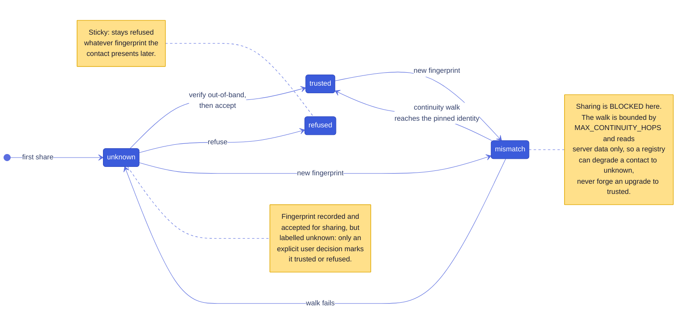
```mermaid
%%{init: {'theme':'base','themeVariables':{'fontSize':'15px','primaryColor':'#3b5bdb','primaryTextColor':'#fff','primaryBorderColor':'#2942b8','lineColor':'#5b6ee0','tertiaryColor':'#fff','labelBackgroundColor':'#ffffff','edgeLabelBackground':'#ffffff','transitionColor':'#5b6ee0','transitionLabelColor':'#33406b','noteBkgColor':'#ffe08a','noteTextColor':'#1a1a2e','noteBorderColor':'#e0a800'},'themeCSS':'.edgeLabel p{background-color:#fff;padding:4px 10px;border-radius:5px;margin:0;} .edgeLabel .labelBkg{background:transparent;} .statediagram-state .nodeLabel p{font-size:15px;padding:5px 12px;margin:0;}','stateDiagram':{'nodeSpacing':70,'rankSpacing':110,'useMaxWidth':true}}}%%
stateDiagram-v2
  direction LR
  [*] --> unknown: first share
  unknown --> trusted: verify out-of-band,<br/>then accept
  unknown --> refused: refuse
  trusted --> mismatch: new fingerprint
  unknown --> mismatch: new fingerprint
  mismatch --> trusted: continuity walk<br/>reaches the pinned identity
  mismatch --> unknown: walk fails
  note right of unknown
    Fingerprint recorded and
    accepted for sharing, but
    labelled unknown: only an
    explicit user decision marks
    it trusted or refused.
  end note
  note left of refused
    Sticky: stays refused
    whatever fingerprint the
    contact presents later.
  end note
  note right of mismatch
    Sharing is BLOCKED here.
    The walk is bounded by
    MAX_CONTINUITY_HOPS and reads
    server data only, so a registry
    can degrade a contact to unknown,
    never forge an upgrade to trusted.
  end note
```

The continuity chain lets a **legitimate** rotation pass without re-verification: the client walks from the contact's current identity back toward the one it trusts, checking at each hop that the newer identity carries a valid `continuitySignature` from its predecessor, and only then carries the old trust status forward to the new fingerprint. This does **not** weaken the detection above, because forging any link requires that predecessor's **private key**, which never touches the server. A compromised registry can only **withhold or roll back** links, whose fail-safe effect is to fall back to unknown and force re-verification, never a false upgrade to trusted. A refused contact is not affected by any of this: a refusal is sticky, it stays in force whatever fingerprint the contact presents later, so changing keys can never get someone out of a refusal; only the user can lift it. So continuity in the TOFU registry propagates trust only along a chain the legitimate key holder actually signed, and stays safe against a database compromise.

**Status: supported by the core, not used yet.** The walk is implemented and tested, but no flow writes continuity links (they are reserved for a future migration of the identity key, for instance to a post-quantum hybrid signature: Ed25519 and ML-DSA concatenated, the form ANSSI lists ([4.5](#s4-5)), the new identity being cross-signed by the old one through these same columns), so today every identity change surfaces as a mismatch.

The resolution happens **inside the normal fingerprint check**, not as a separate call. When a provided fingerprint mismatches a pinned one, the vault fetches that contact's continuity chain from the registry itself (`GET /api/public-keys/:userId/continuity`, public directory data needing no auth) and walks it: it verifies each link's signature and contiguity, and stops as soon as a link's predecessor is the identity it pinned, re-pinning the current fingerprint and keeping the old status. The walk is bounded by a shared hop cap (`MAX_CONTINUITY_HOPS`): a contact that rotated more times than that since the last verification, or a registry serving a longer fabricated chain, falls back to a fresh out-of-band check. No continuity data crosses the postMessage boundary, so products never handle it. Multiple rotations therefore resolve across several hops in a single check, and the cross-signing columns are the only registry data the walk relies on.

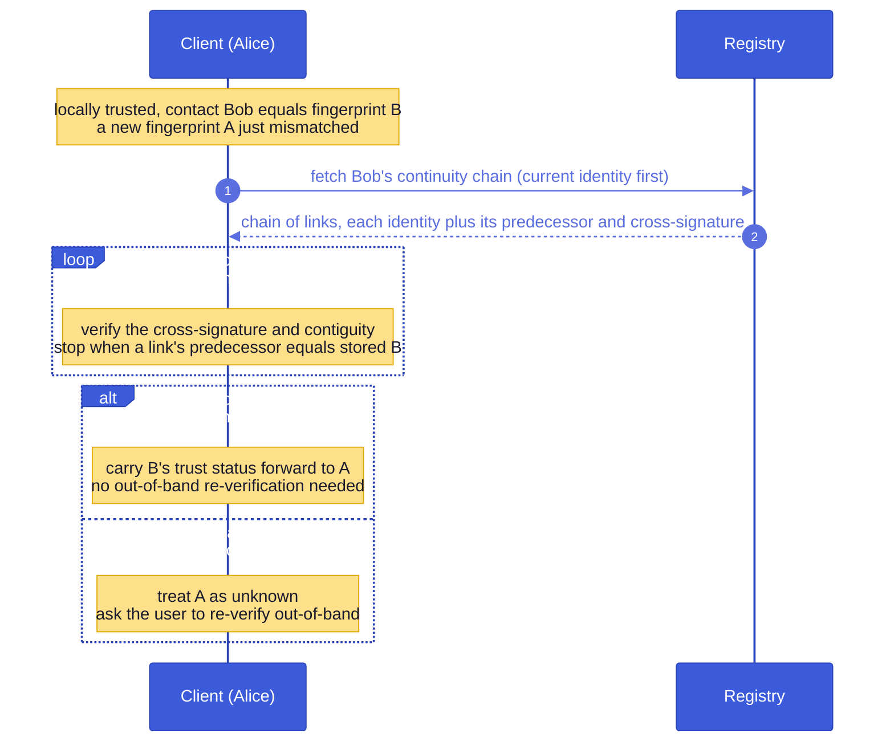
```mermaid
%%{init: {'theme':'base','themeVariables':{'actorBkg':'#3b5bdb','actorTextColor':'#fff','actorBorder':'#2942b8','signalColor':'#5b6ee0','signalTextColor':'#5b6ee0','noteBkgColor':'#ffe08a','noteTextColor':'#1a1a2e','noteBorderColor':'#e0a800','sequenceNumberColor':'#fff'}}}%%
sequenceDiagram
  autonumber
  participant C as Client (Alice)
  participant REG as Registry
  Note over C: locally trusted, contact Bob equals fingerprint B<br/>a new fingerprint A just mismatched
  C->>REG: fetch Bob's continuity chain (current identity first)
  REG-->>C: chain of links, each identity plus its predecessor and cross-signature
  loop each link, back toward B, up to the hop cap
    Note over C: verify the cross-signature and contiguity<br/>stop when a link's predecessor equals stored B
  end
  alt a valid chain reaches B within the cap
    Note over C: carry B's trust status forward to A<br/>no out-of-band re-verification needed
  else chain broken, absent, or over the cap
    Note over C: treat A as unknown<br/>ask the user to re-verify out-of-band
  end
```

<a id="s5-5"></a>

### 5.5 Key registration: dual-key proof of possession

Before a key pair enters the directory, the client must prove it holds **both** private keys, and the record's identity binding must be internally coherent. This is the anti-impersonation core: it is what stops anyone (including a malicious server) from publishing a key they do not control, or claiming another user's key. It runs as two phases, `init` then `complete`.

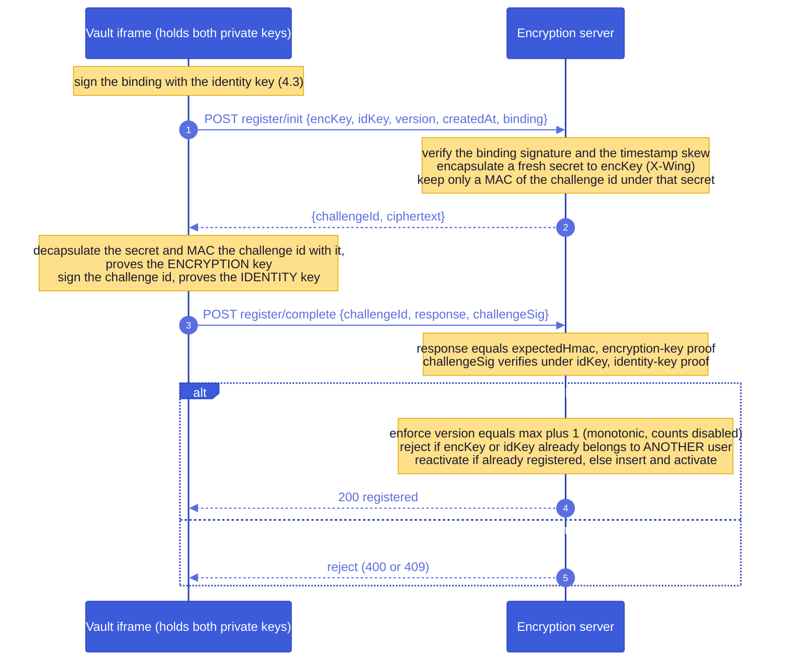
```mermaid
%%{init: {'theme':'base','themeVariables':{'actorBkg':'#3b5bdb','actorTextColor':'#fff','actorBorder':'#2942b8','signalColor':'#5b6ee0','signalTextColor':'#5b6ee0','noteBkgColor':'#ffe08a','noteTextColor':'#1a1a2e','noteBorderColor':'#e0a800','sequenceNumberColor':'#fff'}}}%%
sequenceDiagram
  autonumber
  participant V as Vault iframe (holds both private keys)
  participant API as Encryption server
  Note over V: sign the binding with the identity key (4.3)
  V->>API: POST register/init {encKey, idKey, version, createdAt, binding}
  Note over API: verify the binding signature and the timestamp skew<br/>encapsulate a fresh secret to encKey (X-Wing)<br/>keep only a MAC of the challenge id under that secret
  API-->>V: {challengeId, ciphertext}
  Note over V: decapsulate the secret and MAC the challenge id with it,<br/>proves the ENCRYPTION key<br/>sign the challenge id, proves the IDENTITY key
  V->>API: POST register/complete {challengeId, response, challengeSig}
  Note over API: response equals expectedHmac, encryption-key proof<br/>challengeSig verifies under idKey, identity-key proof
  alt both proofs pass and the record is coherent
    Note over API: enforce version equals max plus 1 (monotonic, counts disabled)<br/>reject if encKey or idKey already belongs to ANOTHER user<br/>reactivate if already registered, else insert and activate
    API-->>V: 200 registered
  else a proof fails or the key is already taken
    API-->>V: reject (400 or 409)
  end
```

The two proofs are independent and both required: decapsulating the X-Wing ciphertext proves the **encryption** private key, and signing the server-issued challenge id proves the **identity** private key. The binding signature (verified at `init`) proves the encryption key was chosen by the holder of the identity key, and because `version` and `createdAt` are inside it, the server cannot silently renumber or backdate a record. The `complete` writes run in one Serializable transaction so two devices racing for the same next `version` cannot both succeed. A registration record is immutable: restoring an already-registered key **reactivates** its existing row rather than minting a new version. This is the same flow the atomic onboarding ([7.1](#s7-1)) folds into its bootstrap transaction, and it is what a re-onboard after a reset re-runs at `max + 1`.

---

<a id="s6"></a>

## 6. The synchronized vault

<a id="s6-1"></a>

### 6.1 What syncs

```
VaultState {
  schema: 1
  identities:     [ { generation, algo, sigPublicKey, sigSecretKey, createdAt } ]   // grow-only, immutable
  encryptionKeys: [ { version, algo, publicKey, secretKey, createdAt } ]            // grow-only, immutable
  active:         { identityGen, encKeyVersion }                                     // pointer to the current key
  tofu:           { [remoteUserId]: { fingerprint, status, revisionDate, deleted? } }// the only mutable data
}
```

- **Keep every key generation**, not just the current one: a device must _decrypt_ content wrapped under an old key while _encrypting_ under the active one. Old versions are immutable, so keeping them costs a few KB.
- **No cached "known public keys."** A trust entry is just `{ fingerprint, status }` keyed by `remoteUserId`; the actual public keys are fetched fresh from the registry and re-verified on use. The fingerprint plus the userId is all we need to remember a trust decision.
- **The TOFU registry is the only mutable, conflict-prone state**: everything else is append-only. This is what makes conflict handling tractable ([Section 11](#s11)).

Each item's decrypted payload and each server row are validated against a **Zod schema** after decryption, matching the project convention in `src/shared/schemas`. AEAD already prevents tampering; Zod guards against bugs and schema drift.

<a id="s6-2"></a>

### 6.2 Local storage and caching

Locally, the vault iframe keeps two things: a plain in-memory `VaultState`, and a durable cache holding the encrypted items, their revision, the manifest signature, and **the VRK wrapped by a non-extractable WebCrypto device key**.

Why cache the VRK rather than the passphrase: the passphrase (`R`) is the ultimate secret and also the printed recovery secret, so it is never persisted anywhere. The VRK is a derived key; caching it wrapped under a non-extractable device key means (a) we skip the deliberately-slow Argon2id every session, (b) we never re-prompt the mnemonic for routine use, including after the last tab is closed, and (c) script cannot exfiltrate the wrapping key. This is strictly safer than storing the phrase.

The decrypted `VaultState` lives in memory only while a page embeds the vault iframe. There is deliberately no inactivity lock: unlocking again would only unwrap the cached VRK with the same device key, without any user action, so it would protect nothing; leaving a session unlocked is covered by the assumptions instead ([1.4](#s1-4)).

**De-enroll** (**Status: planned**): wipe the device-wrapped VRK when the device has not used encryption for a long period (about 6 months), so it must be enrolled again through device approval or the recovery phrase. The vault iframe enforces the check on load. It protects a device that is lost and found after that period, not one an attacker uses before it. Today the device-wrapped VRK stays until the user leaves encryption or clears the site data.

<a id="s6-3"></a>

### 6.3 Integrity model

Bitwarden does not sign vault items, it relies on transport auth and trusts the server for integrity. We do not, because our threat model includes a compromised server.

Alongside the items we store a **manifest**:

```
manifest = {
  revision,                 // monotonic
  identityGen,              // which identity generation signed, advisory hint only
  items: [ { id, type, contentHash, revisionDate } ],
}
manifestSig = Ed25519_sign(identitySecretKey, canonical(manifest))
```

A consuming device verifies, in order:

1. `manifestSig` against the **locally-trusted identity public key**, not whatever the server labels. `identityGen` is only a hint for _which_ key to expect; the trust anchor is the identity the device already holds (verified out-of-band and/or cross-checked against the public registry). A server that rewrites `identityGen` gains nothing, because it cannot produce a signature under a key it does not hold.
2. Every item's `contentHash` is present in the manifest, detects a spliced, dropped, or swapped item.
3. `revision >= lastSeenRevision` stored locally, detects rollback to an older vault.

**Which identity signs.** The manifest must be signed by the **current active identity**. On an identity rotation (supported by the core through the continuity columns, not used yet), the manifest is re-signed under the new identity, the same "re-sign on rotation" pattern Bitwarden uses for key rotation. A manifest signed by a non-active identity is rejected, with a future grace path via the continuity cross-signature.

**Can a legitimate user hit a bad signature?** With a correct client, essentially no, a legitimate device always signs with the active identity it holds, so a verification failure means tampering, corruption, or rollback, not normal use. That is why the response is to **refuse and warn**, not to auto-repair. Resolution paths, in order of preference: keep the last-good cached vault and retry (transient/corruption); **cross-check against the public registry** (the keys are independently registered there with their own binding signatures, so a device can confirm which key set is authentic and see exactly what was altered); **restore from the recovery phrase**, which re-derives the VRK and lets the device rebuild and re-sign a fresh manifest from items that verify against the registry.

This mirrors how other systems treat an integrity break as a hard stop with a human decision rather than a silent fix: **Signal** shows a "safety number changed" warning and blocks until acknowledged; **git** flags a bad commit signature and leaves the policy to the caller; **TLS certificate pinning** fails the connection outright; **Apple iCloud Keychain** anchors recovery in HSM attestation so a mismatch cannot be papered over.

<a id="s6-4"></a>

### 6.4 How each server request is authorized

Two things authorize a request, and they answer different questions: **transport** ("is this really one of the account's devices?") and **payload** ("what does this write mean?").

**Transport auth comes in four tiers**, chosen by whether the caller can hold the identity key at that moment and how sensitive the operation is. The load-bearing idea: the **vault** iframe (which holds the identity key) is loaded whenever a product uses encryption, but the **interface** iframe (which holds the OIDC JWT) is not, so anything that must run silently is authenticated by the **identity signature alone**, not the JWT. "Silently" still means _while the user has a product window open_ (the vault iframe is live in that page); this is not headless, server-side background work. The point is precisely that we can keep the vault synced in that window **without interrupting the user**: we never want to pop a "your session has expired, please sign in again" modal just to push a trust decision or pull a remote change. Signing each request with a private key and verifying it against a registered public key, with no bearer token, is the same pattern as SSH, WireGuard, mTLS and WebAuthn.

| Tier                        | Auth required                        | Driven by              | Why                                                                                                                                                                                                             | Endpoints                                                                                                                                                     |
| --------------------------- | ------------------------------------ | ---------------------- | --------------------------------------------------------------------------------------------------------------------------------------------------------------------------------------------------------------- | ------------------------------------------------------------------------------------------------------------------------------------------------------------- |
| **Silent / background**     | **Identity signature only** (no JWT) | the vault (autonomous) | must run with no interface and no live JWT; the identity signature proves "an enrolled device of this user", and `userId` travels inside the signed claims so the server targets one identity to verify against | `GET`/`PUT /api/vault/items`, `GET /api/vault/revision`, SSE `/api/vault/events`, `GET /api/emergency-access/pending` ([9.7](#s9-7))                          |
| **Interactive + sensitive** | **JWT + identity signature**         | the interface          | the interface is open (JWT is free) and the op is security-relevant, so keep the OIDC-session assurance on top of the key proof                                                                                 | `PUT /api/vault/keyring` (change phrase), device-approval approve / list, emergency designate / wait-time change / re-arm / initiate / recover ([9.7](#s9-7)) |
| **Cold / no keys yet**      | **JWT (+ passphrase PoP)**           | the interface          | the caller has no identity key yet (restoring / onboarding); the passphrase proof is what gates the `wrappedVRK`                                                                                                | `GET /api/vault/meta`, `POST /api/vault/challenge` `/fetch` `/reactivate` `/vault` (bootstrap), `register/*`                                                  |
| **Lost-password**           | **JWT only**                         | the interface          | must work exactly when the user can sign nothing                                                                                                                                                                | `DELETE /api/public-keys`, the emergency fail-safe actions (accept, cancel, reject, delete, lists, search: [9.7](#s9-7))                                      |

**Why keep the JWT _on top of_ the signature for tier 2.** The signature alone is already strong authentication (the SSH / WebAuthn key-possession pattern), so tier 2 does not strictly _need_ the JWT for correctness. We keep it because those operations are **rare and sensitive** (changing the recovery phrase, approving a new device), the interface is already open at that moment so the JWT costs nothing, and it is cheap belt-and-suspenders: were there ever a subtle edge in signature verification, the JWT is a second, independent gate that blinds it. It is the same shape as cold-start pairing the JWT with the passphrase proof (there the passphrase does the cryptographic part). For the frequent, silent data-plane we deliberately do not pay that cost, because requiring the JWT is exactly what would force the re-authentication modal we are trying to avoid.

**The `X-Signature` mechanism.** The per-request identity signature (tiers 1 and 2) is a DPoP-style compact JWS (modelled on RFC 9449 / RFC 7515) over `{method, path, body-digest, userId, iat, exp}`, signed by the caller's identity key and sent in an `X-Signature` header (`src/crypto/request-proof.ts`). On the **silent data-plane (tier 1)** it stands alone (no JWT), and the server takes `userId` from the signed `sub`, does one indexed lookup of that user's identity key, and verifies against it (a forged `sub` simply won't verify). On **tier 2** it accompanies the JWT, its `sub` bound to the JWT's user. The **body-digest** (`bh` = base64url SHA-256 of the exact request body, the same idea as AWS SigV4's payload hash and RFC 9421's `Content-Digest`) binds the signature to the payload, so a captured signature cannot be replayed against the same method+path with a **swapped body**: the server hashes the raw bytes it received and rejects any mismatch. A server middleware enforces the whole proof **secure-by-default**: a new vault route is covered automatically and must be _explicitly_ exempted, so the failure mode of forgetting is a rejected legitimate call (loud), never a silently open one. The server verifies the proof against the caller's **active identity** from the registry, so a bare stolen token, lacking the identity key, cannot produce it. Replay is bounded by the covered method+path+body and a short validity window, with **no server-side nonce cache**: the covered reads are idempotent and the covered writes carry their own monotonic-revision replay protection. One deliberate deviation from DPoP: we do not trust a public key embedded in the proof; the server always resolves the key from the registry.

Exempt from the `X-Signature`, and _only_ these, because the caller structurally cannot hold the identity key at that point:

- **cold prerequisites / PoP flows**: `GET /api/vault/meta` (KDF params fetched before any key is derived), `POST /api/vault/challenge` `/fetch` `/reactivate` `/vault` (bootstrap), `register/*`;
- **lost-password disable**: `DELETE /api/public-keys`: it must work precisely when the user can sign nothing, and only ever _disables_ the identity and keyring (never hard-deletes), so a backup reactivates them;
- the emergency-access **fail-safe actions** (accept, cancel, reject, delete, the lists and the contact search): a grantor who lost every device must still be able to refuse a recovery from a bare login, and none of these can ever release key material or shorten a wait ([9.7](#s9-7));
- the public directory reads.

The one subtlety is device adoption: a new device must pull `/items` (a covered route) to obtain the very identity key it would sign with. So the enrolled device forwards the **identity secret key alongside the VRK**, both wrapped to the new device's ephemeral key, and the new device signs its own first pull ([7.5](#s7-5)). No keyless carve-out on `/items`.

**Identity migration and self-auth.** Verifying the `X-Signature` against only the _active_ identity would deadlock a device that is one migration behind (it signs with the old generation the server no longer treats as active, yet it must sync to obtain the new one). The resolution is a walk bounded **two** ways: accept the active identity always; accept a **continuity-linked** predecessor (verifying each cross-signature) only if it is both within a small **hop** bound (N-1…N-3) _and_ within a **time** grace window; otherwise return a distinct "identity too stale / off-chain" error that tells the client to restore from backup. The two bounds do different jobs: the hop bound caps the walk's cost, the **time bound caps cryptographic exposure**: you migrate an identity for a reason (notably retiring a signature key with emerging long-term weakness, the Ed25519 → PQ case this mechanism is reserved for), so an old key must stop authenticating _anything_ once the window closes, not linger usable forever. The time check is **absolute and per-identity, measured against `now`**: a predecessor's "superseded at" is exactly its **successor's `createdAt`** (the successor is minted at the moment the old identity is demoted, so no separate column is needed: the walk already holds the successor), and a predecessor is accepted only while `now − successor.createdAt < WINDOW`. It is emphatically **not** a chained "each migration was within WINDOW of the previous" test: that would let frequent migrations (say every 11 months) walk the chain back many years. With the absolute rule, the oldest key that can authenticate is one retired within the last WINDOW, no matter how often migrations happen. The active identity itself is **never** time-checked (it is accepted unconditionally on the fast path); only superseded predecessors are. The window is set to the **same ~1 year** as the superseded-vault content retention ([§8](#s8)), and the two reinforce each other: past a year the old vault's wrapped VRK + items are purged, so a device still on the old identity would have nothing left to sync anyway. It is deliberately _not_ "any of the user's identities": an **unlinked** older generation (from a start-over or a post-compromise reset) is a trust break and must not authenticate (the walk needs a valid cross-signature to step), and even a linked one expires. This acceptance is **implemented** (`src/server/routes/transport-auth.ts`: active key checked first, then `continuityPredecessorWireKeys` walks the chain with the hop + window + cross-signature checks; verified by unit tests including out-of-window, revoked, and forged-link rejection). It is **supported by the core, not used yet**: nothing writes continuity links ([5.4](#s5-4)), so `previousIdentityId` is always null, the walk finds no predecessor, and only the active identity authenticates. But the day migration writes a chain (link + successor `createdAt`, no extra state), the check is already correct and live.

**Payload: content signatures (what a write means).** Independently of transport, any write that changes durable, trust-bearing state carries an Ed25519 signature over a specific canonical object, in the JSON body, verified against a key the server cannot forge:

- vault item writes carry the **manifest signature** (identity over item hashes + monotonic `revision`, [Section 6.3](#s6-3));
- registration and onboarding carry the **binding signature** (identity over `{version, createdAt, keys, userId}`) plus dual proof-of-possession ([5.5](#s5-5));
- a rotated identity carries the **continuity signature** by its predecessor ([5.4](#s5-4));
- changing the recovery phrase (`PUT /api/vault/keyring`) carries an **auth-binding** signature over the new `authPublicKey`.

Anti-replay/anti-reorder here is the **embedded monotonic counter** the signature covers, not a nonce. This layer is what makes integrity independent of the server; the transport `X-Signature` is defence-in-depth on top of it, and the only thing protecting the covered _reads_ (which have no body to sign).

**Releasing the wrappedVRK (passphrase PoP).** Cold fetch (`/fetch`) and reactivation (`/reactivate`) are gated by a passphrase-derived signature over a **single-use server nonce** ([7.2](#s7-2)): a read and a state-flip with no meaningful payload to sign, where a server nonce is the simplest anti-replay and matters most for the state change.

**Residual.** With the `X-Signature` in place, a bare stolen JWT (or a rogue server acting within its own API) can no longer even pull the sealed vault: it lacks the identity key. The one mutating endpoint it can still reach is the lost-password **disable**, whose worst case is a **recoverable availability hit** (the owner reactivates from backup). It can never read content, forge a signed item, mint or rotate an identity, or cause irreversible loss, exactly the [Section 3](#s3) posture (the server is honest-but-curious and possibly compromised for availability; confidentiality and integrity never depend on trusting it).

---

<a id="s7"></a>

## 7. Vault flows

Participants: **U** user, **P** product app, **UI** interface iframe, **V** vault iframe, **API** encryption server, **E** an enrolled device, **N** a new device.

<a id="s7-1"></a>

### 7.1 Onboarding: vault creation

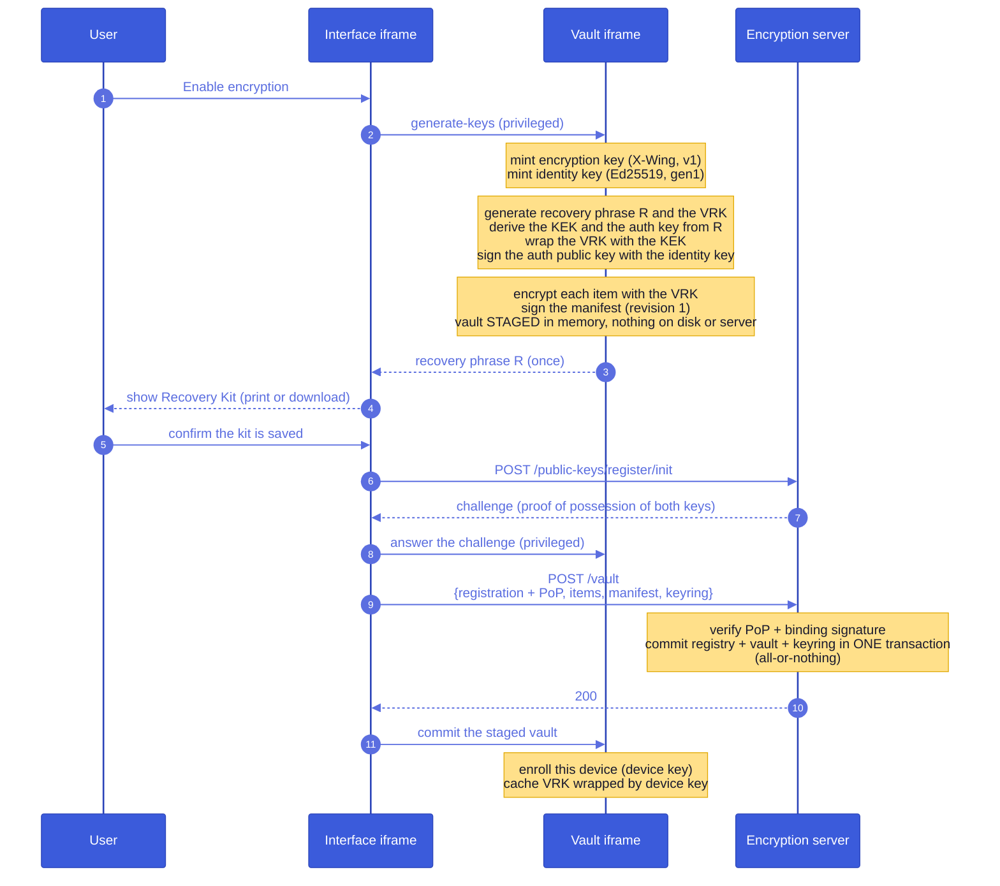
```mermaid
%%{init: {'theme':'base','themeVariables':{'actorBkg':'#3b5bdb','actorTextColor':'#fff','actorBorder':'#2942b8','signalColor':'#5b6ee0','signalTextColor':'#5b6ee0','noteBkgColor':'#ffe08a','noteTextColor':'#1a1a2e','noteBorderColor':'#e0a800','sequenceNumberColor':'#fff'}}}%%
sequenceDiagram
  autonumber
  participant U as User
  participant UI as Interface iframe
  participant V as Vault iframe
  participant API as Encryption server
  U->>UI: Enable encryption
  UI->>V: generate-keys (privileged)
  Note over V: mint encryption key (X-Wing, v1)<br/>mint identity key (Ed25519, gen1)
  Note over V: generate recovery phrase R and the VRK<br/>derive the KEK and the auth key from R<br/>wrap the VRK with the KEK<br/>sign the auth public key with the identity key
  Note over V: encrypt each item with the VRK<br/>sign the manifest (revision 1)<br/>vault STAGED in memory, nothing on disk or server
  V-->>UI: recovery phrase R (once)
  UI-->>U: show Recovery Kit (print or download)
  U->>UI: confirm the kit is saved
  UI->>API: POST /public-keys/register/init
  API-->>UI: challenge (proof of possession of both keys)
  UI->>V: answer the challenge (privileged)
  UI->>API: POST /vault<br/>{registration + PoP, items, manifest, keyring}
  Note over API: verify PoP + binding signature<br/>commit registry + vault + keyring in ONE transaction<br/>(all-or-nothing)
  API-->>UI: 200
  UI->>V: commit the staged vault
  Note over V: enroll this device (device key)<br/>cache VRK wrapped by device key
```

Onboarding writes three things that must stay consistent: the public-key registration, the encrypted vault, and the keyring (the wrapped VRK plus the cold-fetch auth key). Nothing is sent until the user confirms the Recovery Kit is saved: abandoning the backup step (reload, close, cancel) leaves no registration and no vault anywhere, so a user can never end up registered with keys they have no way to recover. Then the three are committed **atomically in a single server transaction** rather than as separate requests. A partial write would otherwise leave a harmful state, for example public keys registered so contacts wrap document keys to the user, but no keyring or vault backed up, so the data is unrecoverable if the device is lost, or a stored vault whose keyring never landed, which can never be unlocked. The preceding challenge fetch is read-only and safe to retry, and the commit is **idempotent** (registration reactivates rather than duplicates, and the vault write is keyed by content and revision), so a client that retries after a lost response completes cleanly.

<a id="s7-2"></a>

### 7.2 Cold unlock on a new device (recovery phrase)

The only flow that uses the passphrase, when a device has nothing cached and no other device is available to approve it (otherwise use [7.5](#s7-5)).

The proof-of-passphrase gates the **`wrappedVRK`**, not just the items. That placement is deliberate: the items are encrypted under the random VRK and are not brute-forceable, whereas `wrappedVRK = seal(VRK, Argon2id(R, ...))` is the only thing an attacker could grind against the passphrase, so it is what must not be handed to a bare token. The salt is `userId`, so no secret is fetched to derive the key; the only thing served before the proof is the account's **KDF cost variants** (non-sensitive numbers). They are needed because Argon2 params are stored **per vault**, so a vault created before the standard was raised keeps its own params: the client derives `authKey` for each distinct variant (cheapest first, almost always a single one) and retries the proof until a keyring verifies. The client trusts the list it is served, so a malicious server could announce many or very expensive variants and stall the restore; this is accepted, since a server able to do that can also serve a modified frontend ([3.4](#s3-4)). No language is served or needed: `authKey` is derived from Argon2 over the phrase **string**, so the input validates typed words against every wordlist and the server only ever checks a signature. The `authPubKey` is a passphrase-derived verifier and is therefore **never** returned to a client; it is written at bootstrap and used only server-side to check the proof. As elsewhere, this gate is defense-in-depth: the high entropy of `R` is what actually protects a leaked `wrappedVRK`; the gate simply keeps that material away from a stolen token in the first place.

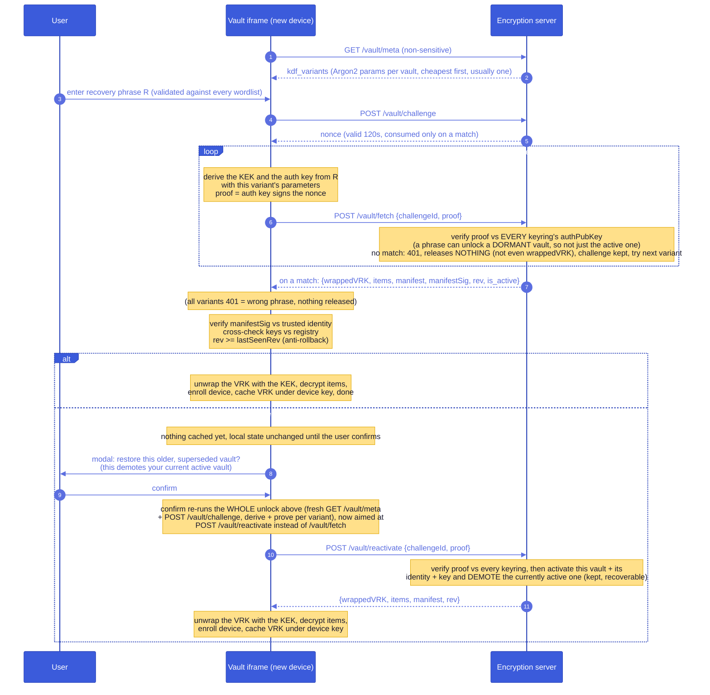
```mermaid
%%{init: {'theme':'base','themeVariables':{'actorBkg':'#3b5bdb','actorTextColor':'#fff','actorBorder':'#2942b8','signalColor':'#5b6ee0','signalTextColor':'#5b6ee0','noteBkgColor':'#ffe08a','noteTextColor':'#1a1a2e','noteBorderColor':'#e0a800','sequenceNumberColor':'#fff'}}}%%
sequenceDiagram
  autonumber
  participant U as User
  participant V as Vault iframe (new device)
  participant API as Encryption server
  V->>API: GET /vault/meta (non-sensitive)
  API-->>V: kdf_variants (Argon2 params per vault, cheapest first, usually one)
  U->>V: enter recovery phrase R (validated against every wordlist)
  V->>API: POST /vault/challenge
  API-->>V: nonce (valid 120s, consumed only on a match)
  loop each KDF variant until the proof verifies (usually the first)
    Note over V: derive the KEK and the auth key from R<br/>with this variant's parameters<br/>proof = auth key signs the nonce
    V->>API: POST /vault/fetch {challengeId, proof}
    Note over API: verify proof vs EVERY keyring's authPubKey<br/>(a phrase can unlock a DORMANT vault, so not just the active one)<br/>no match: 401, releases NOTHING (not even wrappedVRK), challenge kept, try next variant
  end
  API-->>V: on a match: {wrappedVRK, items, manifest, manifestSig, rev, is_active}
  Note over V: (all variants 401 = wrong phrase, nothing released)
  Note over V: verify manifestSig vs trusted identity<br/>cross-check keys vs registry<br/>rev >= lastSeenRev (anti-rollback)
  alt is_active: the phrase unlocked the CURRENT vault
    Note over V: unwrap the VRK with the KEK, decrypt items,<br/>enroll device, cache VRK under device key, done
  else the phrase unlocked a DORMANT (superseded) vault
    Note over V: nothing cached yet, local state unchanged until the user confirms
    V->>U: modal: restore this older, superseded vault?<br/>(this demotes your current active vault)
    U->>V: confirm
    Note over V: confirm re-runs the WHOLE unlock above (fresh GET /vault/meta<br/>+ POST /vault/challenge, derive + prove per variant), now aimed at<br/>POST /vault/reactivate instead of /vault/fetch
    V->>API: POST /vault/reactivate {challengeId, proof}
    Note over API: verify proof vs every keyring, then activate this vault + its<br/>identity + key and DEMOTE the currently active one (kept, recoverable)
    API-->>V: {wrappedVRK, items, manifest, rev}
    Note over V: unwrap the VRK with the KEK, decrypt items,<br/>enroll device, cache VRK under device key
  end
```

The `is_active` flag drives the last fork. If the phrase unlocked the **current** vault, the client caches it and enrolls straight away. If it unlocked a **dormant** (superseded) vault, nothing is cached: the client shows a modal, and only if the user confirms does it call `/vault/reactivate`, which activates that vault and **demotes the currently active one** (the same phrase-authenticated switch [§7.8](#s7-8) uses, and the mechanism behind recovering an older vault or reclaiming a vault after another device replaced the identity).

The candidate set the proof is checked against is every credential the phrase may legitimately unlock right now: the **primary** credential of each of the user's vaults (dormant vaults stay restorable by their own phrase), plus any **emergency** credential whose recovery is currently granted ([Section 9](#s9)). The response's `credential_type` tells the client which kind matched: an emergency match means the phrase was handed over by a trusted contact, and the interface locks into the forced phrase change of [9.5](#s9-5) before anything else.

<a id="s7-3"></a>

### 7.3 Warm sync on an enrolled device

No passphrase: the device unwraps its cached VRK with its device key, and authenticates its requests with the **identity key** held in the vault (the `X-Signature` of [Section 6.4](#s6-4), no JWT needed). The everyday path.

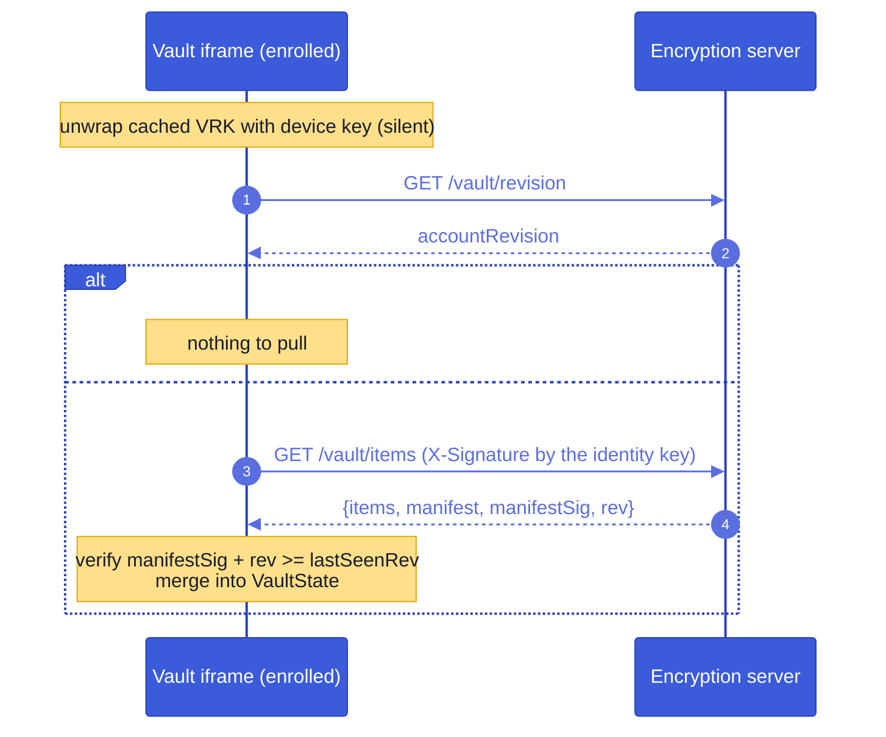
```mermaid
%%{init: {'theme':'base','themeVariables':{'actorBkg':'#3b5bdb','actorTextColor':'#fff','actorBorder':'#2942b8','signalColor':'#5b6ee0','signalTextColor':'#5b6ee0','noteBkgColor':'#ffe08a','noteTextColor':'#1a1a2e','noteBorderColor':'#e0a800','sequenceNumberColor':'#fff'}}}%%
sequenceDiagram
  autonumber
  participant V as Vault iframe (enrolled)
  participant API as Encryption server
  Note over V: unwrap cached VRK with device key (silent)
  V->>API: GET /vault/revision
  API-->>V: accountRevision
  alt unchanged
    Note over V: nothing to pull
  else newer on server
    V->>API: GET /vault/items (X-Signature by the identity key)
    API-->>V: {items, manifest, manifestSig, rev}
    Note over V: verify manifestSig + rev >= lastSeenRev<br/>merge into VaultState
  end
```

<a id="s7-4"></a>

### 7.4 Mutate the vault (with conflict handling)

Every local change goes through a single choke point (`applyAndSync`) so nothing bypasses sync: compute the change, re-sign the manifest, push **write-through** (commit to `VaultState` only once the server confirms). Mirrors Bitwarden's per-item optimistic concurrency.

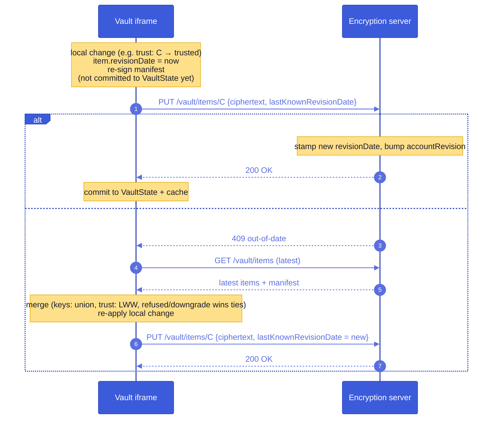
```mermaid
%%{init: {'theme':'base','themeVariables':{'actorBkg':'#3b5bdb','actorTextColor':'#fff','actorBorder':'#2942b8','signalColor':'#5b6ee0','signalTextColor':'#5b6ee0','noteBkgColor':'#ffe08a','noteTextColor':'#1a1a2e','noteBorderColor':'#e0a800','sequenceNumberColor':'#fff'}}}%%
sequenceDiagram
  autonumber
  participant V as Vault iframe
  participant API as Encryption server
  Note over V: local change (e.g. trust: C → trusted)<br/>item.revisionDate = now<br/>re-sign manifest<br/>(not committed to VaultState yet)
  V->>API: PUT /vault/items/C {ciphertext, lastKnownRevisionDate}
  alt server copy not newer
    Note over API: stamp new revisionDate, bump accountRevision
    API-->>V: 200 OK
    Note over V: commit to VaultState + cache
  else server copy newer (> 1s)
    API-->>V: 409 out-of-date
    V->>API: GET /vault/items (latest)
    API-->>V: latest items + manifest
    Note over V: merge (keys: union, trust: LWW, refused/downgrade wins ties)<br/>re-apply local change
    V->>API: PUT /vault/items/C {ciphertext, lastKnownRevisionDate = new}
    API-->>V: 200 OK
  end
```

<a id="s7-5"></a>

### 7.5 Add a device via approval (QR): the primary path

There are two ways to bring encryption onto a new device. When another device is at hand, this approval flow forwards the keys directly. When it is not, the user unlocks with the recovery phrase instead ([7.2](#s7-2)). This section is the with-another-device path. An already-enrolled, unlocked device forwards the **VRK and the identity secret key** to a new device, both wrapped to an ephemeral X-Wing key the new device generated: the VRK decrypts the sealed vault, and the identity key authenticates the new device's very first vault pull ([Section 6.4](#s6-4)), which it must make to obtain the vault that contains that same key. The mnemonic is never involved here (it is not on the device to forward; the VRK is). The new device shows a **128-bit decimal fingerprint** of its ephemeral public key: as a QR to scan with a camera, and as digits to type when a camera is not available. The fingerprint is public, so capturing it is useless. It exists only so the enrolled device can confirm the server handed over the right key. 128 bits is deliberate: the ephemeral key and the whole exchange live for minutes and are used once, so there is no need for the recovery phrase's long-term, post-quantum 256-bit margin, and a shorter fingerprint keeps the typed fallback manageable.

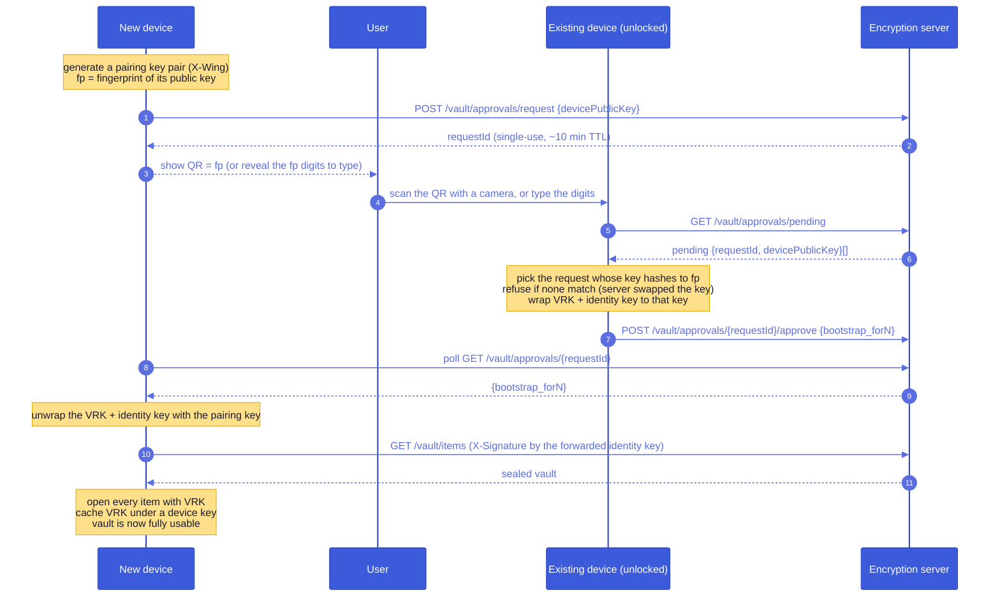
```mermaid
%%{init: {'theme':'base','themeVariables':{'actorBkg':'#3b5bdb','actorTextColor':'#fff','actorBorder':'#2942b8','signalColor':'#5b6ee0','signalTextColor':'#5b6ee0','noteBkgColor':'#ffe08a','noteTextColor':'#1a1a2e','noteBorderColor':'#e0a800','sequenceNumberColor':'#fff'}}}%%
sequenceDiagram
  autonumber
  participant N as New device
  participant U as User
  participant E as Existing device (unlocked)
  participant API as Encryption server
  Note over N: generate a pairing key pair (X-Wing)<br/>fp = fingerprint of its public key
  N->>API: POST /vault/approvals/request {devicePublicKey}
  API-->>N: requestId (single-use, ~10 min TTL)
  N-->>U: show QR = fp (or reveal the fp digits to type)
  U->>E: scan the QR with a camera, or type the digits
  E->>API: GET /vault/approvals/pending
  API-->>E: pending {requestId, devicePublicKey}[]
  Note over E: pick the request whose key hashes to fp<br/>refuse if none match (server swapped the key)<br/>wrap VRK + identity key to that key
  E->>API: POST /vault/approvals/{requestId}/approve {bootstrap_forN}
  N->>API: poll GET /vault/approvals/{requestId}
  API-->>N: {bootstrap_forN}
  Note over N: unwrap the VRK + identity key with the pairing key
  N->>API: GET /vault/items (X-Signature by the forwarded identity key)
  API-->>N: sealed vault
  Note over N: open every item with VRK<br/>cache VRK under a device key<br/>vault is now fully usable
```

The enrolled device fetches the full key from the server and wraps the VRK and identity key only after the out-of-band fingerprint matches, so a malicious server cannot substitute a key of its own: it would have to find a different key pair whose 128-bit fingerprint collides, which is computationally infeasible (about 2^128 operations). The new device then pulls the sealed vault and opens every item with that VRK, so it lands on a complete, usable vault rather than an orphaned key.

**What the return path does and does not guarantee.** The forwarded capsule (the VRK and identity key wrapped to the new device's ephemeral key) is unauthenticated public-key encryption: anyone holding that public key, the server included, can produce a valid wrapping. So the 128-bit fingerprint authenticates only the **new-to-enrolled** direction (the enrolled device wraps to the right key). It does not let the new device prove the returned VRK and vault are the real ones. A fully malicious server could therefore wrap its own VRK' and serve a self-consistent vault under an **attacker identity**, which a brand-new device, having no prior anchor, would adopt. This is not a pairing-specific weakness: it is the general case of an untrusted server substituting a user's identity ([3.1](#s3-1), [5.4](#s5-4)), and it is bounded from several directions, which is why we do not add a second out-of-band confirmation step:

- **An already-provisioned device cannot be silently flipped.** If the server tries to converge an enrolled device onto the fake vault, that device verifies the pulled manifest against the identity it **already trusts locally**; the attacker's signature does not match, so it fails closed ([7.7](#s7-7), integrity error) instead of adopting. Fooling it would need the real identity's private key, which never left it.
- **The fake identity is inert to others unless the registry is also substituted.** Third parties can only encrypt to the new device if the attacker also publishes the fake identity in the public-key registry, and that publication is exactly what a contact's out-of-band fingerprint check (TOFU registry, [5.4](#s5-4)) detects, and what an append-only trace of directory writes would make **auditable** after the fact ([Appendix D](#appendix-d)).
- **The blast radius is new content only.** Existing documents stay under the real keys and remain unreadable to the fake identity. Only content the user creates on the freshly poisoned device is exposed, and it surfaces as a fingerprint change at every contact who had already recorded the real identity ([5.4](#s5-4)).

Turning an enrolled device's refusal into a guided "what happened / how to recover" flow, and telling this apart from a **legitimate** vault switch made on another device, is the reconciliation path ([7.9](#s7-9)). The net posture is worth stating plainly: being able to tamper with the server does **not** let it read content or silently take over a provisioned device. At most, and detectably, it can mislead a brand-new device or reshuffle data that stays unreadable.

<a id="s7-6"></a>

### 7.6 Change the recovery phrase

Cheap: re-wrap the VRK; the vault items are not touched. The previously printed Recovery Kit becomes invalid, so the new one is shown first and the keyring is written only once the user confirms it is saved: abandoning midway leaves the old phrase valid. One gate applies: when a trusted contact's recovery is currently granted on this vault, the keyring write must atomically carry a **burn + re-arm** payload for every granted escrow (the emergency phrase the contact saw dies, a fresh one replaces it), and the server rejects the write otherwise ([9.5](#s9-5)).

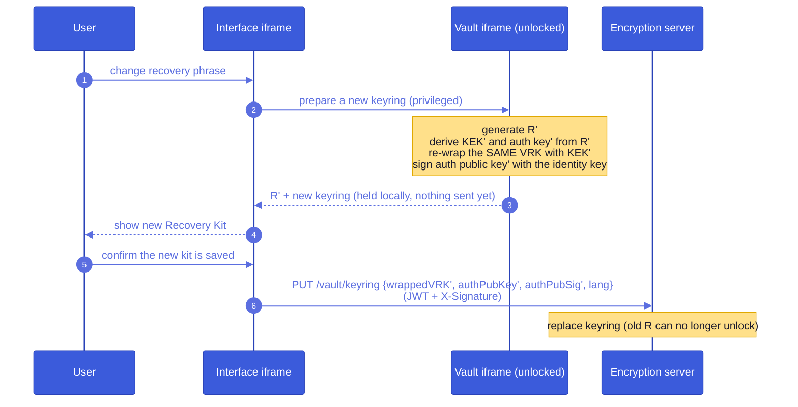
```mermaid
%%{init: {'theme':'base','themeVariables':{'actorBkg':'#3b5bdb','actorTextColor':'#fff','actorBorder':'#2942b8','signalColor':'#5b6ee0','signalTextColor':'#5b6ee0','noteBkgColor':'#ffe08a','noteTextColor':'#1a1a2e','noteBorderColor':'#e0a800','sequenceNumberColor':'#fff'}}}%%
sequenceDiagram
  autonumber
  participant U as User
  participant UI as Interface iframe
  participant V as Vault iframe (unlocked)
  participant API as Encryption server
  U->>UI: change recovery phrase
  UI->>V: prepare a new keyring (privileged)
  Note over V: generate R'<br/>derive KEK' and auth key' from R'<br/>re-wrap the SAME VRK with KEK'<br/>sign auth public key' with the identity key
  V-->>UI: R' + new keyring (held locally, nothing sent yet)
  UI-->>U: show new Recovery Kit
  U->>UI: confirm the new kit is saved
  UI->>API: PUT /vault/keyring {wrappedVRK', authPubKey', authPubSig', lang}<br/>(JWT + X-Signature)
  Note over API: replace keyring (old R can no longer unlock)
```

<a id="s7-7"></a>

### 7.7 Integrity failure handling

If the manifest signature does not verify, or the revision went backwards, the device refuses to apply the data and keeps its last-good state.

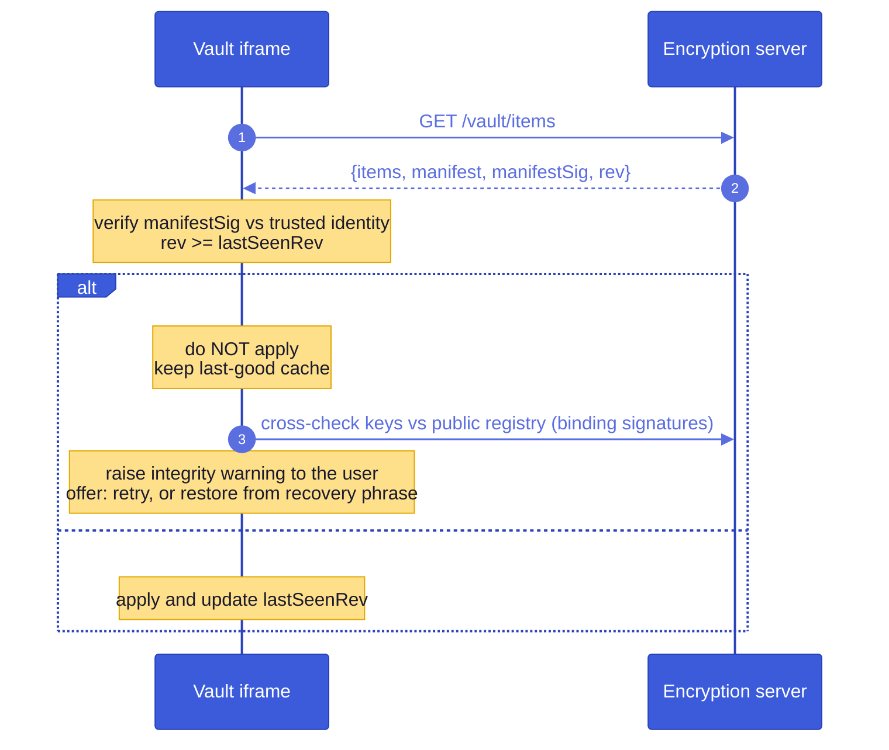
```mermaid
%%{init: {'theme':'base','themeVariables':{'actorBkg':'#3b5bdb','actorTextColor':'#fff','actorBorder':'#2942b8','signalColor':'#5b6ee0','signalTextColor':'#5b6ee0','noteBkgColor':'#ffe08a','noteTextColor':'#1a1a2e','noteBorderColor':'#e0a800','sequenceNumberColor':'#fff'}}}%%
sequenceDiagram
  autonumber
  participant V as Vault iframe
  participant API as Encryption server
  V->>API: GET /vault/items
  API-->>V: {items, manifest, manifestSig, rev}
  Note over V: verify manifestSig vs trusted identity<br/>rev >= lastSeenRev
  alt invalid signature or rolled-back revision
    Note over V: do NOT apply<br/>keep last-good cache
    V->>API: cross-check keys vs public registry (binding signatures)
    Note over V: raise integrity warning to the user<br/>offer: retry, or restore from recovery phrase
  else valid
    Note over V: apply and update lastSeenRev
  end
```

<a id="s7-8"></a>

### 7.8 Lost access: disable, reactivate, or reset

A user who loses their recovery phrase and has no enrolled device de-onboards. This soft-disables the **identity and the vault keyring** (their rows stay, with `disabledAt` set); the **encryption key row is left valid**, so a later reactivation restores the _same_ key rather than rotating. Disabling targets the identity because the identity is what makes a user discoverable: the directory joins only _active_ identities, so a disabled identity disappears from the registry and others can no longer fetch its key to share with it, while the key itself remains intact for recovery. It is never a hard delete, so a stolen access token cannot destroy data, only hide it.

**The directory ledger is permanent.** Identities (their generation) and encryption-key versions, with their dates and `disabledAt`, are never purged. They are the audit trail ("on this date, this identity existed") and the source of the monotonic counters, so versions and generations never reset: a returning user's next key is `ledger max + 1`.

**The vault content is purgeable.** The wrapped VRK and sealed items are the only sensitive material (they hold private keys). A scheduled job deletes them once `disabledAt` exceeds the retention window of one year, which also bounds how long private keys sit at rest. **Status: planned.** The purge job does not exist yet, so today a disabled vault is kept, and stays reactivatable, indefinitely.

**Reactivation and reset.** Within the retention window, the correct recovery phrase reactivates the dormant vault: the phrase-derived auth key matches that vault's stored `authPublicKey`, which identifies the vault and proves ownership in one step. After the window, or when no disabled vault matches, the user onboards a fresh vault under a new identity and the old encrypted content is lost.

The vault's own lifecycle, with the two irreversible boundaries (the retention purge, and the fresh onboarding that follows it):

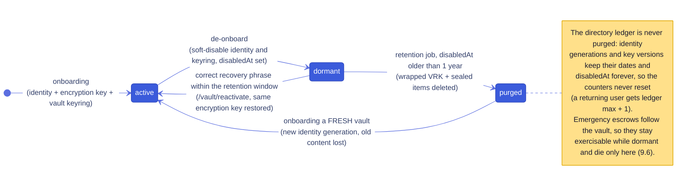
```mermaid
%%{init: {'theme':'base','themeVariables':{'fontSize':'15px','primaryColor':'#3b5bdb','primaryTextColor':'#fff','primaryBorderColor':'#2942b8','lineColor':'#5b6ee0','tertiaryColor':'#fff','labelBackgroundColor':'#ffffff','edgeLabelBackground':'#ffffff','transitionColor':'#5b6ee0','transitionLabelColor':'#33406b','noteBkgColor':'#ffe08a','noteTextColor':'#1a1a2e','noteBorderColor':'#e0a800'},'themeCSS':'.edgeLabel p{background-color:#fff;padding:4px 10px;border-radius:5px;margin:0;} .edgeLabel .labelBkg{background:transparent;} .statediagram-state .nodeLabel p{font-size:15px;padding:5px 12px;margin:0;}','stateDiagram':{'nodeSpacing':70,'rankSpacing':110,'padding':14,'useMaxWidth':true}}}%%
stateDiagram-v2
  direction LR
  [*] --> active: onboarding<br/>(identity + encryption key + vault keyring)
  active --> dormant: de-onboard<br/>(soft-disable identity and keyring, disabledAt set)
  dormant --> active: correct recovery phrase within the retention window<br/>(/vault/reactivate, same encryption key restored)
  dormant --> purged: retention job, disabledAt older than 1 year<br/>(wrapped VRK + sealed items deleted)
  purged --> active: onboarding a FRESH vault<br/>(new identity generation, old content lost)
  note right of purged
    The directory ledger is never purged: identity
    generations and key versions keep their dates and
    disabledAt forever, so the counters never reset
    (a returning user gets ledger max + 1).
    Emergency escrows follow the vault, so they stay
    exercisable while dormant and die only here (9.6).
  end note
```

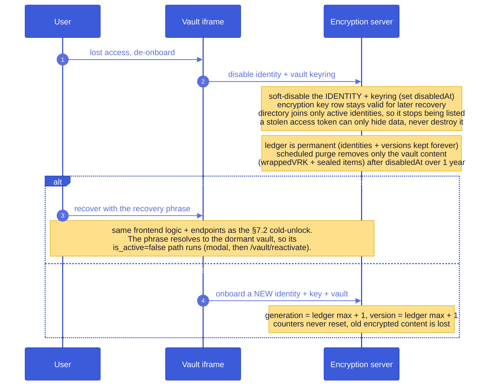
```mermaid
%%{init: {'theme':'base','themeVariables':{'actorBkg':'#3b5bdb','actorTextColor':'#fff','actorBorder':'#2942b8','signalColor':'#5b6ee0','signalTextColor':'#5b6ee0','noteBkgColor':'#ffe08a','noteTextColor':'#1a1a2e','noteBorderColor':'#e0a800','sequenceNumberColor':'#fff'}}}%%
sequenceDiagram
  autonumber
  participant U as User
  participant V as Vault iframe
  participant API as Encryption server
  U->>V: lost access, de-onboard
  V->>API: disable identity + vault keyring
  Note over API: soft-disable the IDENTITY + keyring (set disabledAt)<br/>encryption key row stays valid for later recovery<br/>directory joins only active identities, so it stops being listed<br/>a stolen access token can only hide data, never destroy it
  Note over API: ledger is permanent (identities + versions kept forever)<br/>scheduled purge removes only the vault content<br/>(wrappedVRK + sealed items) after disabledAt over 1 year
  alt within retention window, user re-enters the recovery phrase
    U->>V: recover with the recovery phrase
    Note over U,API: same frontend logic + endpoints as the §7.2 cold-unlock.<br/>The phrase resolves to the dormant vault, so its<br/>is_active=false path runs (modal, then /vault/reactivate).
  else phrase matches nothing or vault already purged
    V->>API: onboard a NEW identity + key + vault
    Note over API: generation = ledger max + 1, version = ledger max + 1<br/>counters never reset, old encrypted content is lost
  end
```

Two details the diagram compresses. **Nothing secret crosses the wire.** The device only ever sends a `challengeId` and an Ed25519 signature; the phrase, the KEK, and the VRK never leave it. The server stores each keyring's `authPublicKey` (a public key derived from the phrase) and the phrase-encrypted `wrappedVRK`, never the phrase or a hash of it, so a database thief cannot learn anything without guessing the phrase: the stored values do let them check a guess offline (derive with Argon2id, compare the public key), which 256 bits of entropy makes hopeless. **KDF params are per vault.** An older vault keeps the (weaker) Argon2 cost it was created with rather than today's, so the device cannot know which to use until it derives: it asks the server for the account's distinct variants (cheapest first) and retries the proof once per variant until one keyring verifies, almost always the first, since an account normally has a single variant. All attempts reuse one short-lived challenge, consumed only on a match and **not** invalidated on a wrong variant; that chaining is safe because every attempt still costs a full Argon2 derivation on the device and the phrase carries 256 bits of entropy. This walk-and-verify only happens on **cold restore**; an already-enrolled device that still holds its VRK syncs against the single active keyring directly (`/vault/items`, JWT-gated, no proof, no walk).

<a id="s7-9"></a>

### 7.9 Reconciliation: when this device and the server disagree

[§7.8](#s7-8) is the _cold_ case: a device with **no VRK**, holding only a recovery phrase. This section is the opposite: a device that **still holds its VRK** (cached under a non-extractable device key) but finds that the server no longer advertises its identity (disabled from another device) or advertises a **different** one (another device re-onboarded). The settings screen detects this by comparing its local identity fingerprint against the directory's active identity, and, since the two must agree before anything else works, gates on a reconciliation choice.

Two states, and the choices they offer:

- **Disabled elsewhere** (no active identity on the server): _reactivate this device_ (warm, below) or _de-onboard_ this device.
- **Diverged** (a different identity is active): _keep this device's identity_ (warm reactivate, which supersedes the other, and the other device must then reconcile in turn), _adopt the server's identity_ (discard the local keys and re-acquire the active one via a device or its recovery phrase), or _de-onboard_.

**Warm reactivation** is the key contrast with [§7.8](#s7-8)'s cold path, and the reason it needs **no recovery phrase** is the **VRK**, not the keys. The VRK is what the passphrase originally produced (the phrase derives a KEK that unwraps the VRK), and this device already has it cached. Because the VRK is present, the device does not need the phrase to re-derive it: it opens its own vault with the cached VRK, and re-proves possession of the keys that vault contains (the same dual proof of possession used at registration). Holding the keys is itself a consequence of holding the VRK. The server's reactivate path then re-enables the identity and its encryption key, and flips this identity's vault keyring active (demoting any other), so identity and vault come back together. No `wrappedVRK` is released, because the device already has it.

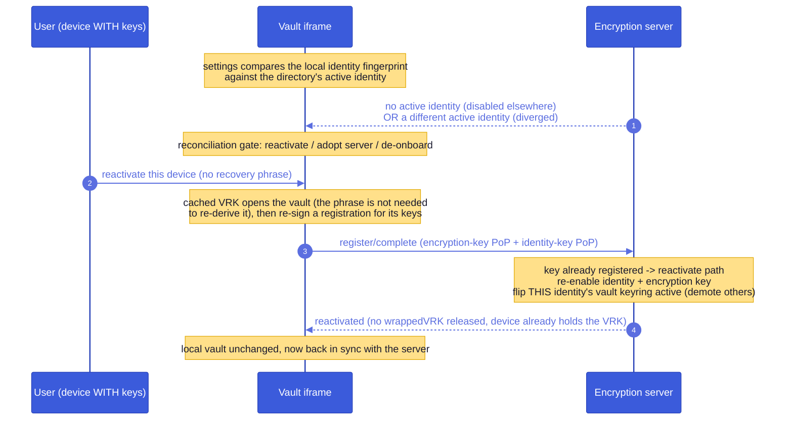
```mermaid
%%{init: {'theme':'base','themeVariables':{'actorBkg':'#3b5bdb','actorTextColor':'#fff','actorBorder':'#2942b8','signalColor':'#5b6ee0','signalTextColor':'#5b6ee0','noteBkgColor':'#ffe08a','noteTextColor':'#1a1a2e','noteBorderColor':'#e0a800','sequenceNumberColor':'#fff'}}}%%
sequenceDiagram
  autonumber
  participant U as User (device WITH keys)
  participant V as Vault iframe
  participant API as Encryption server
  Note over V: settings compares the local identity fingerprint<br/>against the directory's active identity
  API-->>V: no active identity (disabled elsewhere)<br/>OR a different active identity (diverged)
  Note over V: reconciliation gate: reactivate / adopt server / de-onboard
  U->>V: reactivate this device (no recovery phrase)
  Note over V: cached VRK opens the vault (the phrase is not needed<br/>to re-derive it), then re-sign a registration for its keys
  V->>API: register/complete (encryption-key PoP + identity-key PoP)
  Note over API: key already registered -> reactivate path<br/>re-enable identity + encryption key<br/>flip THIS identity's vault keyring active (demote others)
  API-->>V: reactivated (no wrappedVRK released, device already holds the VRK)
  Note over V: local vault unchanged, now back in sync with the server
```

---

<a id="s8"></a>

## 8. Recovery and lifecycle policy

**Enrollment and recovery, combined.** Device-approval ([7.5](#s7-5)) is the everyday way to add a device; the mnemonic ([7.2](#s7-2)) is the recovery fallback for when no other device is available. The mnemonic is shown once at onboarding and printed as the Recovery Kit; after that it is secret and never re-displayed. The QR path forwards the _wrapped VRK_, never the mnemonic, so routine multi-device setup never exposes the long-term secret.

**Recovery Kit wording.** The kit hints that it is needed to restore encrypted data on a new device, without over-explaining exactly what it unlocks. Both **print** (recommended) and **download** are offered. We do not try to "save into a password manager", the item-vs-note ambiguity is not worth it.

**Mnemonic language.** BIP-39 wordlists are language-specific, so the language is a cryptographic parameter, not only UI text: a phrase generated in one wordlist must be entered against that wordlist (the BIP-39 checksum makes a wrong-language entry fail fast). The user is **never asked to pick a language**, it would be an odd, out-of-context question. At generation we **detect it automatically** from the UI/User-Agent locale, falling back to **English** if unsupported, then **store the wordlist language as non-secret metadata (`lang`) in the keyring**, and the printed Kit states it too. Restore does not need it: the typed words are validated against every supported wordlist, and the key is derived from the phrase string itself, so the server never serves a language before the proof ([7.2](#s7-2)). The stored `lang` is used where a phrase must be _rendered_ for this user, e.g. an emergency phrase revealed by a trusted contact ([9.5](#s9-5)) is shown in the grantor's wordlist. Before derivation the phrase is normalized (Unicode NFKD, surrounding spaces removed, inner spaces collapsed to one, lowercase), so a typed phrase derives the same key as the printed one. Only the English and French wordlists are offered; a phrase valid in both would derive the same key anyway, since derivation uses the string, not the wordlist.

**Changing the recovery phrase.** Allowed and cheap ([7.6](#s7-6): re-wrap the VRK, no vault re-encryption). The cost is that the **previously printed kit is invalidated**, so we force a re-print with a clear warning. This is the trade-off 1Password avoids by keeping its Secret Key stable forever and letting only the memorized password change, they have two secrets, so the printed one never rotates; we have one by design, so rotating it means re-printing. Bitwarden, which has no printed artifact, simply lets the master password change. Our choice: permit rotation, force re-print, never re-encrypt the vault.

**Recovery model and durability.** Recovery has exactly three routes and no standalone key export: an already-enrolled **device** (its cached VRK), **device-approval** from such a device, and the **recovery phrase** unlocking the server-held vault. There is deliberately **no offline full-private-key export**: it would be a second, more dangerous secret (the blob _is_ the keys, whereas the phrase is useless without the server and a proof-of-possession), and it is redundant with the three routes above. Durability of the server copy is the **operator's** responsibility (database backups/replication), not something offloaded onto every user as a raw-key file, which is where Bitwarden's user-held encrypted export sits and which we intentionally do not adopt.

**Retention and reset.** Losing the phrase with no enrolled device is a **soft de-onboard**, never a destructive delete, so a stolen access token cannot cause permanent loss. The directory ledger is permanent, and only the sensitive vault content is purged after a retention window (planned); the details are in [7.8](#s7-8).

**Starting over never destroys the previous vault.** A user can hold several vaults (keyrings) over time: exactly one is **active** (the current sync target) and any others are **dormant** remnants of superseded vaults. A fresh onboarding mints a new identity and a new vault; if an active vault already exists, its keyring is marked dormant and the new one is created alongside it in the same bootstrap transaction. The dormant vault's wrapped VRK and sealed items are kept intact, so its **own** recovery phrase can still recover it within the retention window. This is what keeps the two flows independent: start over is a brand-new vault, and recovery is a separate phrase-driven path. Trusted-contact escrows ([Section 9](#s9)) follow the same rule: they stay bound to the vault they were created for, so a start-over does not erase them (deliberately: a stolen-session reset must not be able to destroy the user's recovery routes), and they die only when that vault's content is purged at retention expiry, through the credential cascade ([9.6](#s9-6)).

Recovery is by phrase, and the phrase **self-selects** its vault. The proof of possession verifies against exactly the keyring whose `authPublicKey` the phrase derived, so a fetch returns the one vault that phrase unlocks, active or dormant, without the client ever naming a vault id. The sync and write paths always operate on the active vault, so a single active keyring per user keeps them unambiguous.

When the phrase resolves to a **dormant** vault, the client can bring it back as the current one. Reactivation is a distinct, explicitly confirmed step (it demotes the vault that was active, which stays recoverable by its own phrase), authenticated by the same phrase proof of possession. It is entirely **flag flips**: the recovered keyring is marked active and the previously active one dormant, and the directory is re-pointed at the recovered vault's identity and its latest encryption key, disabling whatever pair was active. Because each keyring records the identity it belongs to, no re-registration is needed. The confirmation matters because there is no separate "disable" gesture: the user is told which vault is being put to sleep, so switching vaults is never silent.

---

<a id="s9"></a>

## 9. Emergency access (trusted contacts)

Every recovery route in [Section 8](#s8) assumes the user still holds an enrolled device or the printed phrase. Emergency access covers the case where both are gone. The model is Bitwarden's Emergency Access, re-based onto this architecture: the user (the **grantor**) designates a **trusted contact**, an already-onboarded user of this service; designation immediately escrows a dormant recovery route to that contact; if the grantor is ever locked out, the contact requests recovery, and a waiting period the grantor chose (7, 15, or 30 days offered, custom up to 90) starts, during which the grantor can refuse from any logged-in session; if the grantor does nothing, the contact receives an emergency recovery phrase, prints it as a kit, and hands it to the grantor in person.

**Organizational escrow was rejected**: LaSuite is deployed by organizations of very different maturity, so a deployment-held recovery key would, in most deployments, be a standing master key in ordinary IT hands, and it concentrates risk (one compromised escrow key or one coerced admin exposes every user's vault). If a deployment ever needs organization-level recovery, it can be layered on top of this same mechanism (an organization recovery identity acting as a mandatory contact) without changing the model. **M-of-N (Shamir) recovery was set aside** for a different reason: splitting the escrow so that no single contact can recover alone sounds stronger, but it multiplies the coordination and comprehension cost for exactly the users this feature serves, and it multiplies the failure modes (one unreachable share-holder blocks everyone). A single well-chosen contact behind a delay is the right amount of machinery, and because the escrow stores one capsule per contact, shares remain an additive change if a deployment ever truly needs them. Recovery of the OIDC login itself is and stays the identity provider's job; this feature covers only the encryption layer, and the printed kit remains the primary, instant, fully user-controlled route: emergency access is its slow, socially anchored complement. A grantor who has also lost the OIDC account is out of scope by the same split (once they can log in again, the flow applies unchanged), and if the grantor is deceased or incapacitated, the contact ends up holding a passphrase but still reads nothing: the server serves the vault only to the grantor's OIDC session, and documents live in the product backends behind that session and the sharing tables, so actual access additionally requires a product-level or legal process (succession, administrator action on the OIDC account). Emergency access makes such a process meaningful (without the keys, granting ciphertext access yields nothing) but does not replace it. No new cryptographic primitive is introduced anywhere: every operation below composes the existing keyring derivation ([4.3](#s4-3)), the existing wrap-for-user KEM path ([5.2](#s5-2)), and the existing length-framed Ed25519 binding-signature pattern ([5.5](#s5-5)).

<a id="s9-1"></a>

### 9.1 The escrow: a dormant emergency passphrase, a second credential of the same vault

What is escrowed is neither the grantor's own phrase (an escrow of it would silently die on every phrase change) nor the raw VRK (the contact would then have to open and rebuild the whole vault on their machine, over-disclosing private keys and the TOFU registry). It is a **fresh, dormant emergency passphrase** for the grantor's own vault, exploiting the credential model of [4.4](#s4-4) LUKS-style: one vault, several keyslots.

At designation, the grantor's open vault iframe generates a fresh emergency phrase `E` (24 words, in the grantor's wordlist), derives from it a **credential** exactly as for the recovery phrase (its own KEK wrapping the same VRK, its own auth key), and wraps the entropy of `E` to the contact's active encryption key: the **capsule**. The formulas are in [4.3](#s4-3).

The credential mirrors the primary one and unlocks the **same** vault (same VRK, same items), but is stored **dormant**: the unlock proof is never checked against it until the relationship is recovery-approved ([9.3](#s9-3)). `E` itself is discarded by the vault iframe the moment the credential and capsule are built; it is never stored or displayed anywhere on the grantor's side. The contact's encryption-key **version** used for the wrap is recorded (`granteeKeyVersion`), so the grantor's settings screen can later detect that the capsule targets an outdated key and offer a one-click re-arm ([9.6](#s9-6)).

What this buys: **the contact never opens the vault.** They only ever end up holding a passphrase, and since the server serves vault ciphertext exclusively to the grantor's own authenticated OIDC session, that passphrase alone reads nothing: no private keys, no documents, no TOFU registry ever reach the contact's machine. Nothing is duplicated either: the grantor keeps their vault, identity, devices, and TOFU registry untouched, and simply gains one more way in. The handover artifact is a recovery kit, the object users already know.

**Designation is gated on explicit verification.** The vault operation that builds the escrow requires the contact's identity fingerprint to be **`trusted`** in the grantor's TOFU registry: stricter than the share gate of [5.4](#s5-4), where `unknown` passes. Escrowing a way into the whole vault demands a prior out-of-band verification, so `unknown` is rejected. This is precisely what defeats a server that substitutes the contact's key at designation time (the wrap targets the binding-verified key of the pinned, humanly-verified identity).

**The escrow binding signature.** Every escrow is signed by the grantor's identity key over a length-framed canonical payload with the dedicated context `lasuite-encryption/emergency-escrow/v1`, covering: the grantor and contact internal user ids, the pinned contact identity public key, the wait time, the escrow creation time, the SHA-256 of the emergency credential's auth verifier (the verifier itself is never released to any client), and the SHA-256 of the capsule. The server verifies it at write against the grantor's **active** identity (on top of the standard auth-binding check on the credential's verifier, and a check that the pinned identity and wrapped key version are the contact's current ones). It serves three verifiers:

- **the grantor's own devices** audit the `/trusted` list against it in the vault (a row the grantor never created, a swapped contact, an altered wait time, or a substituted credential or capsule fails verification and is surfaced as an integrity warning, [§7.7](#s7-7) posture);
- **the contact at reveal time** verifies the record against the grantor identity **pinned in their own TOFU registry**, fail-closed, confirming the escrow really was created by the grantor, for them, with these parameters;
- **the server at write time**, as a coherence gate.

What it does **not** do: prevent the server from releasing the capsule early or hiding rows. The wait period is server policy, exactly as in Bitwarden ([9.3](#s9-3), and stated honestly in the [Section 3](#s3) table).

<a id="s9-2"></a>

### 9.2 State machine

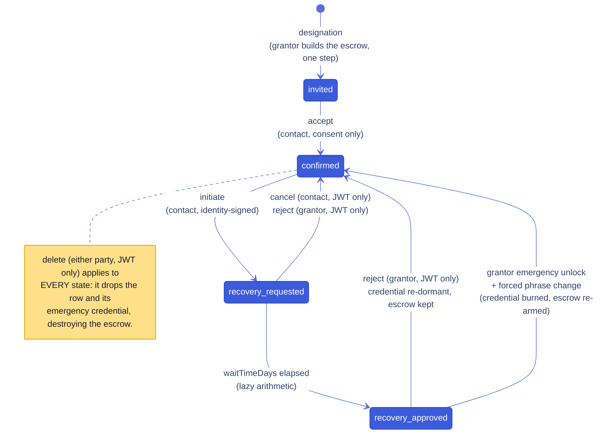
```mermaid
%%{init: {'theme':'base','themeVariables':{'fontSize':'15px','primaryColor':'#3b5bdb','primaryTextColor':'#fff','primaryBorderColor':'#2942b8','lineColor':'#5b6ee0','tertiaryColor':'#fff','labelBackgroundColor':'#ffffff','edgeLabelBackground':'#ffffff','transitionColor':'#5b6ee0','transitionLabelColor':'#33406b','noteBkgColor':'#ffe08a','noteTextColor':'#1a1a2e','noteBorderColor':'#e0a800'},'themeCSS':'.edgeLabel p{background-color:#fff;padding:4px 10px;border-radius:5px;margin:0;} .edgeLabel .labelBkg{background:transparent;} .statediagram-state .nodeLabel p{font-size:15px;padding:5px 12px;margin:0;}','stateDiagram':{'nodeSpacing':70,'rankSpacing':110,'padding':14,'useMaxWidth':true}}}%%
stateDiagram-v2
  direction TB
  [*] --> invited: designation<br/>(grantor builds the escrow, one step)
  invited --> confirmed: accept<br/>(contact, consent only)
  confirmed --> recovery_requested: initiate<br/>(contact, identity-signed)
  recovery_requested --> recovery_approved: waitTimeDays elapsed<br/>(lazy arithmetic)
  recovery_requested --> confirmed: cancel (contact, JWT only)<br/>reject (grantor, JWT only)
  recovery_approved --> confirmed: reject (grantor, JWT only)<br/>credential re-dormant, escrow kept
  recovery_approved --> confirmed: grantor emergency unlock<br/>+ forced phrase change<br/>(credential burned, escrow re-armed)
  note right of confirmed
    delete (either party, JWT only) applies to
    EVERY state: it drops the row and its
    emergency credential, destroying the escrow.
  end note
```

**Designation is one step**, a deliberate divergence from Bitwarden's Invite/Accept/Confirm: contacts are existing, onboarded users found by exact-email search in the local base, so their verified keys exist before designation and the escrow is built immediately. Acceptance is pure consent (no invite tokens, no invitee emails, no second trip by the grantor). Another Bitwarden distinction is collapsed too: their View versus Takeover relationship types make no sense here (this server holds no documents, so a View capability would expose the same key material while reading nothing on its own), leaving a single capability, **recover**.

**There is no early-approve, deliberately.** An approve endpoint could only be authenticated by the grantor's OIDC session: by definition, a grantor who needs recovery has no vault left to sign with. That makes approve exactly as strong as a stolen JWT, and it would let a JWT thief who also suborns the contact collapse the wait to zero. The wait is the entire protection, so **nothing reachable by JWT alone may shorten it**. The cooperative case does not need it: a grantor who still has an enrolled device does not need emergency access at all (any open vault already mints a fresh kit via [7.6](#s7-6)), and a grantor with no device waits the delay they themselves chose.

**Reject and cancel stay JWT-only because they fail safe**: the worst a stolen session can do with them is deny a recovery, never obtain one. Reject is allowed even from `recovery_approved` (it re-dormants the credential, killing a revealed-but-unused phrase) and returns the relationship to `confirmed`, escrow kept: a grantor who no longer trusts the contact deletes the relationship instead, which destroys the credential and the row. The wait time is offered as 7/15/30-day presets plus a custom field, server-validated 1 to 90 (with a UI hint that a short wait is risky over long holidays); changing it re-signs the escrow binding (the wait time is inside the signature) and is only allowed outside a running recovery.

<a id="s9-3"></a>

### 9.3 The wait period: lazy arithmetic is the authority, the hourly job is for humans

Two mechanisms, deliberately layered:

- **The lazy check is for security.** Every release point (the capsule release in `recover`, and the emergency credential's unlock candidacy in the proof check of [7.2](#s7-2)) independently re-computes `recoveryRequestedAt + waitTimeDays <= now()` and treats that arithmetic, not the stored status, as authoritative, flipping the status on the fly if the job missed it. A dead job can silence emails; it can never shorten or lengthen the wait itself.
- **The hourly job runner is for humans.** Under a per-run Postgres advisory lock (so multiple server instances never double-send), it flips overdue requests to `recovery_approved` and emails both parties, sends the escalating reminders below, and purges never-accepted `invited` rows after 90 days.

**Reminder cadence** while a request runs, driven by the time REMAINING until auto-approval and throttled per row: monthly while more than 30 days remain, weekly during the last 30 days, daily during the final 7. This replaces Bitwarden's single final-day reminder, because our waits can span holidays and the grantor's ability to object is the entire security of the scheme. Email is **load-bearing** for the same reason: the notification must reach the grantor outside the app, and refusing requires no vault (reject works from any logged-in OIDC session). The initiate notification is so load-bearing that it is sent before the status flips, and a failed send fails the whole initiate call. Every other step notifies too: designation, acceptance, approval (both parties), rejection, cancellation, revocation, and the completed recovery (both parties). Email links point at an instance-configured product page (`EMAIL_PRODUCT_URL`), with no tokens and no deep routes: after login, the vault fetches the pending actionable state over the silent data plane and the SDK auto-surfaces the right prompt ([9.7](#s9-7)).

<a id="s9-4"></a>

### 9.4 Flows

**Designating a trusted contact (one step).**

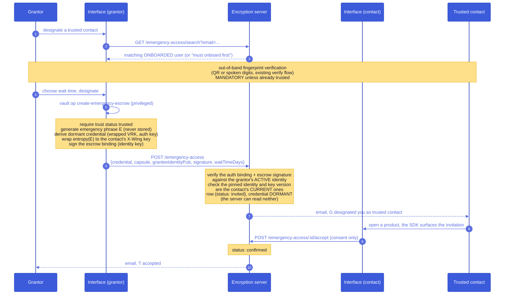
```mermaid
%%{init: {'theme':'base','themeVariables':{'actorBkg':'#3b5bdb','actorTextColor':'#fff','actorBorder':'#2942b8','signalColor':'#5b6ee0','signalTextColor':'#5b6ee0','noteBkgColor':'#ffe08a','noteTextColor':'#1a1a2e','noteBorderColor':'#e0a800','sequenceNumberColor':'#fff'}}}%%
sequenceDiagram
  autonumber
  participant G as Grantor
  participant UIg as Interface (grantor)
  participant API as Encryption server
  participant UIt as Interface (contact)
  participant T as Trusted contact
  G->>UIg: designate a trusted contact
  UIg->>API: GET /emergency-access/search?email=...
  API-->>UIg: matching ONBOARDED user (or "must onboard first")
  Note over G,T: out-of-band fingerprint verification<br/>(QR or spoken digits, existing verify flow)<br/>MANDATORY unless already trusted
  G->>UIg: choose wait time, designate
  UIg->>UIg: vault op create-emergency-escrow (privileged)
  Note over UIg: require trust status trusted<br/>generate emergency phrase E (never stored)<br/>derive dormant credential (wrapped VRK, auth key)<br/>wrap entropy(E) to the contact's X-Wing key<br/>sign the escrow binding (identity key)
  UIg->>API: POST /emergency-access<br/>{credential, capsule, granteeIdentityPub, signature, waitTimeDays}
  Note over API: verify the auth binding + escrow signature<br/>against the grantor's ACTIVE identity<br/>check the pinned identity and key version<br/>are the contact's CURRENT ones<br/>row {status: invited}, credential DORMANT<br/>(the server can read neither)
  API-->>T: email, G designated you as trusted contact
  T->>UIt: open a product, the SDK surfaces the invitation
  UIt->>API: POST /emergency-access/:id/accept (consent only)
  Note over API: status: confirmed
  API-->>G: email, T accepted
```

**Requesting access, refusal or grant, recovery.**

```mermaid
%%{init: {'theme':'base','themeVariables':{'actorBkg':'#3b5bdb','actorTextColor':'#fff','actorBorder':'#2942b8','signalColor':'#5b6ee0','signalTextColor':'#5b6ee0','noteBkgColor':'#ffe08a','noteTextColor':'#1a1a2e','noteBorderColor':'#e0a800','sequenceNumberColor':'#fff'}}}%%
sequenceDiagram
  autonumber
  participant T as Trusted contact
  participant UIt as Interface (contact)
  participant API as Encryption server
  participant UIg as Interface (grantor)
  participant G as Grantor
  T->>UIt: request emergency access (confirmation modal)
  Note over UIt: the request carries the per-request proof<br/>signed with T's IDENTITY key (vault open, 6.4)
  UIt->>API: POST /emergency-access/:id/initiate
  Note over API: verify against T's registered identity<br/>email the grantor FIRST (load-bearing:<br/>a failed send fails the call)<br/>status: recovery_requested
  API-->>G: email, T requested access,<br/>you have N days to refuse
  alt grantor refuses (JWT only, no vault needed, from the email link or the product modal)
    G->>API: POST /emergency-access/:id/reject
    Note over API: back to confirmed, credential re-dormant, escrow kept
    API-->>T: email, request refused
  else grantor says nothing
    Note over API: reminder emails to the grantor: monthly,<br/>then weekly (last 30 days), then daily (last 7)<br/>auto-approve after waitTimeDays<br/>(deadline also re-checked lazily at release)
    Note over API: status: recovery_approved
    API-->>T: email, access granted
    API-->>G: email, access was granted to T
    T->>UIt: reveal the emergency phrase (identity-signed request)
    API-->>UIt: {capsule, escrow record, grantor lang}
    Note over UIt: vault op (privileged), all client-side:<br/>verify the escrow signature against the<br/>PINNED grantor identity (fail-closed)<br/>unwrap the entropy with own private key<br/>render the 24-word phrase, print the kit<br/>repeatable while approved, nothing persisted
    T->>G: hand over the kit (in person)
    G->>UIg: normal cold unlock with E<br/>(the server accepts the now-live credential)
    Note over UIg: forced immediately, before anything else:<br/>set a NEW personal phrase (7.6 flow)
    UIg->>API: atomic write: new primary credential<br/>+ burn the used emergency credential<br/>+ re-arm ALL approved escrows (fresh E', capsule')
    Note over API: status back to confirmed<br/>emails both parties
  end
```

<a id="s9-5"></a>

### 9.5 Recovery, then burn + re-arm

While recovery is granted, the server releases to the contact exactly one thing: the capsule, together with the signed escrow record and the grantor's wordlist `lang`. Never items, never keys. The contact's vault verifies the escrow signature against the grantor identity pinned in the contact's own TOFU registry (fail-closed: if the grantor was never verified out-of-band, this is the moment it is enforced), unwraps the entropy with the contact's own key history (newest first, since the history is grow-only), renders the 24-word phrase, and the interface displays it as a printable recovery kit for the handover. The reveal is **repeatable while granted**: a one-time display over a wait of up to 90 days would lose phrases, the grantor may legitimately take weeks to come back, and the phrase is going to be burned anyway. Nothing about the grantor's vault is downloaded, decrypted, or persisted on the contact's side.

The grantor then performs a completely ordinary cold unlock ([7.2](#s7-2)) with the handed-over phrase on their own OIDC session: the proof simply matches the now-live emergency credential, and the response's `credential_type` flags it. Because the contact has seen this phrase, it is **burned by design**: the interface forces a phrase change before anything else, and that keyring write ([7.6](#s7-6)) atomically, in one Serializable transaction:

- replaces the primary credential (new personal phrase, new kit),
- deletes the used emergency credential and its capsule (the phrase the contact knows is now dead),
- **re-arms** every relationship that was granted on this vault with a fresh emergency phrase, credential, and capsule (cheap: the vault is open and the contacts are still trusted), returning each to `confirmed`,
- and emails both parties once committed.

The server enforces an **exact cover**: the write must carry one re-arm per granted relationship of this vault and nothing extraneous (each re-arm re-verified like a designation), and it is rejected otherwise. A partial rotation could not leave a revealed phrase alive, nor silently strip the user of their recovery contacts. Until the forced change completes, the relationship stays visibly granted and the reminder emails keep nudging the grantor.

<a id="s9-6"></a>

### 9.6 Lifecycle

- **Grantor starts over ([§7.8](#s7-8)): escrows deliberately survive the reset.** They are bound to the (now dormant) vault they were created for and remain exercisable against it: recovering through one lands on the dormant vault and runs the existing reactivation semantics of [7.2](#s7-2). Rationale: an attacker holding only a stolen OIDC session must not be able to erase the user's recovery routes by resetting the vault; with survival, the worst a JWT thief achieves is denial-by-noise, never permanent lockout. The mirror risk (an old trusted contact can resurrect a vault the user deliberately abandoned) is accepted, bounded by the wait, the notifications, and the contacts being verified people, and it is stated plainly in the user documentation. Escrows die only when the vault content is truly purged at retention expiry (once the purge job of [7.8](#s7-8) exists): purging the vault deletes its credentials (cascade), which deletes the escrow rows (cascade). A new vault starts with zero contacts, and its empty TOFU registry forces re-verification by construction.
- **The contact resets to a new identity** (lost their own vault): the capsule targets private keys that no longer exist anywhere. The grantor's escrow audit detects that the pinned identity is no longer the contact's active one and is not continuity-linked to it, and flags `stale-identity`; renewal is revoke + designate again, which re-runs the mandatory verification.
- **The contact legitimately rotated their identity** (continuity chain): the audit walks the chain exactly as the trust check does ([5.4](#s5-4)) and carries the escrow forward; nothing to do.
- **The contact rotated their encryption key**: nothing breaks (the old private key is still in the contact's grow-only vault), but the recorded `granteeKeyVersion` lags the directory, so the audit flags `outdated-key` and the settings screen offers a **one-click re-arm** (fresh phrase, credential, and capsule replacing the old ones in place, status unchanged).
- **Two contacts recover concurrently**: each relationship has its own independent credential for the same VRK, so two live credentials can coexist; the forced rotation burns and re-arms **every** granted row at once, so no revealed phrase survives it.
- **Phrase revealed but never handed over**: the credential stays live and visible ("access granted"), reminders continue, and the grantor can reject (re-dormant, killing the revealed phrase) or delete at any time from any logged-in session.
- **Designation never accepted**: the row stays `invited`, visible to both sides, revocable by the grantor, and the job runner purges it after 90 days.

<a id="s9-7"></a>

### 9.7 How the emergency routes authenticate

The routes reuse the transport-auth tiers of [§6.4](#s6-4), mapped by one rule: anything that can release or create key material is signed by the identity key of an open vault, anything that only ever denies is reachable by a bare login.

| Tier ([§6.4](#s6-4))         | Emergency routes                                                                            | Why                                                                                                                                                                                                         |
| ---------------------------- | ------------------------------------------------------------------------------------------- | ----------------------------------------------------------------------------------------------------------------------------------------------------------------------------------------------------------- |
| **JWT + identity signature** | designate (`POST`), wait-time change (`PUT`), `rearm`, `initiate`, `recover`                | all performed with an open vault by construction (grantor building an escrow, contact triggering or exercising a recovery), so a stolen OIDC session alone can neither start a recovery nor fetch a capsule |
| **JWT only** (fail-safe)     | `accept`, `cancel`, `reject`, `delete`, the `trusted`/`granted` lists, the contact `search` | a grantor who lost every device must still be able to refuse from a bare login; none of these can release key material or shorten a wait (the worst a stolen session does is deny)                          |
| **Identity signature only**  | `GET /emergency-access/pending`                                                             | fetched by the vault over the silent data plane, so the SDK can auto-surface the pending prompts (a recovery request to refuse, an invitation to accept) on any product page, with no interface and no JWT  |

The designation, re-arm, and burn + re-arm writes run in Serializable transactions (initiate uses a status-guarded update, so concurrent triggers resolve to exactly one running request), and the routes are rate-limited following the repo pattern (10 designations per 24 h per grantor, counted on durable rows; 5 initiates per 24 h per contact and 20 searches per hour, damped per instance). The `search` endpoint necessarily reveals whether an email has an onboarded account; that is accepted inside a collaborative suite (the directory already resolves colleagues), bounded by authentication, exact match only, and the rate limit. An address matching several onboarded users resolves to "nobody designatable" rather than guessing between two humans.

---

<a id="s10"></a>

## 10. Why the vault is modelled on password managers

Under the hood, this service and a password manager solve the **same problem**: an **encrypted vault only the user can read, synced across their devices, unlocked by a user secret, with the server never trusted with the contents**. Ours happens to store **encryption keys** (the current one _and_ the rotated history) plus a **contact TOFU registry**, rather than logins and notes; but the mechanics are identical (encrypt on the device, store only ciphertext, sync it per-item, recover it from a secret). So instead of inventing a sync-and-recovery scheme from scratch, we borrowed the parts of mature, audited managers that fit our case and deliberately dropped the parts that don't.

**What we borrowed, and from whom:**

- **From Bitwarden: the synchronization model.** A cheap "has anything changed?" check (a revision number), a full pull when it has, and per-item last-write-wins for conflicts. It is simple, well-documented, and independently audited, so a reviewer can map our sync onto a known baseline and only scrutinise where we differ.
- **From 1Password: the high-entropy unlock secret.** 1Password pairs the memorised password with a generated 128-bit "Secret Key" precisely so that a stolen vault can't be guessed offline. We take that idea and go one step further: because the user is **already logged in via the LaSuite's normal sign-in (OIDC)**, our unlock secret is **entirely generated** (the recovery phrase) with no memorised password at all: one strong secret instead of two.

**What we deliberately did _not_ copy:**

- **We don't send a password to log in.** Bitwarden sends a hash of the master password; 1Password uses a zero-knowledge password login (a scheme called SRP). We need neither: LaSuite already authenticates the user, and our secret is randomly generated, so there is nothing password-shaped to protect. We do add a small proof that the caller actually holds the phrase before the server hands back the encrypted vault, but that's a belt-and-suspenders check, not the thing that keeps the data secret: the secret's sheer randomness is what does that.
- **We don't trust the server for integrity.** A plain synced vault trusts the server not to tamper with the stored ciphertext. We instead **sign** the vault with the user's identity key and verify that signature against a key we trust locally plus the independent public registry, so tampering is caught even if the server itself is compromised.

The table is for orientation, not a scorecard: it just shows where our choices land next to two well-known systems:

| Dimension                  | Bitwarden                                 | 1Password                                   | **Our solution**                                                                              |
| -------------------------- | ----------------------------------------- | ------------------------------------------- | --------------------------------------------------------------------------------------------- |
| Unlock secret              | Memorised master password                 | Password **+** generated 128-bit Secret Key | **Generated recovery phrase only** (nothing to memorise)                                      |
| Logging in                 | Password hash sent to server              | Zero-knowledge password login (SRP)         | **LaSuite sign-in (OIDC)** + a small "you hold the phrase" proof before the vault is released |
| Server's view of the vault | Ciphertext (trusted not to tamper)        | Ciphertext (trusted not to tamper)          | **Signed** ciphertext, re-verified against a local key + public registry                      |
| Sync & conflicts           | Per-item, poll-then-pull, last-write-wins | Per-item                                    | **Same as Bitwarden**                                                                         |
| What the vault stores      | Logins, notes                             | Logins, notes                               | **Encryption keys (current + rotated history) + a contact TOFU registry**                     |

---

## Operational details

The sections below describe behaviour that matters for running and maintaining the service but does not change the security model above.

<a id="s11"></a>

## 11. Conflict prevention and resolution

The strategy is **prevention by data shape**: most of the vault cannot represent a conflict, so what is left to resolve is small and deterministic.

- **Encryption keys and identities are immutable and monotonic.** Two devices can only ever _add_ a new version or generation; merging is a **set union keyed by version/generation**: no conflict is representable. If two devices mint the same next `version`, the server's uniqueness constraint rejects the second, which re-pulls and picks `max+1`, the same optimistic-concurrency retry as any write.
- **trust entries are the only mutable items**, so the only place a genuine conflict can occur (device A trusts a contact, device B refuses the same contact). Resolution rules: a **fail-safe** refinement of Bitwarden's pure last-write-wins:
  1. Default: **last-write-wins by `revisionDate`**.
  2. **`refused` wins ties** and never loses to a same-or-older `trusted`.
  3. A **downgrade to `unknown`** (a fingerprint mismatch was detected) always wins, never silently re-trust a key another device flagged.
- **Deletion** of a trust entry uses a **tombstone** (a `deleted` marker carrying a `revisionDate`), not a user-facing trash. The tombstone participates in the same LWW so a stale device cannot resurrect a forgotten contact. We do **not** implement Bitwarden's soft-delete / Trash: that is a product feature we do not need; a tombstone is the minimum required for merge correctness.

Because the merge is **deterministic, commutative, and idempotent**, every device converges to the same state regardless of ordering, and the "re-pull, merge, retry" loop after a 409 is always safe to repeat.

Where we diverge from Bitwarden, stated plainly: Bitwarden's server can read each item's `revisionDate` and adjudicate last-write-wins itself, and its clients never merge. Our server is fully blind, so per-item concurrency is still enforced server-side on the opaque `revisionDate` column, but the **merge on a 409 happens on the client**. We accept this because the only mergeable data is the tiny, deterministic trust map; keys never merge.

---

<a id="s12"></a>

## 12. Failure handling

**Push failure.** Mutations are **write-through and synchronous**: a change is not considered committed until the server confirms it. The choke point computes the new state, pushes it (with the 409 pull-merge-retry loop, all within the one operation), and only then commits to `VaultState` and the local cache; if the push ultimately fails, it raises a **direct, blocking error** and leaves the prior state intact, nothing is silently applied locally and lost. There is deliberately **no cross-session offline write-queue** (a change that could not be saved is simply reported as failed, and the user retries), which keeps the model simple and matches Bitwarden's baseline. The 409 merge-retry loop is not buffering, it resolves a concurrent server-side change inline before the same operation completes.

**Sync triggers (and why SSE is only an optimization).** Background sync runs IN THE VAULT (`src/vault/vault-sync-driver.ts`), authenticated by the identity signature, with no interface and no JWT ([§6.4](#s6-4), tier 1). It pulls on four occasions: on **start** (a product page opening / the vault loading), on **`visibilitychange`** when the page becomes visible again, on every **(re)connection** of the server-push channel, and on each **server-push wake**. The server-push is an **SSE** stream (`GET /api/vault/events`): a content-free "your vault changed" signal, never any vault data, after which the woken device performs the normal authenticated pull. It carries no security risk (it reveals nothing the server does not already hold, since it _is_ the server).

Crucially, **SSE is a latency optimization, not the correctness mechanism**, and the design does not pretend otherwise. A wake can be **missed**: the notifier is an in-memory, per-process registry, so in a **multi-instance** deployment a write handled on one instance does not wake a device connected to another (fix with a shared bus (Postgres `LISTEN/NOTIFY` or Redis pub/sub) or sticky-by-user routing at the gateway); an instance **restart** or a dropped connection also loses in-flight wakes. Convergence therefore does **not** depend on the wake arriving: it depends on the **pull on visibility / open / reconnect**, which fires exactly when it matters: a user is essentially never watching two devices at once expecting instant propagation; the real case is _switching_ to the other device, and that switch makes its page visible, which pulls. This is the same shape Bitwarden uses (SignalR/WebPush for latency, a full authenticated pull as the ground truth).

**Multi-write operations.** Any operation that touches more than one server-side record at once, onboarding (registry + vault + keyring, diagram [7.1](#s7-1)) and, once its flow exists, encryption-key rotation (registry + a new vault item + the manifest), is committed in a **single database transaction** so it is all-or-nothing. This is possible because the registry and the vault share one server and one database. Combined with idempotent writes, a failure or a retry can never leave the server in a half-registered state (for example public keys published without a recoverable backup). This is the same atomic-commit pattern Bitwarden uses for key rotation.

**Integrity failure.** See [Section 6.3](#s6-3) and diagram [7.7](#s7-7), refuse, warn, offer a trusted rebuild path.

**Directory cache staleness.** A product backend that verifies a user's signatures caches their public key using the directory's `ETag` and a short `max-age` (about a minute). For a short window after a key rotation or a reset, that cache can be stale, so a signature made with the new key may be briefly rejected, or a document briefly wrapped for the superseded key. The window is bounded by `max-age` and self-heals on the next revalidation, since the `ETag` changes on rotation and forces a re-fetch. It rarely bites in practice: a user who has just rotated does not immediately return to the product, and by the time they act the caches have revalidated. A backend needing tighter freshness lowers `max-age` or subscribes to the same revision-changed push used for vault sync.

---

<a id="appendix-a"></a>

## Appendix A: Migrating the OIDC provider (subs change)

A deployment can replace its identity provider mid-life. The new provider mints new `sub` values for the same humans, and nothing in this service breaks cryptographically when that happens: internal ids, signatures, vaults, and trust records never reference a sub ([Section 2.3](#s2-3)). What the migration DOES affect is how logins and directory lookups reconnect to existing accounts.

**Account email.** `users.email` is the one piece of personal data attached to the account, and it is **required at first contact**: minting an account needs an address, because it is the only notification channel (security alerts, emergency access) and the only automatic continuity anchor across a provider migration. The address is read from the access-token claims, and when they carry none (some providers, only serve email from the userinfo endpoint) the server falls back to calling the issuer's userinfo endpoint with the presented access token (signed `application/jwt` responses are verified against the issuer JWKS); only if both yield nothing is the login rejected (`email_claim_required`). A **known** credential authenticates without any email at all: the requirement exists to seed the account, not to gate every request. Only provider-verified addresses qualify unless the deployment sets `OIDC_ACCEPT_UNVERIFIED_EMAIL`. The column is deliberately not unique: one address can legitimately end up on two accounts over time (a recycled corporate address, a homonym hired years later gets the released address while the departed user's account remains). The email fallback accounts for that: it links a new credential only when the address matches exactly one user AND that user was seen within the last year; a dormant match is treated as a probably-recycled address and gets a fresh account instead, leaving any merge to a deliberate operator action.

**The model is a hard cutover, not coexistence.** Exactly one issuer is configured (`OIDC_ISSUER`); switching provider is a configuration change, after which tokens from the old provider are rejected wholesale. Two providers are never accepted simultaneously.

**How each user reconnects.** At a user's first post-cutover login, their token carries an unknown `(issuer, sub)` pair. It is re-attached to their existing account by, in order of preference: an operator-prepared mapping import (when the deployment can export old-sub to new-sub correspondences), or the verified-email fallback (`OIDC_FALLBACK_TO_EMAIL_FOR_IDENTIFICATION`), which links when the verified address matches exactly one user who was active within the last year. If neither applies, the login lands on a fresh empty account and the reconciliation gate surfaces the divergence instead of silently splitting the identity.

**The visible symptom during the window.** Directory resolution of subs is scoped to the active issuer, always: a retired-issuer row is never matched, because on a cross-issuer sub collision that could return another person's public key, and a key directory must fail closed rather than guess. Concretely: colleagues of a user who has not yet logged in since the cutover see them as having **no encryption keys** (sharing with them is blocked, visibly), until that user's first post-cutover login re-links their credential. Nothing is lost and nothing heals wrong, it is purely a "this person needs to sign in again" state.

**Runbook implications for operators.**

1. Prepare the sub mapping export from the old provider if it offers one, and import it at cutover; every mapped user then reconnects with zero symptoms.
2. Ensure `OIDC_FALLBACK_TO_EMAIL_FOR_IDENTIFICATION` is set consistently with LaSuite products, so a user who continues seamlessly in Docs also continues seamlessly here.
3. Communicate that everyone should sign in again shortly after the switch: each login (in the products AND here) is what refreshes stored subs and re-links credentials.
4. Old `oidc_accounts` rows are never deleted. They stop resolving and stop authenticating, but remain as the audit trail of which provider minted which credential, and as raw material for after-the-fact operator merges.

---

<a id="appendix-b"></a>

## Appendix B: Email notifications

Transactional email exists in this service almost entirely for **emergency access** ([Section 9](#s9)): the recovery wait period is the grantor's only window to refuse, so a designation, a recovery request, a reminder, or a completion has to reach the grantor out of band. There is no marketing or general-purpose mail, and the rest of the product notifies in-app.

**Rendering.** Emails are built at send time from developer-authored React components (`src/server/email/templates/`) through `@faire/mjml-react` and `mjml`. No user-controlled template is ever compiled: user data (email addresses, day counts, timestamps) enters only as React props, which React escapes when rendering to markup. The output is static HTML plus a plaintext alternative derived from that final HTML with `html-to-text`; no script survives into the message, and links are limited to the instance-configured product URL (no tokens, no deep routes).

**Supply chain.** The MJML toolchain (`mjml`, `@faire/mjml-react`, `html-to-text`, `nodemailer`) is the main added exposure, as with any npm dependency. It is mitigated the same way as the rest of the tree: every version is pinned exactly (no `^`/`~`), so an upgrade is always an explicit, reviewable diff.

**Delivery reliability.** The mailer supports a primary and an optional fallback SMTP transport and retries once before failing loudly, because the emergency-access design depends on the notification actually arriving: a silently lost email would weaken the opposition window. With no SMTP host configured, emails are still rendered (so template errors surface) but only logged, which is the development fallback.

---

<a id="appendix-c"></a>

## Appendix C: Product backend request authorization (explored, not adopted)

> **Status: explored, not adopted.** This records a design that was discussed and set aside: it adds little security on top of OIDC authentication and the product's own access control, which already bound what a stolen session can do to encrypted content (it can never read it). Nothing in the products or the directory implements it. It is kept here so the reasoning is not lost.

A product backend could verify that a request acting on an encrypted document really comes from the user the document was shared with. It records, per share, the recipient's encryption-key **version** (an integer). To authorize a later request, it fetches from the registry the identity that this version is bound to and checks the request's signature against it. A legitimately rotated identity is accepted through the **continuity chain** (a successor identity carries a `continuitySignature` by its predecessor); a fresh, unlinked identity is not.

This check is **defense in depth on top of OIDC**. OIDC already authenticates the request as the user. The identity signature adds a cryptographic assurance that survives a **stolen access token**: a stolen token alone cannot produce the identity signature, and cannot register a continuity-linked successor (that needs the previous identity's private key, which never leaves the client), so it cannot silently act on the user's existing documents and can never read them.

**Trust boundary, stated plainly.** The backend **trusts the registry** for this lookup. It does not keep its own first-seen TOFU registry per user, so a registry that is itself compromised could return a substituted identity and the backend would accept it. That is a deliberate limit: defending a product backend against a fully compromised registry _and_ a stolen token at once is out of scope, and cryptography cannot bootstrap trust from nothing. What still holds under a compromised registry is narrow but real: private keys never touch the server, so no registry compromise can **decrypt** content. At worst it enables impersonation or reshuffled shares over data that stays unreadable. The residual trust roots are therefore explicit and small: **OIDC for authentication, and the registry for the identity lookup**, with the continuity chain and the out-of-band fingerprint the tools that reduce, not eliminate, that registry trust.

```mermaid
%%{init: {'theme':'base','themeVariables':{'actorBkg':'#3b5bdb','actorTextColor':'#fff','actorBorder':'#2942b8','signalColor':'#5b6ee0','signalTextColor':'#5b6ee0','noteBkgColor':'#ffe08a','noteTextColor':'#1a1a2e','noteBorderColor':'#e0a800','sequenceNumberColor':'#fff'}}}%%
sequenceDiagram
  autonumber
  participant U as User (client)
  participant P as Product backend
  participant REG as Registry
  Note over P: recorded at share time, doc D wrapped for the user's enc-key v40
  U->>P: request on D, signed by the current identity
  P->>REG: fetch the identity bound to (user, enc-key v40)
  REG-->>P: identity I + binding signature (plus continuity links if rotated)
  Note over P: verify binding (v40 belongs to I)<br/>verify the request signature chains from I<br/>(I itself, or a continuity-signed successor)
  alt signature chains from the pinned identity
    Note over P: authorize the operation
  else fresh or unlinked identity, e.g. a stolen-token reset
    Note over P: reject as abnormal, cannot act on D
  end
```

---

<a id="appendix-d"></a>

## Appendix D: Auditing and monitoring

> **Status: planned.** None of this exists yet: the server logs errors, but no security event is recorded or alerted on today.

The cryptography detects most server-side tampering only at the moment a user's device or a contact's check runs into it (a manifest that does not verify, a fingerprint that changed). Auditing adds two things: evidence after the fact, and detection that does not wait for a contact to share.

- **A transparency log of directory writes.** Every publication, disablement or reactivation of an identity or encryption key is appended to a Merkle tree, as in Certificate Transparency or the key transparency of messaging services. The log is kept **outside the encryption server's infrastructure**, and its signed tree head is published where third parties can see it, so a server that rewrites history, or shows different keys to different people, is caught, not only a server that forgets to log. Each user's devices can also check their own entries (self-monitoring), which detects a substituted key even if no contact ever verifies a fingerprint. The directory ledger is already permanent ([7.8](#s7-8)); this makes its history verifiable by others.
- **An email to the user for each new identity or encryption key on their account**, like a "new sign-in" notice. It is cheap, uses the existing mail delivery ([Appendix B](#appendix-b)), and lets the user notice a server-side substitution that today only their contacts' fingerprint checks would catch.
- **Security events an operator can alert on**: identity or key registration, disable and reactivate, recovery-phrase change, device approval, emergency designation, initiation and recovery, de-enroll and purge, and repeated failures of the proofs of possession or of request signatures. Logged with user ids and timestamps only, never key material, following the same allowlist rule as error reporting.
