# Encryption Service: Architecture

This document describes how the encryption service protects the documents of LaSuite products (Docs, Drive): what it protects and from whom, which keys exist, and how each flow works.

How to read it:

- **[Section 1](#s1)** is a self-contained summary: purpose, assets, attackers, trust roots, assumptions, security level.
- **Sections 2 to 4** give the components, the threat model, and every key with its algorithm.
- **Sections 5 to 9** detail each mechanism (document sharing, the synchronized vault and its flows including recovery, emergency access, and the design's origins).
- **Sections 10 and 11 and the appendices** cover operational behaviour (sync conflicts, failures, identity-provider migration, emails) that does not change the security model.

Terms are defined at first use and in the glossary just below. A passage marked **Status** says what is not in use yet: **planned** for agreed design not implemented, **supported by the core, not used yet** for mechanisms the code handles but no flow triggers; everything else describes the code as it is.

## Contents

- [Glossary](#glossary)
- [1. Summary](#s1)
  - [1.1 What the service does](#s1-1)
  - [1.2 What it protects, and against whom](#s1-2)
  - [1.3 What the security relies on](#s1-3)
  - [1.4 Assumptions](#s1-4)
  - [1.5 Security level](#s1-5)
- [2. Components and trust boundaries](#s2)
  - [2.1 How users are authenticated](#s2-1)
  - [2.2 Who may decrypt a document](#s2-2)
  - [2.3 Internal user id: identity outlives the OIDC provider](#s2-3)
- [3. Threat model](#s3)
  - [3.1 A compromised encryption server cannot read shared documents](#s3-1)
  - [3.2 Keying trust on the internal id instead of the sub barely changes this](#s3-2)
  - [3.3 A compromised product is out of scope, by construction](#s3-3)
  - [3.4 The vault frontend is the trusted computing base](#s3-4)
- [4. Keys](#s4)
  - [4.1 Key map](#s4-1)
  - [4.2 Key inventory](#s4-2)
  - [4.3 Derivations](#s4-3)
  - [4.4 Rotation, and several ways into one vault](#s4-4)
  - [4.5 Comparison with ANSSI's cryptographic rules](#s4-5)
- [5. Document sharing](#s5)
  - [5.1 Encrypt a document](#s5-1)
  - [5.2 Share: Alice grants Bob access](#s5-2)
  - [5.3 Read: Bob opens the document](#s5-3)
  - [5.4 Contact trust and identity continuity](#s5-4)
  - [5.5 Key registration: dual-key proof of possession](#s5-5)
- [6. The synchronized vault](#s6)
  - [6.1 What syncs](#s6-1)
  - [6.2 Local storage and caching](#s6-2)
  - [6.3 Integrity model](#s6-3)
  - [6.4 How each server request is authorized](#s6-4)
- [7. Vault flows](#s7)
  - [7.1 Onboarding: vault creation](#s7-1)
  - [7.2 Cold unlock on a new device (recovery phrase)](#s7-2)
  - [7.3 Warm sync on an enrolled device](#s7-3)
  - [7.4 Mutate the vault (with conflict handling)](#s7-4)
  - [7.5 Add a device via approval (QR): the primary path](#s7-5)
  - [7.6 Change the recovery phrase](#s7-6)
  - [7.7 Integrity failure handling](#s7-7)
  - [7.8 Lost access: disable, reactivate, or reset](#s7-8)
  - [7.9 Reconciliation: when this device and the server disagree](#s7-9)
- [8. Emergency access (trusted contacts)](#s8)
  - [8.1 The escrow: a dormant emergency passphrase, a second credential of the same vault](#s8-1)
  - [8.2 State machine](#s8-2)
  - [8.3 The wait period: lazy arithmetic is the authority, the hourly job is for humans](#s8-3)
  - [8.4 Flows](#s8-4)
  - [8.5 Recovery, then burn + re-arm](#s8-5)
  - [8.6 Lifecycle](#s8-6)
  - [8.7 How the emergency routes authenticate](#s8-7)
- [9. Why the vault is modelled on password managers](#s9)
- [Operational details](#operational-details)
- [10. Conflict prevention and resolution](#s10)
- [11. Failure handling](#s11)
- [Appendix A: Migrating the OIDC provider (subs change)](#appendix-a)
- [Appendix B: Email notifications](#appendix-b)
- [Appendix C: Product backend request authorization (explored, not adopted)](#appendix-c)
- [Appendix D: Auditing and monitoring](#appendix-d)

---

<a id="glossary"></a>

## Glossary

- **Alice and Bob**: in diagrams, Alice shares a document, Bob receives access.
- **Binding signature**: the identity key's signature over a user's encryption public key and its metadata (version, creation date, user id), published in the directory. It proves the encryption key was chosen by the holder of the identity key ([5.5](#s5-5)).
- **Credential**: one way into a vault (the owner's recovery phrase, or an emergency phrase), stored as a wrapped VRK plus an auth public key ([4.4](#s4-4)).
- **Device key**: a key created on each enrolled device that protects the cached vault root key at rest; it authenticates nothing ([4.2](#s4-2), [6.4](#s6-4)).
- **Document key (DEK)**: the random key that encrypts one document ([4.2](#s4-2)).
- **Encryption key pair**: the user's key pair to which document keys are wrapped. Versioned; every version is kept for decryption ([4.2](#s4-2)).
- **Encryption server**: the central server. It hosts the public-key directory and the encrypted vaults, and serves both iframes.
- **Fingerprint**: a short digest of a public key, shown as 40 digits, that two people compare over another channel (QR code, digits read aloud) to make sure no server substituted the key ([4.2](#s4-2)).
- **Identity key pair**: the user's signature key pair; the stable identity whose fingerprint contacts verify. It signs the binding, the vault manifest and request proofs ([4.2](#s4-2)).
- **Interface iframe** (`encryption.*`): the visible frame for onboarding, settings, recovery and contact verification, shown over the product page on demand.
- **KEK / VRK**: the key-encryption key derived from the recovery phrase, which wraps the random vault root key that actually encrypts the vault items ([4.3](#s4-3)).
- **Manifest**: the signed list of a vault's items with their hashes and a monotonic revision, which lets a device detect any item added, removed, swapped or rolled back by the server ([6.3](#s6-3)).
- **OIDC, JWT, `sub`**: the standard login protocol the products and this service share (OpenID Connect), the signed access token it issues (JWT), and the user identifier inside that token (`sub`), which the service maps to its own internal id ([2.3](#s2-3)).
- **Opaque**: stored as ciphertext the server cannot read. An "opaque item" is one encrypted vault record.
- **Product app / product backend**: the software the user sees (Docs, Drive), on its own domain, and its server, which stores the encrypted documents and the access list with the wrapped document keys.
- **Proof of possession**: a challenge only the holder of a private key (or of the recovery phrase) can answer, required before the server registers a key or releases a vault ([5.5](#s5-5), [7.2](#s7-2)).
- **Public-key directory** (also "registry"): the **public** list holding, per user, the encryption public key, the identity public key, the binding signature and a version. Being public, it needs integrity (the binding signature), not confidentiality.
- **Recovery phrase (`R`)**: a machine-generated 24-word phrase, the user's only long-term secret. Shown once at onboarding as the Recovery Kit, never stored by the service ([4.2](#s4-2)).
- **TOFU registry** (trust on first use): each user's record of their contacts' identity fingerprints, with a status for each: **unknown** (seen, not verified), **trusted** or **refused** (the last two only by an explicit user decision). Any later change of a recorded fingerprint blocks sharing. Statuses and fingerprints are encrypted in the vault; which contacts have an entry is visible to the server ([1.2](#s1-2), [5.4](#s5-4)).
- **Trusted computing base (TCB)**: the code that must be correct for every other guarantee to hold. Nothing protects against a bug or a backdoor inside it, so it is kept as small and as tamper-evident as possible. Here it is the vault's served code ([3.4](#s3-4)).
- **Vault**: either the **vault iframe** (`data.encryption.*`, the invisible frame that holds the private keys and performs all cryptography, reached only through `postMessage`) or the **synchronized vault** (the per-user encrypted container on the server that the vault iframes download and update). See [Section 2](#s2).
- **Vault item**: one record in the synchronized vault (one encryption key version, the identity key, or one trust entry), stored as one ciphertext.
- **VaultState**: the in-memory, decrypted form of all items on a device.
- **Wrap / unwrap a key**: encrypt a key to a recipient's public key, so only the matching private key can recover it.
- **X-Wing**: the key-encapsulation mechanism used to wrap keys, combining a classical and a post-quantum algorithm so that breaking it requires breaking both ([1.5](#s1-5), [4.2](#s4-2)).

---

<a id="s1"></a>

## 1. Summary

<a id="s1-1"></a>

### 1.1 What the service does

LaSuite products let users create and share documents. For the documents a user chooses to encrypt, the service makes the content readable only by the people it is shared with, and not by the servers that store it: neither the product's servers nor the encryption service itself.

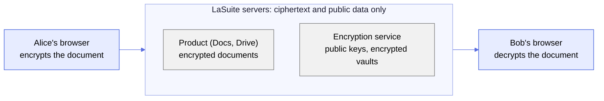
```mermaid
%%{init: {'theme':'base','look':'classic','themeVariables':{'lineColor':'#5b6ee0','clusterBkg':'#f5f7ff','clusterBorder':'#9aa7e8','titleColor':'#1a1a2e'}}}%%
flowchart LR
  A["Alice's browser<br/>encrypts the document"]
  subgraph SRV["LaSuite servers: ciphertext and public data only"]
    P["Product (Docs, Drive)<br/>encrypted documents"]
    E["Encryption service<br/>public keys, encrypted vaults"]
  end
  B["Bob's browser<br/>decrypts the document"]
  A --> SRV --> B
  classDef user fill:#e7ecff,stroke:#3b5bdb,color:#000;
  classDef srv fill:#f1f1f1,stroke:#777,color:#000;
  class A,B user;
  class P,E srv;
```

This overview leaves out how each browser talks to the servers; [Section 2](#s2) shows every component.

It does this with end-to-end encryption performed in the user's browser:

- **Each document is encrypted with its own random key** (the document key). That key is then encrypted ("wrapped") separately for each person who has access, with that person's public key. The product stores the encrypted document and the wrapped keys, exactly where it stores a normal document and its access list.
- **Each user has two key pairs**: an encryption key pair, which receives wrapped document keys, and an identity key pair, which signs and is what contacts verify. The public halves are published in a directory; the private halves never leave the user's browsers unencrypted.
- **Private keys live in an isolated, invisible browser frame (the vault iframe)** served from a dedicated domain. Products never see them: they ask the vault to encrypt or decrypt through `postMessage`, the browser's message channel between frames.
- **Keys follow the user across devices** through an encrypted vault kept on the encryption server. It can be opened only with a 24-word recovery phrase the user prints when activating encryption, or through an approval from a device that already holds the keys.

<a id="s1-2"></a>

### 1.2 What it protects, and against whom

**Assets**, and what each needs. Each cell says whether a breach of that property would harm users; "no" means there is nothing to protect, usually because the data is public. Availability matters for keys: losing them means losing the documents they protect, which is why recovery takes so much of this document.

| Asset                                         | Confidentiality                                                                                        | Integrity | Authenticity                         | Availability                                 |
| --------------------------------------------- | ------------------------------------------------------------------------------------------------------ | --------- | ------------------------------------ | -------------------------------------------- |
| Document content                              | Yes                                                                                                    | Yes       | Not provided (the product's concern) | The product's concern                        |
| Document keys                                 | Yes                                                                                                    | Yes       | n/a                                  | Yes: lost keys mean lost documents           |
| Users' private keys (encryption and identity) | Yes                                                                                                    | Yes       | Yes                                  | Yes: same                                    |
| Recovery phrase, emergency phrases            | Yes                                                                                                    | Yes       | n/a                                  | Yes: the only way back without a device      |
| Public-key directory                          | No, public by design                                                                                   | Yes       | Yes                                  | Yes                                          |
| Trust decisions about contacts                | Yes for statuses and fingerprints; the list of contacts is visible to the server (accepted, see below) | Yes       | Yes                                  | Yes: losing them silently re-accepts any key |
| Vault and interface code                      | No, open source                                                                                        | Yes       | Yes                                  | Yes                                          |

Document authenticity (who wrote a given version) is not provided by the encryption layer: documents are encrypted, not signed, and authorship stays with the product.

**Attackers in scope**, in two families:

- **Remote**: a compromised or malicious encryption server or database (reads everything stored, modifies, replays old data, substitutes keys); a compromised product backend or database; a stolen login session; a trusted contact who abuses emergency access; a network attacker (TLS is assumed).
- **Local**, with physical access to a user's device, temporary or permanent, possibly the legitimate user of that device: limited to what the assumptions below leave open, i.e. a device that is switched off or locked, with disk encryption.

**Out of scope**: a device used while its session is unlocked; a compromised product frontend, which legitimately sees what its user decrypts; malicious code served as the vault itself, which is the trusted computing base. [Section 3](#s3) lists every threat with its defence.

**What this gives**:

- Neither server, acting alone, can read document content or private keys: the encryption server stores only ciphertext and public data, and the product stores only ciphertext and wrapped keys.
- Tampering with stored vault data or with the directory is detected through signatures, never silently accepted.
- A server that substitutes someone's public key is detected by contacts who already know that person's identity: any change of a recorded fingerprint blocks sharing. A contact who meets someone for the first time accepts the key they see, as in any end-to-end system, unless they verify it out-of-band.
- A stolen login session alone reaches neither keys nor content. Its worst outcome is a recoverable one: disabling encryption for that user, or refusing a recovery.

**Metadata the encryption server can see (accepted).** Encryption hides content and keys, not who interacts with whom. A hostile encryption server can learn:

- **each user's contacts**: trust entries are encrypted one by one, but stored under an id that names the contact (`tofu:<contact id>`), so the server sees who a user has shared with, though not the status or the fingerprint;
- **who looks up whom**: directory reads are not authenticated, but they come from the same browser that syncs the vault, at the moment of a share;
- **activity**: when a vault changes and how many items it holds (roughly the number of contacts and key versions);
- **which accounts exist**: the directory is public, and the trusted-contact search answers whether an email has an account.

This is accepted on purpose: the products already hold the same relationship graph in their access lists, so hiding it from the encryption server alone would not reduce what a compromise reveals.

<a id="s1-3"></a>

### 1.3 What the security relies on

- **The vault's served code**, the trusted computing base: kept on its own origin, protected by Subresource Integrity hashes, and confined by a strict Content Security Policy ([Section 3.4](#s3-4)).
- **The browser**: origin isolation between the product page and the vault iframe, its cryptographically secure random generator (`crypto.getRandomValues`), and WebCrypto's non-extractable keys. There is no TPM, HSM or secure element: keys are software keys in the browser.
- **libsodium** (compiled to WebAssembly) for all cryptography in the vault, except the device key, which uses WebCrypto ([4.5](#s4-5)).
- **The OIDC identity provider** of the deployment, for authentication (who is logged in). Logging in never unlocks keys by itself.
- **Users' out-of-band fingerprint checks**, against key substitution.
- **The product's own access control**, as an independent second gate: even with a wrong wrapped key, an attacker must also be allowed by the product to download it ([Section 3.1](#s3-1)).

<a id="s1-4"></a>

### 1.4 Assumptions

What the service expects from its environment and does not defend against itself:

- **Users lock their computer session** when they leave it. Anyone using an unlocked session can use the products, and therefore decrypt, as that user.
- **Devices have disk encryption.** The cached vault key is wrapped by a non-extractable device key, but the browser stores that key in the same profile: a copy of the IndexedDB file alone is useless, a copy of the whole browser profile from an unencrypted disk is not.
- **Browsers and operating systems are kept up to date**, and the browser's TLS implementation is correct.
- **Users keep their Recovery Kit safe**, like any other credential, and verify out-of-band the identity of the contacts whose access matters to them.
- **The operator is trusted for availability and durability** (database backups, uptime), never for confidentiality or integrity: the design assumes the operator's server and database may be hostile.
- **The OIDC identity provider authenticates users correctly.** It cannot unlock anything by itself, but a provider that logs an attacker in as a victim enables the stolen-session attacks of [Section 3](#s3).

<a id="s1-5"></a>

### 1.5 Security level

| Use                                     | Primitive                                                                                                | Classical security            | Post-quantum                                                                                                                                                                                                           |
| --------------------------------------- | -------------------------------------------------------------------------------------------------------- | ----------------------------- | ---------------------------------------------------------------------------------------------------------------------------------------------------------------------------------------------------------------------- |
| Document and vault content              | XChaCha20-Poly1305 (libsodium `crypto_aead_xchacha20poly1305_ietf`), 256-bit keys, 192-bit random nonces | 256-bit keys                  | Yes (symmetric, 256-bit keys)                                                                                                                                                                                          |
| Wrapping a key to a user (key exchange) | X-Wing hybrid KEM: X25519 + ML-KEM-768                                                                   | about 128 bits                | Yes, through ML-KEM-768 (NIST category 3)                                                                                                                                                                              |
| Identity and all signatures             | Ed25519                                                                                                  | about 128 bits                | **No.** A signature only has to resist forgery while it is being checked, unlike ciphertext that can be recorded now and broken later. A migration path to a post-quantum signature is reserved ([Section 5.4](#s5-4)) |
| Recovery phrase                         | 24 BIP-39 words (256 bits of entropy), stretched with Argon2id (3 passes, 64 MiB)                        | 256 bits                      | Yes                                                                                                                                                                                                                    |
| Cached key on each device               | AES-256-GCM, WebCrypto non-extractable key                                                               | 256 bits                      | Yes                                                                                                                                                                                                                    |
| Fingerprints compared between people    | SHA-256 truncated to 128 bits, shown as 40 decimal digits                                                | 128 bits against substitution | n/a                                                                                                                                                                                                                    |

In short, **confidentiality is designed to resist quantum computers, authenticity is not yet**: every path to a document key goes either through ML-KEM-768 or through 256-bit symmetric keys, so content recorded today stays protected against a future quantum computer as long as ML-KEM-768 holds. It is a recent standard that could still fall to new cryptanalysis; the hybrid construction is the safety net, since the content would then remain as protected as with X25519 alone, which is secure against classical attackers only. Signatures (identity, directory, vault integrity) are classical Ed25519.

---

<a id="s2"></a>

## 2. Components and trust boundaries

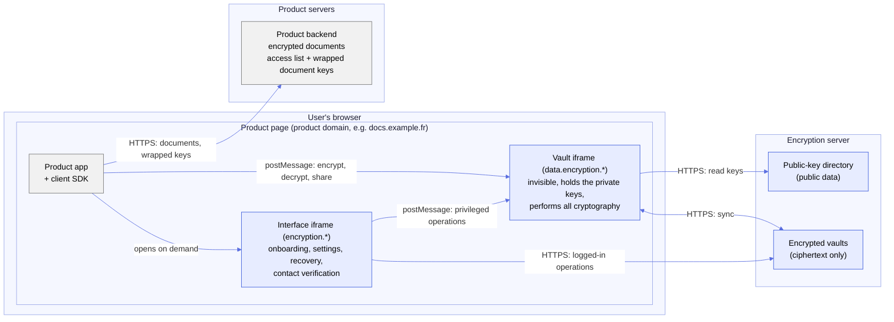
```mermaid
%%{init: {'theme':'base','look':'classic','themeVariables':{'lineColor':'#5b6ee0','edgeLabelBackground':'#ffffff','clusterBkg':'#f5f7ff','clusterBorder':'#9aa7e8','titleColor':'#1a1a2e'},'themeCSS':'.edgeLabel p{background-color:#ffffff;color:#444;font-style:italic;border:1px solid #b5b5b5;padding:2px 8px;border-radius:10px;margin:0;} .edgeLabel .labelBkg{background:transparent;}'}}%%
flowchart LR
  subgraph BROWSER["User's browser"]
    subgraph PAGE["Product page (product domain, e.g. docs.example.fr)"]
      PF["Product app<br/>+ client SDK"]
      VI["Vault iframe (data.encryption.*)<br/>invisible, holds the private keys,<br/>performs all cryptography"]
      UI["Interface iframe (encryption.*)<br/>onboarding, settings, recovery,<br/>contact verification"]
    end
  end
  subgraph PSRV["Product servers"]
    PB["Product backend<br/>encrypted documents<br/>access list + wrapped document keys"]
  end
  subgraph ESRV["Encryption server"]
    REG["Public-key directory<br/>(public data)"]
    EV["Encrypted vaults<br/>(ciphertext only)"]
  end
  PF -->|"postMessage: encrypt, decrypt, share"| VI
  PF -->|"opens on demand"| UI
  UI -->|"postMessage: privileged operations"| VI
  PF -->|"HTTPS: documents, wrapped keys"| PB
  VI -->|"HTTPS: read keys"| REG
  VI <-->|"HTTPS: sync"| EV
  UI -->|"HTTPS: logged-in operations"| EV
  classDef enc fill:#e7ecff,stroke:#3b5bdb,color:#000;
  classDef prod fill:#f1f1f1,stroke:#777,color:#000;
  class VI,UI,REG,EV enc;
  class PF,PB prod;
```

The two iframes are drawn inside the product page because that is where they **run**: in the user's browser, embedded by the product. They belong to the encryption service because their code is **served from its domains**, so the browser's same-origin policy separates them from the product: the product's scripts cannot read the vault's memory or storage, and can only exchange messages with it. That is what lets private keys sit inside a page the product controls without the product being able to read them. Products load a small client SDK (`client.js`) from the vault domain, which creates and talks to both iframes.

| Data                                                                                              | Stored where                                                         | Confidential?                                             |
| ------------------------------------------------------------------------------------------------- | -------------------------------------------------------------------- | --------------------------------------------------------- |
| Public-key directory (encryption + identity public keys, binding signature, version)              | Encryption server, **public**                                        | No, integrity only                                        |
| Encrypted vault (key pairs + TOFU registry)                                                       | Encryption server, **one ciphertext per item**                       | Yes, server cannot read it                                |
| Encrypted documents; access list (in clear) holding a wrapped copy of the document key per member | Product backend                                                      | Documents and keys are ciphertext; the access list is not |
| Unlocked vault state                                                                              | Vault iframe, **in memory** while the page is open                   | n/a                                                       |
| Cached vault root key                                                                             | Vault iframe, **IndexedDB**, wrapped by a non-extractable device key | Yes                                                       |

The encryption server is a **blind store**: it reads routing metadata (which user, which item, how recent) but never any content. This is the same posture as Bitwarden's server, plus one addition: what it stores is **signed**, so integrity does not depend on trusting it ([Section 6.3](#s6-3)).

**"Vault" means two things in this document.** The **vault iframe** is the code above, running on each device, with its local storage. The **(synchronized) vault** is the per-user encrypted container kept on the server, which the vault iframes download and update. Neither is an off-the-shelf product: both are this service's own code, built on libsodium and the browser's IndexedDB and WebCrypto. The design of the synchronized vault borrows from password managers ([Section 9](#s9)).

**Perimeter.** This document covers the code of this repository: the vault iframe, the interface iframe, the client SDK products load, and the encryption server with its database schema. Everything else is environment, relied on as stated in [1.3](#s1-3) and [1.4](#s1-4): the browser and operating system, the OIDC identity provider, the products (their frontends, backends and access control), PostgreSQL, the mail server, and the hosting of the deployment.

**Roles.**

- **User**: activates encryption, holds their keys, shares documents, verifies contacts, manages their devices and recovery.
- **Contact**: another user someone shares with; their trust status is recorded per user ([5.4](#s5-4)).
- **Grantor and trusted contact**: a user who designates someone to help recover their vault, and that person ([Section 8](#s8)).
- **Operator**: runs a deployment (configuration, database, backups, mail). The operator can read and change everything the server stores, deny service, or relink a login to an account ([Appendix A](#appendix-a)); the design is built so that this still gives no access to keys or content. There is no administrator role inside the service itself: no user can act on another user's keys.

<a id="s2-1"></a>

### 2.1 How users are authenticated

- **Login** uses the deployment's OIDC identity provider, the same one the products use. The interface iframe runs the standard authorization-code flow and keeps the tokens in its own `localStorage` (shared by the products of the same site, so signing in once covers them all); the server verifies each token's signature against the provider's published keys. Logging in identifies the user; it never unlocks anything.
- **Requests to the encryption server** are authenticated differently depending on what the device holds ([Section 6.4](#s6-4) has the full list):

  | The device...                              | The request is authenticated by                                                                                                     | Used for                                                                                                                                                                       |
  | ------------------------------------------ | ----------------------------------------------------------------------------------------------------------------------------------- | ------------------------------------------------------------------------------------------------------------------------------------------------------------------------------ |
  | holds the vault (normal use)               | a per-request signature by the **identity key**, which only an open vault can produce, plus the OIDC token for sensitive operations | sync, changing the phrase, approving a device, designating or calling on a trusted contact                                                                                     |
  | holds nothing, and the user has the phrase | the OIDC token plus a signature by the **auth key**, derived from the recovery phrase, over a fresh server nonce                    | releasing the vault to that device (cold unlock, reactivation), and nothing else                                                                                               |
  | holds nothing, and the user has no phrase  | the OIDC token alone                                                                                                                | only actions that release no key material: disabling encryption, refusing or cancelling a recovery, listing and searching trusted contacts, asking another device for approval |

- **Between users**, each person's identity is the fingerprint of their identity key, which two people compare out-of-band (QR code or 40 digits read aloud) to rule out a substituted key ([Section 5.4](#s5-4)).
- **Product backends** keep authenticating their users as they already do.

<a id="s2-2"></a>

### 2.2 Who may decrypt a document

**The product decides; the encryption layer enforces.** Access is granted and reviewed in the product's usual sharing interface, and the product's access list remains the authority. The encryption layer adds a cryptographic condition on top: a user can decrypt only if the product lets them download the document **and** a copy of its key was wrapped for them.

- **Granting.** When a user shares, the product asks their vault to wrap the document key for the chosen people. Before wrapping, the vault checks each recipient's directory record (binding signature) and its own trust decision about them, and refuses a recipient whose key changed or whom the user refused ([Section 5.4](#s5-4)). The product stores the wrapped keys on its access rows.
- **Reading.** The product returns a wrapped key only to the user it belongs to, and only that user's private key can unwrap it.
- **Neither server can add a reader.** Wrapping needs the document key in clear, which exists only inside the vault of someone who already has access. A product backend can grant access in its database, but the new member gets nothing they can decrypt; the encryption server holds no document keys at all.
- **Revoking.** Removing someone from the product's access list removes their wrapped key and their ability to download the document. It cannot make them forget a key or content they already obtained. To protect what is written afterwards, a product can re-encrypt the document under a new key (`encrypt-without-key`) and re-share it to the remaining members; whether it does so on every removal is the product's decision.

<a id="s2-3"></a>

### 2.3 Internal user id: identity outlives the OIDC provider

Products and the login flow use the OIDC `sub`, which is not stable: an organization can replace its identity provider, and the new one mints new subs for the same people. Yet this service embeds a user id where no migration can rewrite it: inside signed payloads (key binding, identity continuity, request proofs), inside the vault's `tofu:<userId>` items covered by the signed manifest, and in every enrolled device's cache.

So the canonical id is an immutable UUID minted by the service (`users.id`) at first contact, used everywhere past authentication: signatures, TOFU registry, foreign keys, caches, the directory. Logins map to it through the `oidc_accounts` table, one row per `(issuer, sub)`. A provider migration is then a data operation on that table (a new row pointing to the same user, added by the verified-email fallback or by the operator), and every signature and vault item stays valid. Directory lookups by sub only consider the currently configured issuer: matching a retired issuer's rows could, on a sub collision, return another person's key, the one wrong answer a key directory must never give. A user not yet relinked after a cutover therefore shows as having no keys until they log in again. Retired rows are kept as an audit trail and for operator merges, and `disabledAt` blocks logins through a retired provider.

Products never see internal ids. **Subs exist only at the two authentication boundaries** (token verification on the server, `setAuthContext` in the SDK); everything past them uses internal ids. The directory accepts lookups by sub, and the vault translates at its boundary.

| Layer                                                              | Identifier           | Notes                                                                                   |
| ------------------------------------------------------------------ | -------------------- | --------------------------------------------------------------------------------------- |
| Signed payloads (binding, continuity, request proof)               | internal id          | signatures survive provider changes                                                     |
| All database `user_id` columns                                     | internal id (FK)     | referential integrity                                                                   |
| Vault items (`tofu:<id>`), trust map keys                          | internal id          | trust decisions survive provider changes                                                |
| IndexedDB vault-cache row key, Web Locks names                     | internal id          | plus a small local sub-to-id alias store                                                |
| Directory records returned to clients                              | internal id          | responses echo the queried sub for correlation                                          |
| Token `sub`                                                        | resolved at boundary | `(iss, sub)` looked up in `oidc_accounts`; request proofs sign the internal id directly |
| SDK own-user init (`setAuthContext`)                               | sub                  | resolved once, as below                                                                 |
| SDK product-facing operations (recipients, fingerprints, profiles) | sub                  | the only id products handle; the vault translates                                       |

**How the vault resolves its user's sub**, in order: an in-memory map, then an alias store in IndexedDB (written with the vault cache, so a cached vault resolves offline), then an unauthenticated directory lookup. The interface uses the same chain through a privileged `resolve-user` operation, so an onboarded user's settings work even with an expired session. Only a user who never onboarded falls back to the authenticated `GET /api/me` (like any first authenticated request, it creates the user row); the interface then passes the id to the vault, which accepts it only from the interface origin and stores the alias for next time. Recipients' subs are resolved in the same batched directory request that fetches their keys, so translation costs no extra round-trip. The alias store never affects trust: a wrong alias can only cause a cache miss or a failed sync, since trust reads the encrypted TOFU registry and every server call is authenticated on its own.

---

<a id="s3"></a>

## 3. Threat model

Assets and attackers are listed in [1.2](#s1-2). The encryption server is assumed **honest-but-curious and possibly compromised**: it is trusted for availability, never for confidentiality or integrity.

The table gives one line per threat. Rows with a reference in the last column are the ones most easily misread as gaps; the subsections below work through them.

| Threat                                                                                                           | Defence                                                                                                                                                                                                                                                                                                                                                                                                                                                                                                                                     | Detail                       |
| ---------------------------------------------------------------------------------------------------------------- | ------------------------------------------------------------------------------------------------------------------------------------------------------------------------------------------------------------------------------------------------------------------------------------------------------------------------------------------------------------------------------------------------------------------------------------------------------------------------------------------------------------------------------------------- | ---------------------------- |
| **Stolen OIDC token** tries to download the vault                                                                | It cannot: item downloads need the identity-key request signature ([6.4](#s6-4)), and the `wrappedVRK`, the only value a phrase guess can be tested against, needs a proof of the phrase. The token alone only gets the KDF parameters. The items are encrypted under the random VRK anyway.                                                                                                                                                                                                                                                |                              |
| **Server or database leak**, offline guessing                                                                    | The server never holds the phrase, the KEK or the VRK. Stored values let an attacker test a phrase guess offline, but the phrase has 256 bits of entropy.                                                                                                                                                                                                                                                                                                                                                                                   |                              |
| **Server tampering** (splice, reorder, backdate, roll back)                                                      | The signed manifest, checked against the locally trusted identity and the directory, with a monotonic revision, detects it.                                                                                                                                                                                                                                                                                                                                                                                                                 |                              |
| **Server substitutes a user's identity** (fake vault for a new device, attacker keys returned for a share)       | An enrolled device refuses the data ([7.7](#s7-7)); contacts who recorded the real identity see a fingerprint change ([5.4](#s5-4)). A substituted share denies access to the recipient but gives the attacker nothing, because the product releases it only to the recipient.                                                                                                                                                                                                                                                              | [§3.1](#s3-1)                |
| **Server returns the wrong internal user id** (the TOFU registry is keyed on a server-minted id)                 | Same outcome: the id that keys trust does not decide who the product releases ciphertext to.                                                                                                                                                                                                                                                                                                                                                                                                                                                | [§3.2](#s3-2)                |
| **Hostile `oidc_accounts` edit or email-fallback mislink** (attacker's login mapped to a victim's account)       | Affects authentication, not encryption: a mislinked login carries no VRK, phrase or identity key, the vault stays behind the phrase proof, and any identity the attacker registers shows to every contact as a fingerprint change. Linking needs operator action or the verified-email fallback (exactly one match, inactive for less than a year).                                                                                                                                                                                         |                              |
| **Local: someone uses an unlocked session**                                                                      | Out of scope: the session is the user's ([1.4](#s1-4)).                                                                                                                                                                                                                                                                                                                                                                                                                                                                                     |                              |
| **Local: copy of a switched-off or locked device's disk**                                                        | A copy of the vault's IndexedDB alone is useless: the cached VRK is wrapped by a device key that cannot be read out. A copy of the **whole browser profile** from an unencrypted disk opens the vault, since the browser keeps that key in the profile; disk encryption is an assumption ([1.4](#s1-4)). A de-enroll after inactivity is planned ([6.2](#s6-2)).                                                                                                                                                                            |                              |
| **Server or database restored to an older, validly signed state** (replay, not forgery)                          | Partly covered. Vault: each device refuses a revision older than the last it saw ([6.3](#s6-3)); a brand-new device has no such reference. Directory: an older identity made active again shows as a change to contacts who recorded the newer one, not to those who only knew the older one. A deleted escrow restored keeps a valid signature, so its contact could request recovery again, under the usual wait and notifications. A phrase changed after a leak does not protect against someone who also holds an older database copy. | [§6.3](#s6-3), [§8.3](#s8-3) |
| **Wrong document key, poisoned share**                                                                           | Before wrapping, the vault checks the recipient's binding signature and the user's trust decision: a changed or refused identity blocks the share ([5.2](#s5-2), [5.4](#s5-4)).                                                                                                                                                                                                                                                                                                                                                             |                              |
| **Compromised product swaps recipients** (its share dialog shows "Bob" but passes another user to the SDK)       | Accepted: the product already sees the plaintext, so lying about recipients adds nothing. Still enforced: wrapping only for registered identities, trust decisions only from the interface, fingerprints displayed by the interface from vault data.                                                                                                                                                                                                                                                                                        | [§3.3](#s3-3)                |
| **Compromised product frontend** (XSS, poisoned dependency in Docs, Drive…)                                      | The worst case for content: it reads what its user decrypts and can walk the whole document list. Iframe isolation still keeps the private keys, trust decisions and raw-key injection out of its reach. Not defendable by cryptography; mitigated by each product's own hardening.                                                                                                                                                                                                                                                         | [§3.3](#s3-3)                |
| **Compromised vault** (malicious code in the vault iframe, through the serving chain or a hash-valid dependency) | The trust root, defended in two layers: bundle integrity (own origin, SRI) and a CSP that leaves a hash-valid bundle no way out on an honest server. Exfiltration needs a further server compromise, and then covers data in transit and the keys.                                                                                                                                                                                                                                                                                          | [§3.4](#s3-4)                |
| **Trusted contact requests recovery behind the user's back**                                                     | The wait period and escalating emails: the grantor can refuse from any logged-in session, with or without a vault. Residual risk: a grantor unreachable for the whole wait, bounded by their choice of wait and of contact.                                                                                                                                                                                                                                                                                                                 | [§8.2](#s8-2)                |
| **Trusted contact alone, even with a revealed emergency phrase**                                                 | Reads nothing: the server serves the vault only to the grantor's own session, and documents stay behind the grantor's login in the products. Recovery hands over a credential, never content.                                                                                                                                                                                                                                                                                                                                               | [§8.1](#s8-1)                |
| **Stolen grantor session** acts on emergency access                                                              | Can only deny: reject, revoke, start over. Nothing reachable with a login alone shortens the wait, a vault reset does not erase escrows, and a login does not unlock the vault.                                                                                                                                                                                                                                                                                                                                                             | [§8.2](#s8-2), [§8.6](#s8-6) |
| **Stolen contact session** starts or uses a recovery                                                             | Cannot start one: `initiate` and `recover` require a request signature from the contact's open vault ([§6.4](#s6-4)). An attacker who also controls that vault is the contact in practice, and the wait and notifications still apply.                                                                                                                                                                                                                                                                                                      | [§8.7](#s8-7)                |
| **Server releases the capsule early, or colludes with the contact**                                              | Not prevented by cryptography, as in Bitwarden: the wait is server policy, checked twice (hourly job and at each release). Once a contact is designated, contact and server together can recover the vault early. Neither alone can.                                                                                                                                                                                                                                                                                                        | [§8.3](#s8-3)                |
| **Server substitutes the contact's key at designation**                                                          | Prevented: designation requires the contact's identity to be `trusted` (verified out-of-band) in the grantor's TOFU registry, and the wrap targets that identity's bound key. Bitwarden lets users skip this check; this service does not.                                                                                                                                                                                                                                                                                                  | [§8.1](#s8-1)                |
| **Server forges or alters escrow rows** (fake contact, shorter wait)                                             | The escrow signature by the grantor's identity covers the contact, the wait, the credential and the capsule. The grantor's devices check the list and raise an integrity warning ([§7.7](#s7-7)); the server checks it at write. Hiding rows or refusing release is denial, never disclosure.                                                                                                                                                                                                                                               | [§8.1](#s8-1)                |
| **Contact served a forged escrow at reveal time**                                                                | The signature is checked against the grantor identity **pinned in the contact's own TOFU registry**, and the reveal fails if it does not match.                                                                                                                                                                                                                                                                                                                                                                                             | [§8.5](#s8-5)                |
| **Contact keeps the phrase after handover**                                                                      | The first emergency unlock forces a phrase change, which deletes the used credential and creates a fresh one in the same transaction; the server rejects the change otherwise. Until then the phrase is shared knowingly, and still reads nothing without the grantor's session.                                                                                                                                                                                                                                                            | [§8.5](#s8-5)                |

<a id="s3-1"></a>

### 3.1 A compromised encryption server cannot read shared documents

The encryption server holds ciphertext, the directory and routing metadata: no plaintext and no access lists. The wrapped document keys live **in the product**, on its access rows (Docs keys them by its own local user id), and the product releases a row only to the user it belongs to. The encryption server has no say in that.

Take a server that substitutes keys when Alice shares document `D` with Bob. It can lie in two ways:

- **right id, wrong key**: Bob's real internal id with the attacker's key `K-evil`;
- **wrong id, wrong key**: a fresh internal id with `K-evil`.

Either way, the vault wraps `D`'s key for `K-evil`, and the product stores it on **Bob's** access row, because the product chose Bob. Then:

1. **Bob** cannot unwrap it with his real key: he loses access.
2. **The attacker** could unwrap it, but cannot fetch it: the product serves Bob's row only to Bob's session.

A server acting alone thus turns a substituted share into a **denial of service, not a read**. Reading it also requires power over the product (logging in as Bob, or compromising the product), which is the case of [3.3](#s3-3). The key directory and the product's access list are two independent gates, and the server controls only one.

<a id="s3-2"></a>

### 3.2 Keying trust on the internal id instead of the sub barely changes this

The TOFU registry and the directory use a server-minted internal id ([2.3](#s2-3)), so a lying server could return the wrong id. The outcome is the same as in [3.1](#s3-1): the wrapped key still lands on the access row of the recipient the product intended, and the product still gates retrieval. Recording the sub in trust entries, to catch a "known sub, different id" swap, would only turn a silent denial of service into a detected one. It becomes worth doing only if a product adopts a sharing model that does not gate retrieval by recipient, such as share-by-link.

The internal id itself is the same indirection every product already uses: Docs and Drive map the OIDC sub to their own local user id, and this service maps it to `users.id`, because subs change when the identity provider changes. It is a choice for stability across provider migrations, not a confidentiality gain. It also keeps the mapping from a login to a key pair on the one component that holds neither plaintext nor access lists, so the product's gate still bounds what that mapping can cause.

<a id="s3-3"></a>

### 3.3 A compromised product is out of scope, by construction

The product hands plaintext to the SDK when encrypting and can ask for anything its user may read. A malicious or XSS-injected product frontend therefore reads plaintext directly. No cryptography helps, because the application is where plaintext lives: a backdoored Signal client reads your messages too.

It is also the most damaging frontend compromise, worse than a compromised vault ([3.4](#s3-4)), because the product can **enumerate**: it sees the user's whole document list and can decrypt files unopened for months, titles included. A compromised vault only sees what passes through it.

Two variants add little:

- **Persistence**: the product silently adds an attacker as recipient of every share, keeping access after the compromise is cleaned up. It extends access in time but gives no read the product did not already have.
- **Recipient swap**: the share dialog shows "Bob" but passes another user. The product's own access grant follows the same swapped choice, so nothing downstream catches it. If this is ever judged unacceptable, the fix is for the **interface** to show the recipient confirmation, using the email the service received from the identity provider rather than a label from the product.

What iframe isolation does buy: a compromised product frontend cannot read the vault's **private keys** (another origin), cannot **mark trust** (interface only), and cannot **inject raw keys** (it passes user ids; the vault wraps only for registered identities). Compared with designs where the served app is the vault, as in CryptPad or Bitwarden's web vault, a product compromise drops from "every key" to "what its user can decrypt, plus persistence".

<a id="s3-4"></a>

### 3.4 The vault frontend is the trusted computing base

Everything above assumes the vault's served code is honest. That code is the **trusted computing base**: it holds the private keys and performs every decryption, so code of an attacker's choosing running inside it ends the scheme, as a backdoored Bitwarden client would. Cryptography cannot defend it; two layers do.

**Layer 1: keeping malicious code out.** The vault is served from its own origin and every script carries a build-time SRI hash. A Service Worker caches the bundle for offline use, but it follows the server's updates, so it gives no protection against a compromised server. Two attack routes differ:

- **Serving-chain compromise**: the attacker controls what the server returns, so HTML, SRI hashes and response headers alike, Layer 2 included. This is the real "game over", and it means compromising the encryption service's build or hosting, not a product.
- **Hash-valid supply-chain compromise**: a poisoned dependency built into the bundle. Its code matches the hashes and runs, but the HTML and the CSP header come from an honest server, so Layer 2 still applies.

SRI hashes are produced by the same build and served by the same server as the bundle, so they cannot detect a serving-chain compromise: a modified bundle comes with matching hashes. That needs a check outside the production server: hashes published through an independent channel (repository releases, a transparency log as in [Appendix D](#appendix-d)) and reproducible builds, so anyone can compare what is served with what was published. The container image already carries build provenance and an SBOM; nothing yet lets a browser or a user check the served bundle independently.

**Layer 2: stopping running code from sending data out.** The vault's production CSP is `default-src 'none'; script-src 'self' 'wasm-unsafe-eval'; connect-src 'self'; base-uri 'none'; form-action 'none'; frame-ancestors <allowed products> <interface>; require-trusted-types-for 'script'; trusted-types vault-service-worker`, plus reporting. `connect-src 'self'` blocks requests to any other host, and `default-src 'none'` blocks image beacons and form posts.

`wasm-unsafe-eval` is required because libsodium runs as WebAssembly. It weakens nothing here: WebAssembly can only do what the JavaScript instantiating it allows, and whoever can instantiate it already runs JavaScript on this origin. libsodium's WebAssembly bytes are also embedded in the SRI-hashed bundle. `'unsafe-eval'`, which would let any injected string run as code, is not allowed.

So hash-valid malicious code can decrypt in memory but cannot reach an attacker's server. It has two ways out, both needing more than the bundle:

- **Loosen the CSP**: it is a response header, so this is a serving-chain compromise.
- **Use a same-origin endpoint**: `connect-src 'self'` allows the encryption API itself, so an attacker-controlled endpoint there, or an existing one abused to store and later reveal data, would work without changing the CSP. That is a backend compromise.

Even then, the damage is bounded in one way and widened in two:

- **In transit only.** The vault sees only what passes through it during the compromise and cannot list documents, unlike a compromised product ([3.3](#s3-3)). It can, however, steal the **private keys**, so the attacker can later decrypt any ciphertext they obtain separately.
- **Navigation.** Code could encode data in a URL and navigate the hidden iframe to an attacker's host. The vault iframe's sandbox (`allow-scripts allow-same-origin`, the minimum for IndexedDB and WebAssembly) blocks popups and top-level navigation, but no sandbox flag or CSP directive stops a frame navigating itself (`navigate-to` was dropped from the CSP specification). This channel is noisy: the product sees the iframe leave its origin and the message channel break.
- **Sabotage, with no exfiltration at all.** Malicious vault code can weaken randomness or silently add an attacker's key to every wrap, so data leaks through the untrusted server and product it was meant to be protected from. No CSP stops that, which is why Layer 1 matters most.

Two calibrations:

- A vault compromise exposes **less content** than a product compromise (what passes through, not the whole corpus), but threatens the **keys** and the **integrity of future ciphertext**. That is why its code integrity gets the strongest protection.
- The **interface** carries less of this trust: it never holds the private keys, and its sensitive actions need a person present. It does, however, see the **recovery phrase** when it shows the Recovery Kit and when the user types it to restore, so its integrity matters too. Its posture is close to the vault's but wider: its CSP also allows connections to the identity provider and inline styles, and its sandbox adds `allow-forms allow-downloads allow-popups allow-modals` (the login popup, the Recovery Kit download, the pairing dialogs), so the popup and navigation channels closed for the vault stay open there. One more reason to keep private keys in the vault.

---

<a id="s4"></a>

## 4. Keys

This section is the single reference for keys: a map of how they relate ([4.1](#s4-1)), an inventory ([4.2](#s4-2)), and the exact derivations ([4.3](#s4-3)). The flow diagrams elsewhere name keys and actions only and point back here for the formulas.

<a id="s4-1"></a>

### 4.1 Key map

An arrow reads "protects": the source key derives, wraps (encrypts a key), encrypts (content) or signs its target. Colours show where each key lives.

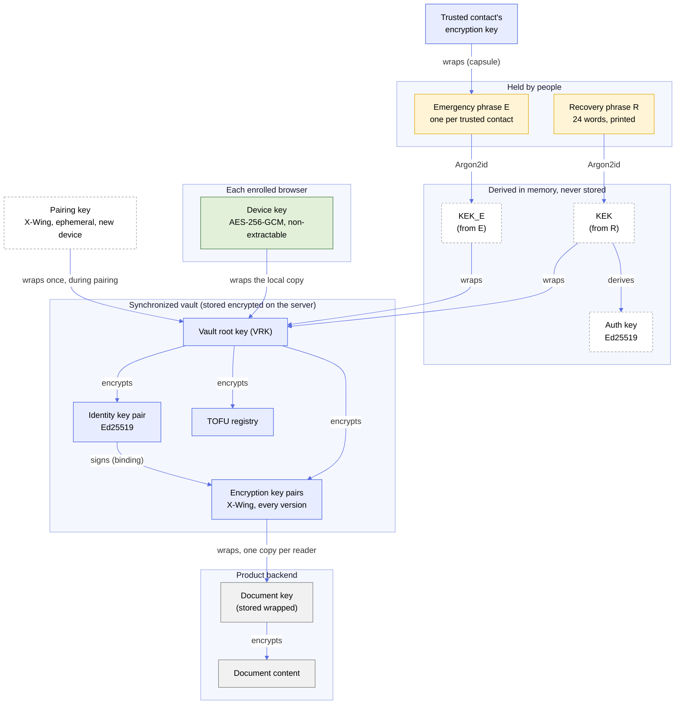
```mermaid
%%{init: {'theme':'base','look':'classic','themeVariables':{'lineColor':'#5b6ee0','edgeLabelBackground':'#ffffff','clusterBkg':'#f5f7ff','clusterBorder':'#9aa7e8','titleColor':'#1a1a2e'},'themeCSS':'.edgeLabel p{background-color:#ffffff;color:#444;font-style:italic;border:1px solid #b5b5b5;padding:2px 8px;border-radius:10px;margin:0;} .edgeLabel .labelBkg{background:transparent;}'}}%%
flowchart TB
  subgraph HELD["Held by people"]
    R["Recovery phrase R<br/>24 words, printed"]
    E["Emergency phrase E<br/>one per trusted contact"]
  end
  subgraph MEM["Derived in memory, never stored"]
    KEK["KEK<br/>(from R)"]
    KEKE["KEK_E<br/>(from E)"]
    AUTH["Auth key<br/>Ed25519"]
  end
  subgraph DEV["Each enrolled browser"]
    DK["Device key<br/>AES-256-GCM, non-extractable"]
  end
  subgraph VAULT["Synchronized vault (stored encrypted on the server)"]
    VRK["Vault root key (VRK)"]
    ID["Identity key pair<br/>Ed25519"]
    ENC["Encryption key pairs<br/>X-Wing, every version"]
    TR["TOFU registry"]
  end
  subgraph PROD["Product backend"]
    DEK["Document key<br/>(stored wrapped)"]
    DOC["Document content"]
  end
  EPH["Pairing key<br/>X-Wing, ephemeral, new device"]
  CENC["Trusted contact's<br/>encryption key"]
  R -->|"Argon2id"| KEK
  E -->|"Argon2id"| KEKE
  KEK -->|"derives"| AUTH
  KEK -->|"wraps"| VRK
  KEKE -->|"wraps"| VRK
  DK -->|"wraps the local copy"| VRK
  VRK -->|"encrypts"| ID
  VRK -->|"encrypts"| ENC
  VRK -->|"encrypts"| TR
  ENC -->|"wraps, one copy per reader"| DEK
  DEK -->|"encrypts"| DOC
  ID -->|"signs (binding)"| ENC
  EPH -->|"wraps once, during pairing"| VRK
  CENC -->|"wraps (capsule)"| E
  classDef held fill:#fff4d6,stroke:#e0a800,color:#000;
  classDef mem fill:#ffffff,stroke:#999,stroke-dasharray:4 3,color:#000;
  classDef dev fill:#e2f0d9,stroke:#3c763d,color:#000;
  classDef vault fill:#e7ecff,stroke:#3b5bdb,color:#000;
  classDef prod fill:#f1f1f1,stroke:#777,color:#000;
  class R,E held;
  class KEK,KEKE,AUTH,EPH mem;
  class DK dev;
  class VRK,ID,ENC,TR,CENC vault;
  class DEK,DOC prod;
```

Besides the binding shown above, the identity key signs the vault manifest ([6.3](#s6-3)), every per-request proof ([6.4](#s6-4)), the auth key's public half ([4.3](#s4-3)), and the emergency escrows ([8.1](#s8-1)). The pairing key also carries the identity secret key along with the VRK ([7.5](#s7-5)).

<a id="s4-2"></a>

### 4.2 Key inventory

Every key, password and secret of the service. "libsodium RNG" is libsodium's `randombytes`, which in the browser draws from `crypto.getRandomValues` (the browser's cryptographically secure generator, seeded by the operating system) and on the server from the operating system's generator.

| Key                          | Purpose                                                                                                                                                                 | Algorithm                                                     | Size, entropy                                                                   | Generated by                                 | Lifetime                                                                                                                                | Stored                                                                                                                                                                              |
| ---------------------------- | ----------------------------------------------------------------------------------------------------------------------------------------------------------------------- | ------------------------------------------------------------- | ------------------------------------------------------------------------------- | -------------------------------------------- | --------------------------------------------------------------------------------------------------------------------------------------- | ----------------------------------------------------------------------------------------------------------------------------------------------------------------------------------- |
| **Recovery phrase `R`**      | The user's only long-term secret: unlocks the vault on a device that holds nothing                                                                                      | BIP-39 mnemonic of a random value                             | 24 words, 256 bits of entropy                                                   | libsodium RNG, in the vault iframe           | Until the user changes it ([7.6](#s7-6))                                                                                                | By the user only (printed or downloaded Recovery Kit). Never stored by the service, never shown again                                                                               |
| **KEK** (key-encryption key) | Wraps the VRK                                                                                                                                                           | Argon2id (3 passes, 64 MiB), parameters stored per credential | 256 bits, as strong as `R`                                                      | Derived from `R`                             | Only while unlocking or changing the phrase                                                                                             | Never stored                                                                                                                                                                        |
| **Auth key pair**            | Proves knowledge of `R` before the server releases the wrapped VRK ([7.2](#s7-2))                                                                                       | Ed25519, seed derived from the KEK                            | 256-bit seed                                                                    | Derived from the KEK                         | Same as `R`                                                                                                                             | Public half on the server (per credential), signed by the identity key; private half never stored                                                                                   |
| **Vault root key (VRK)**     | Encrypts every vault item                                                                                                                                               | XChaCha20-Poly1305                                            | 256 bits                                                                        | libsodium RNG                                | Life of the vault                                                                                                                       | Server: wrapped by each credential's KEK. Each device: wrapped by its device key, in IndexedDB. In memory while the vault iframe runs                                               |
| **Device key**               | Wraps the device's cached VRK at rest                                                                                                                                   | AES-256-GCM, WebCrypto, non-extractable                       | 256 bits                                                                        | WebCrypto `generateKey` (browser generator)  | Until the device leaves encryption or its site data is cleared (an expiry after inactivity is planned, [6.2](#s6-2))                    | IndexedDB of the vault origin, as a key handle whose raw bytes script cannot read                                                                                                   |
| **Identity key pair**        | The user's identity: what contacts verify, and what signs bindings, manifests, request proofs                                                                           | Ed25519                                                       | 256-bit secret, about 128-bit security                                          | libsodium RNG                                | Long-lived; a new one only when the user starts over (migration to a new identity is supported by the core, not used yet, [5.4](#s5-4)) | Private: vault item (encrypted by the VRK). Public: directory                                                                                                                       |
| **Encryption key pairs**     | Receive wrapped document keys. Each wrap derives a fresh single-use 32-byte secret from the recipient's public key, which encrypts the document key and is never stored | X-Wing (X25519 + ML-KEM-768)                                  | Public 1,216 bytes; secret 32 bytes (a seed from which both halves are derived) | libsodium RNG                                | Every version is kept for decryption (rotation is supported by the core, not used yet, [4.4](#s4-4))                                    | Private: vault items. Public: directory, with a binding signature by the identity key                                                                                               |
| **Document key (DEK)**       | Encrypts one document's content                                                                                                                                         | XChaCha20-Poly1305, fresh 192-bit random nonce per encryption | 256 bits                                                                        | libsodium RNG                                | Life of the document, unless the product re-encrypts it ([2.2](#s2-2))                                                                  | Product backend, wrapped once per member. Also kept in the vault's memory during the session, to avoid decrypting the same key again (up to 50; the least recently used is evicted) |
| **Emergency phrase `E`**     | A dormant second way into the vault, escrowed for one trusted contact ([8.1](#s8-1))                                                                                    | As `R`, with its own KEK, auth key and wrapped VRK            | 24 words, 256 bits of entropy                                                   | libsodium RNG, in the grantor's vault iframe | Until used (then replaced), refreshed or deleted ([8.5](#s8-5), [8.6](#s8-6))                                                           | Never in clear on the grantor's side. Server: its credential, and its entropy wrapped to the contact's encryption key (the capsule)                                                 |
| **Pairing key pair**         | Receives the VRK and identity key when a new device is approved ([7.5](#s7-5))                                                                                          | X-Wing                                                        | As above                                                                        | libsodium RNG, on the new device             | One pairing, at most 10 minutes                                                                                                         | Private: new device's memory only. Public: server, until the request expires                                                                                                        |

Secrets that are not keys:

| Secret                 | Purpose                                                        | Form and lifetime                                                                                                    | Stored                                                          |
| ---------------------- | -------------------------------------------------------------- | -------------------------------------------------------------------------------------------------------------------- | --------------------------------------------------------------- |
| OIDC tokens            | Log the user in to the encryption server                       | Issued by the deployment's identity provider, lifetimes set there                                                    | Interface iframe's `localStorage`                               |
| Per-request proof      | Authenticates a request by the identity key ([6.4](#s6-4))     | Signed token covering method, path and a SHA-256 of the body, valid at most 120 seconds                              | Not stored                                                      |
| Unlock challenge       | Fresh value the auth key signs ([7.2](#s7-2))                  | 32 random bytes from the server's generator, valid 120 seconds, consumed on success                                  | Server database until used or expired                           |
| Registration challenge | Proves possession of both private keys ([5.5](#s5-5))          | X-Wing encapsulation to the key being registered, valid 120 seconds; the server keeps only a MAC of the challenge id | Server database until used or expired                           |
| Fingerprints           | Compared between people to verify an identity or a pairing key | First 128 bits of SHA-256 of the public key, shown as 40 decimal digits                                              | Trust decisions keep the fingerprint inside the encrypted vault |

<a id="s4-3"></a>

### 4.3 Derivations

```
R                = BIP-39 mnemonic of 32 random bytes (24 words)     wordlist from the user's locale, stored as `lang`
salt             = BLAKE2b-128(userId)                               internal user id (2.3); not secret
KEK              = Argon2id(normalize(R), salt, ops = 3, mem = 64 MiB) → 32 bytes
authKey          = Ed25519 key pair from seed BLAKE2b-256(key = KEK, "vault-auth-v1")
authPubSig       = Ed25519_sign(identity, "vault-auth-binding-v1" ‖ authKey.public)
VRK              = 32 random bytes
wrappedVRK       = XChaCha20-Poly1305(VRK, key = KEK)
item ciphertext  = XChaCha20-Poly1305(item, key = VRK)                one per vault item, random nonce each
device cache     = AES-256-GCM(VRK, key = device key)

identity         = Ed25519 key pair (random)
encryption key   = X-Wing key pair (random), numbered by a per-user version
binding          = Ed25519_sign(identity, {version, createdAt, userId, encryption public key, identity public key})

DEK              = 32 random bytes
document         = XChaCha20-Poly1305(content, key = DEK)
wrap(K, pk)      = (ct, ss) = X-Wing_encapsulate(pk);  stored: ct and XChaCha20-Poly1305(K, key = ss), with version bytes

fingerprint(pk)  = first 128 bits of SHA-256(pk), as 40 decimal digits
pairing bundle   = wrap({VRK, identity secret key}, new device's pairing public key)

E                = same as R, independent; its KEK_E, auth key and wrapped VRK are derived exactly like R's
capsule          = wrap(entropy of E, contact's active encryption public key)
```

**Exact bytes of every signed message.** "Framed" below means each field is preceded by its length as a 16-bit little-endian integer (a longer field is refused); integers are little-endian.

| Message                               | Signed by              | Bytes                                                                                                                                                                                                                                                          |
| ------------------------------------- | ---------------------- | -------------------------------------------------------------------------------------------------------------------------------------------------------------------------------------------------------------------------------------------------------------- |
| Key binding ([5.5](#s5-5))            | Identity key           | framed `lasuite-encryption/key-registration/v1`, version (32-bit), createdAt in ms (64-bit), framed userId, framed encryption public key, framed identity public key                                                                                           |
| Identity continuity ([5.4](#s5-4))    | Previous identity key  | framed `lasuite-encryption/identity-continuity/v1`, framed userId, generation (32-bit), framed algorithm name, framed new identity public key                                                                                                                  |
| Emergency escrow ([8.1](#s8-1))       | Grantor's identity key | framed `lasuite-encryption/emergency-escrow/v1`, framed grantor id, framed contact id, framed contact identity public key, wait days (32-bit), creation time in ms (64-bit), framed SHA-256 of the credential's auth public key, framed SHA-256 of the capsule |
| Auth-key binding ([4.4](#s4-4))       | Identity key           | `vault-auth-binding-v1` and the auth public key, each preceded by its 32-bit length                                                                                                                                                                            |
| Registration challenge ([5.5](#s5-5)) | Identity key           | the text `lasuite-encryption/key-pop/v1:<challenge id>`                                                                                                                                                                                                        |
| Per-request proof ([6.4](#s6-4))      | Identity key           | compact JWS: `base64url(header).base64url(claims)`, header `{"alg":"EdDSA","typ":"vault-req+jws"}`                                                                                                                                                             |
| Vault manifest ([6.3](#s6-3))         | Identity key           | the text `v<schema>\|<revision>\|<identity generation>\|[<items>]`, each item as `"<id>":"<type>":"<content hash>":<revision date>` (strings JSON-escaped), sorted by id                                                                                       |
| Unlock challenge ([7.2](#s7-2))       | Auth key               | the text `vault-auth-challenge-v1:<userId>:` followed by the 32-byte server nonce                                                                                                                                                                              |

Every message signed by the identity key starts differently (a binary length, `lasuite-…`, `eyJ` for the JWS, `v` for the manifest), so a signature made for one purpose cannot be taken for another. The manifest is the only one without an explicit context label; adding one is planned with its next format version.

Why it is built this way:

- **Authentication and unlocking are separate jobs.** Bitwarden's master password both logs the user in and unlocks the vault, so it must be memorable, and a memorable secret has less entropy than a generated one. Here **OIDC authenticates**, and the vault secret only _unlocks_, so it can be **machine-generated and high-entropy**, which is what defeats offline guessing against a stolen or leaked vault.
- **The recovery phrase is generated, never user-chosen.** There is no low-entropy fallback, so every user gets a vault that cannot be brute-forced.
- **Argon2id** (libsodium `crypto_pwhash`) is defence in depth: because `R` is high-entropy, the KDF is not the main barrier. It slows guessing and standardizes the derivation.
- **The salt is derived from the internal user id**, not the OIDC `sub`, which can change ([2.3](#s2-3)). A salt is not a secret: its jobs are per-user uniqueness and resistance to precomputation, both met. Only the client runs the KDF, so a server that tampered with a salt would only produce a wrong KEK and a failed, detectable unwrap, a denial of service and not a disclosure. (A random stored salt would be an equally valid alternative.)
- **The VRK indirection** (a random key wrapped by the KEK, like Bitwarden's user key) makes two operations cheap: changing the phrase re-wraps only the VRK, and enrolling a second device forwards the VRK.

<a id="s4-4"></a>

### 4.4 Rotation, and several ways into one vault

**What "rotation" means here.** A phrase change re-wraps the VRK only. An encryption-key rotation _appends_ a new key version and re-encrypts nothing (old versions are kept for decryption). **Status: supported by the core, not used yet.** The data model, the directory and the decrypt path (which selects the exact stored key version) handle several versions, so rotation can be added without migrating anything; no flow triggers it today. Ordinary use never re-encrypts the vault.

**One vault, several credentials (like LUKS keyslots).** The unlock material (the wrapped VRK, the auth public key with its identity signature, the Argon2 parameters, the wordlist `lang`) lives in its own `VaultCredential` table rather than on the vault itself: exactly one `primary` credential per vault (the owner's phrase), plus any number of `emergency` credentials, each owned by a trusted-contact relationship ([Section 8](#s8)) and each wrapping the SAME VRK under a different phrase. Emergency credentials are **dormant**: the unlock proof is never checked against them until that relationship's recovery is granted. `VaultKeyring` stays the vault container (identity, items, manifest, `disabledAt`); a credential is one way in.

<a id="s4-5"></a>

### 4.5 Comparison with ANSSI's cryptographic rules

Reference: ANSSI, _Règles et recommandations concernant le choix et le dimensionnement des mécanismes cryptographiques_ (ANSSI-PG-083, version 3.00, March 2026). The guide states rules and gives examples of conforming mechanisms. A mechanism missing from its examples is not non-conforming by definition, but its conformity has to be justified against the rules.

| Mechanism                                  | Used for                                                                                        | Status in the guide                                                                                                                                                                                                                                                                                                                                                                                                                                                             |
| ------------------------------------------ | ----------------------------------------------------------------------------------------------- | ------------------------------------------------------------------------------------------------------------------------------------------------------------------------------------------------------------------------------------------------------------------------------------------------------------------------------------------------------------------------------------------------------------------------------------------------------------------------------- |
| SHA-256                                    | Fingerprints, request body digests, escrow hashes                                               | Listed as conforming (but not to the post-quantum recommendation of 384-bit digests). Fingerprints truncate it to 128 bits: they are compared values, where only resistance to finding a second key with the same fingerprint matters, not collision resistance                                                                                                                                                                                                                 |
| HMAC-SHA-256                               | Registration challenge ([5.5](#s5-5))                                                           | Listed as conforming                                                                                                                                                                                                                                                                                                                                                                                                                                                            |
| AES-256-GCM                                | Device key ([6.2](#s6-2))                                                                       | Listed as conforming; each wrap uses a fresh random 96-bit IV                                                                                                                                                                                                                                                                                                                                                                                                                   |
| ML-KEM-768 hybridised with X25519 (X-Wing) | Wrapping document keys, the VRK during pairing, emergency capsules                              | ML-KEM-768 is conforming only when hybridised with a classical mechanism, which X-Wing does. Its mode (a classical and a post-quantum KEM, combined by SHA3-256 with the classical ciphertext and public key) is the one the guide calls the most desirable                                                                                                                                                                                                                     |
| X25519 (classical half of X-Wing)          | Same                                                                                            | Curve25519 is not among the listed curves (FRP256v1, P-256, P-384, P-521, Brainpool). It meets the rule (its security rests on a prime of about 252 bits, above the 250-bit minimum), but not the recommendation that the whole group have prime order: its group is 8 times that prime, and such a factor has caused bugs in careless implementations. X25519 neutralizes it by design (key clamping); the listed curves have no such factor                                   |
| Ed25519                                    | Identity, binding, manifest, request proofs, escrows, auth key                                  | Not listed: the listed classical signatures are ECDSA or ECKCDSA on the curves above, and RSA-PSS. Ed25519 offers the same security level as ECDSA on P-256 but is harder to misuse: its nonces are deterministic, whereas a single reused or biased ECDSA nonce reveals the private key, and it is strongly unforgeable, a property the guide itself notes ECDSA lacks. For post-quantum signatures the guide expects ML-DSA hybridised with a classical signature, or SLH-DSA |
| XChaCha20-Poly1305                         | Documents, vault items, wrapped VRK, wrapped keys                                               | ChaCha20 is listed as a conforming stream cipher. The Poly1305 authenticator is not listed; AES-GCM is the guide's example of authenticated encryption                                                                                                                                                                                                                                                                                                                          |
| Argon2id, BLAKE2b                          | KEK from the recovery phrase; salt, auth-key seed, and the content hashes in the vault manifest | Outside the guide, which has no entry for password-based derivation or BLAKE2                                                                                                                                                                                                                                                                                                                                                                                                   |
| Random generation                          | Every key ([4.2](#s4-2))                                                                        | The guide's rules on random generators apply to the browser's and operating system's generator, which this service relies on ([1.3](#s1-3))                                                                                                                                                                                                                                                                                                                                     |

In short, the post-quantum part (hybridisation, ML-KEM-768, the combiner) follows ANSSI's position, while the classical primitives come from the libsodium family rather than from the curves and constructions the guide lists.

**Decision: stay on libsodium.** All cryptography in the vault goes through one widely reviewed library, which keeps implementation choices in well-tested code. Its primitives are not all among the guide's examples, so their conformity is justified against the guide's rules: 256-bit symmetric keys, about 128-bit classical security for X25519 and Ed25519, and post-quantum confidentiality through the hybrid KEM. The one exception to "only libsodium" is the device key, kept in WebCrypto because only WebCrypto offers non-extractable keys; it uses AES-256-GCM, which the guide lists.

---

<a id="s5"></a>

## 5. Document sharing

Each document has its own symmetric key. Sharing wraps that key to the recipient's encryption public key and stores the wrapped copy on the product's access list; reading unwraps it with the recipient's private key.

<a id="s5-1"></a>

### 5.1 Encrypt a document

A new document gets a fresh key (`encrypt-without-key`). Later saves reuse it: the product passes its wrapped copy back, and the vault unwraps it and encrypts the new content (`encrypt-with-key`).

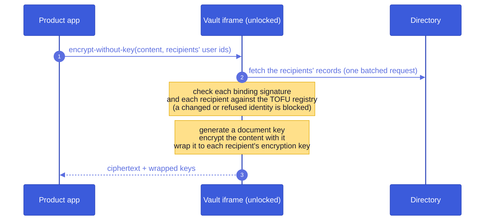
```mermaid
%%{init: {'theme':'base','look':'classic','themeVariables':{'actorBkg':'#3b5bdb','actorTextColor':'#fff','actorBorder':'#2942b8','signalColor':'#5b6ee0','signalTextColor':'#5b6ee0','noteBkgColor':'#ffe08a','noteTextColor':'#1a1a2e','noteBorderColor':'#e0a800','sequenceNumberColor':'#fff'}}}%%
sequenceDiagram
  autonumber
  participant P as Product app
  participant V as Vault iframe (unlocked)
  participant REG as Directory
  P->>V: encrypt-without-key(content, recipients' user ids)
  V->>REG: fetch the recipients' records (one batched request)
  Note over V: check each binding signature<br/>and each recipient against the TOFU registry<br/>(a changed or refused identity is blocked)
  Note over V: generate a document key<br/>encrypt the content with it<br/>wrap it to each recipient's encryption key
  V-->>P: ciphertext + wrapped keys
```

<a id="s5-2"></a>

### 5.2 Share: Alice grants Bob access

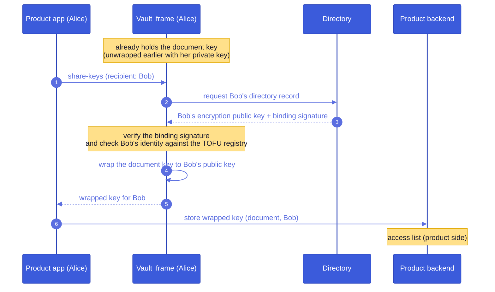
```mermaid
%%{init: {'theme':'base','look':'classic','themeVariables':{'actorBkg':'#3b5bdb','actorTextColor':'#fff','actorBorder':'#2942b8','signalColor':'#5b6ee0','signalTextColor':'#5b6ee0','noteBkgColor':'#ffe08a','noteTextColor':'#1a1a2e','noteBorderColor':'#e0a800','sequenceNumberColor':'#fff'}}}%%
sequenceDiagram
  autonumber
  participant PA as Product app (Alice)
  participant VA as Vault iframe (Alice)
  participant REG as Directory
  participant PB as Product backend
  Note over VA: already holds the document key<br/>(unwrapped earlier with her private key)
  PA->>VA: share-keys (recipient: Bob)
  VA->>REG: request Bob's directory record
  REG-->>VA: Bob's encryption public key + binding signature
  Note over VA: verify the binding signature<br/>and check Bob's identity against the TOFU registry
  VA->>VA: wrap the document key to Bob's public key
  VA-->>PA: wrapped key for Bob
  PA->>PB: store wrapped key (document, Bob)
  Note over PB: access list (product side)
```

<a id="s5-3"></a>

### 5.3 Read: Bob opens the document

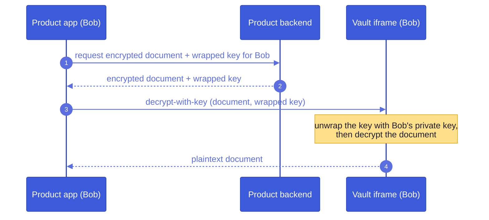
```mermaid
%%{init: {'theme':'base','look':'classic','themeVariables':{'actorBkg':'#3b5bdb','actorTextColor':'#fff','actorBorder':'#2942b8','signalColor':'#5b6ee0','signalTextColor':'#5b6ee0','noteBkgColor':'#ffe08a','noteTextColor':'#1a1a2e','noteBorderColor':'#e0a800','sequenceNumberColor':'#fff'}}}%%
sequenceDiagram
  autonumber
  participant PB2 as Product app (Bob)
  participant BK as Product backend
  participant VB as Vault iframe (Bob)
  PB2->>BK: request encrypted document + wrapped key for Bob
  BK-->>PB2: encrypted document + wrapped key
  PB2->>VB: decrypt-with-key (document, wrapped key)
  Note over VB: unwrap the key with Bob's private key,<br/>then decrypt the document
  VB-->>PB2: plaintext document
```

<a id="s5-4"></a>

### 5.4 Contact trust and identity continuity

Each user's vault keeps a **TOFU registry** (trust on first use): one entry per contact, keyed by their user id and recording their **identity fingerprint**, like SSH's known hosts. The first time the user shares with a contact, the fingerprint is **recorded** and the share is **allowed**; recording it is what lets a later change be caught. That first key is labelled **`unknown`** (seen, not verified), never `trusted`: only an **explicit user decision**, after checking the fingerprint out-of-band, marks a contact `trusted` or `refused`. Any **change** of a recorded fingerprint is a **mismatch**: it blocks the share and asks the user to check again. That is what catches an attacker who reset a victim's account to a new identity, or a directory that substituted a key.

Every way into `trusted` comes from an explicit decision by the user; identity continuity only carries an earlier decision over to a new key:

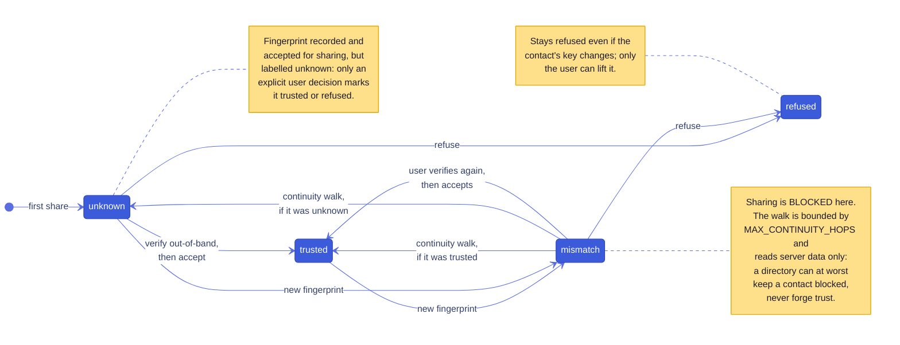
```mermaid
%%{init: {'theme':'base','look':'classic','themeVariables':{'fontSize':'15px','primaryColor':'#3b5bdb','primaryTextColor':'#fff','primaryBorderColor':'#2942b8','lineColor':'#5b6ee0','tertiaryColor':'#fff','labelBackgroundColor':'#ffffff','edgeLabelBackground':'#ffffff','transitionColor':'#5b6ee0','transitionLabelColor':'#33406b','noteBkgColor':'#ffe08a','noteTextColor':'#1a1a2e','noteBorderColor':'#e0a800'},'themeCSS':'.edgeLabel p{background-color:#fff;padding:4px 10px;border-radius:5px;margin:0;} .edgeLabel .labelBkg{background:transparent;} .statediagram-state .nodeLabel p{font-size:15px;padding:5px 12px;margin:0;}','stateDiagram':{'nodeSpacing':70,'rankSpacing':110,'useMaxWidth':true}}}%%
stateDiagram-v2
  direction LR
  [*] --> unknown: first share
  unknown --> trusted: verify out-of-band,<br/>then accept
  unknown --> refused: refuse
  trusted --> mismatch: new fingerprint
  unknown --> mismatch: new fingerprint
  mismatch --> trusted: continuity walk,<br/>if it was trusted
  mismatch --> unknown: continuity walk,<br/>if it was unknown
  mismatch --> trusted: user verifies again,<br/>then accepts
  mismatch --> refused: refuse
  note right of unknown
    Fingerprint recorded and
    accepted for sharing, but
    labelled unknown: only an
    explicit user decision marks
    it trusted or refused.
  end note
  note left of refused
    Stays refused even if the
    contact's key changes; only
    the user can lift it.
  end note
  note right of mismatch
    Sharing is BLOCKED here.
    The walk is bounded by
    MAX_CONTINUITY_HOPS and
    reads server data only:
    a directory can at worst
    keep a contact blocked,
    never forge trust.
  end note
```

**Identity continuity** lets a legitimate change of identity pass without a new check. The client walks from the contact's current identity back toward the one it recorded, checking at each step that the newer identity is signed (`continuitySignature`) by its predecessor, and only then carries the old status over to the new fingerprint. Forging a link needs the predecessor's private key, which never reaches the server, so a compromised directory can only withhold or roll back links: the contact then stays blocked until the user checks again, never reaching a false `trusted`. Refusals are not affected: a refused contact stays refused whatever fingerprint they present, and only the user can lift it.

**Status: supported by the core, not used yet.** The walk is implemented and tested, but no flow writes continuity links, so today every identity change surfaces as a mismatch. They are reserved for a future migration of the identity key, for instance to a post-quantum hybrid signature (Ed25519 and ML-DSA concatenated, the form ANSSI lists, [4.5](#s4-5)), with the new identity cross-signed by the old one.

The walk runs **inside the normal fingerprint check**. On a mismatch, the vault fetches the contact's chain from the directory (`GET /api/public-keys/:userId/continuity`, public, no authentication) and checks each link's signature and order, stopping at the identity it recorded. The walk is capped (`MAX_CONTINUITY_HOPS`): a contact who changed identity more often since the last check, or a directory serving a longer forged chain, falls back to a new out-of-band check. Several changes resolve in a single check, and no continuity data crosses to the product.


```mermaid
%%{init: {'theme':'base','look':'classic','themeVariables':{'actorBkg':'#3b5bdb','actorTextColor':'#fff','actorBorder':'#2942b8','signalColor':'#5b6ee0','signalTextColor':'#5b6ee0','noteBkgColor':'#ffe08a','noteTextColor':'#1a1a2e','noteBorderColor':'#e0a800','sequenceNumberColor':'#fff'}}}%%
sequenceDiagram
  autonumber
  participant C as Client (Alice)
  participant REG as Registry
  Note over C: locally trusted, contact Bob equals fingerprint B<br/>a new fingerprint A just mismatched
  C->>REG: fetch Bob's continuity chain (current identity first)
  REG-->>C: chain of links, each identity plus its predecessor and cross-signature
  loop each link, back toward B, up to the hop cap
    Note over C: verify the cross-signature and contiguity<br/>stop when a link's predecessor equals stored B
  end
  alt a valid chain reaches B within the cap
    Note over C: carry B's trust status forward to A<br/>no out-of-band re-verification needed
  else chain broken, absent, or over the cap
    Note over C: stay blocked (mismatch)<br/>ask the user to re-verify out-of-band
  end
```

<a id="s5-5"></a>

### 5.5 Key registration: dual-key proof of possession

Before a key pair enters the directory, the client must prove it holds **both** private keys, and the record's binding must be coherent. This stops anyone, a malicious server included, from publishing a key they do not control or claiming another user's key. It runs in two steps, `init` then `complete`.

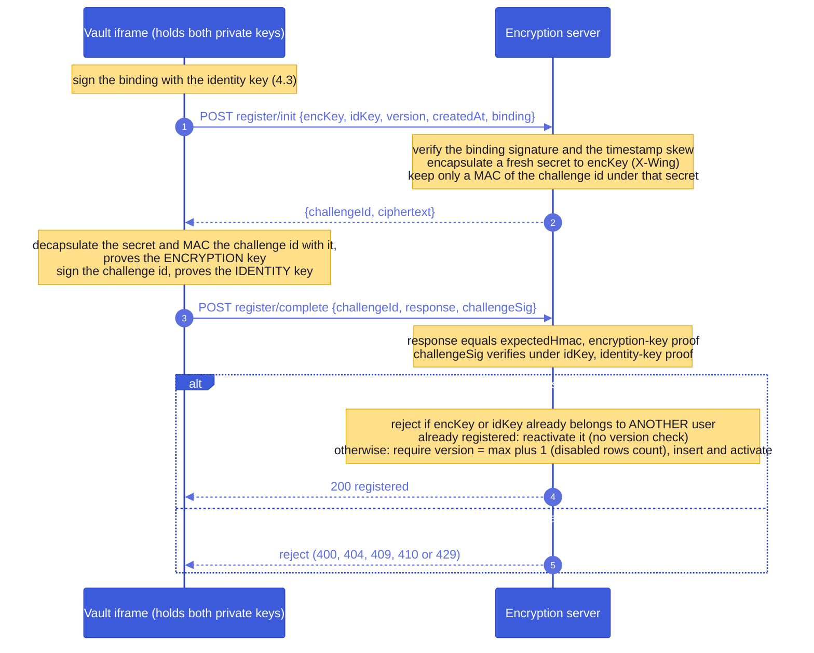
```mermaid
%%{init: {'theme':'base','look':'classic','themeVariables':{'actorBkg':'#3b5bdb','actorTextColor':'#fff','actorBorder':'#2942b8','signalColor':'#5b6ee0','signalTextColor':'#5b6ee0','noteBkgColor':'#ffe08a','noteTextColor':'#1a1a2e','noteBorderColor':'#e0a800','sequenceNumberColor':'#fff'}}}%%
sequenceDiagram
  autonumber
  participant V as Vault iframe (holds both private keys)
  participant API as Encryption server
  Note over V: sign the binding with the identity key (4.3)
  V->>API: POST register/init {encKey, idKey, version, createdAt, binding}
  Note over API: verify the binding signature and the timestamp skew<br/>encapsulate a fresh secret to encKey (X-Wing)<br/>keep only a MAC of the challenge id under that secret
  API-->>V: {challengeId, ciphertext}
  Note over V: decapsulate the secret and MAC the challenge id with it,<br/>proves the ENCRYPTION key<br/>sign the challenge id, proves the IDENTITY key
  V->>API: POST register/complete {challengeId, response, challengeSig}
  Note over API: response equals expectedHmac, encryption-key proof<br/>challengeSig verifies under idKey, identity-key proof
  alt both proofs pass and the record is coherent
    Note over API: reject if encKey or idKey already belongs to ANOTHER user<br/>already registered: reactivate it (no version check)<br/>otherwise: require version = max plus 1 (disabled rows count), insert and activate
    API-->>V: 200 registered
  else a proof fails or the key is already taken
    API-->>V: reject (400, 404, 409, 410 or 429)
  end
```

Both proofs are required. Decapsulating the X-Wing ciphertext proves the **encryption** key; signing the challenge id proves the **identity** key. The binding signature, checked at `init`, proves the identity key's holder chose the encryption key, and since `version` and `createdAt` are inside it, the server cannot renumber or backdate a record. The `complete` step runs in one serializable transaction, so two devices racing for the next version cannot both succeed. Records are immutable: registering an already-registered key **reactivates** its row instead of creating a new version. Onboarding ([7.1](#s7-1)) runs the same checks inside its single transaction, and a new onboarding after a reset registers at `max + 1`.

---

<a id="s6"></a>

## 6. The synchronized vault

<a id="s6-1"></a>

### 6.1 What syncs

```
VaultState {
  schema: 1
  identities:     [ { generation, algo, signaturePublicKey, signatureSecretKey, createdAt } ]   // grow-only, immutable
  encryptionKeys: [ { version, algo, publicKey, secretKey, createdAt } ]            // grow-only, immutable
  active:         { identityGen, encKeyVersion }                                     // pointer to the current key
  tofu:           { [remoteUserId]: { fingerprint, status, revisionDate, deleted } }   // the only mutable data
}
```

- **Every key version is kept**, not only the current one: a device must _decrypt_ content wrapped under an old key while _encrypting_ under the active one. Old versions never change, and cost a few KB. The server enforces it: an existing identity or encryption-key item can never be rewritten (`vault_item_immutable`); only new versions can be added.
- **No cached public keys.** A trust entry is just `{ fingerprint, status }` for a contact id; public keys are fetched from the directory and verified each time they are used.
- **The TOFU registry is the only data that changes**; everything else is append-only, which keeps conflict handling simple ([Section 10](#s10)).

After decryption, each item and each server row is validated against a **Zod schema** (`src/shared/schemas`). Authenticated encryption already prevents tampering; the schemas catch bugs and format drift.

<a id="s6-2"></a>

### 6.2 Local storage and caching

Locally, the vault iframe keeps the decrypted `VaultState` in memory, and a durable cache in IndexedDB: the encrypted items, their revision, the manifest signature, and **the VRK wrapped by a non-extractable WebCrypto device key**.

The cache holds the VRK, never the recovery phrase, which is never stored anywhere. Caching the wrapped VRK skips the slow Argon2id derivation, avoids asking for the phrase in routine use (even after every tab was closed), and keeps the wrapping key out of reach of scripts.

The decrypted `VaultState` lives only while a page embeds the vault iframe. There is no inactivity lock: unlocking again would only unwrap the cached VRK with the same device key, without any user action, so it would protect nothing. An unlocked session is covered by the assumptions instead ([1.4](#s1-4)).

**De-enroll** (**Status: planned**): wipe the device-wrapped VRK when the device has not used encryption for a long period (about 6 months), so it must be enrolled again through device approval or the recovery phrase. The vault iframe enforces the check on load. It protects a device that is lost and found after that period, not one an attacker uses before it. Today the device-wrapped VRK stays until the user leaves encryption or clears the site data.

<a id="s6-3"></a>

### 6.3 Integrity model

Bitwarden does not sign vault items: it relies on transport authentication and trusts its server for integrity. This service signs them, because its threat model includes a compromised server.

Alongside the items, the server stores a **manifest**:

```
manifest = {
  schema,                  // format version
  revision,                 // monotonic
  identityGen,              // which identity generation signed, advisory hint only
  items: [ { id, type, contentHash, revisionDate } ],
}
manifestSig = Ed25519_sign(identitySecretKey, canonical(manifest))
```

On every write, the server checks the manifest signature against the vault's identity, and that the stored items stay exactly what the manifest lists: at onboarding the whole set is compared, then each item write may only change its own entry (one hash per write). A buggy client therefore cannot publish a vault the other devices would refuse. The server also serves the manifest and the items from a single database snapshot, so a pull never pairs them across a concurrent write. A consuming device verifies, in order:

1. `manifestSig` against the **identity key the device already trusts**, not whatever the server labels. `identityGen` only hints at which key to expect; a server that rewrites it gains nothing, since it cannot sign with a key it does not hold.
2. Every item's `contentHash` matches the manifest: detects an item spliced in, dropped or swapped.
3. `revision >= lastSeenRevision` stored on the device: detects a rollback to an older vault.

**Which identity signs.** The manifest must be signed by the **active identity**. When the identity changes (supported by the core through the continuity columns, not used yet), the manifest is signed again under the new one, as Bitwarden does on key rotation. A manifest signed by another identity is rejected; a grace path through the continuity signature may come later.

**A legitimate user should never hit a bad signature**: a correct client always signs with the active identity it holds, and the server refuses inconsistent writes, so a failure means tampering, corruption, rollback, or a legitimate change of identity made on another device. The response is therefore to **refuse**, never to repair silently, and the device always keeps its last verified copy. During onboarding, restore and device approval, the user sees an integrity error. In background sync, every pull downloads the whole vault, so the device simply tries once more a few seconds later, which clears a passing failure. If that fails too, it compares its identity with the directory's: a different identity is a change made elsewhere, which the settings screen reconciles ([7.9](#s7-9)); the same identity means the server's copy really does not verify, which is reported through error reporting and shown in the encryption settings as a non-blocking warning, asking the user to contact support if it persists. Syncing is paused meanwhile: the device keeps decrypting and encrypting with its copy, but changes that must reach the server (trusting or refusing a contact's identity, for instance) fail until the server copy verifies again, at which point syncing resumes by itself.

Other systems also treat an integrity break as a hard stop that needs a person: **Signal** blocks on a changed safety number until acknowledged, **git** flags a bad commit signature, **TLS certificate pinning** fails the connection.

<a id="s6-4"></a>

### 6.4 How each server request is authorized

Two things authorize a request: **transport** authentication (is this one of the account's devices?) and **payload** signatures (what does this write mean?).

**Transport authentication has four tiers** (background, sensitive, restore, login only), depending on whether the caller can hold the identity key at that moment and how sensitive the operation is. The vault iframe, which holds the identity key, is loaded whenever a product uses encryption; the interface, which holds the OIDC token, is not. So everything that must run in the background is authenticated by the **identity signature alone**. "Background" still means while a product page is open, since the vault lives in it; the point is to keep the vault in sync without ever interrupting the user with a "session expired, sign in again" prompt. Signing each request with a private key checked against a registered public key, with no bearer token, is the pattern of SSH, WireGuard, mTLS and WebAuthn.

| Tier                                                                   | Auth required                        | Driven by                      | Why                                                                                                                                                                                                             | Endpoints                                                                                                                                                                                 |
| ---------------------------------------------------------------------- | ------------------------------------ | ------------------------------ | --------------------------------------------------------------------------------------------------------------------------------------------------------------------------------------------------------------- | ----------------------------------------------------------------------------------------------------------------------------------------------------------------------------------------- |
| **Background**                                                         | **Identity signature only** (no JWT) | the vault (autonomous)         | must run with no interface and no live JWT; the identity signature proves "an enrolled device of this user", and `userId` travels inside the signed claims so the server targets one identity to verify against | `GET /api/vault/items`, `PUT /api/vault/items/:itemId`, `GET /api/vault/revision`, SSE `/api/vault/events`, `GET /api/emergency-access/pending` ([8.7](#s8-7))                            |
| **Sensitive**                                                          | **JWT + identity signature**         | the interface                  | the interface is open (JWT is free) and the op is security-relevant, so keep the OIDC-session assurance on top of the key proof                                                                                 | `PUT /api/vault/keyring` (change phrase), device-approval approve / list, emergency designate / wait-time change / re-arm / initiate / recover ([8.7](#s8-7))                             |
| **Restore**                                                            | **JWT (+ passphrase proof)**         | the interface, or a new device | the caller has no identity key yet (restoring, onboarding, a new device waiting for approval); the passphrase proof is what releases the `wrappedVRK`                                                           | `GET /api/vault/meta`, `POST /api/vault/challenge` `/fetch` `/reactivate` `/vault` (onboarding), `register/*`, `POST /api/vault/approvals/request`, `GET /api/vault/approvals/:requestId` |
| **Login only** (no key to sign the request with: no device, no phrase) | **JWT only**                         | the interface                  | must work exactly when the user can sign nothing                                                                                                                                                                | `DELETE /api/public-keys`, the emergency fail-safe actions (accept, cancel, reject, delete, lists, search: [8.7](#s8-7))                                                                  |

**Why the sensitive tier also requires the token.** The signature alone is strong authentication, but these operations are rare and sensitive (changing the phrase, approving a device), the interface is open so the token costs nothing, and it is a second, independent check should signature verification ever have a flaw. The background tier skips it, because requiring the token there is exactly what would force re-authentication prompts.

**The `X-Signature` header** is the per-request signature of the background and sensitive tiers (`src/crypto/request-proof.ts`). It is a small signed token (a compact JWS, in the style of DPoP, RFC 9449) holding the HTTP method and path, a SHA-256 of the request body, the user id, and an issue and an expiry time, all signed by the user's identity key.

How the server checks it:

- **Background tier**: the signature is the only proof. The server reads the user id from the token, takes that user's active identity key from the directory, and checks the signature; a forged user id simply fails.
- **Sensitive tier**: the login token is required too, and the user id in the signature must be the login token's user.
- **The public key always comes from the directory**, never from the request (DPoP, by contrast, sends it along).

What it prevents:

- **Reusing a signature with another body**: the body hash is signed, so a captured signature cannot be attached to different content (the same idea as AWS SigV4 or RFC 9421).
- **Replaying it later**: it expires after at most 120 seconds. Within that window it only works on the same route with the same body, which is harmless: reads change nothing, and a write carries a revision number the server accepts only once. No list of used signatures is kept.
- **Forgetting it on a new route**: the server enforces it on every vault route unless one is explicitly exempted, so a missing check shows up as a rejected request, not an open route.

Only these routes are exempt, because the caller cannot hold the identity key at that point:

- **restore, registration and new-device approval**: `GET /api/vault/meta` (KDF parameters needed before any key exists), `POST /api/vault/challenge`, `/fetch`, `/reactivate`, `/vault` (onboarding), `register/*`, and the new device's `POST /api/vault/approvals/request` and polling `GET /api/vault/approvals/:requestId`;
- **disabling after a lost phrase**: `DELETE /api/public-keys`, which must work when the user can sign nothing, and only ever _disables_ the identity and keyring, so the phrase can reactivate them;
- the emergency-access **actions that can only deny** (accept, cancel, reject, delete, lists, contact search): a grantor who lost every device must still be able to refuse a recovery with a login alone, and none of them releases key material or shortens a wait ([8.7](#s8-7));
- the public directory reads.

When a new device is added ([7.5](#s7-5)), it needs the identity key to sign its first pull of `/items`, but that key is inside the vault it is pulling. So the approving device forwards the **identity secret key with the VRK**, and `/items` needs no exemption.

**Devices one identity behind.** If only the active identity could authenticate, a device still on the previous identity could never sync to obtain the new one. So the server accepts the active identity always, and a **continuity-linked predecessor** (each cross-signature checked) only within a small number of **hops** and a **time window** of about one year; otherwise the request is rejected like any invalid signature (401), and the device must recover through approval or the recovery phrase. The hop limit caps the cost of the walk; the time limit caps exposure, since an identity is replaced for a reason (typically retiring a signature algorithm, the Ed25519 to post-quantum case this is reserved for), and the old key must stop working once the window closes. The window is **absolute per identity**: a predecessor counts as retired at its successor's `createdAt`, and is accepted only while less than the window has passed since then. Chaining "each migration within a year of the previous" would let frequent migrations reach back many years. The active identity is never time-checked. An **unlinked** older identity (after starting over, or a reset following a compromise) never authenticates. This is implemented and tested (`src/server/routes/transport-auth.ts`), and **supported by the core, not used yet**: nothing writes continuity links ([5.4](#s5-4)), so only the active identity authenticates today.

**Payload signatures.** Independently of transport, every write that changes durable, trust-bearing state carries an Ed25519 signature over a precise object ([4.3](#s4-3) gives the bytes), checked against a key the server cannot forge:

- vault item writes: the **manifest signature** ([6.3](#s6-3));
- registration and onboarding: the **binding signature**, plus the dual proof of possession ([5.5](#s5-5));
- a new identity: the **continuity signature** by its predecessor ([5.4](#s5-4));
- changing the recovery phrase (`PUT /api/vault/keyring`): the **auth-binding signature** over the new auth public key.

Replay and reordering are prevented by the monotonic counter inside each signed object, not by a nonce. This layer makes integrity independent of the server; the `X-Signature` adds defence in depth, and is the only protection of reads, which have no body to sign.

**Releasing the wrapped VRK.** Restore (`/fetch`) and reactivation (`/reactivate`) require a signature by the phrase-derived auth key over a **single-use server nonce** ([7.2](#s7-2)): neither has a payload worth signing, and a nonce is the simplest protection against replaying the state change.

**What a stolen token still allows.** Without the identity key, a stolen token, or a rogue server acting through its own API, cannot even download the vault. The only write it can reach is the **disable** of a lost phrase, which the owner can undo by reactivating with the phrase. It can never read content, forge a signed item, create or replace an identity, or cause permanent loss ([Section 3](#s3)).

---

<a id="s7"></a>

## 7. Vault flows

**Recovery routes.** A device that already holds the keys keeps them (its cached VRK, [6.2](#s6-2)). Any other device gets them in one of two ways: **approval** from a device that holds them ([7.5](#s7-5)), the everyday way to add one, or the **recovery phrase** opening the server-held vault ([7.2](#s7-2)), the fallback when no such device is at hand. Approval forwards the wrapped VRK and identity key, never the phrase. There is no export of the raw private keys: it would be a second, more dangerous secret (the file _is_ the keys, whereas the phrase is useless without the server and its proof), and it adds nothing to these routes. Keeping the server copy durable is the **operator's** job (database backups and replication), not the user's. When no device and no phrase are left, emergency access remains ([Section 8](#s8)).

Participants: **U** user, **P** product app, **UI** interface iframe, **V** vault iframe, **API** encryption server, **E** an enrolled device, **N** a new device.

<a id="s7-1"></a>

### 7.1 Onboarding: vault creation

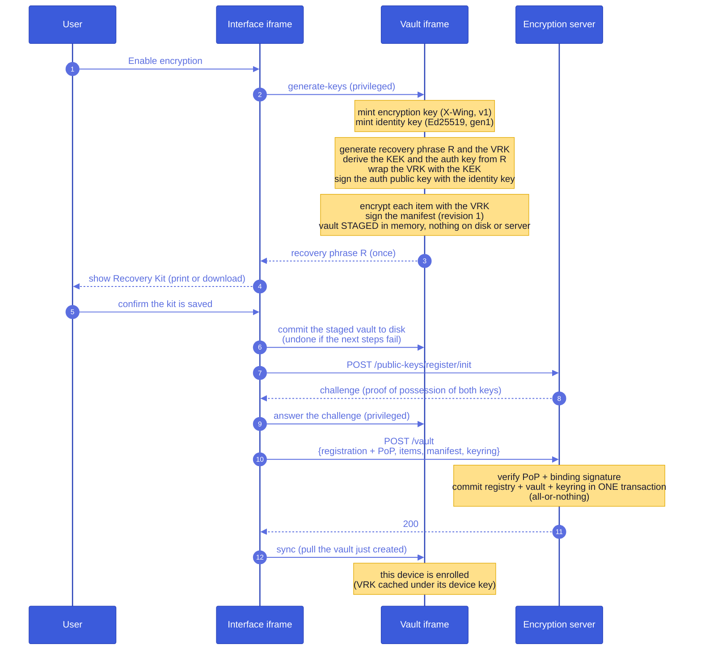
```mermaid
%%{init: {'theme':'base','look':'classic','themeVariables':{'actorBkg':'#3b5bdb','actorTextColor':'#fff','actorBorder':'#2942b8','signalColor':'#5b6ee0','signalTextColor':'#5b6ee0','noteBkgColor':'#ffe08a','noteTextColor':'#1a1a2e','noteBorderColor':'#e0a800','sequenceNumberColor':'#fff'}}}%%
sequenceDiagram
  autonumber
  participant U as User
  participant UI as Interface iframe
  participant V as Vault iframe
  participant API as Encryption server
  U->>UI: Enable encryption
  UI->>V: generate-keys (privileged)
  Note over V: mint encryption key (X-Wing, v1)<br/>mint identity key (Ed25519, gen1)
  Note over V: generate recovery phrase R and the VRK<br/>derive the KEK and the auth key from R<br/>wrap the VRK with the KEK<br/>sign the auth public key with the identity key
  Note over V: encrypt each item with the VRK<br/>sign the manifest (revision 1)<br/>vault STAGED in memory, nothing on disk or server
  V-->>UI: recovery phrase R (once)
  UI-->>U: show Recovery Kit (print or download)
  U->>UI: confirm the kit is saved
  UI->>V: commit the staged vault to disk<br/>(undone if the next steps fail)
  UI->>API: POST /public-keys/register/init
  API-->>UI: challenge (proof of possession of both keys)
  UI->>V: answer the challenge (privileged)
  UI->>API: POST /vault<br/>{registration + PoP, items, manifest, keyring}
  Note over API: verify PoP + binding signature<br/>commit registry + vault + keyring in ONE transaction<br/>(all-or-nothing)
  API-->>UI: 200
  UI->>V: sync (pull the vault just created)
  Note over V: this device is enrolled<br/>(VRK cached under its device key)
```

Onboarding writes three things that must stay consistent: the key registration, the encrypted vault, and the keyring (the wrapped VRK and the auth key). Nothing reaches the server until the user confirms the Recovery Kit is saved, so abandoning that step (reload, close, cancel) leaves nothing on the server, and nobody ends up registered with keys they cannot recover. The device then writes the vault to disk, and removes it again if the server steps fail. The three server writes are committed in **one server transaction**. A partial write would be harmful: keys registered with no vault behind them, so contacts share with a user who would lose everything with their device, or a vault whose keyring never landed and can never be opened. If the server committed but its response was lost, the device rolls its own copy back and the user retries with the same phrase. The server recognizes the retry (same identity, same signed manifest as the active vault) and answers success without creating a second vault; only the retry's challenge is consumed.

**Recovery Kit.** It says it is needed to restore encrypted data on a new device, without detailing what it unlocks. It can be **printed** (recommended) or **downloaded**. Saving it into a password manager is not offered: whether it belongs there as a login or a note is too ambiguous.

**Wordlist language.** BIP-39 wordlists differ per language, and a phrase must be typed against its own wordlist (its checksum makes a wrong-language entry fail at once). Users are never asked to choose: the language is taken from the interface locale (French, otherwise English), stored as non-secret metadata (`lang`) in the keyring, and printed on the Kit. Restore does not need it, since typed words are checked against every wordlist and the key derives from the phrase string ([7.2](#s7-2)). The stored `lang` is used to display a phrase in the user's wordlist, such as an emergency phrase revealed by a trusted contact ([8.5](#s8-5)). Before derivation the phrase is normalized (Unicode NFKD, surrounding spaces removed, inner spaces collapsed to one, lowercase), so a typed phrase derives the same key as the printed one. Only English and French are offered; a phrase valid in both derives the same key either way.

<a id="s7-2"></a>

### 7.2 Cold unlock on a new device (recovery phrase)

The only flow that uses the recovery phrase: the device holds nothing and no other device can approve it (otherwise see [7.5](#s7-5)).

Before releasing the `wrappedVRK`, the server requires a proof that the caller knows the phrase. The vault items need no such gate, since they are encrypted under the random VRK; the `wrappedVRK` is the one value an attacker could test phrase guesses against.

- **Before the proof**, the server serves only the KDF parameters. A user can have several vaults (dormant ones remain after starting over), and an older vault keeps the Argon2 parameters it was created with if the defaults were raised since. The device does not know which vault the phrase belongs to, so it tries each distinct set the account uses, cheapest first (usually there is only one). A malicious server could announce costly sets and stall the restore; this is accepted, since it could also serve a modified frontend ([3.4](#s3-4)).
- **No wordlist language is needed**: the key is derived from the phrase string, and typed words are checked against every wordlist.
- **The verifier** (`authPublicKey`) is written at onboarding and never returned to any client.

This gate is defence in depth: the phrase's 256 bits are what protect a leaked `wrappedVRK`; the gate keeps it away from a stolen token.

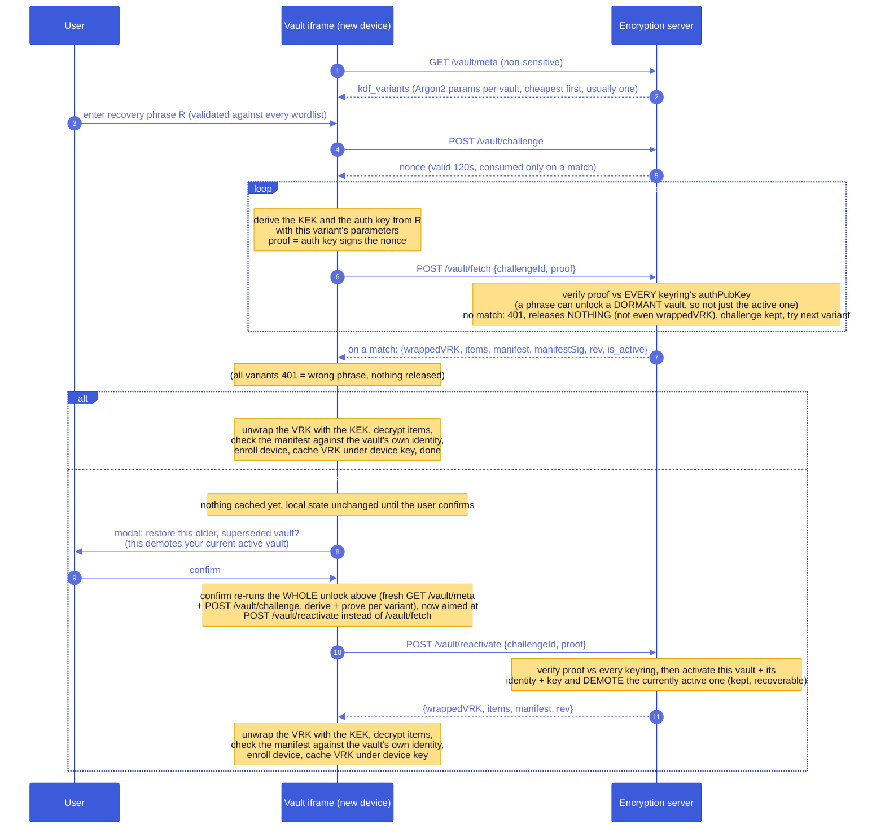
```mermaid
%%{init: {'theme':'base','look':'classic','themeVariables':{'actorBkg':'#3b5bdb','actorTextColor':'#fff','actorBorder':'#2942b8','signalColor':'#5b6ee0','signalTextColor':'#5b6ee0','noteBkgColor':'#ffe08a','noteTextColor':'#1a1a2e','noteBorderColor':'#e0a800','sequenceNumberColor':'#fff'}}}%%
sequenceDiagram
  autonumber
  participant U as User
  participant V as Vault iframe (new device)
  participant API as Encryption server
  V->>API: GET /vault/meta (non-sensitive)
  API-->>V: kdf_variants (Argon2 params per vault, cheapest first, usually one)
  U->>V: enter recovery phrase R (validated against every wordlist)
  V->>API: POST /vault/challenge
  API-->>V: nonce (valid 120s, consumed only on a match)
  loop each KDF variant until the proof verifies (usually the first)
    Note over V: derive the KEK and the auth key from R<br/>with this variant's parameters<br/>proof = auth key signs the nonce
    V->>API: POST /vault/fetch {challengeId, proof}
    Note over API: verify proof vs EVERY keyring's authPubKey<br/>(a phrase can unlock a DORMANT vault, so not just the active one)<br/>no match: 401, releases NOTHING (not even wrappedVRK), challenge kept, try next variant
  end
  API-->>V: on a match: {wrappedVRK, items, manifest, manifestSig, rev, is_active}
  Note over V: (all variants 401 = wrong phrase, nothing released)
  alt is_active: the phrase unlocked the CURRENT vault
    Note over V: unwrap the VRK with the KEK, decrypt items,<br/>check the manifest against the vault's own identity,<br/>enroll device, cache VRK under device key, done
  else the phrase unlocked a DORMANT (superseded) vault
    Note over V: nothing cached yet, local state unchanged until the user confirms
    V->>U: modal: restore this older, superseded vault?<br/>(this demotes your current active vault)
    U->>V: confirm
    Note over V: confirm re-runs the WHOLE unlock above (fresh GET /vault/meta<br/>+ POST /vault/challenge, derive + prove per variant), now aimed at<br/>POST /vault/reactivate instead of /vault/fetch
    V->>API: POST /vault/reactivate {challengeId, proof}
    Note over API: verify proof vs every keyring, then activate this vault + its<br/>identity + key and DEMOTE the currently active one (kept, recoverable)
    API-->>V: {wrappedVRK, items, manifest, rev}
    Note over V: unwrap the VRK with the KEK, decrypt items,<br/>check the manifest against the vault's own identity,<br/>enroll device, cache VRK under device key
  end
```

The `is_active` flag decides the end of the flow. If the phrase unlocked the **current** vault, the device caches it and is enrolled. If it unlocked a **dormant** one (replaced since), nothing is cached: the user is asked to confirm, and only then does `/vault/reactivate` make it active again and **demote the current one**. That is how a user recovers an older vault, or takes their vault back after another device replaced the identity ([7.8](#s7-8)). A device that held nothing has no earlier reference, so it checks the manifest against the identity found inside the vault itself, and has no previous revision to compare with ([7.5](#s7-5) explains why that is acceptable).

The proof is checked against every credential the phrase may unlock right now: the **primary** credential of each of the user's vaults (dormant ones stay restorable by their own phrase), plus any **emergency** credential whose recovery is currently granted ([Section 8](#s8)). The response's `credential_type` says which matched. An emergency match means a trusted contact handed the phrase over, and the interface first forces the phrase change of [8.5](#s8-5).

<a id="s7-3"></a>

### 7.3 Warm sync on an enrolled device

The everyday path, with no phrase: the device unwraps its cached VRK with its device key and signs its requests with the identity key held in the vault ([6.4](#s6-4), no token needed). It pulls when the vault loads, when the page becomes visible again, when the push channel reconnects, and on each server push ([Section 11](#s11)).

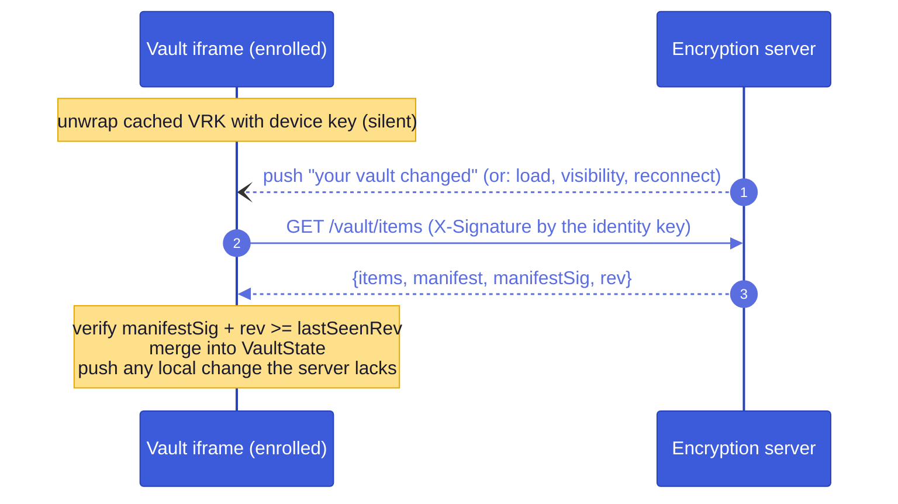
```mermaid
%%{init: {'theme':'base','look':'classic','themeVariables':{'actorBkg':'#3b5bdb','actorTextColor':'#fff','actorBorder':'#2942b8','signalColor':'#5b6ee0','signalTextColor':'#5b6ee0','noteBkgColor':'#ffe08a','noteTextColor':'#1a1a2e','noteBorderColor':'#e0a800','sequenceNumberColor':'#fff'}}}%%
sequenceDiagram
  autonumber
  participant V as Vault iframe (enrolled)
  participant API as Encryption server
  Note over V: unwrap cached VRK with device key (silent)
  API--)V: push "your vault changed" (or: load, visibility, reconnect)
  V->>API: GET /vault/items (X-Signature by the identity key)
  API-->>V: {items, manifest, manifestSig, rev}
  Note over V: verify manifestSig + rev >= lastSeenRev<br/>merge into VaultState<br/>push any local change the server lacks
```

<a id="s7-4"></a>

### 7.4 Mutate the vault (with conflict handling)

Decisions the user makes (accepting or refusing a contact, for instance) go through a **write-through** path (`writeThrough`): the change is applied to the opened state, pushed, and saved locally only once the server confirms. Automatic records (a contact seen for the first time, a status carried over by continuity) are saved locally first and pushed by the next sync, which uploads any local item the server lacks. This mirrors Bitwarden's per-item optimistic concurrency.

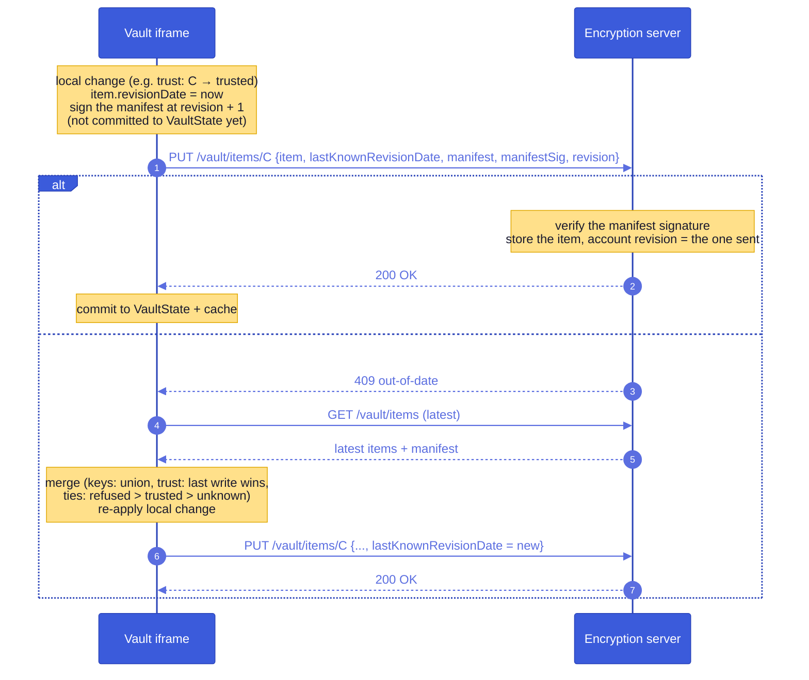
```mermaid
%%{init: {'theme':'base','look':'classic','themeVariables':{'actorBkg':'#3b5bdb','actorTextColor':'#fff','actorBorder':'#2942b8','signalColor':'#5b6ee0','signalTextColor':'#5b6ee0','noteBkgColor':'#ffe08a','noteTextColor':'#1a1a2e','noteBorderColor':'#e0a800','sequenceNumberColor':'#fff'}}}%%
sequenceDiagram
  autonumber
  participant V as Vault iframe
  participant API as Encryption server
  Note over V: local change (e.g. trust: C → trusted)<br/>item.revisionDate = now<br/>sign the manifest at revision + 1<br/>(not committed to VaultState yet)
  V->>API: PUT /vault/items/C {item, lastKnownRevisionDate, manifest, manifestSig, revision}
  alt item and account revisions both as expected
    Note over API: verify the manifest signature<br/>store the item, account revision = the one sent
    API-->>V: 200 OK
    Note over V: commit to VaultState + cache
  else another device wrote first
    API-->>V: 409 out-of-date
    V->>API: GET /vault/items (latest)
    API-->>V: latest items + manifest
    Note over V: merge (keys: union, trust: last write wins,<br/>ties: refused > trusted > unknown)<br/>re-apply local change
    V->>API: PUT /vault/items/C {..., lastKnownRevisionDate = new}
    API-->>V: 200 OK
  end
```

<a id="s7-5"></a>

### 7.5 Add a device via approval (QR): the primary path

A new device gets the keys either from a device that already has them (this flow) or from the recovery phrase ([7.2](#s7-2)). Here, an enrolled, unlocked device forwards the **VRK and the identity secret key**, wrapped to a pairing key the new device generated: the VRK opens the vault, and the identity key signs the new device's first vault pull ([6.4](#s6-4)), which it needs to obtain the vault containing that same key. The recovery phrase is never involved; it is not on the device anyway.

The new device shows the **fingerprint** of its pairing public key (128 bits, 40 digits), as a QR code to scan or as digits to type. It is public, so seeing it gives nothing; it only lets the enrolled device check that the server passed on the right key. 128 bits is enough for a key used once and for minutes, and keeps the digits short enough to type.

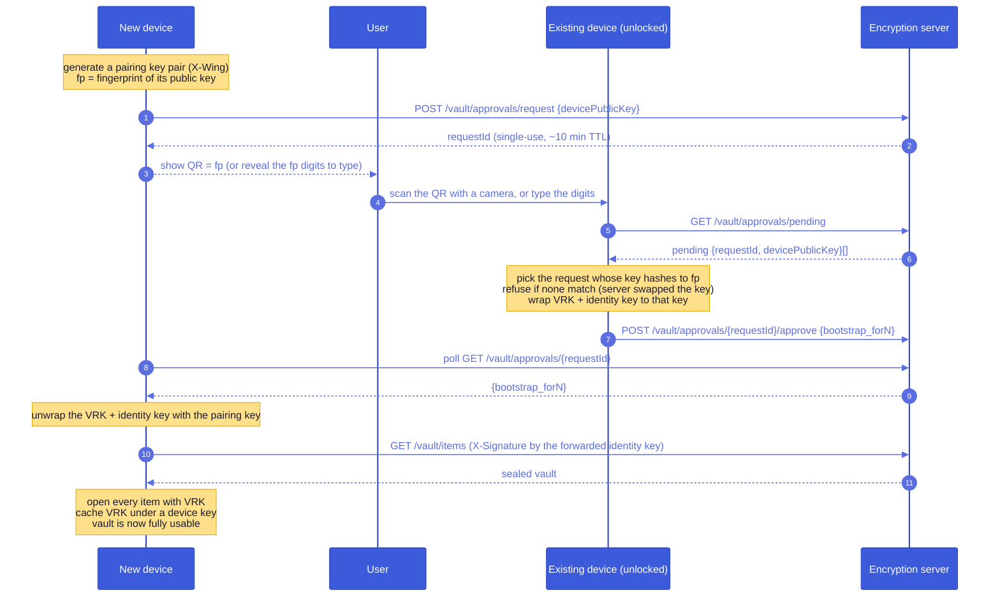
```mermaid
%%{init: {'theme':'base','look':'classic','themeVariables':{'actorBkg':'#3b5bdb','actorTextColor':'#fff','actorBorder':'#2942b8','signalColor':'#5b6ee0','signalTextColor':'#5b6ee0','noteBkgColor':'#ffe08a','noteTextColor':'#1a1a2e','noteBorderColor':'#e0a800','sequenceNumberColor':'#fff'}}}%%
sequenceDiagram
  autonumber
  participant N as New device
  participant U as User
  participant E as Existing device (unlocked)
  participant API as Encryption server
  Note over N: generate a pairing key pair (X-Wing)<br/>fp = fingerprint of its public key
  N->>API: POST /vault/approvals/request {devicePublicKey}
  API-->>N: requestId (single-use, ~10 min TTL)
  N-->>U: show QR = fp (or reveal the fp digits to type)
  U->>E: scan the QR with a camera, or type the digits
  E->>API: GET /vault/approvals/pending
  API-->>E: pending {requestId, devicePublicKey}[]
  Note over E: pick the request whose key hashes to fp<br/>refuse if none match (server swapped the key)<br/>wrap VRK + identity key to that key
  E->>API: POST /vault/approvals/{requestId}/approve {bootstrap_forN}
  N->>API: poll GET /vault/approvals/{requestId}
  API-->>N: {bootstrap_forN}
  Note over N: unwrap the VRK + identity key with the pairing key
  N->>API: GET /vault/items (X-Signature by the forwarded identity key)
  API-->>N: sealed vault
  Note over N: open every item with VRK<br/>cache VRK under a device key<br/>vault is now fully usable
```

The enrolled device wraps the keys only if the key the server gives it matches that fingerprint. To substitute its own key, a server would need one with the same 128-bit fingerprint, which is computationally infeasible (about 2^128 operations). The new device then pulls the vault and opens every item with the VRK, so it ends up with a complete vault.

**What the fingerprint does not cover.** Anyone with the pairing public key, the server included, can wrap something to it. The fingerprint therefore protects only one direction (the enrolled device wraps to the right key), not the other: a fully malicious server could wrap its own VRK and serve a consistent vault under an **attacker identity**, which a brand-new device, with nothing to compare against, would adopt. This is the general case of a server substituting an identity ([3.1](#s3-1), [5.4](#s5-4)), not a weakness of pairing, and it is bounded enough that no second out-of-band check is added:

- **An enrolled device cannot be switched over silently.** It checks any pulled manifest against the identity it already trusts; the attacker's signature does not match, so it refuses ([7.7](#s7-7)). Fooling it needs the real identity's private key, which never left it.
- **The fake identity is useless unless the directory is substituted too.** Others can only encrypt to it if the attacker publishes it in the directory, which contacts who recorded the real identity detect ([5.4](#s5-4)), and which a transparency log would make auditable later ([Appendix D](#appendix-d)).
- **Only new content is exposed.** Existing documents stay under the real keys. Only what the user creates on the misled device is at risk, and it shows as a fingerprint change to every contact who recorded the real identity.

Explaining a refusal to the user, and telling it apart from a **legitimate** vault switch made on another device, is the reconciliation flow ([7.9](#s7-9)). In short, controlling the server does **not** allow reading content or silently taking over an enrolled device; at most, and detectably, it can mislead a brand-new device or reshuffle data that stays unreadable.

<a id="s7-6"></a>

### 7.6 Change the recovery phrase

Cheap: only the VRK is wrapped again; the items are untouched. The old Recovery Kit stops working, so the new one is shown first, and the keyring is written only once the user confirms it is saved; giving up midway leaves the old phrase valid. If a trusted contact's recovery is currently granted on this vault, the write must also **burn and re-arm** every granted escrow (the emergency phrase the contact saw dies, a fresh one replaces it), or the server rejects it ([8.5](#s8-5)). (1Password avoids a new printout by keeping two secrets, a memorized password that can change and a printed Secret Key that never does; this service has one secret by design.)

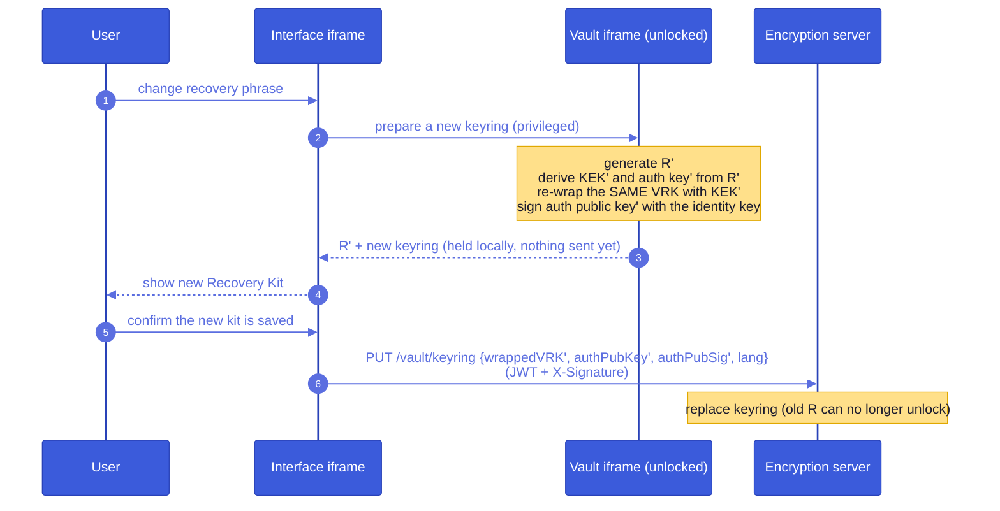
```mermaid
%%{init: {'theme':'base','look':'classic','themeVariables':{'actorBkg':'#3b5bdb','actorTextColor':'#fff','actorBorder':'#2942b8','signalColor':'#5b6ee0','signalTextColor':'#5b6ee0','noteBkgColor':'#ffe08a','noteTextColor':'#1a1a2e','noteBorderColor':'#e0a800','sequenceNumberColor':'#fff'}}}%%
sequenceDiagram
  autonumber
  participant U as User
  participant UI as Interface iframe
  participant V as Vault iframe (unlocked)
  participant API as Encryption server
  U->>UI: change recovery phrase
  UI->>V: prepare a new keyring (privileged)
  Note over V: generate R'<br/>derive KEK' and auth key' from R'<br/>re-wrap the SAME VRK with KEK'<br/>sign auth public key' with the identity key
  V-->>UI: R' + new keyring (held locally, nothing sent yet)
  UI-->>U: show new Recovery Kit
  U->>UI: confirm the new kit is saved
  UI->>API: PUT /vault/keyring {wrappedVRK', authPubKey', authPubSig', lang}<br/>(JWT + X-Signature)
  Note over API: replace keyring (old R can no longer unlock)
```

<a id="s7-7"></a>

### 7.7 Integrity failure handling

If the manifest signature does not verify, or the revision went backwards, the device refuses the data and keeps its last good state ([6.3](#s6-3) describes what the user sees today).

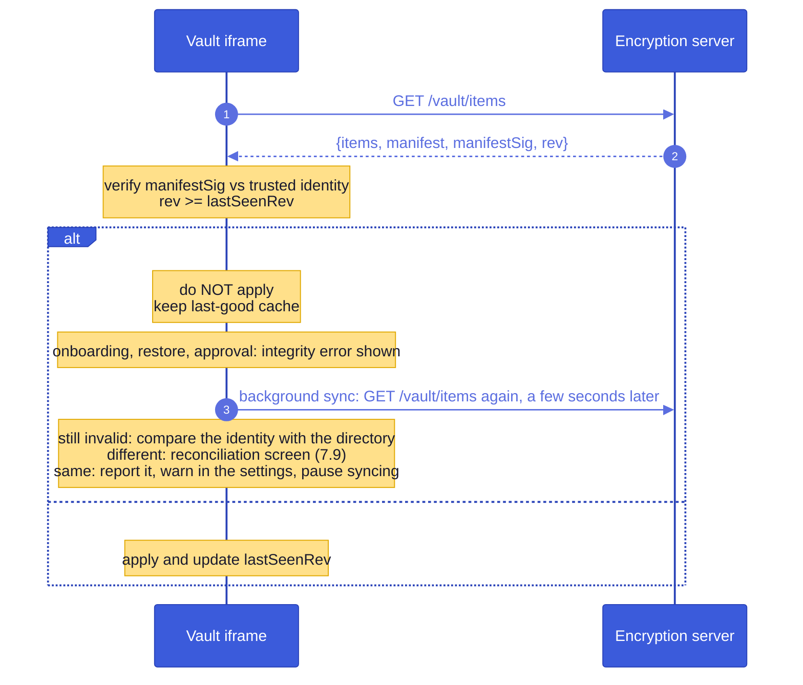
```mermaid
%%{init: {'theme':'base','look':'classic','themeVariables':{'actorBkg':'#3b5bdb','actorTextColor':'#fff','actorBorder':'#2942b8','signalColor':'#5b6ee0','signalTextColor':'#5b6ee0','noteBkgColor':'#ffe08a','noteTextColor':'#1a1a2e','noteBorderColor':'#e0a800','sequenceNumberColor':'#fff'}}}%%
sequenceDiagram
  autonumber
  participant V as Vault iframe
  participant API as Encryption server
  V->>API: GET /vault/items
  API-->>V: {items, manifest, manifestSig, rev}
  Note over V: verify manifestSig vs trusted identity<br/>rev >= lastSeenRev
  alt invalid signature or rolled-back revision
    Note over V: do NOT apply<br/>keep last-good cache
    Note over V: onboarding, restore, approval: integrity error shown
    V->>API: background sync: GET /vault/items again, a few seconds later
    Note over V: still invalid: compare the identity with the directory<br/>different: reconciliation screen (7.9)<br/>same: report it, warn in the settings, pause syncing
  else valid
    Note over V: apply and update lastSeenRev
  end
```

<a id="s7-8"></a>

### 7.8 Lost access: disable, reactivate, or reset

A user who lost their recovery phrase and every enrolled device leaves encryption. This **disables** the identity and the vault keyring (`disabledAt` set, rows kept) but leaves the **encryption key row valid**, so a later reactivation restores the _same_ key. The directory lists only active identities, so a disabled user disappears from it and nobody can share with them, while the keys stay intact for recovery. Nothing is deleted, so a stolen token can hide data, never destroy it.

**The directory ledger is permanent.** Identities and encryption-key versions, with their dates and `disabledAt`, are never deleted. They are the audit trail and the source of the counters, which therefore never reset: a returning user's next key is the previous maximum plus one.

**Vault content can be purged.** The wrapped VRK and the encrypted items are the only sensitive material, since they hold private keys. A scheduled job deletes them once a vault has been disabled for a year, which also limits how long private keys stay at rest. **Status: planned.** The job does not exist yet, so a disabled vault is kept, and can be reactivated, indefinitely.

**Reactivation and reset.** Within that period, the right recovery phrase reactivates the dormant vault: the key derived from it matches that vault's stored auth public key, which identifies the vault and proves ownership at once. After it, or when no disabled vault matches, the user starts a new vault under a new identity, and the old encrypted content is lost.

**Starting over never destroys the previous vault.** A user can have several vaults over time: one **active** (the one devices sync with) and **dormant** ones left by previous starts. Starting over creates a new identity and vault and marks the active vault dormant, in the same transaction. The dormant vault keeps its wrapped VRK and items, so its **own** phrase can still recover it within the retention period. Trusted-contact escrows ([Section 8](#s8)) follow the same rule: they stay bound to their vault and survive a start-over, so a stolen session cannot erase the user's recovery routes by resetting; they disappear only when that vault's content is purged ([8.6](#s8-6)).

**The phrase selects its own vault**: the proof matches exactly the keyring whose auth key the phrase derives, so the client never names a vault, and sync and writes always target the single active one. Making a dormant vault current again only flips states: the recovered keyring becomes active, the previous one dormant (still recoverable by its own phrase), and the directory points again at the recovered vault's identity and latest encryption key. No new registration is needed, since each keyring records its identity. The user confirms first, and is told which vault is being put to sleep, so switching vaults is never silent.

The vault's lifecycle, with its two irreversible steps (the purge, and the new onboarding after it):


```mermaid
%%{init: {'theme':'base','look':'classic','themeVariables':{'fontSize':'15px','primaryColor':'#3b5bdb','primaryTextColor':'#fff','primaryBorderColor':'#2942b8','lineColor':'#5b6ee0','tertiaryColor':'#fff','labelBackgroundColor':'#ffffff','edgeLabelBackground':'#ffffff','transitionColor':'#5b6ee0','transitionLabelColor':'#33406b','noteBkgColor':'#ffe08a','noteTextColor':'#1a1a2e','noteBorderColor':'#e0a800'},'themeCSS':'.edgeLabel p{background-color:#fff;padding:4px 10px;border-radius:5px;margin:0;} .edgeLabel .labelBkg{background:transparent;} .statediagram-state .nodeLabel p{font-size:15px;padding:5px 12px;margin:0;}','stateDiagram':{'nodeSpacing':70,'rankSpacing':110,'padding':14,'useMaxWidth':true}}}%%
stateDiagram-v2
  direction LR
  [*] --> active: onboarding<br/>(identity + encryption key + vault keyring)
  active --> dormant: de-onboard<br/>(soft-disable identity and keyring, disabledAt set)
  dormant --> active: correct recovery phrase within the retention window<br/>(/vault/reactivate, same encryption key restored)
  dormant --> purged: retention job (planned), disabledAt older than 1 year<br/>(wrapped VRK + sealed items deleted)
  purged --> active: onboarding a FRESH vault<br/>(new identity generation, old content lost)
  note right of purged
    The directory ledger is never purged: identity
    generations and key versions keep their dates and
    disabledAt forever, so the counters never reset
    (a returning user gets ledger max + 1).
    Emergency escrows follow the vault, so they stay
    exercisable while dormant and die only here (8.6).
  end note
```

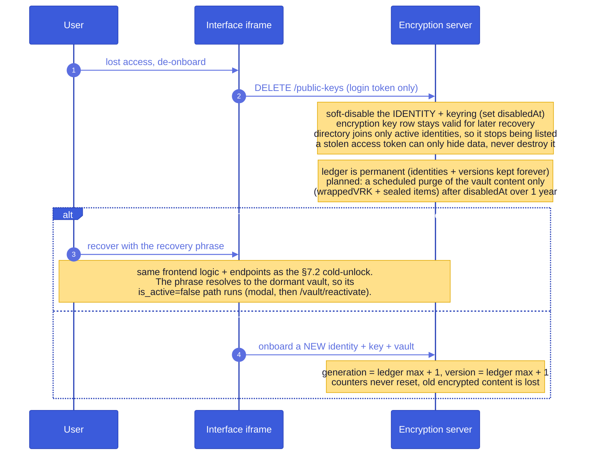
```mermaid
%%{init: {'theme':'base','look':'classic','themeVariables':{'actorBkg':'#3b5bdb','actorTextColor':'#fff','actorBorder':'#2942b8','signalColor':'#5b6ee0','signalTextColor':'#5b6ee0','noteBkgColor':'#ffe08a','noteTextColor':'#1a1a2e','noteBorderColor':'#e0a800','sequenceNumberColor':'#fff'}}}%%
sequenceDiagram
  autonumber
  participant U as User
  participant V as Interface iframe
  participant API as Encryption server
  U->>V: lost access, de-onboard
  V->>API: DELETE /public-keys (login token only)
  Note over API: soft-disable the IDENTITY + keyring (set disabledAt)<br/>encryption key row stays valid for later recovery<br/>directory joins only active identities, so it stops being listed<br/>a stolen access token can only hide data, never destroy it
  Note over API: ledger is permanent (identities + versions kept forever)<br/>planned: a scheduled purge of the vault content only<br/>(wrappedVRK + sealed items) after disabledAt over 1 year
  alt within retention window, user re-enters the recovery phrase
    U->>V: recover with the recovery phrase
    Note over U,API: same frontend logic + endpoints as the §7.2 cold-unlock.<br/>The phrase resolves to the dormant vault, so its<br/>is_active=false path runs (modal, then /vault/reactivate).
  else phrase matches nothing or vault already purged
    V->>API: onboard a NEW identity + key + vault
    Note over API: generation = ledger max + 1, version = ledger max + 1<br/>counters never reset, old encrypted content is lost
  end
```

Two details the diagram leaves out:

- **Nothing secret crosses the network.** The device sends only a challenge id and a signature; the phrase, the KEK and the VRK never leave it. The server stores each keyring's auth public key and wrapped VRK, never the phrase or a hash of it. A database thief can test a phrase guess offline against them (derive with Argon2id, compare the public key), which 256 bits of entropy makes hopeless.
- **One challenge for every parameter set.** When the device tries several KDF parameter sets ([7.2](#s7-2)), all attempts reuse one short-lived challenge, consumed only on success; that is safe because each attempt costs a full Argon2 derivation and the phrase has 256 bits of entropy. This only happens on restore: an enrolled device syncs with the active keyring directly (`/vault/items`, signed by the identity key).

<a id="s7-9"></a>

### 7.9 Reconciliation: when this device and the server disagree

[7.8](#s7-8) covers a device with **no VRK**, only a recovery phrase. This section covers the opposite: a device that **still holds its VRK** but finds the server no longer lists its identity (disabled from another device) or lists a **different** one (another device onboarded again). The settings screen detects it by comparing the local identity fingerprint with the directory's active identity, and since both must agree before anything else works, asks the user to choose:

- **Disabled elsewhere** (no active identity): _reactivate this device_ (below) or _leave encryption_ on this device.
- **Diverged** (another identity is active): _keep this device's identity_ (reactivate, which demotes the other, whose devices must then choose in turn), _take the server's identity_ (discard local keys and get the active ones from a device or the phrase), or _leave encryption_.

**Reactivation from a device needs no recovery phrase**, because the device already holds the VRK the phrase would unlock. It opens its own vault with the cached VRK and proves again that it holds the keys inside (the dual proof of registration). The server then re-enables the identity and its encryption key and makes this identity's keyring active, demoting any other, so identity and vault come back together. No wrapped VRK is released; the device does not need it.

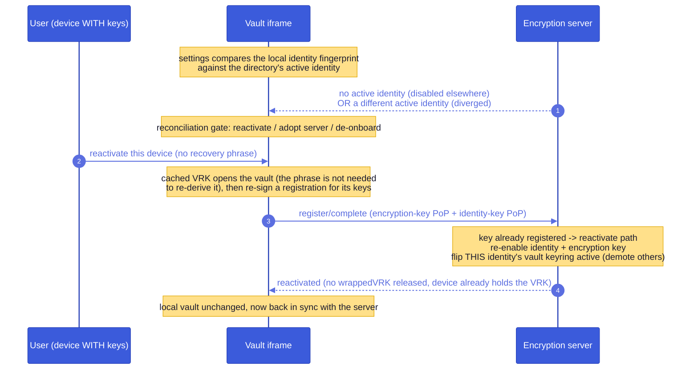
```mermaid
%%{init: {'theme':'base','look':'classic','themeVariables':{'actorBkg':'#3b5bdb','actorTextColor':'#fff','actorBorder':'#2942b8','signalColor':'#5b6ee0','signalTextColor':'#5b6ee0','noteBkgColor':'#ffe08a','noteTextColor':'#1a1a2e','noteBorderColor':'#e0a800','sequenceNumberColor':'#fff'}}}%%
sequenceDiagram
  autonumber
  participant U as User (device WITH keys)
  participant V as Vault iframe
  participant API as Encryption server
  Note over V: settings compares the local identity fingerprint<br/>against the directory's active identity
  API-->>V: no active identity (disabled elsewhere)<br/>OR a different active identity (diverged)
  Note over V: reconciliation gate: reactivate / adopt server / de-onboard
  U->>V: reactivate this device (no recovery phrase)
  Note over V: cached VRK opens the vault (the phrase is not needed<br/>to re-derive it), then re-sign a registration for its keys
  V->>API: register/complete (encryption-key PoP + identity-key PoP)
  Note over API: key already registered -> reactivate path<br/>re-enable identity + encryption key<br/>flip THIS identity's vault keyring active (demote others)
  API-->>V: reactivated (no wrappedVRK released, device already holds the VRK)
  Note over V: local vault unchanged, now back in sync with the server
```

---

<a id="s8"></a>

## 8. Emergency access (trusted contacts)

The recovery routes of [Section 7](#s7) assume the user still has an enrolled device or the printed phrase. Emergency access covers the case where both are gone. It follows Bitwarden's Emergency Access, adapted to this design:

1. The user (the **grantor**) designates a **trusted contact**, another user of the service who already has keys. Designation immediately sets up a dormant recovery route for that contact.
2. If the grantor is locked out, the contact requests recovery. A wait chosen by the grantor starts (7, 15 or 30 days, or custom up to 90), during which the grantor can refuse from any logged-in session.
3. If the grantor does nothing, the contact receives an emergency recovery phrase, prints it as a kit, and hands it over in person.

**Alternatives set aside:**

- **An organization-held recovery key.** Organizations deploying LaSuite differ widely in maturity; in most, such a key would be a permanent master key in ordinary IT hands, and one compromised key or coerced administrator would expose every vault. Organization-level recovery could later be built on this mechanism (an organization identity acting as a mandatory contact) without changing it.
- **M-of-N (Shamir) recovery.** Requiring several contacts sounds stronger but multiplies coordination, misunderstanding and failure (one unreachable holder blocks everyone). One well-chosen contact behind a delay is enough; since the escrow stores one capsule per contact, shares could still be added later.

**Scope.** Recovering the login itself remains the identity provider's job; this feature covers only encryption, and the printed Kit remains the main, instant route. A grantor who also lost their login can use the flow once they can log in again. If the grantor died or is incapacitated, the contact ends up with a phrase that reads nothing on its own: the server serves the vault only to the grantor's session, and documents stay behind that session in the products. Actual access then needs a legal or administrative process (succession, action on the grantor's account), which emergency access makes meaningful but does not replace.

No new cryptography is involved: every step reuses the keyring derivation ([4.3](#s4-3)), the usual wrap to a user ([5.2](#s5-2)) and the framed Ed25519 signatures ([5.5](#s5-5)).

<a id="s8-1"></a>

### 8.1 The escrow: a dormant emergency passphrase, a second credential of the same vault

The escrow is neither the grantor's own phrase (it would die at every phrase change) nor the raw VRK (the contact would have to open and rebuild the whole vault, seeing private keys and the TOFU registry). It is a **new, dormant emergency phrase** for the grantor's vault: one vault with several credentials, like LUKS keyslots ([4.4](#s4-4)).

At designation, the grantor's open vault iframe generates a fresh emergency phrase `E` (24 words, in the grantor's wordlist), derives from it a **credential** exactly as for the recovery phrase (its own KEK wrapping the same VRK, its own auth key), and wraps the entropy of `E` to the contact's active encryption key: the **capsule**. The formulas are in [4.3](#s4-3).

The credential opens the **same** vault (same VRK, same items) but stays **dormant**: the unlock proof ignores it until recovery is approved ([8.3](#s8-3)). The grantor's vault discards `E` as soon as the credential and capsule are built; it is never stored or shown on the grantor's side. The contact's encryption-key version used for the wrap is recorded (`granteeKeyVersion`), so the grantor's settings can later notice that the capsule targets an old key and offer to refresh it ([8.6](#s8-6)).

**The contact never opens the vault.** They only ever hold a phrase, and since the server serves the vault only to the grantor's own session, that phrase reads nothing by itself: no private key, document or TOFU entry ever reaches the contact. Nothing is copied either: the grantor keeps their vault, identity, devices and contacts, and gains one more way in. What is handed over is a recovery kit, an object users already know.

**Designation requires a verified contact.** The contact's identity must be **`trusted`** in the grantor's TOFU registry, which means checked out-of-band; `unknown`, enough for sharing ([5.4](#s5-4)), is refused here. That is what stops a server from substituting the contact's key at designation: the wrap targets the bound key of an identity a person verified.

**The escrow signature.** Each escrow is signed by the grantor's identity key, with context `lasuite-encryption/emergency-escrow/v1` ([4.3](#s4-3) gives the bytes), over the grantor and contact ids, the contact's identity public key, the wait, the creation time, and SHA-256 hashes of the credential's auth verifier (the verifier itself never reaches a client) and of the capsule. The server checks it at write against the grantor's **active** identity, along with the credential's own auth binding; at designation and re-arm it also requires the contact's identity and key version to be the current ones. Three parties check it:

- **the grantor's devices**, auditing the escrow list: a row the grantor never created, or one with a swapped contact, wait, credential or capsule, fails and raises an integrity warning ([7.7](#s7-7));
- **the contact at reveal time**, against the grantor identity **pinned in their own TOFU registry**, refusing on any mismatch;
- **the server at write time**, as a consistency check.

It does **not** stop the server from releasing a capsule early or hiding rows: the wait is server policy, as in Bitwarden ([8.3](#s8-3), [Section 3](#s3)).

<a id="s8-2"></a>

### 8.2 State machine

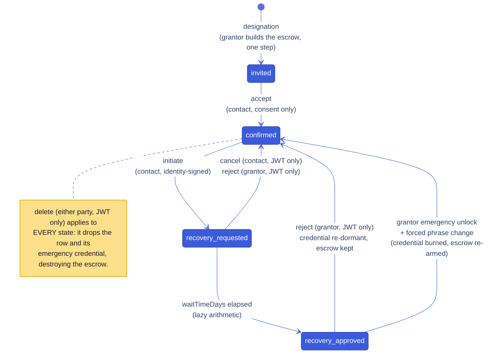
```mermaid
%%{init: {'theme':'base','look':'classic','themeVariables':{'fontSize':'15px','primaryColor':'#3b5bdb','primaryTextColor':'#fff','primaryBorderColor':'#2942b8','lineColor':'#5b6ee0','tertiaryColor':'#fff','labelBackgroundColor':'#ffffff','edgeLabelBackground':'#ffffff','transitionColor':'#5b6ee0','transitionLabelColor':'#33406b','noteBkgColor':'#ffe08a','noteTextColor':'#1a1a2e','noteBorderColor':'#e0a800'},'themeCSS':'.edgeLabel p{background-color:#fff;padding:4px 10px;border-radius:5px;margin:0;} .edgeLabel .labelBkg{background:transparent;} .statediagram-state .nodeLabel p{font-size:15px;padding:5px 12px;margin:0;}','stateDiagram':{'nodeSpacing':70,'rankSpacing':110,'padding':14,'useMaxWidth':true}}}%%
stateDiagram-v2
  direction TB
  [*] --> invited: designation<br/>(grantor builds the escrow, one step)
  invited --> confirmed: accept<br/>(contact, consent only)
  confirmed --> recovery_requested: initiate<br/>(contact, identity-signed)
  recovery_requested --> recovery_approved: waitTimeDays elapsed<br/>(lazy arithmetic)
  recovery_requested --> confirmed: cancel (contact, JWT only)<br/>reject (grantor, JWT only)
  recovery_approved --> confirmed: reject (grantor, JWT only)<br/>credential re-dormant, escrow kept
  recovery_approved --> confirmed: grantor emergency unlock<br/>+ forced phrase change<br/>(credential burned, escrow re-armed)
  note right of confirmed
    delete (either party, JWT only) applies to
    EVERY state: it drops the row and its
    emergency credential, destroying the escrow.
  end note
```

**Designation is one step**, unlike Bitwarden's invite, accept and confirm: contacts are existing users found by exact email, their keys already exist and are verified, so the escrow is built at once. Acceptance is only consent (no invitation token or email to an outsider, no second step for the grantor). Bitwarden's "view" and "takeover" types are merged too: this server holds no documents, so viewing would expose the same keys while reading nothing. The only capability is **recover**.

**There is no early approval.** It could only be authenticated by the grantor's login, since a grantor who needs recovery has no vault left to sign with. It would then be exactly as strong as a stolen token, and a thief who also won over the contact could cut the wait to zero. The wait is the whole protection, so **nothing reachable with a login alone can shorten it**. Cooperation does not need it: a grantor with an enrolled device does not need emergency access (any open vault can make a new Kit, [7.6](#s7-6)), and one without waits the delay they chose.

**Reject and cancel need only a login**, because the worst a stolen session can do with them is deny a recovery. Reject also works after approval: it makes the credential dormant again, killing a phrase revealed but not yet used, and returns to `confirmed` with the escrow kept. A grantor who no longer trusts the contact deletes the relationship instead, which destroys the credential and the row. The wait is offered as 7, 15 or 30 days or a custom value, validated between 1 and 90 by the server (the interface warns that a short wait is risky over holidays). Changing it signs the escrow again, since the wait is covered, and is only possible outside a running recovery.

<a id="s8-3"></a>

### 8.3 The wait period: lazy arithmetic is the authority, the hourly job is for humans

Two mechanisms, with different jobs:

- **The check at release is for security.** Every release point (capsule release in `recover`, and admitting the emergency credential in the unlock proof of [7.2](#s7-2)) recomputes `recoveryRequestedAt + waitTimeDays <= now()` and trusts that, not the stored status; `recover` also updates the status (and sends the approval emails) if the job missed it. A dead job can silence emails, never change the wait.
- **The hourly job is for people.** Under a PostgreSQL advisory lock, so several server instances never send twice, it moves overdue requests to `recovery_approved` and emails both parties, sends the reminders below, and deletes designations never accepted after 90 days.

**Reminders** while a request runs, based on the time left before approval: monthly while more than 30 days remain, weekly in the last 30, daily in the last 7, and every 6 hours in the last 2 (so even a one-day wait gets reminders). Reminders stop once the request is approved. Bitwarden sends one reminder on the last day; waits here can span holidays, and the grantor's ability to object is the whole security of the scheme. Email is essential for the same reason: the notice must reach the grantor outside the app, and refusing needs only a login. The notice of a new request is sent **before** its status changes, and a failed send fails the request. Every other step notifies too: designation, acceptance, approval and completed recovery (both parties), rejection, cancellation, revocation. Links point to a product page set per deployment (`EMAIL_PRODUCT_URL`), with no tokens or deep links; after login, the vault fetches what is pending in the background and the SDK shows the right prompt ([8.7](#s8-7)).

<a id="s8-4"></a>

### 8.4 Flows

**Designating a trusted contact (one step).**

```mermaid
%%{init: {'theme':'base','look':'classic','themeVariables':{'actorBkg':'#3b5bdb','actorTextColor':'#fff','actorBorder':'#2942b8','signalColor':'#5b6ee0','signalTextColor':'#5b6ee0','noteBkgColor':'#ffe08a','noteTextColor':'#1a1a2e','noteBorderColor':'#e0a800','sequenceNumberColor':'#fff'}}}%%
sequenceDiagram
  autonumber
  participant G as Grantor
  participant UIg as Interface (grantor)
  participant API as Encryption server
  participant UIt as Interface (contact)
  participant T as Trusted contact
  G->>UIg: designate a trusted contact
  UIg->>API: GET /emergency-access/search?email=...
  API-->>UIg: matching ONBOARDED user (or "must onboard first")
  Note over G,T: out-of-band fingerprint verification<br/>(QR or spoken digits, existing verify flow)<br/>MANDATORY unless already trusted
  G->>UIg: choose wait time, designate
  UIg->>UIg: vault op create-emergency-escrow (privileged)
  Note over UIg: require trust status trusted<br/>generate emergency phrase E (never stored)<br/>derive dormant credential (wrapped VRK, auth key)<br/>wrap entropy(E) to the contact's X-Wing key<br/>sign the escrow binding (identity key)
  UIg->>API: POST /emergency-access<br/>{credential, capsule, granteeIdentityPub, signature, waitTimeDays}
  Note over API: verify the auth binding + escrow signature<br/>against the grantor's ACTIVE identity<br/>check the pinned identity and key version<br/>are the contact's CURRENT ones<br/>row {status: invited}, credential DORMANT<br/>(the server can read neither)
  API-->>T: email, G designated you as trusted contact
  T->>UIt: open a product, the SDK surfaces the invitation
  UIt->>API: POST /emergency-access/:id/accept (consent only)
  Note over API: status: confirmed
  API-->>G: email, T accepted
```

**Requesting access, refusal or grant, recovery.**

```mermaid
%%{init: {'theme':'base','look':'classic','themeVariables':{'actorBkg':'#3b5bdb','actorTextColor':'#fff','actorBorder':'#2942b8','signalColor':'#5b6ee0','signalTextColor':'#5b6ee0','noteBkgColor':'#ffe08a','noteTextColor':'#1a1a2e','noteBorderColor':'#e0a800','sequenceNumberColor':'#fff'}}}%%
sequenceDiagram
  autonumber
  participant T as Trusted contact
  participant UIt as Interface (contact)
  participant API as Encryption server
  participant UIg as Interface (grantor)
  participant G as Grantor
  T->>UIt: request emergency access (confirmation modal)
  Note over UIt: the request carries the per-request proof<br/>signed with T's IDENTITY key (vault open, 6.4)
  UIt->>API: POST /emergency-access/:id/initiate
  Note over API: verify against T's registered identity<br/>email the grantor FIRST<br/>(a failed send fails the call)<br/>status: recovery_requested
  API-->>G: email, T requested access,<br/>you have N days to refuse
  alt grantor refuses (JWT only, no vault needed, from the email link or the product modal)
    G->>API: POST /emergency-access/:id/reject
    Note over API: back to confirmed, credential re-dormant, escrow kept
    API-->>T: email, request refused
  else grantor says nothing
    Note over API: reminder emails to the grantor: monthly,<br/>then weekly (last 30 days), daily (last 7),<br/>every 6 hours (last 2)<br/>auto-approve after waitTimeDays<br/>(deadline also re-checked lazily at release)
    Note over API: status: recovery_approved
    API-->>T: email, access granted
    API-->>G: email, access was granted to T
    T->>UIt: reveal the emergency phrase (identity-signed request)
    API-->>UIt: {capsule, escrow record, grantor lang}
    Note over UIt: vault op (privileged), all client-side:<br/>verify the escrow signature against the<br/>PINNED grantor identity (fail-closed)<br/>unwrap the entropy with own private key<br/>render the 24-word phrase, print the kit<br/>repeatable while approved, nothing persisted
    T->>G: hand over the kit (in person)
    G->>UIg: normal cold unlock with E<br/>(the server accepts the now-live credential)
    Note over UIg: forced immediately, before anything else:<br/>set a NEW personal phrase (7.6 flow)
    UIg->>API: atomic write: new primary credential<br/>+ burn the used emergency credential<br/>+ re-arm ALL approved escrows (fresh E', capsule')
    Note over API: status back to confirmed<br/>emails both parties
  end
```

<a id="s8-5"></a>

### 8.5 Recovery, then burn + re-arm

While recovery is granted, the server releases one thing to the contact: the capsule, with the signed escrow record and the grantor's wordlist `lang`; never items or keys. The contact's vault checks the escrow signature against the grantor identity pinned in the contact's own TOFU registry (if the contact never verified the grantor, this is where it fails), unwraps the entropy with the contact's keys (newest first), and rebuilds the 24-word phrase, which the interface shows as a printable kit. The reveal **can be repeated while recovery is granted**: a single display over a wait of up to 90 days would lose phrases, the grantor may take weeks to come back, and the phrase will be burned anyway. Nothing of the grantor's vault is downloaded, decrypted or kept on the contact's side.

The grantor then restores normally ([7.2](#s7-2)) with the handed-over phrase on their own login: the proof matches the now-active emergency credential, and `credential_type` says so. Since the contact has seen the phrase, it is **burned**: the interface forces a phrase change first, and that write ([7.6](#s7-6)), in one serializable transaction:

- replaces the primary credential (new phrase, new Kit),
- deletes the used emergency credential and its capsule, so the phrase the contact knows stops working,
- **re-arms** every relationship granted on this vault with a new phrase, credential and capsule (cheap, since the vault is open and the contacts still trusted), returning each to `confirmed`,
- and emails both parties once done.

The server requires an **exact match**: one re-arm per granted relationship of this vault and nothing else (each signature checked; unlike a designation, the contact's identity and key need not be current, so a contact who changed keys meanwhile cannot block the burn, and the audit flags it instead), or it rejects the write. So no partial change can leave a revealed phrase working, or silently drop the user's contacts. Until the forced change is done, the relationship stays visibly granted.

<a id="s8-6"></a>

### 8.6 Lifecycle

- **The grantor starts over ([7.8](#s7-8)): escrows survive.** They stay bound to the now dormant vault and still work against it: recovering through one lands on that vault and follows the reactivation of [7.2](#s7-2). This way a stolen session cannot erase the user's recovery routes by resetting; the worst it achieves is noise, never permanent lockout. The reverse risk, an old contact reviving a vault the user meant to abandon, is accepted, bounded by the wait, the notices and the contact being a verified person, and stated in the user documentation. Escrows disappear only when the vault content is purged (once the job of [7.8](#s7-8) exists), through cascading deletes. A new vault starts with no contacts, and its empty TOFU registry forces new verifications.
- **The contact starts over** (lost their own vault): the capsule targets keys that no longer exist. The grantor's audit sees that the pinned identity is no longer the contact's active one and is not linked to it, and flags `stale-identity`; the fix is to revoke and designate again, with a new verification.
- **The contact's identity changed legitimately** (continuity chain): the audit walks the chain like the trust check ([5.4](#s5-4)) and keeps the escrow; nothing to do.
- **The contact's encryption key changed**: nothing breaks, since their old key stays in their vault, but the recorded `granteeKeyVersion` is behind, so the audit flags `outdated-key` and the settings offer a **one-click re-arm** (new phrase, credential and capsule, status unchanged).
- **Two contacts recover at once**: each relationship has its own credential for the same VRK, so both can be live; the forced change burns and re-arms **every** granted relationship together, so no revealed phrase survives.
- **Phrase revealed but never handed over**: the credential stays live and shown as granted (both parties received the approval email; reminders stop at approval), and the grantor can reject (killing the phrase) or delete at any time with a login.
- **Designation never accepted**: the row stays `invited`, visible to both, revocable by the grantor, and deleted by the job after 90 days.

<a id="s8-7"></a>

### 8.7 How the emergency routes authenticate

The routes use the tiers of [6.4](#s6-4) with one rule: anything that can release or create key material is signed by the identity key of an open vault; anything that can only deny needs a login alone.

| Tier ([§6.4](#s6-4))         | Emergency routes                                                                            | Why                                                                                                                                                                                                         |
| ---------------------------- | ------------------------------------------------------------------------------------------- | ----------------------------------------------------------------------------------------------------------------------------------------------------------------------------------------------------------- |
| **JWT + identity signature** | designate (`POST`), wait-time change (`PUT`), `rearm`, `initiate`, `recover`                | all performed with an open vault by construction (grantor building an escrow, contact triggering or exercising a recovery), so a stolen OIDC session alone can neither start a recovery nor fetch a capsule |
| **JWT only** (fail-safe)     | `accept`, `cancel`, `reject`, `delete`, the `trusted`/`granted` lists, the contact `search` | a grantor who lost every device must still be able to refuse from a bare login; none of these can release key material or shorten a wait (the worst a stolen session does is deny)                          |
| **Identity signature only**  | `GET /emergency-access/pending`                                                             | fetched by the vault over the silent data plane, so the SDK can auto-surface the pending prompts (a recovery request to refuse, an invitation to accept) on any product page, with no interface and no JWT  |

Designation, re-arm, and burn plus re-arm run in serializable transactions; `initiate` uses a conditional update, so concurrent requests produce exactly one. Rate limits, all counted in memory per server instance: 10 designations per 24 hours per grantor (also bounded by the stored rows), 5 requests per 24 hours per contact, 20 searches per hour. The `search` route necessarily reveals whether an email has an account with keys; that is accepted inside a collaborative suite, where the directory already resolves colleagues, and limited by authentication, exact matching and the rate limit. An address shared by several users matches nobody, rather than guessing between two people.

---

<a id="s9"></a>

## 9. Why the vault is modelled on password managers

The synchronized vault solves the same problem as a password manager: **an encrypted vault only its user can read, synced across devices, unlocked by a secret, stored on a server never trusted with its content**. It holds encryption keys (current and past versions) and a TOFU registry instead of logins and notes, but the mechanics are the same: encrypt on the device, store only ciphertext, sync item by item, recover from a secret. So rather than inventing a scheme, it reuses what fits from mature, audited managers.

**Borrowed:**

- **From Bitwarden, the synchronization model**: a cheap "has anything changed?" check (a revision number), a full pull when it has, and per-item last-write-wins. It is simple, documented and audited, so a reviewer can compare against a known baseline and focus on the differences.
- **From 1Password, the high-entropy secret**: 1Password adds a generated 128-bit Secret Key to the memorized password so a stolen vault cannot be guessed offline. Since users are already logged in through LaSuite's sign-in, this service goes further: the unlock secret is entirely generated (the recovery phrase), with no password at all.

**Not copied:**

- **No password login.** Bitwarden sends a hash of the master password and 1Password uses SRP; neither is needed, since LaSuite authenticates the user and the secret is random. A small proof of the phrase is still required before the vault is released, as defence in depth: the phrase's randomness is what keeps the data secret.
- **No trust in the server for integrity.** A typical synced vault trusts the server not to alter its ciphertext. This one is **signed** with the user's identity key and checked against a locally trusted key and the directory, so tampering is caught even if the server is compromised.

For orientation:

| Dimension                  | Bitwarden                                 | 1Password                                   | **Our solution**                                                                              |
| -------------------------- | ----------------------------------------- | ------------------------------------------- | --------------------------------------------------------------------------------------------- |
| Unlock secret              | Memorised master password                 | Password **+** generated 128-bit Secret Key | **Generated recovery phrase only** (nothing to memorise)                                      |
| Logging in                 | Password hash sent to server              | Zero-knowledge password login (SRP)         | **LaSuite sign-in (OIDC)** + a small "you hold the phrase" proof before the vault is released |
| Server's view of the vault | Ciphertext (trusted not to tamper)        | Ciphertext (trusted not to tamper)          | **Signed** ciphertext, re-verified against a local key + public registry                      |
| Sync & conflicts           | Per-item, poll-then-pull, last-write-wins | Per-item                                    | **Same as Bitwarden**                                                                         |
| What the vault stores      | Logins, notes                             | Logins, notes                               | **Encryption keys (current + rotated history) + a contact TOFU registry**                     |

---

<a id="operational-details"></a>

## Operational details

The sections below describe behaviour that matters for running and maintaining the service but does not change the security model above.

<a id="s10"></a>

## 10. Conflict prevention and resolution

Conflicts are mostly **prevented by the shape of the data**: most of the vault cannot conflict, and what can is small and resolved deterministically.

- **Keys and identities never change and only grow** (the server refuses any rewrite of an existing key item, [6.1](#s6-1)). Devices can only _add_ a version, so merging is a union by version: no conflict is possible. If two devices create the same next version, the server's uniqueness constraint rejects the second, which pulls again and takes the next number, like any concurrent write.
- **Trust entries are the only items that change**, so the only real conflicts (device A trusts a contact, device B refuses them). The rules refine Bitwarden's plain last-write-wins to fail safe:
  1. The entry with the newer **`revisionDate`** wins.
  2. On equal dates, the stronger status wins: **`refused` > `trusted` > `unknown`**, so an explicit decision beats a bare first sighting and a refusal is never lost.
  3. Remaining ties are broken deterministically (tombstone, then fingerprint).
- **Deleting** a trust entry writes a **tombstone** (a `deleted` marker with a `revisionDate`) that takes part in the same last-write-wins, so a stale device cannot bring a forgotten contact back. There is no user-facing trash as in Bitwarden; the tombstone is the minimum needed for correct merges.

The merge is **deterministic, commutative and idempotent**, so every device converges to the same state whatever the order, and the "pull, merge, retry" loop after a 409 is always safe to repeat.

**Difference with Bitwarden.** Bitwarden's server reads each item's `revisionDate` and decides last-write-wins itself; its clients never merge. This server cannot read items, so it still enforces per-item concurrency on the stored `revisionDate` but **merges happen on the client** after a 409. That is acceptable because the only mergeable data is the small trust map; keys never merge.

---

<a id="s11"></a>

## 11. Failure handling

**Failed writes.** A change counts only once the server confirms it. The single write path computes the new state, pushes it (including the pull, merge and retry after a 409), and only then applies it to `VaultState` and the cache. If the push finally fails, the user gets a **blocking error** and the previous state stays: nothing is applied locally and silently lost. There is no offline queue of pending writes across sessions; a change that could not be saved is reported and retried by the user, as in Bitwarden. The 409 loop is not buffering: it resolves a concurrent change within the same operation.

**When the vault syncs.** Background sync runs in the vault (`src/vault/vault-sync-driver.ts`), signed by the identity key, with no interface and no token ([6.4](#s6-4), background tier). It pulls when the vault loads (a product page opens), when the page becomes visible again (`visibilitychange`), whenever the push channel (re)connects, and when the server pushes a wake-up. That push is a **server-sent event** stream (`GET /api/vault/events`) saying only "your vault changed" with the new revision number, never vault content, after which the device does its normal authenticated pull.

**The push only reduces latency; correctness does not depend on it.** A wake-up can be **missed**: the notifier lives in each server process, so with several instances a write on one does not wake a device connected to another (fixable with a shared bus such as PostgreSQL `LISTEN/NOTIFY` or Redis, or routing each user to one instance), and a restart or a dropped connection loses pending wake-ups. Devices converge anyway through the pulls on load, visibility and reconnection, which happen exactly when it matters: users rarely watch two devices at once, they switch, and switching makes a page visible, which pulls. Bitwarden works the same way (push for latency, full pull as the reference).

**Operations that write several records** (onboarding: directory, vault and keyring, [7.1](#s7-1); and encryption-key rotation once it has a flow) commit in a **single database transaction**, which is possible because the directory and the vault share one database. With idempotent writes, a failure or retry can never leave a half-registered state, such as keys published without a recoverable vault. Bitwarden commits key rotation the same way.

**Integrity failures**: refuse, warn, offer a trusted way to rebuild ([6.3](#s6-3), [7.7](#s7-7)).

**Stale directory caches.** The directory answers with an `ETag` and `max-age=60`. Someone caching a user's key may, for up to a minute after a key change or reset, use the previous one, for instance wrapping a document for the superseded key. The window ends at the next revalidation, since the `ETag` changes with the key. In practice it rarely matters: by the time the user acts again, caches have refreshed.

---

<a id="appendix-a"></a>

## Appendix A: Migrating the OIDC provider (subs change)

A deployment can replace its identity provider. The new provider issues new `sub` values for the same people, and nothing breaks cryptographically: internal ids, signatures, vaults and trust records never contain a sub ([2.3](#s2-3)). What the migration affects is how logins and directory lookups reconnect to existing accounts.

**Account email.** `users.email` is the only personal data attached to an account, and it is **required to create one**: it is the only notification channel (emergency access today) and the only automatic link across a provider migration. It is read from the access token's claims; when the provider does not put it there, the server asks the provider's userinfo endpoint with that token (verifying signed `application/jwt` answers against the provider's keys), and rejects the login only if both fail (`email_claim_required`). A **known** login needs no email at all: the requirement only applies when creating the account. Only addresses the provider verified are accepted, unless the deployment sets `OIDC_ACCEPT_UNVERIFIED_EMAIL`. The column is not unique, because one address can end up on two accounts over time (a recycled corporate address given to a new employee while the former one's account remains). The email fallback therefore links a new login only when the address matches exactly one user **and** that user was seen within the last year; otherwise the address is probably recycled, a new account is created, and any merge is left to the operator.

**A hard cutover, not coexistence.** Exactly one issuer is configured (`OIDC_ISSUER`); switching provider is a configuration change, after which the old provider's tokens are all rejected.

**How users reconnect.** At a user's first login after the switch, the token carries an unknown `(issuer, sub)`. It is attached to their existing account by, in order: a mapping prepared by the operator (when the old provider can export old-to-new sub correspondences; no tool is provided, the rows are added to `oidc_accounts` directly), or the verified-email fallback (`OIDC_FALLBACK_TO_EMAIL_FOR_IDENTIFICATION`) described above. If neither applies, the login gets a new empty account, and reconciliation shows the divergence instead of silently splitting the identity ([7.9](#s7-9)).

**What users see meanwhile.** Directory lookups by sub only consider the active issuer, since matching a retired issuer's rows could return another person's key on a sub collision. So colleagues of a user who has not logged in since the switch see them as having **no encryption keys**, and sharing with them is visibly blocked, until that user logs in and their login is relinked. Nothing is lost and nothing relinks wrongly; the person just needs to sign in again.

**For operators:**

1. If the old provider can export a sub mapping, import it at cutover: every mapped user reconnects with no visible effect.
2. Set `OIDC_FALLBACK_TO_EMAIL_FOR_IDENTIFICATION` like the LaSuite products, so a user who carries on seamlessly in Docs does here too.
3. Ask everyone to sign in again soon after the switch: each login, in the products and here, refreshes stored subs and relinks accounts.
4. Old `oidc_accounts` rows are never deleted. They no longer resolve or authenticate, but record which provider issued which login and help with later merges.

---

<a id="appendix-b"></a>

## Appendix B: Email notifications

Email exists almost only for **emergency access** ([Section 8](#s8)): the wait is the grantor's only chance to refuse, so designations, requests, reminders and completions must reach them outside the app. There is no other mail; the rest of the product notifies in the app.

**Rendering.** Emails are built at send time from React components written by developers (`src/server/email/templates/`) through `@faire/mjml-react` and `mjml`. No user-supplied template is ever compiled: user data (addresses, day counts, dates) enters only as React props, which React escapes. The output is static HTML plus a plain-text version derived from it with `html-to-text`; no script survives, and the only link is the product URL configured for the deployment (no tokens, no deep links).

**Supply chain.** The mail toolchain (`mjml`, `@faire/mjml-react`, `html-to-text`, `nodemailer`) is the main added dependency surface. As for every package, versions are pinned exactly, so any upgrade is an explicit, reviewable change.

**Delivery.** The mailer supports a primary and an optional fallback SMTP server and retries once before failing loudly, since a lost email would shorten the grantor's chance to object. An SMTP server is mandatory (`MAILER_SMTP_HOST`): the service refuses to start without one, since silently dropping these emails would remove the grantor's chance to object.

---

<a id="appendix-c"></a>

## Appendix C: Product backend request authorization (explored, not adopted)

> **Status: explored, not adopted.** This records a design that was discussed and set aside: it would add little on top of OIDC authentication and the product's own access control, which already bound what a stolen session can do to encrypted content. Nothing in the products implements it. It is kept here so the reasoning is not lost.

**The problem it addresses.** A stolen login session cannot read encrypted documents, but the product accepts its requests like any other: it could overwrite, delete or change the members of documents it cannot read.

**The design: a signing key per document.** Each encrypted document gets its own Ed25519 key pair. The public half is stored on the document's row in the product. The private half is either encrypted with the document key, so anyone who can read can sign, or wrapped separately to each member allowed to write, which makes read-only access cryptographic. Sensitive requests on the document (saving content, deleting, changing members, removing encryption) carry a signature with that key, which the backend checks against the row, on top of its usual session and role checks.

```mermaid
%%{init: {'theme':'base','look':'classic','themeVariables':{'actorBkg':'#3b5bdb','actorTextColor':'#fff','actorBorder':'#2942b8','signalColor':'#5b6ee0','signalTextColor':'#5b6ee0','noteBkgColor':'#ffe08a','noteTextColor':'#1a1a2e','noteBorderColor':'#e0a800','sequenceNumberColor':'#fff'}}}%%
sequenceDiagram
  autonumber
  participant V as Member's vault iframe
  participant P as Product backend
  Note over P: document D's row holds D's public signing key
  Note over V: unwrap D's private signing key<br/>(with the document key, or from the member's own wrap)
  V->>P: request on D (save, delete, change members)<br/>signed with D's signing key
  Note over P: usual session and role checks<br/>then check the signature against D's public key
  alt signature valid
    Note over P: apply the request
  else missing or invalid (e.g. a stolen session without the document's keys)
    Note over P: reject it
  end
```

- **A capability, not an identity**: the signature proves the requester holds the document's key material, which a stolen session alone does not. That holds even if the attacker uses the stolen session to disable the victim's identity and register a new one: the document's keys stay wrapped to the victim's previous key, out of the new identity's reach.
- **No directory lookup**: the backend checks against a key it already stores, so it neither calls nor trusts the directory on each request.
- **Removing a member** means a new key pair, rotated together with the document key.
- **Checks on both sides**: the backend verifies to prevent unauthorized writes; clients can verify when reading, to detect a server that swapped the stored public key. CryptPad works this way, with a validation key per document.

**Why not sign with the user's identity key instead.** It looks simpler: requests signed with the identity key, checked by the backend against the directory. But a stolen session can disable the victim's identity and register a new one ([7.8](#s7-8)), so the backend would have to record, for every share, which key version it saw and reject any identity not linked to it, and it would depend on the directory, and trust it, for every request. The per-document key avoids both by construction.

---

<a id="appendix-d"></a>

## Appendix D: Auditing and monitoring

> **Status: planned.** None of this exists yet. Today the server logs errors and the browsers' security reports (CSP, isolation and integrity violations, received on `/api/browser-reports`), but none of the events below.

The cryptography detects most server-side tampering only at the moment a user's device or a contact's check runs into it (a manifest that does not verify, a fingerprint that changed). Auditing adds two things: evidence after the fact, and detection that does not wait for a contact to share.

- **A transparency log of directory writes.** Every publication, disablement or reactivation of an identity or encryption key is appended to a Merkle tree, as in Certificate Transparency or the key transparency of messaging services. The log is kept **outside the encryption server's infrastructure**, and its signed tree head is published where third parties can see it, so a server that rewrites history, or shows different keys to different people, is caught, not only a server that forgets to log. Each user's devices can also check their own entries (self-monitoring), which detects a substituted key even if no contact ever verifies a fingerprint. The directory ledger is already permanent ([7.8](#s7-8)); this makes its history verifiable by others.
- **An email to the user for each new identity or encryption key on their account**, like a "new sign-in" notice. It is cheap, uses the existing mail delivery ([Appendix B](#appendix-b)), and lets the user notice a server-side substitution that today only their contacts' fingerprint checks would catch.
- **Security events an operator can alert on**: identity or key registration, disable and reactivate, recovery-phrase change, device approval, emergency designation, initiation and recovery, de-enroll and purge, and repeated failures of the proofs of possession or of request signatures. Logged with user ids and timestamps only, never key material, following the same allowlist rule as error reporting.
