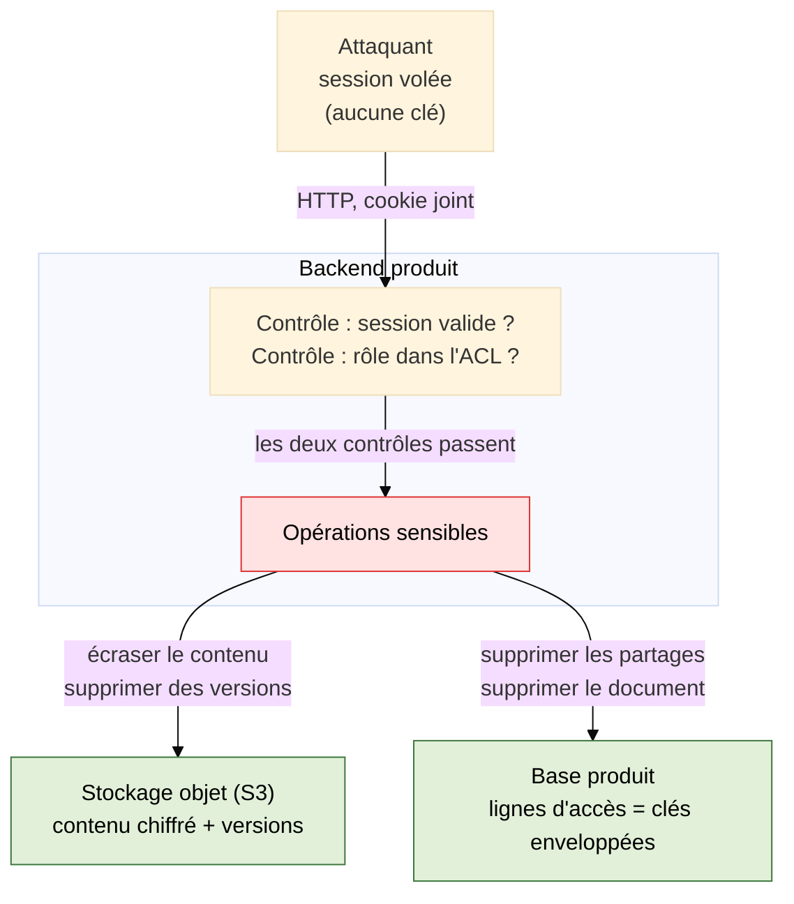
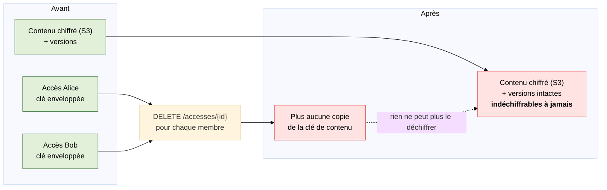
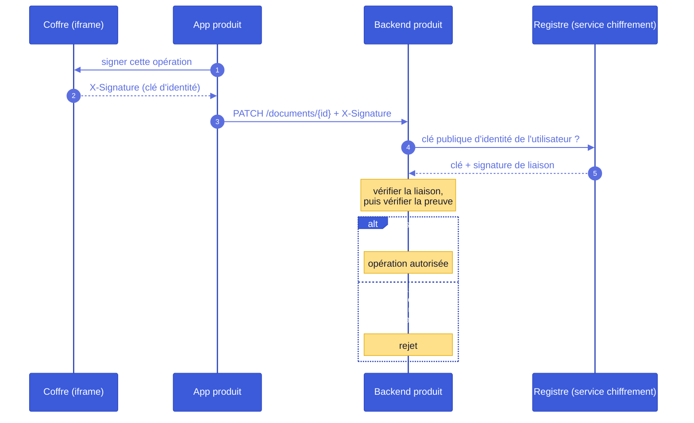
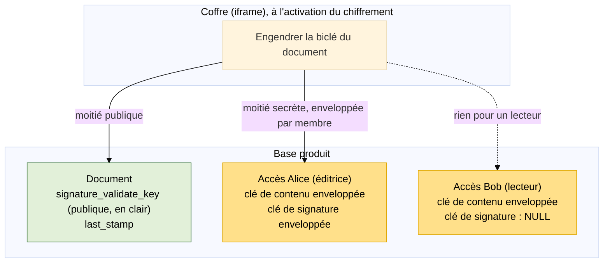
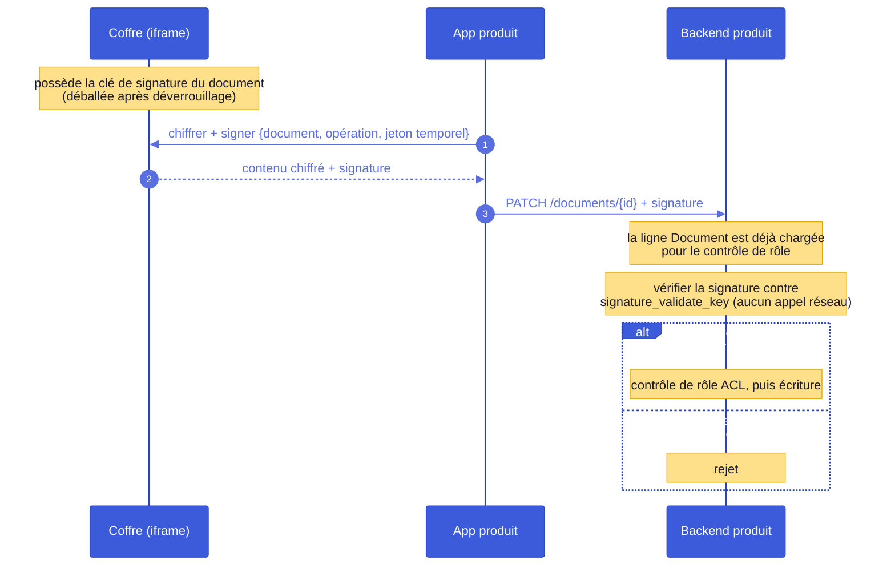

# Autorisation des opérations sensibles sur les contenus chiffrés (Docs, Drive)

**Question soumise à l'équipe : faut-il exiger une signature cryptographique sur les opérations
sensibles des produits, au prix de la complexité que cela ajoute ?**

Le document expose l'exposition actuelle (option A), puis les deux façons d'exiger une signature
(options B et C). Il s'arrête là : le choix appartient à l'équipe. Le dossier complet (pistes
écartées, comparaison détaillée, recommandation, conception, questions ouvertes) est consigné dans
`plan.md`.

Rien de ce qui suit n'est implémenté dans les dépôts produits. Les références de fichiers renvoient
à l'état actuel de `lasuite/docs` et `lasuite/drive`.

---

## 1. La menace

Un attaquant obtient une session valide de l'utilisateur. Côté produit, l'identifiant qui circule
sur l'API n'est pas le jeton OIDC : Docs utilise `mozilla-django-oidc` avec une session Django,
donc c'est le **cookie de session** `docs_sessionid`, valable **12 heures** par défaut
(`SESSION_COOKIE_AGE`, `impress/settings.py:553`).

L'attaquant ne peut **rien déchiffrer** : les clés privées ne quittent jamais le coffre, et le
coffre exige l'appareil de l'utilisateur et son déverrouillage.

En revanche il peut appeler l'API produit en tant que l'utilisateur. Tous les contrôles passent,
puisque du point de vue de l'API il **est** l'utilisateur.

La forme réaliste de l'attaque n'est pas une action manuelle isolée. C'est un **script** : énumérer
tous les documents accessibles à la victime, puis modifier ou détruire chacun d'eux, en quelques
secondes. C'est ce scénario qui sert d'étalon dans tout le document.

Hors périmètre, conformément à `architecture.md` §11.3 : un backend produit compromis, et un
appareil utilisateur compromis. Si l'attaquant contrôle le navigateur après déverrouillage, il a les
clés, et aucun mécanisme décrit ici n'y change quoi que ce soit.

### 1.1 Deux points d'entrée, très inégaux

Le cookie de session n'est que le point d'entrée le plus proche. Le risque principal se situe en
amont, sur les identifiants du fournisseur d'identité.

|                | **Vol du cookie de session**           | **Vol des identifiants OIDC** (ProConnect sans 2FA)                                      |
| -------------- | -------------------------------------- | ---------------------------------------------------------------------------------------- |
| Portée         | un seul produit                        | **toute la suite**, l'attaquant se connecte où il veut                                   |
| Durée          | bornée par `SESSION_COOKIE_AGE` (12 h) | **illimitée**, jusqu'au changement de mot de passe ou à l'activation d'un second facteur |
| Renouvellement | non, il faut revoler                   | l'attaquant se reconnecte à volonté                                                      |

Le second cas est le risque réel, et il ne relève pas de nous : **le contrôle qui a le plus d'effet
de levier est le second facteur sur le fournisseur d'identité**, décision de déploiement qui nous
échappe.

Ce qui nous concerne, c'est que dans les deux cas **l'attaquant n'a pas le coffre**. Se connecter en
tant que la victime sur un navigateur neuf donne une session OIDC, donc l'accès à Docs, mais pas les
clés : le coffre exige la phrase de récupération ou l'approbation depuis un appareil déjà enrôlé.
C'est cette asymétrie que les options B et C exploitent, et le vol d'identifiants **renforce**
l'argument plutôt qu'il ne l'affaiblit, puisqu'il est illimité dans le temps et couvre tous les
produits.

**Le vol d'identifiants ouvre un chemin supplémentaire**, à connaître pour la suite. Avec la seule
session OIDC, un attaquant peut appeler `DELETE /api/public-keys`, authentifié par jeton seul par
conception puisque cette route doit fonctionner précisément quand l'utilisateur ne peut plus rien
signer. Cela désactive l'identité et le trousseau de coffre de la victime. Il peut ensuite lire
`GET /api/public-keys/next` et refaire un enrôlement complet via `register/init` et
`register/complete`, également accessibles au jeton seul, ce qui crée une **identité neuve, non
liée** à la génération suivante (`registration-core.ts:176-182`). Il devient alors **l'identité
active de la victime dans le registre**.

Il ne déchiffre toujours rien pour autant : les anciens éléments ne sont pas supprimés, mais restent
enveloppés pour des clés qu'il n'a pas.

Cette désactivation reste possible quel que soit le mécanisme retenu par la suite. Elle ne détruit
rien, aucune donnée n'est supprimée, et la victime se rétablit en réactivant son identité avec sa
phrase de récupération. Mais tant qu'elle ne l'a pas fait, elle n'apparaît plus dans le registre et
personne ne peut plus partager de nouveau document avec elle. C'est une gêne temporaire, pas une
perte, et c'est le risque résiduel déjà assumé en `architecture.md` §7.1.

---

## 2. Option A : ne rien changer

Le statu quo. Zéro travail, zéro complexité. Voici ce qu'il autorise aujourd'hui.

### 2.1 Destruction aveugle du contenu

L'attaquant ne peut pas lire un document, mais il peut écraser son contenu chiffré par des octets
arbitraires (`PATCH /api/v1.0/documents/{id}/`). À la prochaine ouverture, le déchiffrement échoue
pour tout le monde. Scripté sur l'ensemble du corpus de la victime, cela donne la corruption de tous
les documents chiffrés sur lesquels elle a le droit d'écrire.

### 2.2 L'historique est un filet plus mince qu'il n'y paraît

Docs conserve un historique du contenu via le versionnement d'objets S3 (`versions_list` /
`versions_detail`). En principe, un écrasement est donc restaurable. Trois limites :

- **L'historique est destructible par la même session.** `DELETE /documents/{id}/versions/{version_id}/`
  appelle `Document.delete_version` (`core/models.py:591`), qui exécute
  `delete_object(Bucket, Key, VersionId=...)` : une suppression définitive de cette version S3
  précise. Le droit associé est `versions_destroy: is_owner_or_admin` (`core/models.py:864`). Si la
  victime est propriétaire ou administratrice, l'attaquant peut donc écraser le document **puis
  effacer l'historique de l'écrasement**.
- **La restauration expire.** Docs fait une suppression douce (`soft_delete`, `core/models.py:934`),
  et `restore()` refuse dès que `deleted_at` est plus ancien que `TRASHBIN_CUTOFF_DAYS`, par défaut
  **30 jours** (`impress/settings.py:455`). Au-delà, la récupération sort de l'API et devient une
  tâche de support ou de DBA.
- **Drive peut purger directement.** `DELETE /items/{id}/hard-delete/` (`viewsets.py:727`) appelle
  `hard_delete()` puis met en file `process_item_deletion`, qui exécute `s3_client.delete_object`
  (`core/tasks/item.py:103`). Deux appels d'API, et les octets ont disparu du stockage objet.

L'historique existe donc, mais **ce n'est pas un filet sur lequel s'appuyer face à cette menace** :
la session qui a abîmé le document peut détruire l'historique, et la fenêtre de récupération se
referme. Savoir si les sauvegardes d'infrastructure (versionnement du bucket, cycle de vie, PITR
PostgreSQL) rattraperaient encore le coup est une question à poser aux équipes Docs et ops, et elle
mérite une réponse avant de décider ce que vaut cette fonctionnalité.

### 2.3 L'irréversible : supprimer les partages détruit la clé

C'est le point le plus grave, et il est spécifique aux documents chiffrés.

Pour un document chiffré, les lignes d'ACL **sont du matériel cryptographique**, pas seulement des
permissions. Chaque `DocumentAccess` porte `encrypted_document_symmetric_key_for_user`, la clé
symétrique du document enveloppée pour ce membre (`core/models.py:282`). C'est le **seul** endroit
où une copie utilisable de la clé existe en dehors de la session d'un membre.

Docs a un garde-fou, mais étroit. `_raise_if_would_strand_pending_users`
(`core/api/viewsets.py:2483`) refuse une suppression qui laisserait des collaborateurs _en attente_
(lignes dont la clé enveloppée est `NULL`) sans personne pour les valider. Le test porte sur
`has_pending and not remaining_validated`. **S'il n'y a aucune ligne en attente, supprimer le
dernier accès validé est autorisé.**

Un attaquant disposant d'un compte propriétaire qui supprime toutes les lignes d'accès détruit donc
toutes les copies enveloppées de la clé du document. Le contenu chiffré survit dans S3 et devient
**définitivement indéchiffrable**. Le versionnement S3 n'aide pas : il protège des octets que
personne ne peut plus lire. La récupération suppose de restaurer la **base de données** à un état
antérieur à la suppression, ce qui est une opération d'infrastructure avec sa propre fenêtre de
perte, pas une fonctionnalité produit.

C'est le seul chemin du système actuel où une session volée produit une destruction
**cryptographique**, et non administrative.

### 2.4 Le reste de la surface

`remove_encryption` (repasser un document en clair), renommages, déplacements, ajouts et retraits de
membres, changements de rôle : tout est atteignable, tout est scriptable, et rien n'est réversible
via une trace d'audit que le produit conserverait aujourd'hui.

### 2.5 Ce qui plaide en faveur de A

Le statu quo reste défendable :

- l'attaque suppose une session ou des identifiants volés, ce qui n'est pas le cas courant, et ce
  contre quoi le fournisseur d'identité travaille déjà ;
- la confidentialité, la propriété à laquelle les utilisateurs tiennent le plus, n'est jamais en
  jeu ;
- une partie des dégâts reste récupérable sous 30 jours ;
- **la majorité des produits comparables ne traitent pas ce problème**. Proton, notre pair le plus
  proche, livre de la détection et de la récupération, pas de la prévention. Choisir A n'est pas une
  position marginale, c'est le comportement par défaut du secteur ;
- toute alternative ajoute un cycle de vie de clés, un mode de panne, et un moyen de bloquer des
  utilisateurs légitimes hors de leurs propres documents. Un contrôle de signature qui se passe mal
  est lui-même un incident de disponibilité.

---

## Vue d'ensemble des options B et C

Les deux reposent sur la même idée : exiger, sur chaque opération sensible, une
**signature que seule une clé détenue dans le coffre peut produire**. Une session volée atteint la
vue mais ne peut pas signer, donc l'opération est refusée.

Elles ne diffèrent que par la **granularité de la clé** :

|                                      | **B**                                                        | **C**                                                          |
| ------------------------------------ | ------------------------------------------------------------ | -------------------------------------------------------------- |
| Une biclé par...                     | **utilisateur** (sa clé d'identité, déjà existante)          | **document** (nouvelle biclé, distribuée au moment du partage) |
| Où le backend trouve la clé publique | dans le registre du service de chiffrement, par appel réseau | dans sa propre base, sur la ligne du document                  |
| Ce qui est prouvé                    | _quel_ utilisateur agit                                      | que l'appelant est _un membre_ du document                     |

Tout le reste (les opérations couvertes, la fraîcheur, le déploiement) est commun.

---

## 3. Option B : une biclé par utilisateur, clé publique lue dans le registre

Chaque requête sensible porte la preuve d'identité `X-Signature` que nous construisons déjà
(`src/crypto/request-proof.ts`) : un JWS compact de forme DPoP couvrant `{sub, htm, htu, bh, iat,
exp}`, signé par la clé Ed25519 d'identité de l'utilisateur. Le backend produit résout la clé
publique d'identité de cet utilisateur auprès du registre (`GET /api/public-keys`), vérifie la
signature de liaison, puis vérifie la preuve.

- **Prouve** : cet utilisateur précis a fait cette opération. Redevabilité cryptographique.
- **Exige** : un appel au registre (ou un cache) sur le chemin de chaque opération couverte, une
  gestion de la rotation (le parcours de chaîne de continuité de `architecture.md` §3.4
  réimplémenté en Python), une politique de fraîcheur de révocation, une correspondance
  `encryption_user_id` par produit, un cache anti-rejeu, et une décision sur le comportement quand
  le registre est injoignable.
- **Confiance** : le produit fait confiance au registre pour la résolution, sans mémoire des
  réponses précédentes, donc une clé substituée serait acceptée silencieusement.
- **Volume** : ce n'est pas le point bloquant. Docs enregistre sur une minuterie de 60 secondes
  (`SAVE_INTERVAL = 60000`, `useSaveDoc.tsx:13`) et la frappe en direct passe par le relais
  WebSocket, jamais par une écriture REST. Mille éditeurs simultanés représentent de l'ordre de 17
  résolutions par seconde.

Le coût réel est le couplage et le cycle de vie, pas le débit.

**Face au vol d'identifiants (§1.1), le mécanisme s'effondre si on s'arrête à la signature.**
L'attaquant qui a réinitialisé l'identité détient une clé de signature **parfaitement valide**,
enregistrée dans le registre au nom de la victime. Les signatures qu'il produit ne sont pas des
faux : elles sont authentiques, et elles vérifient. Un backend qui demande « l'identité active de
cet utilisateur » puis vérifie la preuve les acceptera toutes. Dans ce scénario, celui qui a la
portée la plus large et la durée la plus longue, l'option n'apporte alors **aucune protection** :
elle laisse simplement l'attaquant signer ses opérations destructrices.

Ce qui protège dans B n'est donc pas la signature, c'est la **politique d'épinglage du produit** :
mémoriser la `encryption_public_key_version` enregistrée au partage, remonter à l'identité liée à
cette version, et rejeter une identité neuve non liée par continuité (`architecture.md` §3.3). C'est
spécifié et faisable, mais c'est la partie la plus délicate de l'option, et son défaut est
**silencieux** : une implémentation naïve fonctionne, passe les tests, et ne protège de rien.

B reste en revanche pleinement efficace contre le vol du seul cookie de session, qui ne donne pas
accès à notre API et ne permet donc pas de réinitialiser l'identité.

---

## 4. Option C : une biclé par document, distribuée au partage

Plutôt que d'utiliser la biclé de signature de l'utilisateur, chaque document reçoit **sa propre
biclé Ed25519**, engendrée dans le coffre au moment où le chiffrement est activé et distribuée aux
membres exactement comme la clé de contenu l'est déjà.

| Où               | Colonne                                   | Contenu                                                                                                                                               | Secret ?                                                                                 |
| ---------------- | ----------------------------------------- | ----------------------------------------------------------------------------------------------------------------------------------------------------- | ---------------------------------------------------------------------------------------- |
| `Document`       | `signature_validate_key`                  | la moitié **publique**, en base64, environ 44 caractères                                                                                              | Non. Une colonne en clair, comme `is_encrypted`. C'est ce contre quoi le backend vérifie |
| `Document`       | `last_stamp`                              | le dernier jeton temporel signé accepté (anti-rejeu, voir `plan.md`)                                                                                  | Non                                                                                      |
| `DocumentAccess` | `encrypted_document_signing_key_for_user` | la moitié **secrète**, enveloppée pour la clé publique X-Wing de ce membre, exactement comme `encrypted_document_symmetric_key_for_user` juste à côté | Oui, c'est une clé chiffrée. Seul le coffre de ce membre peut l'ouvrir                   |

Chaque opération sensible sur le document porte une signature par cette clé. Le backend a déjà
chargé la ligne `Document` pour son contrôle de permissions : la vérification est donc **une
vérification Ed25519 contre une colonne qu'il tient déjà en main**, quelques dizaines de
microsecondes, **sans aucune résolution externe**.

Pourquoi une session volée échoue : la requête atteint la vue, mais la clé de signature n'existe que
sous forme chiffrée, enveloppée pour la clé de chiffrement de chaque membre, et n'est ouverte qu'à
l'intérieur du coffre après déverrouillage. Récupérer le blob enveloppé via l'API ne donne à
l'attaquant qu'une chose qu'il ne peut pas déballer.

- **Prouve** : l'appelant détient une clé distribuée aux membres de ce document. De la capacité, pas
  de la paternité : tous les éditeurs partagent la clé, donc le backend apprend qu'_un_ membre a
  signé, pas _lequel_.
- **Exige** : rien d'externe. Une rotation au retrait d'un membre, qui doit de toute façon déjà
  avoir lieu pour la clé de contenu, donc les deux tournent dans la même opération.
- **Confiance** : rien au-delà de la base de données du produit lui-même.
- **Bonus** : les lecteurs ont `NULL` dans la colonne d'accès, donc **la lecture seule devient
  cryptographiquement imposée** au lieu d'être un booléen côté serveur.

**Face au vol d'identifiants** (§1.1), rien à prévoir de particulier. La clé de signature du
document est enveloppée pour l'**ancienne** clé de chiffrement de la victime. Un attaquant qui vient
de se réenrôler a des clés neuves et ne peut pas ouvrir ces enveloppes. La résistance est acquise
**par construction**, sans aucune logique de continuité côté produit.

**Limite.** Un backend produit malveillant pourrait engendrer sa propre biclé, envelopper le secret
pour chaque membre avec leurs clés publiques de chiffrement (publiques par définition), écraser les
colonnes, et tous les clients vérifieraient le résultat sans broncher. C protège donc contre une
session volée, pas contre un backend compromis, que la §11.3 place déjà hors périmètre. Fermer cela
supposerait que la clé du document soit elle-même signée par l'identité de la personne qui a activé
le chiffrement, de sorte qu'un lecteur qui fait déjà confiance à cette identité par TOFU puisse
vérifier qu'elle a bien été autorisée par un humain. Piste réelle, volontairement hors de cette
proposition.

**Précédent.** C'est le modèle de CryptPad : une `validateKey` par pad dans les métadonnées du
canal, contre laquelle le serveur vérifie **chaque message**, en rejetant les invalides
(`lib/hk-util.js:1049-1080`, `lib/crypto.js`). Les éditeurs détiennent la clé de signature, les
lecteurs seulement la clé de validation. Même menace, aucun registre d'identité impliqué, une
trentaine de lignes côté serveur.
